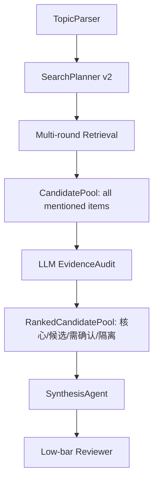

# PaperAgent Re02 SOP：新 Agent 的最小科研选题闭环

> 目标：在 Re01 新 agent 基础上，补齐现阶段真正需要的检索增强、检索计划可解释、候选池、过滤器/LLM 审计分层、低门槛复核。核心策略不是少给，而是尽可能多查找，按可信度/相关性排序，前排展示最可信结果，其余进入候选池并附提醒。
>
> 本 SOP 不以此前旧页面报错为主线，也不追着某个错误论文做硬编码过滤。测试用例按科研 skill 的通用工作流重新设计：题目理解 -> 检索计划 -> 证据复核 -> 方向建议 -> 停止。
>
> 当前策略补充：HumanGate 暂缓实现，不做人工调试阻塞。本轮先做自动多轮检索：只要论文、数据集、repo、baseline 名称出现在相关参考文献、摘要、README、引用信息或检索结果中，就进入候选池。LLM 审计只负责真实性、关系类型和排序，不负责早期强过滤。

---

## 0. 本次边界

### 0.1 本次做什么

Re02 只做自动最小闭环：

1. SearchPlan v2：每次 tool call 都带目标角色和调用原因。
2. Multi-round Retrieval v1：宽召回、参考扩展、repo/dataset 补查三轮自动检索。
3. EvidenceReview v1：候选进入展示前先做轻量 LLM 审计，并分层为核心推荐、普通候选、需人工确认、拒绝/隔离。
4. Low-bar Reviewer v1：用低门槛审稿判断“是否足够继续开题建议”。
5. Synthesis v1：输出好毕业方向、相关论文、数据/工程线索、Baseline 与工作建议，同时保留长尾候选和风险提醒，然后停止。

### 0.2 本次不做什么

本次不应该：

- 重构成完整 LangGraph / 多 subagent 系统。
- 引入长期记忆。
- 引入完整 PRISMA / cross-model verification。
- 做复杂关系图。
- 大改 UI。
- 本轮不做 HumanGate 人工暂停；只预留状态字段，后续再加。
- 对单个错误标题做 blacklist 式修补。
- 把所有模块一次性拆得很细。
- 不做论文引用、时间、repo、dataset 组成的数据网；但要预留字段，方便后续 Re03/Re04 做图谱。

---

## 1. 本次参考资料

执行者必须先阅读这些参考位置，但只取最小可用思想：

### 1.1 AutoResearchClaw

- `C:\Users\ZYF\Desktop\Paper\AutoResearchClaw\researchclaw\literature\search.py`
  - 学习多源检索、dedup、source stats。
- `C:\Users\ZYF\Desktop\Paper\AutoResearchClaw\researchclaw\pipeline\stage_impls\_literature.py`
  - 学习 search strategy、query expansion、literature collection 分阶段。
- `C:\Users\ZYF\Desktop\Paper\AutoResearchClaw\researchclaw\mcp\tools.py`
  - 学习 MCP tool schema 中 `name/description/inputSchema` 的表达方式。

### 1.2 academic-research-skills

- `C:\Users\ZYF\Desktop\Paper\academic-research-skills\academic-pipeline\SKILL.md`
  - 学习阶段化输入/输出意识；本轮不实现人工确认阻塞。
- `C:\Users\ZYF\Desktop\Paper\academic-research-skills\agents\synthesis_agent.md`
  - 学习 synthesis 不是简单汇总，而是把证据合成为判断。
- `C:\Users\ZYF\Desktop\Paper\academic-research-skills\shared\cross_model_verification.md`
  - 只学习 `VERIFIED / NOT_SEARCHED / MISMATCH / NOT_FOUND` 这种状态意识，不引入跨模型。

---

## 2. 推荐最小架构

不要一次加十几个 agent。Re02 只落地四个角色：



### 2.1 现阶段只需要的 agent 能力

| 角色 | 作用 | 本次是否实现 |
|---|---|---|
| TopicParser | 拆题目、方法、对象、任务、数据线索 | 保留并小改 |
| SearchPlanner | 生成带目标角色的多轮 tool calls | 必须实现 |
| ToolExecutor | 调 arXiv/OpenAlex/Crossref/GitHub | 保留并记录 ledger |
| CandidatePool | 收集所有相关参考中出现的论文/数据集/repo/baseline | 必须实现 |
| EvidenceReview | LLM 审计候选真实性、关系类型、可信层级 | 必须实现轻量版 |
| HumanGate | 后续用于题目理解、检索计划、baseline 的人工确认 | 本轮暂缓，只预留字段 |
| SynthesisAgent | 基于已复核证据给建议 | 收窄职责 |
| Low-bar Reviewer | 低门槛开题复核 | 必须实现 |

暂不实现：

- RelationBuilder
- HumanGate UI / 人工阻塞流程
- Long-term Memory
- 多 subagent 路由
- ACP/A2A 深集成
- 复杂 citation graph

注意：RelationBuilder 暂不实现，但每个候选应尽量保留 `year`、`citation_count`、`repo_url`、`dataset_names`、`source_query` 等字段，后续可据此形成“论文-引用-年份-repo-dataset 数据网”。

---

## 3. 影响范围

主要修改：

- `G:\PaperAgent\apps\api\app\services\agents\research_agent.py`
- `G:\PaperAgent\apps\api\app\services\agents\prompts\parse_topic.py`
- `G:\PaperAgent\apps\api\app\services\agents\prompts\plan_tools.py`
- `G:\PaperAgent\apps\api\app\services\agents\prompts\synthesize.py`
- `G:\PaperAgent\apps\api\app\services\agents\prompts\devils_advocate.py`

建议新增：

- `G:\PaperAgent\apps\api\app\services\agents\evidence_review.py`
- `G:\PaperAgent\apps\api\app\services\agents\source_ledger.py`
- `G:\PaperAgent\apps\api\app\services\agents\candidate_pool.py`

新增测试：

- `G:\PaperAgent\apps\api\tests\test_re02_search_plan_v2.py`
- `G:\PaperAgent\apps\api\tests\test_re02_evidence_review.py`
- `G:\PaperAgent\apps\api\tests\test_re02_candidate_pool.py`
- `G:\PaperAgent\apps\api\tests\test_re02_low_bar_reviewer.py`
- `G:\PaperAgent\apps\api\tests\test_re02_research_skill_cases.py`

---

## 4. Task 1：SearchPlan v2

### 4.1 修改目标

修改：

`G:\PaperAgent\apps\api\app\services\agents\prompts\plan_tools.py`

当前 plan 只给 query 列表。Re02 改成多轮 tool call list：

```json
{
  "rounds": [
    {
      "round": 1,
      "name": "broad_recall",
      "goal": "宽召回同任务/同对象/同方法论文",
      "calls": [
        {
          "tool": "search_arxiv",
          "query": "unet crack segmentation",
          "target_role": "baseline_or_parallel_paper",
          "why_call": "find method papers for the task",
          "expected_output": "paper",
          "fallback_tool": "search_crossref"
        }
      ]
    },
    {
      "round": 2,
      "name": "reference_expansion",
      "goal": "从已找到论文的标题、摘要、related work、dataset mention、repo link 扩展检索",
      "calls": []
    },
    {
      "round": 3,
      "name": "repo_dataset_followup",
      "goal": "补查论文中提到的 repo/dataset/baseline",
      "calls": []
    }
  ]
}
```

### 4.2 Tool 调用规范

必须写入 prompt：

| Tool | When to call | Why call | Expected output |
|---|---|---|---|
| `search_arxiv` | 找近年方法、baseline、平行论文、综述 | 快速找预印本和方法线索 | `paper` |
| `search_openalex` | 找高引用或跨源论文 | 补学术元数据和引用量 | `paper` |
| `search_crossref` | 找期刊论文/DOI/工程论文 | arXiv 不覆盖的工科论文 | `paper` |
| `search_github` | 找代码、官方实现、数据集仓库 | 判断可复现性 | `repo` |

暂不强制新增 `search_dataset_web`，但 plan 中可以预留：

```json
{"tool": "search_dataset_web", "enabled": false, "reason": "reserved for later"}
```

### 4.3 规则

每个 call 必须包含：

- `tool`
- `query`
- `target_role`
- `why_call`
- `expected_output`

每个 query 必须：

- 避免只有 `machine learning`、`deep learning`、`classification` 这种泛词。
- 尽量包含“方法 + 任务”或“任务 + 对象”。
- GitHub query 允许短，但不能只写 `paper`、`dataset`、`baseline`。

### 4.4 多轮检索策略

参考 AutoResearchClaw：

- `_expand_search_queries()`：原 query 外加 broad query、tail query、survey、benchmark、comparison。
- `_build_default_search_queries()`：从题目抽关键词，生成 primary、benchmark、survey、recent advances。
- `search_papers_multi_query()`：多 query、多源 union，再按 DOI/arXiv/fuzzy title 去重。
- literature collect：真实 API 失败后可 fallback，同时 web/scholar/crawl 作为 augmentation。

Re02 采用 3 轮自动检索：

#### Round 1：Broad Recall

目标：先尽可能多拿论文，不追求一步到位。

生成 query：

- `method + task + object`
- `task + object`
- `method + object`
- `task + object benchmark`
- `task + object survey`
- `method + task recent advances`

工具：

- arXiv
- OpenAlex
- Crossref
- GitHub

输出：

- 初始 paper/repo 候选。
- source ledger。

#### Round 2：Reference Expansion

目标：把 Round 1 论文里出现过的名字继续丢进候选池。

从 Round 1 结果提取：

- cited/mentioned baseline 名称。
- dataset 名称。
- repo/code link。
- benchmark/challenge 名称。
- survey/review 中列出的经典方法。
- abstract 中反复出现的方法/模块。

规则：

- 只要出现在相关参考文献中，就先进入候选池。
- 不要求当场证明它一定能用。
- LLM 审计只判断 `exists_verdict` 和 `relation_to_topic`。

工具：

- 对论文名：arXiv/OpenAlex/Crossref。
- 对 repo 名/code link：GitHub。
- 对 dataset 名：GitHub / 后续预留 dataset web。

#### Round 3：Repo/Dataset Follow-up

目标：补齐毕业最关心的可复现线索。

输入：

- Round 1/2 中提到的 baseline paper。
- Round 1/2 中提到的 dataset。
- Round 1/2 中提到的 repo/code link。

输出：

- repo_candidates。
- dataset_candidates。
- baseline_options。
- `candidate_pool` 中的长尾候选。

### 4.5 排序思路

排序不是过滤。排序参考：

- 与题目方法/任务/对象的匹配程度。
- 是否真实存在 DOI/arXiv/GitHub URL。
- 年份，新论文优先但经典 baseline 可前置。
- 引用量或来源可信度。
- 是否有 repo。
- 是否有 dataset。
- 是否被多个来源重复提到。
- 是否来自 survey/reference 的方法列表。

弱相关但真实存在的候选不删除，放入 `candidate_pool.long_tail`。

### 4.6 不应该

SearchPlan v2 不应该：

- 直接生成最终论文候选。
- 调网络。
- 替用户确认题目方向。
- 把所有题目都路由到 CV 检测。
- 只输出 adapter query list 而没有调用原因。
- 只跑一轮检索就结束。
- 因为关系不确定而不把相关参考里出现的候选放入候选池。

---

## 5. Task 2：上一阶段遗留表现修复与过滤器边界

### 5.1 本轮主线

本轮不是做 HumanGate，也不是做 UI 交互，而是修复上一阶段遗留表现：

- 检索结果过少或过窄。
- 不同题目返回相似泛化结果。
- 参考文献中出现的 repo/dataset/baseline 没有被继续追查。
- 过滤器过早删除候选，导致可用线索丢失。
- 过滤器不解释为什么一个候选是核心、普通候选、需确认或拒绝。

### 5.2 HumanGate 仅预留

HumanGate 暂时不实现人工阻塞流程，只在结果中预留字段：

```json
{
  "human_gate": {
    "enabled": false,
    "future_gates": ["topic_understanding", "search_plan", "baseline_selection"],
    "auto_mode_reason": "Re02 focuses on retrieval enhancement and filter/audit repair."
  }
}
```

### 5.3 过滤器边界

过滤器/审计器不是“少给结果”的工具，而是“分层展示”的工具：

- 真实存在但关系弱：进入 `candidate`。
- 真实存在但关系不确定：进入 `needs_manual`。
- 多个来源重复提到：提高排序。
- 论文中提到 repo/dataset：必须继续补查，并把结果放进候选池。
- 只有确认伪造、元数据明显不匹配、完全跨领域时才 `rejected`。

### 5.4 不应该

Re02 不应该：

- 实现需要用户人工点击确认的 HumanGate。
- 因为没有 HumanGate 就阻塞自动链路。
- 用 blacklist 修单个标题。
- 把过滤器写成“删除器”。
- 只跑单轮检索。

---

## 6. Task 3：SourceLedger v1

### 6.1 新增模块

创建：

`G:\PaperAgent\apps\api\app\services\agents\source_ledger.py`

### 6.2 记录字段

```json
{
  "adapter": "arxiv",
  "query": "unet crack segmentation",
  "target_role": "baseline_or_parallel_paper",
  "status": "ok",
  "result_count": 8,
  "error": null
}
```

### 6.3 修改 fetch_all

修改：

`G:\PaperAgent\apps\api\app\services\agents\research_agent.py`

要求：

- 每次 adapter 调用都写 ledger。
- OpenAlex 失败必须显示 `status=error|rate_limited`。
- 0 结果必须显示 `status=empty`，不能和失败混淆。

### 6.4 不应该

SourceLedger 不应该：

- 评估论文好坏。
- 参与分桶。
- 生成建议。

---

## 7. Task 4：EvidenceReview v1

### 7.1 新增模块

创建：

`G:\PaperAgent\apps\api\app\services\agents\evidence_review.py`

### 7.2 最小模型

```python
@dataclass
class EvidenceReview:
    candidate_id: str
    evidence_type: str  # paper | dataset | repo | survey | unknown
    role_hint: str      # baseline | parallel | module | reference | dataset | repo | needs_manual
    status: str         # core | candidate | needs_manual | rejected
    matched_terms: list[str]
    missing_terms: list[str]
    confidence_label: str  # high | medium | low | unknown
    relation_to_topic: str # baseline | parallel | module | dataset | repo | survey | background | weak_related | unrelated
    exists_verdict: str    # exists | likely_exists | not_found | metadata_mismatch
    rank_reason: str
    reason: str
```

### 7.3 规则

EvidenceReview 只做轻量 LLM 审计，不做早期强过滤：

- 标题/摘要/描述是否命中题目方法、任务、对象。
- 来源类型是否和 role 匹配。
- 是否明显不是当前题目。
- 是否需要人工确认。
- 是否真实存在：能否从 raw source、URL、DOI、arXiv ID、GitHub full_name、引用文本中找到依据。
- 与题目的关系是什么：baseline、parallel、module、dataset、repo、survey、background、weak_related、unknown。
- 是否可以进入前排，还是只能进入候选池。

分层策略：

- `core`：真实存在，方法/任务/对象至少两类强命中，且来源类型与角色一致，适合前排展示。
- `candidate`：真实存在，来自相关参考文献或检索结果，有部分命中或可能有参考价值，但证据不足以作为主 baseline/主数据集。
- `needs_manual`：真实存在或高度疑似真实，但关系需要后续用户确认，例如材料统计论文、数据集论文、repo 描述不完整。
- `rejected`：只有在确认伪造、URL/元数据明显不匹配、或完全跨领域时使用。
- 只要候选来自相关参考文献中的 citation、related work、dataset mention、code link、benchmark mention，就必须进入候选池；LLM 审计只决定排序和提醒，不应直接丢弃。
- 不把弱相关候选直接作为主 baseline，但可以进入候选池。
- survey 可以作为 reference，但不能作为 baseline。
- repo 可以作为 repo 候选，但不能直接变成 paper。

### 7.4 LLM 审计 Prompt 要求

新增或修改 EvidenceReview 的 LLM 审计 prompt，要求输出严格 JSON：

```json
{
  "candidate_id": "...",
  "exists_verdict": "exists | likely_exists | not_found | metadata_mismatch",
  "relation_to_topic": "baseline | parallel | module | dataset | repo | survey | background | weak_related | unrelated",
  "display_tier": "core | candidate | needs_manual | rejected",
  "why_this_tier": "...",
  "authenticity_reminder": "...",
  "relation_reminder": "...",
  "should_keep_in_candidate_pool": true
}
```

Prompt 必须写明：

- 只要候选来自相关参考文献、引用、摘要、README 或检索结果，就默认 `should_keep_in_candidate_pool=true`。
- 不要因为“不够像主 baseline”而拒绝；应降级为 `candidate` 或 `needs_manual`。
- 只有确认伪造、元数据不匹配、完全跨领域时才 `rejected`。
- 需要判断“它和题目的关系”，而不是只判断“好/坏”。

### 7.5 不应该

EvidenceReview 不应该：

- 算 0.1 这类相关性分数。
- 调网络。
- 生成新候选。
- 做复杂学术审稿。
- 用固定 blacklist 解决单个错标题。
- 为了避免错误而少给；低置信线索应进入候选池并附提醒。
- 把“不能当核心证据”误判为“应该删除”。

---

## 8. Task 5：SynthesisAgent 收窄职责

### 8.1 修改 prompt

修改：

`G:\PaperAgent\apps\api\app\services\agents\prompts\synthesize.py`

SynthesisAgent 只能接收：

- confirmed topic atoms。
- source ledger。
- reviewed evidence。
- selected baseline，如无则为空。
- candidate pool。

输出：

```json
{
  "direction_recommendation": "...",
  "baseline_options": [],
  "candidate_pool": {
    "core": [],
    "candidate": [],
    "needs_manual": [],
    "rejected": []
  },
  "paper_groups": {
    "baseline": [],
    "parallel": [],
    "reference": [],
    "long_tail_candidates": []
  },
  "dataset_and_repo_notes": [],
  "work_suggestions": [],
  "risk_reminders": [],
  "manual_questions": [],
  "stop_here": true
}
```

### 8.2 不应该

SynthesisAgent 不应该：

- 从 raw 里重新挑候选。
- 移动 EvidenceReview 的 status。
- 把 `candidate` / `needs_manual` 当成已确认核心证据。
- 输出“已可开题”，除非低门槛复核通过。
- 自动进入后续论文写作。
- 只展示前排核心结果，隐藏长尾候选。
- 因为候选关系弱就删除它；应保留在 `candidate_pool` 并写清提醒。

---

## 9. Task 6：Low-bar Reviewer v1

### 9.1 修改位置

可以复用并收窄：

`G:\PaperAgent\apps\api\app\services\agents\prompts\devils_advocate.py`

或者新增：

`G:\PaperAgent\apps\api\app\services\agents\low_bar_reviewer.py`

推荐新增轻量模块，避免把“审稿”写得太复杂。

### 9.2 复核维度

只检查 5 项：

1. 题目边界是否清楚。
2. 是否至少有 1 个 baseline 候选或明确 baseline gap。
3. 是否至少有数据来源候选或明确自采/补查 gap。
4. 是否有若干参考论文或明确继续检索方向。
5. 工作建议是否绑定证据，而不是模板句。
6. 相关参考中出现过的论文、数据集、repo、baseline 是否进入了候选池。
7. 是否把弱相关但真实存在的线索降级展示，而不是静默删除。

输出：

```json
{
  "review_verdict": "pass | needs_revision | stop",
  "blocking_questions": [],
  "weak_points": [],
  "can_continue_to_opening_report": false
}
```

### 9.3 不应该

Low-bar Reviewer 不应该：

- 模拟正式论文审稿委员会。
- 给复杂分数。
- 要求所有证据完美。
- 在 baseline/data 都缺失时强行通过。
- 要求候选越少越好。
- 因为候选未进核心层就判定必须删除。

---

## 10. 科研 Skill 风格测试用例

这些用例不是复现旧报错，而是模拟科研选题常见输入，验证 agent 是否能按科研工作流停顿、检索、复核、建议。

### 10.1 Case A：工科视觉 / 3D

输入：

```text
基于三维成像的智能损伤检测
```

必须验证：

- TopicParser 能拆出 `三维成像`、`损伤检测`、`智能方法`。
- SearchPlan 的 query 至少包含 3D/damage/defect/point cloud/reconstruction 中的组合。
- EvidenceReview 不应把无对象命中的泛 ML 论文直接放入 core。
- 只要相关论文/综述/README 中出现数据集、repo、baseline 名称，就应进入 `candidate_pool`，不能静默丢弃。
- Synthesis 应询问用户：损伤对象是混凝土、钢结构、道路、设备，还是通用缺陷？

### 10.2 Case B：工业视觉 / 2D

输入：

```text
基于Unet的钢材裂缝分割
```

必须验证：

- TopicParser 能识别 `U-Net`、`钢材裂缝`、`分割`。
- SearchPlan 至少生成 paper、dataset/repo 两类检索意图。
- EvidenceReview 能区分：
  - U-Net/segmentation 相关候选。
  - steel/crack/surface defect 相关候选。
  - 只和钢结构材料统计相关、但不是 segmentation baseline 的背景候选。
- 背景候选如果真实存在，应进入 `candidate` 或 `needs_manual`，而不是直接删除。
- Low-bar Reviewer 如果没有 dataset 或 baseline，必须 `needs_revision`。

### 10.3 Case C：NLP / LLM

输入：

```text
基于大语言模型的中文主观题自动评分
```

必须验证：

- TopicParser 能拆出 `LLM`、`中文主观题`、`自动评分/评分一致性`。
- SearchPlan 不能路由到 CV。
- EvidenceReview 应优先接受 NLP/education/automatic scoring 相关候选。
- 非 LLM 但来自教育测评/自动评分参考文献的传统 baseline 可进入候选池。
- Synthesis 应给出可能 baseline 路线：BERT/RoBERTa 分类回归、LLM prompt rubric、LoRA 微调。

### 10.4 Case D：遥感 / 农业

输入：

```text
基于多时相遥感数据的作物早期识别
```

必须验证：

- TopicParser 能拆出 `多时相遥感`、`作物识别`、`早期识别`。
- SearchPlan 应生成 remote sensing/crop/Sentinel/multitemporal 相关 query。
- EvidenceReview 不应接受医学、天文、通用 NLP 作为核心证据。
- remote sensing/crop 方向的弱相关论文可以保留为 `candidate`，但不能混入 core。
- Synthesis 应明确数据问题：Sentinel-2、公开 crop dataset、自采或区域数据。

---

## 11. 必跑测试

执行者必须新增并通过：

```powershell
cd G:\PaperAgent
python -m pytest apps/api/tests/test_re02_search_plan_v2.py -v
python -m pytest apps/api/tests/test_re02_evidence_review.py -v
python -m pytest apps/api/tests/test_re02_candidate_pool.py -v
python -m pytest apps/api/tests/test_re02_low_bar_reviewer.py -v
python -m pytest apps/api/tests/test_re02_research_skill_cases.py -v
```

回归：

```powershell
python -m pytest apps/api/tests/test_s66v_agent.py -v
```

如果使用 `uv`：

```powershell
uv run pytest apps/api/tests/test_re02_research_skill_cases.py -v
```

---

## 12. 真实流程验收

执行者必须做一次真实流程，不接受只跑 mock：

1. 启动后端/前端。
2. 输入 4 个 Case 中任意 2 个。
3. 查看 TopicParser 输出。
4. 查看 SearchPlan v2 的三轮检索计划。
5. 运行自动多轮检索。
6. 查看 SourceLedger，确认每个 adapter 的 query、数量、失败原因。
7. 查看 CandidatePool，确认相关参考中出现的论文/数据集/repo/baseline 没被静默丢弃。
8. 查看 EvidenceReview 的 core/candidate/needs_manual/rejected 分层。
9. 生成方向建议。
10. Low-bar Reviewer 给出 pass/needs_revision/stop。

截图保存：

```text
G:\PaperAgent\Plan\reports\Re02_screenshots\
```

至少包含：

- `topic_understanding.png`
- `multi_round_search_plan.png`
- `source_ledger.png`
- `evidence_review.png`
- `final_recommendation_review.png`

---

## 13. Re02 验收通过条件

必须全部满足：

1. SearchPlan v2 每个 call 都有 `tool/query/target_role/why_call/expected_output`。
2. Multi-round Retrieval 至少实现 broad recall、reference expansion、repo/dataset follow-up 三轮。
3. SourceLedger 能区分 `ok/empty/error/rate_limited`，不能把失败当作无证据。
4. CandidatePool 保留相关参考中出现的论文、数据集、repo、baseline，除非 LLM 审计确认伪造、元数据不匹配或完全跨领域。
5. EvidenceReview 输出 `evidence_type/role_hint/status/relation_to_topic/exists_verdict/rank_reason/reason`。
6. EvidenceReview 至少能分出 `core/candidate/needs_manual/rejected` 四层。
7. Synthesis 只使用 reviewed evidence，并保留长尾候选与风险提醒。
8. Low-bar Reviewer 能在证据不足时给 `needs_revision` 或 `stop`，但不能要求“候选越少越好”。
9. 四个科研 skill 风格 case 的单测通过。
10. 至少 2 个真实流程截图完成。
11. 完工报告说明：core/candidate/needs_manual/rejected 数量、代表项、为什么前排可信、为什么长尾保留。

---

## 14. Re02 不通过条件

出现任一情况即不通过：

- SearchPlan 仍只是 adapter query list，没有 target_role。
- 仍然只跑单轮检索。
- 没有 CandidatePool，或者相关参考中出现的候选被静默丢弃。
- EvidenceReview 没有 reason。
- 过滤器仍作为“删除器”，而不是分层展示器。
- Synthesis 直接从 raw 生成最终建议。
- 没有真实流程点击测试。
- Low-bar Reviewer 永远 pass。
- 工作建议仍是固定模板，例如永远“复现 baseline + 加注意力机制”。
- 完工报告只说“通过”，没有截图、ledger、分层统计和失败项。

---

## 15. 完工报告要求

完成后写：

`G:\PaperAgent\Plan\PaperAgent_Re02_完工报告.md`

必须包含：

1. 修改文件。
2. 新增模块。
3. 两个真实题目的 TopicParser 输出。
4. 两个真实题目的三轮 SearchPlan。
5. SourceLedger 统计：每个 adapter 的 query、result_count、empty/error。
6. CandidatePool 统计：paper / dataset / repo / baseline 各多少。
7. EvidenceReview 统计：core / candidate / needs_manual / rejected。
8. Low-bar Reviewer 结果。
9. 截图路径。
10. 未解决问题与 Re03 建议。

---

## 16. Re03 预留方向

Re02 通过后，再考虑：

- 更完整的 typed evidence。
- relation graph。
- dataset web search。
- Semantic Scholar adapter。
- ACP/A2A。
- 长期记忆。
- 更正式的审稿委员会。

这些都不是 Re02 的必要内容。
