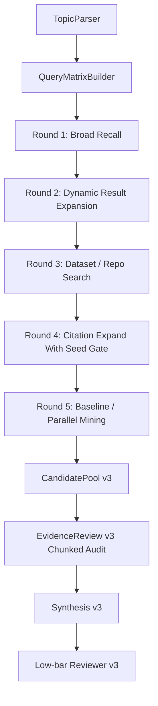

# PaperAgent Re03 SOP：重型检索、过滤器与 V3 验收修复

> 当前主线：继续增强检索功能，修复 Re02/V3 遗留表现，补强过滤器与测试验收。
>
> Re03 不做 UI 大改，不做完整关系图，不做 HumanGate。Re03 的目标是让输入题目后，系统能更稳定地找到“相关论文 / 数据集 / repo / baseline / 平行方案”，并把可信结果排前、弱相关结果保留在候选池、离题噪声隔离。

---

## 0. 本次审阅结论

### 0.1 Re02 不能直接验收通过

Re02 已经建立了有价值的骨架：

- `SearchPlan v2`
- `Multi-round Retrieval`
- `SourceLedger`
- `CandidatePool`
- `EvidenceReview`
- `Low-bar Reviewer`
- `citation_expand`

但 V3 测试和报告暴露出的问题说明：**当前检索质量与过滤器质量还不能算通过**。Re03 必须先修基础故障，再扩展检索轮次。

### 0.2 我本轮实际复验结果

在 `G:\PaperAgent` 下运行：

```powershell
python -m pytest apps/api/tests/test_re02_evidence_review.py -q
```

结果：

```text
4 failed, 1 passed
```

根因：

`G:\PaperAgent\apps\api\app\services\agents\evidence_review.py` 使用了 `os.environ`，但文件顶部没有 `import os`。

另外运行：

```powershell
python -m pytest apps/api/tests/test_re02_research_skill_cases.py -q
```

结果：

```text
4 skipped
```

原因：

`pytest.mark.asyncio` 没有被当前环境识别，4 个 async e2e 测试没有真正执行。因此报告里的“V3 测试用例通过”只能视为未证实。

---

## 1. Re02/V3 主要问题

### 1.1 EvidenceReview 当前存在硬 bug

文件：

`G:\PaperAgent\apps\api\app\services\agents\evidence_review.py`

问题：

- 使用 `os.environ.get("PAPERAGENT_ER_MAX_TOKENS", "12000")`。
- 没有 `import os`。
- 单测已经证明会直接 `NameError`。

Re03 第一优先级：

- 加 `import os`。
- 重新跑 `test_re02_evidence_review.py`。
- 将这个测试加入 Re03 必跑测试。

### 1.2 V3 e2e 测试没有真实执行

文件：

`G:\PaperAgent\apps\api\tests\test_re02_research_skill_cases.py`

问题：

- 4 个测试是 async。
- 当前环境缺少可用的 async pytest runner 或 marker 配置。
- 实测全部 skipped。

Re03 必须：

- 安装或接入 `pytest-asyncio`，或把这些测试改成同步 wrapper。
- 在 `pytest.ini` / `pyproject.toml` 注册 `re02 / re03 / asyncio` markers。
- 禁止把 skipped 测试写成通过。

### 1.3 citation_expand 的 seed 选择会污染候选池

文件：

`G:\PaperAgent\apps\api\app\services\agents\citation_expand.py`

现状：

`_seed_candidates()` 只看候选是否有 `openalex_id / doi / arxiv_id`，不看与题目的相关性。

后果：

- Re02 完工报告 Case A 中，离题的 cosmic ray paper 被选为 seed。
- 后续 references 被拉进 CandidatePool。
- EvidenceReview / Synthesis 一旦 LLM JSON 失败，噪声会扩散到最终结果。

Re03 必须新增：

`G:\PaperAgent\apps\api\app\services\agents\seed_relevance.py`

职责：

- 对 citation_expand seed 做轻量相关性门控。
- 输入 `parsed_topic`、candidate title、abstract、source query。
- 输出 `seed_eligible / reject_reason / matched_axis`。

该模块不应该：

- 调网络。
- 调 LLM。
- 删除 CandidatePool 中的候选。
- 用 blacklist 修单个标题。

最小规则：

```text
seed 必须满足以下任一条件：
1. method_terms 命中 >= 1 且 task_terms/object_terms 命中 >= 1
2. query_atoms_en 中至少 2 个关键词组与 title/abstract/source_query 重叠
3. EvidenceReview 已标为 core
```

否则不能进入 citation_expand 的 seed list，但仍可留在 CandidatePool。

### 1.4 SourceLedger 存在误导性记录

文件：

`G:\PaperAgent\apps\api\app\services\agents\citation_expand.py`

现状：

`citation_expand()` 在真实网络请求前先写一条：

```python
status="ok",
result_count=len(seeds)
```

后果：

- ledger 看起来像成功拉到了 references。
- 实际可能只是“有 seed”，不是“有结果”。

Re03 必须：

- 删除这条预记录。
- 只在每个 seed 真实 fetch 后写 ledger。
- ledger 必须区分：
  - `seed_selected`
  - `seed_rejected`
  - `refs_empty`
  - `refs_ok`
  - `refs_error`

### 1.5 CandidatePool 合并会丢失 role_hint 与 extra

文件：

`G:\PaperAgent\apps\api\app\services\agents\candidate_pool.py`

现状：

`_add_or_merge()` 合并时只合并：

- `sources`
- 部分空字段
- `quoted_paper_titles`

但没有合并：

- `role_hint`
- `extra`
- `via_seed`
- `target_role`

后果：

`citation_expand` 加入的 `role_hint=parallel_baseline_candidate` 可能被已有 paper 的默认 `reference` 覆盖，导致 V3 报告里提到的“标签被下游覆盖”。

Re03 必须：

- 为 Candidate 增加 `role_hints: list[str]` 或 `role_evidence: list[dict]`。
- 保留每次来源给出的 role，而不是只保留一个字符串。
- `role_hint` 可作为显示主标签，但不能丢弃历史角色。

### 1.6 Round 2 / Round 3 不是基于真实结果动态生成

文件：

`G:\PaperAgent\apps\api\app\services\agents\prompts\plan_tools.py`

现状：

- Round 2 多为 `benchmark / survey / recent advances` 泛扩展。
- Round 3 多为 GitHub 短 query。
- Re02 报告显示 Round 3 在 4 个 case 里 3 个几乎无有效增量。

Re03 必须：

- 不再只依赖初始 LLM Plan 一次性生成所有轮次。
- Round 2 以后必须基于 Round 1 的真实结果动态生成。
- 每轮结束都写 `round_delta`。

---

## 2. Re03 参考流程

### 2.1 AutoResearchClaw 需要吸收的部分

参考：

- `C:\Users\ZYF\Desktop\Paper\AutoResearchClaw\researchclaw\literature\search.py`
- `C:\Users\ZYF\Desktop\Paper\AutoResearchClaw\researchclaw\pipeline\stage_impls\_literature.py`

吸收点：

1. 多 query union：`search_papers_multi_query()` 先宽召回，再全局去重。
2. 多源补偿：OpenAlex / Semantic Scholar / arXiv 某个源失败，不等于无证据。
3. 全局去重：DOI -> arXiv ID -> normalized title。
4. source stats：每个来源的结果数量必须可解释。
5. screening 前先做 domain pre-filter，并保留 dropped/kept 统计。
6. LLM screening 输出过少时，要补足 shortlist 或明确暂停/失败。

PaperAgent Re03 不照搬完整 pipeline，只吸收“检索更重、记录更细、筛选可解释”。

### 2.2 academic-research-skills 需要吸收的部分

参考：

- `C:\Users\ZYF\Desktop\Paper\academic-research-skills\academic-pipeline\SKILL.md`
- `C:\Users\ZYF\Desktop\Paper\academic-research-skills\agents\synthesis_agent.md`

吸收点：

1. 阶段化：每轮有输入、输出、状态、产物。
2. synthesis 不是摘要，而是跨来源整合。
3. 证据权重：不同来源、不同关系类型不能混成一类。
4. gap 明确化：没找到数据集 / baseline / repo 时要写成 gap，不要悄悄略过。
5. 不进入后续写作：Re03 到“方向建议 + baseline/模块建议 + 停止”为止。

---

## 3. Re03 推荐新流程

Re03 改为更重型的 6 轮检索。



### Round 0：QueryMatrixBuilder

新增：

`G:\PaperAgent\apps\api\app\services\agents\query_matrix.py`

输入：

- `raw_topic`
- `topic_atoms`
- `method_terms`
- `task_terms`
- `object_terms`
- `domain_route`

输出：

```json
{
  "query_families": {
    "core": [],
    "method_task": [],
    "object_task": [],
    "dataset": [],
    "repo": [],
    "survey": [],
    "benchmark": [],
    "baseline": []
  }
}
```

该模块不应该：

- 调网络。
- 生成论文候选。
- 把中文题目 fallback 成 `machine learning`。
- 用单个 `if "检测" in topic` 路由所有题目。

### Round 1：Broad Recall

目标：

用 `core / method_task / object_task` 三类 query 跑：

- arXiv
- OpenAlex
- Crossref
- GitHub

要求：

- 每类 query 至少 2 条。
- 每个 adapter 写 ledger。
- 每条结果保留 `source_query` 和 `query_family`。

### Round 2：Dynamic Result Expansion

目标：

从 Round 1 真实命中里抽取：

- 高频方法名。
- 高频对象词。
- 论文标题里的 baseline 名。
- abstract 里的 dataset 名。
- GitHub README/description 里的 paper title。

新增：

`G:\PaperAgent\apps\api\app\services\agents\result_expander.py`

该模块不应该：

- 盲目加 `survey / benchmark` 后缀。
- 只用初始题目生成扩展 query。
- 引入没有来源的候选。

### Round 3：Dataset / Repo Search

目标：

补齐毕业选题最关键的可复现证据。

工具：

- GitHub
- HuggingFace dataset 搜索预留
- Kaggle / PapersWithCode / web dataset search 预留

现阶段可先实现：

- GitHub repo search。
- 数据集名称从 paper/repo 文本中抽取。
- web dataset adapter 只预留接口，不强行实现。

要求：

- dataset 不允许只靠 whitelist 注入。
- whitelist 只能用于“识别 raw 中出现过的数据集名”。
- 若 dataset 未找到，必须写 `dataset_gap`，不能让 Low-bar 误以为没问题。

### Round 4：Citation Expand With Seed Gate

目标：

只对高相关 seed 拉 references。

修改：

`G:\PaperAgent\apps\api\app\services\agents\citation_expand.py`

要求：

- `_seed_candidates(raw, parsed_topic=None, reviews=None)`。
- seed 必须通过 `seed_relevance.py`。
- 每个 seed ledger 记录 `seed_selected / seed_rejected / refs_ok / refs_empty / refs_error`。
- 不允许写“预成功” ledger。

### Round 5：Baseline / Parallel Mining

目标：

把论文分成：

- baseline：可复现基础路线。
- parallel：同任务/同方法的平行论文。
- module：可借鉴模块。
- reference：任务同形或背景参考。
- rejected：完全离题或元数据错误。

新增：

`G:\PaperAgent\apps\api\app\services\agents\literature_role_classifier.py`

要求输出：

```json
{
  "method_match": "exact | adjacent | none",
  "task_match": "exact | adjacent | none",
  "object_match": "exact | adjacent | none",
  "role": "baseline | parallel | module | reference | dataset | repo | rejected",
  "borrow_value": "可复现基础 | 模块借鉴 | 数据集借鉴 | 方法论借鉴 | 无价值",
  "reason": "..."
}
```

该模块不应该：

- 用一个 `role_hint` 覆盖所有来源证据。
- 把任务同形论文直接删掉。
- 把完全跨域噪声留在前排。

---

## 4. EvidenceReview v3

修改：

`G:\PaperAgent\apps\api\app\services\agents\evidence_review.py`

必须做：

1. 补 `import os`。
2. 分批审计 candidates，默认每批 20-25 条。
3. 增加 JSON repair / retry。
4. LLM 失败时不静默当正常输出，必须写 blocker。
5. 输出 method/task/object 三轴匹配。

建议新增字段：

```python
method_match: str
task_match: str
object_match: str
borrow_value: str
llm_blocker: str | None
```

Fallback 规则：

- LLM 失败时可以产生 `candidate`，但必须同时标：

```json
{
  "llm_blocker": "evidence_review_parse_failed"
}
```

Low-bar 必须把这个 blocker 视为不能 pass。

---

## 5. Synthesis v3

修改：

`G:\PaperAgent\apps\api\app\services\agents\prompts\synthesize.py`

目标：

输出不是“泛泛建议”，而是：

1. 这个题目是否适合毕业。
2. 推荐方向。
3. Baseline 候选。
4. 可以加的模块。
5. 平行论文怎么借鉴。
6. 数据集 / repo gap。
7. 到这里停止。

`work_suggestions` 必须绑定候选：

```json
{
  "work_package": "在 U-Net baseline 上加入 DAU-Net/FuseSeg 风格注意力模块",
  "baseline_candidate_id": "c-...",
  "borrow_from_candidate_ids": ["c-...", "c-..."],
  "dataset_candidate_ids": ["c-..."],
  "risk": "钢材数据集不足，需先确认 NEU-DET / 自采数据是否可用"
}
```

不应该：

- 永远输出“复现 baseline + 加注意力机制”。
- 在没有 baseline 时编 baseline。
- 在没有 dataset 时假装可开题。
- 把任务同形论文丢进 reference 后不解释借鉴价值。

---

## 6. 测试要求

### 6.1 必修单测

新增或修复：

- `G:\PaperAgent\apps\api\tests\test_re03_query_matrix.py`
- `G:\PaperAgent\apps\api\tests\test_re03_seed_relevance.py`
- `G:\PaperAgent\apps\api\tests\test_re03_citation_expand_ledger.py`
- `G:\PaperAgent\apps\api\tests\test_re03_role_classifier.py`
- `G:\PaperAgent\apps\api\tests\test_re03_evidence_review_chunking.py`
- `G:\PaperAgent\apps\api\tests\test_re03_online_cases.py`

并修复：

- `G:\PaperAgent\apps\api\tests\test_re02_evidence_review.py`
- `G:\PaperAgent\apps\api\tests\test_re02_research_skill_cases.py`

### 6.2 V3/V4 真实用例

必须保留这 4 个领域：

1. `基于三维成像的智能损伤检测`
2. `基于Unet的钢材裂缝分割`
3. `基于大语言模型的中文主观题自动评分`
4. `基于多时相遥感数据的作物早期识别`

每个 case 必须验证：

- `query_atoms_en` 不是 `machine learning`。
- Round 1-5 每轮有 ledger。
- CandidatePool 至少包含 paper。
- dataset/repo 如果没找到，必须有 gap。
- EvidenceReview 不允许全表 fallback 后伪装正常。
- Synthesis 的每条 work suggestion 至少引用 1 个 candidate_id。
- Low-bar 不能在 `llm_blocker` 存在时 pass。

### 6.3 噪声回归用例

必须新增：

```text
输入：基于三维成像的智能损伤检测
构造候选：
- A study of the link between cosmic rays and clouds with a cloud chamber at the CERN PS
- A U-band survey of brown dwarfs in the Taurus Molecular Cloud
- Deep Learning for 3D Point Clouds: A Survey
- Casualty Detection from 3D Point Cloud Data for Autonomous Ground Mobile Rescue Robots
```

验收：

- cosmic ray / brown dwarfs 不能成为 citation seed。
- cosmic ray / brown dwarfs 不能进 core / baseline / parallel。
- 3D Point Clouds survey 可以进 reference。
- Casualty Detection 可以进 candidate 或 parallel。

---

## 7. Re03 必跑命令

```powershell
cd G:\PaperAgent
python -m pytest apps/api/tests/test_re02_evidence_review.py -q
python -m pytest apps/api/tests/test_re02_research_skill_cases.py -q
python -m pytest apps/api/tests/test_re03_query_matrix.py -q
python -m pytest apps/api/tests/test_re03_seed_relevance.py -q
python -m pytest apps/api/tests/test_re03_citation_expand_ledger.py -q
python -m pytest apps/api/tests/test_re03_role_classifier.py -q
python -m pytest apps/api/tests/test_re03_evidence_review_chunking.py -q
python -m pytest apps/api/tests/test_re03_online_cases.py -q
```

要求：

- 不允许 skipped 当作 passed。
- 不允许 LLM-dead path 当作最终验收。
- 若在线 LLM 不可用，报告必须写 `BLOCKED-AFTER-5`，并列出 5 次尝试。

---

## 8. 真实流程验收

执行者必须真实跑 2 个 case：

- `基于Unet的钢材裂缝分割`
- `基于三维成像的智能损伤检测`

保存：

`G:\PaperAgent\Plan\reports\Re03_screenshots\`

至少包含：

- `re03_query_matrix.png`
- `re03_round_delta.png`
- `re03_candidate_pool.png`
- `re03_seed_relevance.png`
- `re03_evidence_review.png`
- `re03_work_suggestions.png`

完工报告必须包含：

1. 修改文件列表。
2. 修复的 Re02 bug。
3. 每轮检索增量表。
4. seed selected / rejected 表。
5. CandidatePool 统计。
6. EvidenceReview core/candidate/needs_manual/rejected 统计。
7. 噪声回归用例结果。
8. 两个真实 case 的截图路径。
9. 未解决问题与 Re04 建议。

---

## 9. Re03 通过条件

必须全部满足：

1. `test_re02_evidence_review.py` 不再失败。
2. `test_re02_research_skill_cases.py` 不再 skipped。
3. 新增 Re03 单测通过。
4. CandidatePool 合并不再丢失 role history。
5. citation_expand 不再选择明显离题 seed。
6. SourceLedger 不再虚报 citation_expand 成功。
7. EvidenceReview 支持分批、重试、blocker。
8. Low-bar 在 `llm_blocker` 存在时不能 pass。
9. Round 2 / Round 3 / Round 4 / Round 5 都能说明本轮新增了什么，没新增也要说明为什么。
10. 工作建议不再是固定模板，必须绑定 baseline / parallel / module / dataset 候选。

---

## 10. Re03 不通过条件

出现任一情况即不通过：

- 报告继续声称 skipped 测试通过。
- LLM-dead path 被当成交付结果。
- EvidenceReview fallback 后没有 blocker。
- citation_expand 仍只按 ID 选 seed。
- ledger 仍写预成功记录。
- CandidatePool 仍只有单个 `role_hint` 且会覆盖历史角色。
- 3D 损伤 case 仍把 cosmic ray / brown dwarfs 放进 core / baseline / parallel。
- work_suggestions 仍是“复现 baseline + 加注意力机制”模板。

---

## 11. 附录：Case A 噪声污染链路复盘

本节来自执行者对 Re02/V3 Case A 的噪声问题分析，作为 Re03 的故障地图。后续实现者必须逐项对照，不能只修某一个表面现象。

### 11.1 13 步调用链检查

```text
1. parse_topic LLM                         ✅ 正常
2. plan_tools                              ✅ 正常
3. multi_round_fetch Round 1               ✅ 正常
4. multi_round_fetch Round 2               ⚠️ 开始引入离题结果
5. multi_round_fetch Round 3               ❌ dataset/repo follow-up 污染扩大
6. _seed_candidates                        ⚠️ 只看 ID，不看相关性
7. _fetch_work_refs                        ❌ 离题 seed 的 references 被拉入
8. SourceLedger                            ❌ 预记录导致虚报成功
9. CandidatePool.add_paper                 ✅ 正常加入，但也放大污染
10. EvidenceReview LLM                     ❌ JSON 截断/解析失败
11. EvidenceReview heuristic fallback      ❌ 静默接管，全部默认 candidate
12. Synthesis LLM                          ❌ JSON 截断/解析失败
13. Low-bar Reviewer                       ✅ 最终 stop，但已经很晚
```

### 11.2 根因责任划分

| 根因 | 对应步骤 | 严重度 | Re03 修复位置 |
|---|---:|---|---|
| 搜索策略污染 | Step 4-5 | 高 | `query_matrix.py`、`result_expander.py`、Round 2/3 动态检索 |
| seed gate 缺失 | Step 6 | 高 | `seed_relevance.py`、`citation_expand.py` |
| LLM JSON 容错不足 | Step 10-13 | 致命 | `evidence_review.py`、`synthesize_v2`、LLM retry/分批/blocker |
| Ledger 虚报 | Step 8 | 中 | `source_ledger.py`、`citation_expand.py` |
| 数据流污染扩散 | 综合 | 致命 | CandidatePool role history、EvidenceReview blocker、Low-bar 强约束 |

### 11.3 修复优先级

Re03 执行顺序必须优先处理：

1. `seed gate`
2. `LLM JSON 容错 / 分批 / blocker`
3. `ledger 虚报`
4. `Round 2/3 动态查询`
5. `CandidatePool role history`

原因：

- `seed gate` 可以在污染源进入 citation_expand 前拦住离题 seed。
- `LLM 容错` 可以避免污染进入后被 heuristic 静默放大。
- `ledger 修正` 可以让执行者看到真实失败，而不是被“ok result_count”误导。

### 11.4 污染链路图

```mermaid
flowchart LR
  A["R2/R3 query<br/>benchmark / dataset follow-up"] -->|误命中| B["离题 paper<br/>cosmic ray / brown dwarfs"]
  B --> C["_seed_candidates<br/>只看 ID"]
  C --> D["citation_expand<br/>拉 references"]
  D --> E["CandidatePool<br/>噪声进入候选池"]
  E --> F["EvidenceReview LLM 挂<br/>JSON parse fail"]
  F --> G["heuristic fallback<br/>全部 candidate"]
  G --> H["Synthesis LLM 挂<br/>JSON parse fail"]
  H --> I["heuristic synthesize<br/>噪声混入 reference"]
  I --> J["Low-bar stop<br/>但已无法解释清楚前置污染"]

  style A fill:#fee,stroke:#c00
  style C fill:#fee,stroke:#c00
  style D fill:#fee,stroke:#c00
  style F fill:#fee,stroke:#c00
  style G fill:#fee,stroke:#c00
  style H fill:#fee,stroke:#c00
  style I fill:#faa,stroke:#c00
```



