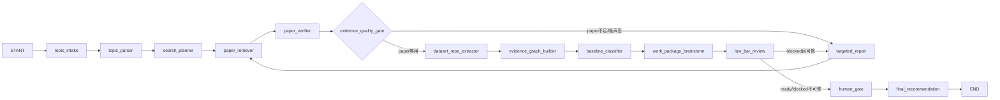

# PaperAgent Re1.2 LangGraph 全链路完善与候选关系网 SOP

> 承接：`PaperAgent_Re1.1_完工报告.md`  
> 下一步：Re1.3 再做图谱与简易前端接入。  
> 本轮原则：模型策略听用户指定，统一使用 StepFun `step-3.7-flash` 作为小规模执行与结构化测试主模型；不要退回 `step-1v-32k`。

## 0. Re1.1 审核结论

Re1.1 可以作为 LangGraph 化起点，但不能直接进入图谱/前端。

已完成：

- 有了 `ResearchState`。
- 有了 LangGraph `StateGraph` + `MemorySaver`。
- 有了 8 个可运行节点。
- 有 StepFun adapter 和 provider router。
- 有 Loop3/Loop4 小样例报告。
- VOAPI/MiniMax 日常禁用基本符合要求。

主要问题：

- Graph 仍是线性 8 节点，报告承认还有 5 个阶段是内嵌逻辑。
- `retrieve_node` 仍是 `legacy_adapter`，且 topic parser / search planner 没有独立 node。
- 没有条件边，没有 repair loop，没有基于失败候选的反思检索。
- dataset/repo 虽然开始 paper-derived，但 repo 覆盖仍低，Loop4 多数 case repo=0。
- work package 在 road-crack / rag-qa / steel-monitor 中为 0，说明建议生成仍受 baseline/repo/dataset 关系缺口影响。
- `llm_router.call_json()` 对 list/dict schema 处理不稳定，存在把空 list 当成功结果返回的风险。
- 旧报告中“step-3.7-flash 不适合 JSON，应退到 step-1v-32k”的结论作废；正确方向是保留 `step-3.7-flash`，修适配层。

## 1. 本轮目标

Re1.2 只做后端链路完善，不做图谱 UI。

必须完成：

1. 将 Re1.1 内嵌的 5 个阶段拆成独立 LangGraph node。
2. 围绕 `step-3.7-flash` 完成稳定 JSON 提取与 fallback formatter。
3. 将线性图升级为带条件边的 Graph。
4. 建立 paper / repo / dataset / baseline / parallel 的候选关系网数据结构。
5. 提升 repo/dataset repair 能力，尤其是从论文反查 official repo / dataset。
6. 输出 Re1.3 可直接接入的 graph data contract，但不实现前端。

## 2. 模型策略锁定

`.env` 必须显式包含：

```text
FAST_JSON_PRIMARY=stepfun
STEPFUN_MODEL=step-3.7-flash
LLM_PROVIDER=stepfun
LLM_EXECUTION_PROVIDER=stepfun
LLM_THINKING_BUDGET=6000
VOAPI_USAGE_POLICY=premium_review_only
MINIMAX_DISABLED=true
PAPERAGENT_ALLOW_MINIMAX=false
```

规则：

- 普通 Loop 只用 `step-3.7-flash`。
- 不得自动切到 `step-1v-32k`。
- 不得用 VOAPI 修普通测试。
- 不得用 MiniMax。
- 如果 `step-3.7-flash` 输出在 `reasoning` 字段，则 adapter 必须提取 reasoning 中最后一个合法 JSON。
- 如果 content 是截断 JSON，adapter 必须同时扫描 content 与 reasoning，不得只看 content。

## 3. Re1.1 遗留坑

### P0-1：旧报告的模型结论需要纠正

位置：

- `Plan/PaperAgent_Re1.1_PITFALLS.md`
- `Plan/PaperAgent_Re1.1_Loop1_Provider连通性.md`
- `Plan/PaperAgent_Re1.1_Loop2_GraphSmoke.md`
- `Plan/PaperAgent_Re1.1_环境与密钥安全检查.md`

问题：

- 多处写“改为 step-1v-32k”。
- 用户已明确 `step-3.7-flash` 是对的。

Re1.2 要求：

- 新增勘误段，不必批量重写历史文件。
- 在 Re1.2 报告中明确：`step-1v-32k` 仅作为历史踩坑记录，不作为当前策略。

### P0-2：`llm_router.call_json()` schema 不稳定

位置：

- `apps/api/app/services/llm_router.py`

问题：

- `_extract_json_from_text()` 无结果时返回 `[]`。
- `call_json()` 在 JSON parse 失败后可能把 `[]` 当成功结果返回。
- dataset/work_package node 期望 dict，如果拿到 list，容易产生隐蔽异常或空结果。

必须修：

- `call_json(..., expected="dict" | "list" | "any")`。
- 默认 `expected="dict"`。
- 无法获得目标类型时必须 raise `LLMUnavailable`。
- trace 中记录 `json_repair_stage`：`direct_content / reasoning_scan / balanced_scan / fallback_formatter / failed`。

### P0-3：StepFun reasoning/content 双通道没有统一处理

位置：

- `apps/api/app/services/llm.py:_chat_openai_compat_once`
- `apps/api/app/services/llm_router.py`

必须修：

- 如果 `content` 非空但 JSON parse 失败，继续扫描 `reasoning`。
- 如果 `content` 是 `{}` 或空数组，但 reasoning 中有更完整 JSON，优先 reasoning 中的完整 JSON。
- 所有 JSON repair 必须保留 raw 摘要到 trace，禁止输出完整 prompt/key。
- 增加 `LLM_THINKING_BUDGET` 控制 max_tokens，不在节点里散落硬编码。

### P0-4：Graph 仍是线性链

位置：

- `apps/api/app/services/agents/graph/research_graph.py`

必须修：

- 增加独立 node：
  - `topic_intake`
  - `topic_parser`
  - `search_planner`
  - `targeted_repair`
  - `baseline_classifier`
- 增加条件边：
  - verify 失败 -> targeted_repair
  - paper 数不足 -> targeted_repair
  - repo/dataset 缺口 -> targeted_repair
  - work_package 为空 -> targeted_repair 或 final blocked
  - human gate enabled -> interrupt

### P0-5：候选关系网缺少统一契约

现状：

- Loop3 报告有最小关系表。
- Loop4 trace 较短，不足以支撑 1.3 图谱前端。

必须新增：

- `EvidenceGraph` 数据结构。
- graph node 输出标准 node/edge。
- 每个 paper/repo/dataset/work_package 都有 stable id。

## 4. 目标 Graph



## 5. 新增/调整模块

### 5.1 `topic_intake_node`

文件：

- `apps/api/app/services/agents/graph/nodes/intake.py`

职责：

- 读取 `topic`、`user_constraints`、`case_id`。
- 生成初始 `trace_events`。
- 不调用 LLM。

不应该：

- 做关键词拆解。
- 搜索外部资源。
- 填充默认 baseline/dataset/repo。

### 5.2 `topic_parser_node`

职责：

- 使用 `step-3.7-flash` 拆出 method/object/task/scenario/domain/modality。
- 输出 `topic_atoms`。
- 若题目太泛，输出 `needs_clarification=true`，但本阶段不阻塞。

不应该：

- 只用 `if "检测" in topic` 做领域路由。
- 返回整句作为唯一对象词。
- 生成论文候选。

### 5.3 `search_planner_node`

职责：

- 基于 topic_atoms 生成多轮检索计划。
- 输出 broad / focused / seed_expansion / repair 四类 query。
- 明确每个 query 的 tool、目的、期望候选类型、停止条件。

不应该：

- 直接调用网络。
- 硬塞 ORB-SLAM / YOLO / COCO 等候选。
- 只给一个泛 query。

### 5.4 `paper_retriever_node`

职责：

- 替换 Re1.1 的 `legacy_adapter`。
- 根据 search_plan 调用 arxiv/openalex/crossref/web/github。
- 输出 raw_results + paper_candidates。

允许：

- 保留 legacy adapter 作为 fallback，但必须被 trace 标为 `legacy_adapter=true`，且不得作为主路径。

不应该：

- import 失败后直接用 `_FALLBACK_SEED` 伪造结果。
- 把 GitHub repo 直接当 paper。

### 5.5 `paper_verifier_node`

职责：

- 使用 `step-3.7-flash` 审计候选论文。
- 输出 `verified_primary / verified_secondary / needs_repair / needs_audit / quarantined_noise`。
- 每条候选必须有命中词、无关词、role、why_relevant。

不应该：

- LLM 失败时 forward 未验证候选。
- 只输出 score。
- 把 survey 当 baseline。

### 5.6 `targeted_repair_node`

职责：

- 根据失败原因生成下一轮 query。
- 输入必须包括 rejected/quarantined 候选和缺口类型。
- repair query 必须可追溯到具体缺口。

repair 类型：

- `paper_gap_repair`
- `dataset_gap_repair`
- `repo_gap_repair`
- `baseline_gap_repair`
- `metadata_mismatch_repair`
- `url_repair`

不应该：

- 无条件重复上一轮 query。
- 因为失败就扩大到完全无关领域。

### 5.7 `dataset_repo_extractor_node`

职责：

- 从 verified papers 中抽 dataset/repo。
- 优先 paper-derived，再 title-targeted search，再 dataset-name-targeted search。

必须输出：

- `source`: paper_abstract / paper_metadata_url / paper_title_search / dataset_name_search / topic_broad_search
- `linked_paper_id`
- `availability`
- `reproducibility_hint`
- `risk`

不应该：

- 直接从白名单注入。
- repo=0 时不解释。
- 数据集 URL 缺失时直接 fail。

### 5.8 `evidence_graph_builder_node`

职责：

- 产出 Re1.3 要用的关系网 JSON。
- 不做 UI。

输出字段：

```json
{
  "nodes": [
    {"id": "paper:xxx", "type": "paper", "title": "...", "role": "baseline"},
    {"id": "repo:owner/name", "type": "repo", "title": "..."},
    {"id": "dataset:neu-det", "type": "dataset", "title": "NEU-DET"}
  ],
  "edges": [
    {"source": "paper:xxx", "target": "dataset:neu-det", "type": "uses_dataset"},
    {"source": "paper:xxx", "target": "repo:owner/name", "type": "has_official_repo"}
  ]
}
```

边类型：

- `uses_dataset`
- `has_official_repo`
- `implements`
- `extends_baseline`
- `compares_with`
- `mentions`
- `needs_repair`
- `quarantined_as_noise`

### 5.9 `baseline_classifier_node`

职责：

- 从 verified papers/repo 中识别 baseline 与 parallel。
- baseline 必须是“可复现实验起点”，不是所有 direct paper。

不应该：

- 所有 direct paper 都归 baseline。
- baseline 为空时仍让 work_package 生成“复现 baseline”。

## 6. JSON 修复层设计

新增：

- `apps/api/app/services/json_repair.py`

职责：

1. `parse_direct_content(text, expected)`
2. `parse_reasoning_field(reasoning, expected)`
3. `balanced_json_scan(text, expected)`
4. `schema_normalize(obj, expected_schema)`
5. `fallback_formatter(raw_text, schema, provider="stepfun")`

规则：

- fallback formatter 仍使用 `step-3.7-flash`。
- 不得切到 VOAPI。
- 每一步都写 trace。
- 如果 formatter 失败，抛错，不静默空结果。

## 7. Candidate Quality Gate

新增：

- `apps/api/app/services/agents/graph/nodes/quality_gate.py`

进入 repair 的条件：

- `verified_primary + verified_secondary < 3`
- `quarantined_noise / paper_candidates > 0.4`
- `baseline_candidates == 0`
- `dataset_candidates == 0` 且题目需要实验数据
- `repo_candidates == 0` 且 baseline 需要复现
- `work_packages == 0`

最多 repair 轮数：

- 小样例默认 2 轮。
- 每轮必须写明新增 query 与新增候选。
- 不能无限循环。

## 8. 测试要求

### Loop 0：静态审计

必须检查：

- 历史 `step-1v-32k` 仅出现在报告/踩坑记录，不出现在默认 env 或主链路代码默认。
- `FAST_JSON_PRIMARY=stepfun`。
- `STEPFUN_MODEL=step-3.7-flash`。
- 主链路不再只有 8 个 node。
- `legacy_adapter` 不是默认主路径。

### Loop 1：JSON Repair 单元测试

构造 6 类 StepFun 响应：

1. content 是合法 dict。
2. content 是合法 list。
3. content 空，reasoning 中有合法 JSON。
4. content 是截断 JSON，reasoning 中有完整 JSON。
5. reasoning 中有多个 JSON，取最后一个符合 schema 的。
6. content/reasoning 都无 JSON，必须 fail。

通过条件：

- expected=dict 时不得返回 list。
- expected=list 时不得返回 dict。
- 无 JSON 不得返回 `[]` 假成功。

### Loop 2：Graph Node 拆分 Smoke

必须看到以下 node 事件：

```text
topic_intake
topic_parser
search_planner
paper_retriever
paper_verifier
evidence_quality_gate
targeted_repair
dataset_repo_extractor
evidence_graph_builder
baseline_classifier
work_package_brainstorm
low_bar_review
human_gate
final_recommendation
```

通过条件：

- 每个 node 有 input/output trace。
- `case_id` 是 thread_id。
- graph 可以 stream checkpoints。

### Loop 3：真实 3 样例

复用：

1. `基于YOLOv5的钢铁表面缺陷检测研究`
2. `基于深度学习的视觉SLAM语义地图的研究`
3. `基于大语言模型的医学问答可信度评估方法研究`

通过条件：

- 每个 case paper >= 3。
- 每个 case 输出 evidence graph。
- 至少 2/3 case 有 repo 或明确 repo repair。
- 至少 2/3 case 有 dataset 或明确 dataset repair。
- 每个 case 有 baseline/parallel 分类结果。
- work_package 为空时必须给出具体缺口和 repair query。

### Loop 4：跨领域 5 样例

复用 Re1.1 Loop4 的 5 个领域。

必须修复：

- `uav-crop` 不能 0 paper。
- road-crack / rag-qa / steel-monitor 不能 verified 很多但 work_package=0 且无解释。

通过条件：

- 5/5 至少有 paper evidence。
- 4/5 有可用 work_package 或清晰 repair plan。
- repo=0 的 case 必须有 paper-title-targeted repo search 记录。
- dataset=0 的 case 必须有 dataset-name-targeted search 记录。

## 9. Re1.3 预留接口

Re1.2 结束时必须产出：

- `GET /api/v1/research/{case_id}/state`
- `GET /api/v1/research/{case_id}/trace`
- `GET /api/v1/research/{case_id}/evidence-graph`

如果 API 暂不接 FastAPI，也必须产出可读 JSON 文件：

- `tmp_re12_eval/<run_id>/<case_id>/state.json`
- `tmp_re12_eval/<run_id>/<case_id>/trace.json`
- `tmp_re12_eval/<run_id>/<case_id>/evidence_graph.json`

Re1.3 前端只依赖这三个契约，不直接读内部 trace。

## 10. 禁止事项

- 禁止把模型改回 `step-1v-32k`。
- 禁止用 VOAPI 修普通 loop。
- 禁止 MiniMax fallback。
- 禁止只有 8 节点却报告全链路完成。
- 禁止 repo/dataset 直接白名单注入。
- 禁止 LLM parse 失败后返回空 list 当成功。
- 禁止 work package 引用不存在于 evidence graph 的证据。
- 禁止为了图谱好看伪造关系边。
- 禁止在 Re1.2 做前端 UI。

## 11. 交付物

代码：

- `apps/api/app/services/json_repair.py`
- `apps/api/app/services/agents/graph/nodes/intake.py`
- `apps/api/app/services/agents/graph/nodes/topic_parser.py`
- `apps/api/app/services/agents/graph/nodes/search_planner.py`
- `apps/api/app/services/agents/graph/nodes/quality_gate.py`
- `apps/api/app/services/agents/graph/nodes/targeted_repair.py`
- `apps/api/app/services/agents/graph/nodes/evidence_graph.py`
- `apps/api/app/services/agents/graph/nodes/baseline_classifier.py`
- `apps/api/tests/test_re1.2_json_repair_step37.py`
- `apps/api/tests/test_re1.2_graph_nodes.py`
- `apps/api/tests/test_re1.2_evidence_graph_contract.py`

报告：

- `Plan/PaperAgent_Re1.2_Loop0_静态审计.md`
- `Plan/PaperAgent_Re1.2_Loop1_JSON修复测试.md`
- `Plan/PaperAgent_Re1.2_Loop2_Graph节点拆分Smoke.md`
- `Plan/PaperAgent_Re1.2_Loop3_真实小样例3.md`
- `Plan/PaperAgent_Re1.2_Loop4_跨领域小样例5.md`
- `Plan/PaperAgent_Re1.2_完工报告.md`

## 12. 最终验收条件

Re1.2 通过必须同时满足：

- `step-3.7-flash` 是唯一普通测试模型。
- JSON repair 六类单测全部通过。
- Graph 至少 14 个主节点，不能只有 Re1.1 的 8 节点。
- 有条件边和 repair loop。
- 每个 case 输出 `evidence_graph.json`。
- Loop3 3/3 通过。
- Loop4 5/5 有 paper evidence，4/5 有 work package 或清晰 repair plan。
- VOAPI 调用次数为 0。
- MiniMax 调用次数为 0。
- 密钥未泄露。

## 13. 进入 Re1.3 的条件

只有 Re1.2 通过后，才能进入图谱与简易前端。

Re1.3 预期方向：

- 左侧：题目/对话/人工约束。
- 中间：paper-repo-dataset evidence graph。
- 右侧：Trace / Step 状态 / repair query。
- 点击论文节点可查看 role、命中词、关联 repo/dataset、为什么可信。
- 点击 repo/dataset 节点可查看来源论文、可复现性、风险。

