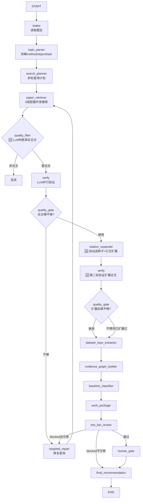

# PaperAgent Re1.3 前端接入与引文扩展搜索 SOP

> 承接：`PaperAgent_Re1.2_完工报告.md`
> 设计参考：`docs/design/PaperAgent_Re2_FullChain_Design.md`
> 本轮原则：前端从简（单页 HTML + SSE），搜索从准（引文网络扩展 + 自动种子选取），过滤从智（LLM 判断代替硬编码黑名单）。

## 0. Re1.2 审核结论

Re1.2 可以作为 Re1.3 的后端基础，但存在已知的质量问题需要在 Re1.3 优先修复。

已完成：

- 14 节点 LangGraph + 条件边 + repair loop。
- `step-3.7-flash` JSON 修复链 (3-phase)。
- EvidenceGraph 数据结构 + 6 个 API endpoint。
- Semantic Scholar 适配器已实现 `semantic_scholar_citations` / `semantic_scholar_references`，**但尚未接入 graph 节点**。
- DeepSeek 实测 2.25 min/case，功能通过。
- 6 个 API endpoint 可用 (list / submit / status / state / trace / evidence-graph)。

主要问题：

- **无前端**：用户只能通过 API 或 runner 脚本使用，看不到实时搜索过程。
- **搜索结果质量差**：词条/概念页混入论文集合（`Term Entry / Core Concept / Reference Entry`），Re1.2 完工报告已标记为高优先级待办。
- **引文扩展未接入**：Semantic Scholar citations/references 适配器代码已存在，但 graph 中没有节点调用它。
- **用户无法指定种子论文**：引文扩展需要种子论文作为起点，但当前无选取机制。
- **黑名单硬编码风险**：当前 `baseline_classifier` 用关键词规则判断 survey/noise，不够智能。
- `rag-qa` case 0 篇 verified papers（topic_parser 中文适配已修但未联网复跑）。
- StepFun RPM=10 导致单 case 10-40 min（DeepSeek 2.25 min 无此问题）。

## 1. 本轮目标

Re1.3 做三件事：**前端接入 + 引文扩展搜索 + 质量过滤智能化**。

必须完成：

1. **简易前端**：单页 HTML + SSE，实时显示搜索结果逐条流入、verify 标记、后续分析进度。
2. **自动种子选取**：从搜索验证结果中自动选取与题目重合度最高的论文作为引文扩展种子（用户无需手动上传）。
3. **引文扩展节点**：对自动选取的种子论文做引用/被引扩展，从扩展论文中提取 repo、综述，形成高可信度论文集。
4. **质量过滤节点**：用 LLM 判断候选是否为真实学术论文（替代硬编码黑名单），过滤词条/概念页/非论文结果。
5. **SSE 流式端点**：`POST /api/v1/research/stream`，前端通过 EventSource 消费。
6. **修复 Re1.2 遗留**：论文真实性过滤、3 分钟内稳定化。

不做：

- Re2 设计文档中的 6 个新分析节点（feasibility_assessor / innovation_extractor / sota_matcher / narrative_builder / optimization_advisor / devils_advocate）——留到 Re2。
- 图谱可视化——前端只做论文列表 + 进度面板，不做 D3/graph 可视化。
- 多档位支持——固定保毕业。
- **手动种子论文上传**——本期不做用户上传接口，种子完全由系统自动选取。后续 Re2 可加。

## 2. 模型策略

沿用 Re1.2，不变：

```text
FAST_JSON_PRIMARY=stepfun
STEPFUN_MODEL=step-3.7-flash
LLM_PROVIDER=stepfun
LLM_EXECUTION_PROVIDER=stepfun
LLM_THINKING_BUDGET=6000
VOAPI_USAGE_POLICY=premium_review_only
MINIMAX_DISABLED=true
PAPERAGENT_ALLOW_MINIMAX=false
```

补充规则：

- **DeepSeek 可作为 verify/quality_filter 节点的备选 provider**（Re1.2 实测 8/8 正确，3-7s）。通过 `LLM_PROFILE=deepseek` 环境变量切换。
- **不新增 provider**，不引入 VOAPI/MiniMax 做普通任务。
- **Semantic Scholar API 无需 key**（公共免费层），有 key 时通过 `S2_API_KEY` 提升速率限制。

## 3. Re1.2 遗留坑

### P0-1：词条/概念页混入论文结果（**实测验证：问题极其严重**）

位置：

- `apps/api/app/services/agents/graph/nodes/retrieve.py`
- `apps/api/app/services/agents/graph/nodes/verify.py`

**Re1.3 编写前实测数据**（2026-07-05 检查 `tmp_re12_eval/` 落盘 state）：

| Case | verified_papers | 其中真实论文 | 其中词条/概念页 |
|---|---|---|---|
| `re12-l5-rag-qa` | 6 | **0** | 6 (100%) |
| `re12-l5-road-crack` | 27 | **0** | 27 (100%) |
| `re12-l5-mono-recon` | ~19 | ~12 (63%) | ~7 (37%) |
| `re12-l3-steel-yolov5` | ~12 | ~10 (83%) | ~2 (17%, "Table 2:..." / "Figure 3:...") |

典型污染样本：
- `"Question Answering Input Classification"` — 被当 baseline，why_relevant 写"explicitly cited as the starting reproducer"
- `"Deep Learning Core Term Entry"` × 10 篇 — road-crack case 全部是深度学习词条页，没有一篇道路裂缝论文
- `"Table 2: Accuracy comparison between YOLOv5 and SDG-YOLOv5"` — 表格标题被当论文
- `"Figure 3: YOLOv5 model."` — 图片标题被当论文

根因分析：
1. retrieve 节点的 `_run_direct_adapter_retrieval` 从 OpenAlex/Crossref 拿到原始结果后，不做任何"这是不是论文"的过滤。
2. verify 节点的 prompt 只判断 `verdict = accept/reject/weak_reject`，没有 `is_real_paper` 维度。LLM 把 "Deep Learning Core Term Entry" 当作与 topic 相关的 baseline，verdict=accept。
3. baseline_classifier 的规则匹配 `method_terms` 命中后直接归为 baseline，不检查标题是否为真实论文。

Re1.3 要求：

- 新增 `quality_filter` 节点，在 retrieve 之后、verify 之前，用 LLM 判断每条候选是否为真实学术论文。
- **不硬编码黑名单关键词**——由 LLM 根据标题/摘要/URL 综合判断。
- LLM 不可用时 fallback 到规则（标题长度 > 10 字符 + 有 URL + 非 "Term Entry" 等明显模式），但规则只做兜底，不作主路径。
- **同时修改 verify prompt**：在 accept 判断中增加必要条件 `is_real_paper=true`，双重保险。
- quality_filter 的 heuristic fallback 必须包含实测发现的污染模式（`Term Entry` / `Core Concept` / `Input Classification` / `Terminology Entry` / `Concept Entry` / `Term Assessment` / `Term List` / `Term Validation` / `Input Evaluation` / `Input Technical Keywords` / `Figure \d` / `Table \d`），但以正则模式形式而非领域黑名单。

### P0-2：引文扩展适配器未接入 graph（**实测验证：代码存在但 0 引用**）

位置：

- `apps/api/app/services/retrieval/adapters/semantic_scholar_search.py` — 适配器实现
- `apps/api/app/services/agents/citation_tracker.py` — 封装层（**孤儿代码，0 importers**）
- `apps/api/app/services/agents/re04_entry.py` — Re04 入口（**仅被 scripts/tests 引用，graph 不用**）

现状：

- `semantic_scholar_citations(paper_id, ...)` 和 `semantic_scholar_references(paper_id, ...)` 已实现且功能完整。
- `citation_tracker.py` 封装了这两个函数，但 **没有任何 graph 节点 import 它**（2026-07-05 验证：全 apps/ 目录搜索 `citation_tracker` 0 命中）。
- `re04_entry.py` 只被 scripts 和 tests 引用，不在 LangGraph 管线中。

Re1.3 要求：

- 新增 `citation_expander` 节点，**直接 import `semantic_scholar_search.py` 中的函数**，不经过 `citation_tracker.py`（避免依赖孤儿代码）。
- 对自动选取的种子论文（verified_papers 中重合度最高的）做引文扩展。
- 扩展出的论文经过 quality_filter → verify 后并入 verified_papers。

### P0-3：引文扩展缺少种子选取机制

现状：

- 引文扩展需要种子论文（有 S2 paperId 的论文）作为起点。
- 当前无任何选取机制——不知道该对哪些论文做引文扩展。
- 用户暂不提供手动种子，需要系统自动选取。

Re1.3 要求：

- `citation_expander` 节点内部自动选取种子：从 `verified_papers` 中按重合度排序取 top-N。
- **重合度计算**：`hit_keywords` 与 `topic_atoms` 的交集大小 + `relation_to_topic` 为 baseline/parallel 的优先。
- 不需要用户上传，不需要额外 API 端点。
- 种子选取逻辑在 `citation_expander` 节点内部完成，不单独成节点。

### P0-4：3 分钟内稳定化

现状：

- 快测 188.3s，但真实 case 可能 10-40 min（StepFun RPM）。
- DeepSeek 2.25 min/case，但未设为默认。

Re1.3 要求：

- `.env.example` 补充 `LLM_PROFILE=deepseek` 选项说明。
- 引文扩展节点必须并发（`asyncio.gather`），不串行等待 Semantic Scholar API。
- quality_filter 批量化（同 Re2 设计 §9.2 verify 批量化策略）。

## 4. 目标 Graph



### 4.1 与 Re1.2 Graph 的差异

| 变更 | 说明 |
|---|---|
| 🆕 `quality_filter` 节点 | retrieve 之后、verify 之前，LLM 判断候选是否为真实学术论文 |
| 🆕 `citation_expander` 节点 | quality_gate 通过后，自动选取重合度最高的论文作为种子，做引文扩展 |
| 🆕 第二轮 verify | 对引文扩展产出的新候选做验证 |
| 🆕 第二轮 quality_gate | 判断扩展后论文是否够用 |
| 🔧 `ResearchState` 扩展 | 新增 `expanded_papers`, `filter_results`, `seed_papers` (自动填充) 字段 |

### 4.2 引文扩展流程详解

```
种子论文选取 (自动, 在 citation_expander 内部):
  1. 从 verified_papers 中计算每篇论文的重合度:
     - relevance_score = len(hit_keywords ∩ topic_atoms关键词) × 2
     - baseline/parallel 加权 +3
     - 有 S2 paperId/DOI/arXiv ID 加权 +2 (能查引文的才有用)
     - citation_count > 10 加权 +1 (高被引优先)
  2. 按 relevance_score 降序排列
  3. 取 top-N 作为种子 (N = min(5, len(verified_papers)))
  4. 种子必须有 S2 paperId 或 DOI 或 arXiv ID (否则跳过, 取下一篇)

对每篇种子论文:
  1. 调 Semantic Scholar API 获取 references (它引用的论文)
  2. 调 Semantic Scholar API 获取 citations (引用它的论文)
  3. 从扩展论文中识别:
     - 综述论文 (survey/review) → surveys
     - 有 repo 的论文 → repo_candidates 补充
     - 高被引论文 → 优先级提升
  4. 扩展论文去重后进入第二轮 verify

扩展上限:
  - 每篇种子论文 references top 15 + citations top 15 = 30 篇
  - 5 篇种子 × 30 = 150 篇上限
  - 去重后预计 50-80 篇
  - 第二轮 verify 批量化 (batch_size=8, ~7 次 LLM 调用)
```

## 5. 新增/调整模块

### 5.1 `quality_filter_node` 🆕

文件：

- `apps/api/app/services/agents/graph/nodes/quality_filter.py`
- `apps/api/app/services/agents/prompts/re13_quality_filter.py`

职责：

- 对 `paper_candidates` 做真实性过滤。
- LLM 判断每条候选是否为真实学术论文（非词条、非概念页、非目录条目）。
- **不硬编码黑名单**——LLM 根据标题/摘要/URL/来源综合判断。

输入：

- `paper_candidates` (来自 retrieve 节点)

输出：

- `paper_candidates` (过滤后的，只保留真实论文)
- `filter_results` (过滤记录，含被丢弃的候选及原因)

LLM Prompt 策略：

```
System: 你是学术论文真实性审计员。判断每条候选是否为真实学术论文。不得使用硬编码关键词列表。

判断标准:
1. 真实学术论文 = 有研究内容、有作者/机构、有发表venue或预印本编号
2. 非论文 = 词条/概念页/目录条目/百科条目/教学讲义/分类号/图表标题/补充材料标题
3. 标题以 "Term Entry" / "Core Concept" / "Input Classification" / "Terminology Entry" /
   "Concept Entry" / "Term Assessment" / "Term List" / "Term Validation" /
   "Input Evaluation" / "Input Technical Keywords" 结尾或开头 → 非论文
4. 标题以 "Figure \d+" / "Table \d+:" / "Supplemental Information" 开头 → 非论文
5. 标题为纯通用领域词 (如 "Deep Learning" / "Large Language Models") 无具体研究内容 → 非论文
6. 摘要为纯定义/纯分类描述/纯术语解释 → 非论文
7. URL 为百科/词典/教学站 → 非论文

注意: 以上规则作为判断维度, 不是硬编码过滤。对每条候选用 LLM 理解力综合判断,
而非简单字符串匹配。

输出 JSON array:
[{"index": 0, "is_paper": true, "reason": "有研究内容和实验"},
 {"index": 1, "is_paper": false, "reason": "词条条目，非学术论文"}]

[OUTPUT CONTRACT] Your ENTIRE final message must be exactly ONE valid JSON array — no prose, no fences.
```

批量策略：

- `batch_size = 8`，每批 1 次 LLM 调用。
- 20 篇候选 = 3 次 LLM 调用（~30s with StepFun, ~10s with DeepSeek）。

Heuristic fallback（LLM 不可用时）：

以下正则模式作为 LLM 不可用时的兜底规则（不是主路径）：

```python
_NON_PAPER_PATTERNS = [
    r"(?i)term\s*entry", r"(?i)core\s*concept", r"(?i)input\s*classification",
    r"(?i)terminology\s*entry", r"(?i)concept\s*entry", r"(?i)term\s*assessment",
    r"(?i)term\s*list", r"(?i)term\s*validation", r"(?i)input\s*evaluation",
    r"(?i)input\s*technical\s*keywords",
    r"(?i)^figure\s*\d+", r"(?i)^table\s*\d+", r"(?i)^supplemental\s*information",
]
# 标题匹配以上任一模式 → 丢弃
# 标题长度 < 10 → 丢弃
# 有 URL 且 URL 含 arxiv.org/doi.org/openalex.org/semanticscholar.org → 保留
# 其他 → 保留（宁可放过，不可误杀）
```

这些模式来自 Re1.2 落盘数据实测发现的污染样本（见 §3 P0-1），不是领域黑名单。

不应该：

- 硬编码领域黑名单（如 "不能出现 watercraft" / "不能出现 deep learning"）。
- 丢弃时没有原因记录。
- LLM 失败时丢弃全部候选。
- 只依赖字符串匹配不做 LLM 判断。

### 5.1b `verify` prompt 修改 🔧

文件：

- `apps/api/app/services/agents/prompts/re11_paper_verifier.py`

变更：

在 verify prompt 的 accept 判断条件中增加必要条件 `is_real_paper`：

```
判断标准 (追加):
- verdict = "accept" 的必要条件: 该候选是一篇真实学术论文 (有研究内容, 非词条/概念页/图表标题)
- 如果候选不是真实论文, verdict 必须为 "reject", relation_to_topic 为 "none"
- reason 字段必须说明为什么是/不是真实论文
```

这是 quality_filter 的双重保险：即使 quality_filter 漏过了一条非论文，verify 节点也能拦截。

### 5.2 `citation_expander_node` 🆕

文件：

- `apps/api/app/services/agents/graph/nodes/citation_expander.py`

职责：

- **自动选取种子**：从 `verified_papers` 中按重合度排序取 top-N 作为种子。
- 对种子论文调用 `semantic_scholar_references` 和 `semantic_scholar_citations` 做引文扩展。
- 从扩展论文中识别综述、repo、高被引论文。
- 扩展论文去重后输出为新的 `paper_candidates`，供第二轮 verify。

输入：

- `verified_papers` (第一轮 verify 通过的)
- `topic_atoms` (用于计算重合度)

输出：

- `seed_papers` (自动选取的种子论文列表，含选取理由)
- `expanded_papers` (扩展出的新候选论文)
- `paper_candidates` (合并: 原有 verified + expanded，供第二轮 verify)
- `surveys_found` (扩展中发现的综述论文)
- `repos_found` (扩展中从论文元数据提取的 repo URL)
- trace 记录种子选取 + 扩展来源链

种子选取算法：

```python
def _select_seeds(verified_papers: list[dict], topic_atoms: dict, top_n: int = 5) -> list[dict]:
    """从 verified_papers 中选取重合度最高的 top-N 作为种子。

    重合度评分:
      base = len(hit_keywords ∩ topic_atoms关键词) × 2
      relation baseline/parallel → +3
      有 paperId/DOI/arXiv ID → +2 (必须, 否则无法查引文)
      citation_count > 10 → +1
    """
    topic_kw = set()
    for v in (topic_atoms.get("method") or []) + (topic_atoms.get("object") or []) + (topic_atoms.get("task") or []):
        topic_kw.add(str(v).lower())

    scored = []
    for p in verified_papers:
        hit_kw = set(k.lower() for k in (p.get("hit_keywords") or []))
        score = len(hit_kw & topic_kw) * 2
        if p.get("relation_to_topic") in ("baseline", "parallel"):
            score += 3
        has_id = bool(p.get("paper_id") or p.get("doi") or p.get("arxiv_id"))
        if has_id:
            score += 2
        else:
            continue  # 无标识符的无法查引文, 跳过
        cc = p.get("citation_count") or 0
        if cc > 10:
            score += 1
        scored.append((score, p))

    scored.sort(key=lambda x: x[0], reverse=True)
    seeds = [p for _, p in scored[:top_n]]
    for s in seeds:
        s["seed_selection_reason"] = f"relevance_score={scored[0][0]}"
    return seeds
```

并发策略：

```python
# 每篇种子论文的 references + citations 并发获取
async def _expand_one_seed(seed):
    refs, cits = await asyncio.gather(
        semantic_scholar_references(paper_id=seed.get("paper_id"), doi=seed.get("doi"), arxiv_id=seed.get("arxiv_id"), top_k=15),
        semantic_scholar_citations(paper_id=seed.get("paper_id"), doi=seed.get("doi"), arxiv_id=seed.get("arxiv_id"), top_k=15),
    )
    return refs + cits

# 多篇种子论文并发
semaphore = asyncio.Semaphore(3)  # S2 API 限流保护
results = await asyncio.gather(*[_expand_one_seed(s) for s in seeds])
```

去重策略：

- 优先用 Semantic Scholar `paperId` 去重。
- fallback 用 DOI 去重。
- 再 fallback 用标题 normalized 去重。
- 已在 verified_papers 中的论文不再重复验证。

不应该：

- 串行调用 Semantic Scholar API。
- 扩展无限层（只扩展 1 层：种子的直接引用/被引）。
- 扩展出的论文不经过 verify 直接并入 verified_papers。
- 忽略 Semantic Scholar API 失败（返回空列表，不阻塞管道）。

### 5.3 `intake_node` 🔧 (无变更)

文件：

- `apps/api/app/services/agents/graph/nodes/intake.py`

Re1.3 不修改 intake 节点。种子论文选取在 `citation_expander` 内部完成，intake 只负责读取 topic 和初始化 state。

### 5.4 `ResearchState` 扩展 🔧

文件：

- `apps/api/app/services/agents/graph/state.py`

新增字段：

```python
class ResearchState(TypedDict, total=False):
    # ... 已有字段 ...

    # === 🆕 Re1.3 新增 ===

    # 种子论文 (自动选取, 由 citation_expander 填充)
    seed_papers: list[dict[str, Any]]
    # [{"title": str, "doi": str|None, "arxiv_id": str|None,
    #   "paper_id": str|None (S2 paperId),
    #   "seed_selection_reason": str,
    #   "relevance_score": int}]

    # 质量过滤结果
    filter_results: dict[str, Any]
    # {"total": int, "kept": int, "dropped": int,
    #  "dropped_items": [{"title": str, "reason": str}]}

    # 引文扩展结果
    expanded_papers: list[dict[str, Any]]
    # 扩展出的新候选论文 (未经 verify)

    surveys_found: list[dict[str, Any]]
    # 引文扩展中发现的综述论文

    repos_found: list[dict[str, Any]]
    # 引文扩展中从论文元数据提取的 repo

    citation_expansion_done: bool
    # 引文扩展是否已完成 (防止无限循环)
```

### 5.5 SSE 流式端点 🆕

文件：

- `apps/api/app/api/v1/research.py` (扩展)

新增端点：

```python
@router.post("/stream")
async def submit_and_stream(payload: dict):
    """提交题目并 SSE 流式返回全程进度。"""
```

SSE 事件协议：

| 事件类型 | `event` 字段 | `data` 内容 | 时机 |
|---|---|---|---|
| 搜索开始 | `search_started` | `{adapters: ["arxiv","openalex","crossref","github"]}` | paper_retriever 开始 |
| 适配器完成 | `adapter_result` | `{adapter: "arxiv", count: 5, papers: [{title, url, year}]}` | 每个适配器返回后 |
| 质量过滤 | `filter_result` | `{kept: 15, dropped: 5, dropped_samples: [{title, reason}]}` | quality_filter 完成 |
| 搜索完成 | `search_completed` | `{total_raw: 20, after_filter: 15}` | 全部适配器 + 过滤完成 |
| 验证结果 | `verify_result` | `{index: 0, title: "...", verdict: "accept"\|"reject"\|"weak_reject", hit_keywords: [...]}` | 每篇验证完 |
| 验证完成 | `verify_completed` | `{accepted: 12, rejected: 8}` | verify 节点结束 |
| 引文扩展开始 | `expansion_started` | `{n_seeds: 3, seed_titles: [...], seed_scores: [...]}` | citation_expander 自动选种后开始 |
| 引文扩展结果 | `expansion_result` | `{seed_title: "...", n_references: 15, n_citations: 12, expanded_papers: [{title, url}]}` | 每篇种子扩展完 |
| 引文扩展完成 | `expansion_completed` | `{total_expanded: 45, n_surveys: 3, n_repos: 5}` | citation_expander 结束 |
| 第二轮验证 | `verify2_result` | `{index: 0, title: "...", verdict: "accept"}` | 扩展论文验证 |
| 节点完成 | `node_complete` | `{node: "baseline_classifier", output: {...}}` | 每个后续节点完成 |
| 最终完成 | `done` | `{case_id, total_elapsed_s}` | final_recommendation 完成 |
| 错误 | `error` | `{node, message}` | 任何节点失败 |

实现要点：

- 使用 LangGraph `stream_mode="updates"` 获取每节点增量。
- `paper_retriever` 节点需要在 trace 中记录每个适配器的返回（已有），SSE 层解析 trace 推送。
- `verify` 节点已记录每篇 verdict，SSE 层逐条推送。
- `citation_expander` 节点需要在 trace 中记录每篇种子的扩展结果，SSE 层逐条推送。
- SSE 连接断开时不中断后端 graph 执行（graph 在后台线程跑，SSE 只负责推送）。

### 5.6 前端 `index.html` 🆕

文件：

- `apps/web/index.html` (单文件，HTML + CSS + JS 内联)

设计：

```
┌──────────────────────────────────────────────────────────┐
│  PaperAgent — 题目研究助手                                │
│                                                          │
│  题目: [________________________]                        │
│                                                          │
│  [开始研究]                                               │
│                                                          │
│  ── 搜索阶段 ──────────────────────────────────────       │
│  ✅ arxiv    5 篇  (2.1s)                                 │
│  ✅ openalex 7 篇  (3.4s)                                 │
│  ✅ 质量过滤: 保留 10 篇, 丢弃 2 篇 (词条/概念页)          │
│                                                          │
│  论文列表 (实时流入):                                      │
│  ┌────────────────────────────────────────────────┐      │
│  │ ✓ 基于YOLOv5的钢材表面缺陷检测 [arxiv 2024]      │      │
│  │   accept · hit: YOLO, defect, steel             │      │
│  ├────────────────────────────────────────────────┤      │
│  │ ✗ 水声目标识别深度学习综述 [arxiv 2023]           │      │
│  │   reject · 无关领域                               │      │
│  └────────────────────────────────────────────────┘      │
│                                                          │
│  ── 引文扩展 (自动选种) ───────────────────────────       │
│  🔗 种子: YOLOv5 (score=12, top1)                         │
│     📄 引用论文 15 篇 · 被引论文 12 篇                     │
│     📋 发现综述 3 篇 · 🐙 发现 repo 2 个                   │
│  🔗 种子: HIC-YOLOv5 (score=9, top2)                      │
│     📄 引用论文 8 篇 · 被引论文 5 篇                       │
│                                                          │
│  ── 分析阶段 ──────────────────────────────────────       │
│  ✅ 基线分类: baseline=3, parallel=5, survey=2             │
│  ✅ 工作包: 2个方案                                        │
│                                                          │
│  ── 最终结果 ──────────────────────────────────────       │
│  [完整推荐报告]                                            │
└──────────────────────────────────────────────────────────┘
```

技术约束：

- **不依赖任何框架/构建工具**——原生 HTML + CSS + JS。
- 使用 `EventSource` API 消费 SSE。
- SSE 不可用时 fallback 到轮询 `/status`。
- CSS 内联在 `<style>` 标签中。
- JS 内联在 `<script>` 标签中。
- 文件大小控制在 500 行以内（含 CSS + JS）。
- 由 FastAPI 静态托管：`app.mount("/web", StaticFiles(directory="apps/web", html=True))`。

核心 JS 逻辑：

```javascript
function startResearch(topic) {
    // POST /api/v1/research/ 启动后台任务
    fetch('/api/v1/research/', {
        method: 'POST',
        headers: {'Content-Type': 'application/json'},
        body: JSON.stringify({case_id: caseId, topic: topic})
    }).then(() => {
        // 连接 SSE 端点
        const es = new EventSource(`/api/v1/research/${caseId}/stream`);
        es.addEventListener('adapter_result', e => renderAdapter(JSON.parse(e.data)));
        es.addEventListener('filter_result', e => renderFilter(JSON.parse(e.data)));
        es.addEventListener('verify_result', e => updatePaperVerdict(JSON.parse(e.data)));
        es.addEventListener('expansion_started', e => renderSeeds(JSON.parse(e.data)));
        es.addEventListener('expansion_result', e => renderExpansion(JSON.parse(e.data)));
        es.addEventListener('node_complete', e => renderNode(JSON.parse(e.data)));
        es.addEventListener('done', e => { es.close(); showComplete(); });
    });
}
```

### 5.7 `research_graph.py` 修改 🔧

文件：

- `apps/api/app/services/agents/graph/research_graph.py`

变更：

```python
# 1. 注册新节点
REGISTRY["quality_filter"] = quality_filter_node
REGISTRY["citation_expander"] = citation_expander_node

# 2. 修改边
graph.add_edge("paper_retriever", "quality_filter")    # 🆕 插入 quality_filter
graph.add_edge("quality_filter", "verify")              # 🆕
# verify → quality_gate (不变)

# 3. quality_gate 通过后进入 citation_expander (替代直接进 dataset_repo)
graph.add_conditional_edges("quality_gate", _route_after_quality_gate, {
    "repair": "targeted_repair",
    "continue": "citation_expander",   # 🆕 改为 citation_expander
    "blocked": "final_recommendation",
    "END": END,
})

# 4. citation_expander → verify (第二轮) → quality_gate_2
graph.add_edge("citation_expander", "verify")
# verify 节点需要支持二次调用 (检查 citation_expansion_done flag)

# 5. quality_gate 第二轮: 扩展后如果还不够，不再循环扩展，直接继续
graph.add_conditional_edges("quality_gate", _route_after_quality_gate_v2, {
    "repair": "targeted_repair",
    "continue": "dataset_repo_extractor",
    "blocked": "final_recommendation",
    "END": END,
})

# 6. 其余边不变
graph.add_edge("dataset_repo_extractor", "evidence_graph_builder")
# ... 后续不变
```

**关键设计：verify 节点的二次调用**

verify 节点在第二轮调用时，需要区分：
- 第一轮：验证 `paper_candidates`（来自 retrieve + quality_filter）
- 第二轮：验证 `expanded_papers`（来自 citation_expander）

实现方式：

```python
def verify_node(state):
    citation_done = state.get("citation_expansion_done", False)
    if citation_done:
        # 第二轮：验证 expanded_papers
        candidates = state.get("expanded_papers", [])
    else:
        # 第一轮：验证 paper_candidates
        candidates = state.get("paper_candidates", [])
    # ... 验证逻辑不变 ...
    # 合并 verified_papers
    if citation_done:
        verified = list(state.get("verified_papers") or []) + new_verified
    else:
        verified = new_verified
    return {"verified_papers": verified, ...}
```

**关键设计：quality_gate 的二次调用**

quality_gate 在第二轮调用时，判断条件不同：
- 第一轮：如果论文不够 → repair
- 第二轮：如果扩展后仍不够 → 不再扩展，直接继续（已尽力）

实现方式：

```python
def quality_gate_node(state):
    citation_done = state.get("citation_expansion_done", False)
    n_papers = len(state.get("verified_papers") or [])
    if n_papers < 1 and not citation_done:
        return {"evidence_audit": {..., "route": "repair"}}
    if n_papers < 1 and citation_done:
        return {"evidence_audit": {..., "route": "blocked"}}  # 真的没有了
    return {"evidence_audit": {..., "route": "continue"}}
```

## 6. Prompt 设计

### 6.1 新增 Prompt 文件

```
apps/api/app/services/agents/prompts/
├── re13_quality_filter.py      🆕 质量过滤器 prompt
└── re13_citation_expander.py   🆕 引文扩展器 prompt (用于综述识别)
```

### 6.2 quality_filter prompt

```python
SYSTEM = """你是学术论文真实性审计员。判断每条候选是否为真实学术论文。不得使用硬编码关键词列表。"""

USER_TEMPLATE = """\
候选论文列表 (共 {n} 条):
{candidates_text}

判断标准:
1. 真实学术论文 = 有研究内容、有作者/机构、有发表venue
2. 非论文 = 词条/概念页/目录条目/百科条目/教学讲义/分类号
3. 标题过短或为通用词 → 非论文
4. 摘要为纯定义/纯分类描述 → 非论文

输出 JSON array, 每个元素:
{{"index": 0, "is_paper": true|false, "reason": "..."}}

[OUTPUT CONTRACT] Your ENTIRE final message must be exactly ONE valid JSON array — no prose, no fences.
"""
```

### 6.3 citation_expander 综述识别 prompt

```python
SYSTEM = """你是文献分析专家。从扩展论文中识别综述论文。"""

USER_TEMPLATE = """\
扩展论文列表 (共 {n} 篇):
{papers_text}

识别标准:
1. 综述 = 标题含 survey/review/tutorial/systematic/benchmark 且内容为领域总结
2. 研究论文 = 有明确的方法贡献和实验
3. 不确定 → 标记 needs_review

输出 JSON array:
{{"index": 0, "is_survey": false, "title": "...", "reason": "..."}}
"""
```

### 6.4 Prompt 设计原则 (沿用 Re1.2)

1. system prompt ≤ 100 token。
2. user prompt 结构化，填空式模板。
3. JSON-only 输出，明确 schema。
4. 不预填 title（Re1.2 P0-3 教训）。
5. 末尾加 OUTPUT CONTRACT。

## 7. 条件边与路由逻辑

### 7.1 新增/修改条件边

```python
# 1. quality_gate → 路由 (修改)
def _route_after_quality_gate(state) -> str:
    citation_done = state.get("citation_expansion_done", False)
    n_papers = len(state.get("verified_papers") or [])
    repair_rounds = state.get("evidence_audit", {}).get("repair_rounds", 0)
    max_repair = int(os.environ.get("PAPERAGENT_MAX_REPAIR_ROUNDS", "2"))

    if n_papers < 1 and not citation_done and repair_rounds < max_repair:
        return "repair"
    if n_papers < 1 and citation_done:
        return "blocked"  # 扩展后仍然没有论文，真的做不了
    if not citation_done:
        return "citation_expander"  # 🆕 先做引文扩展
    return "continue"  # 扩展已完成，继续后续流程

# 2. citation_expander → verify (固定边，非条件)
# 3. verify (第二轮) → quality_gate (固定边，非条件)
# 4. quality_gate (第二轮) → 路由 (同 _route_after_quality_gate，但 citation_done=True)
```

### 7.2 完整路由表

```python
# Linear spine (修改)
graph.add_edge(START, "intake")
graph.add_edge("intake", "topic_parser")
graph.add_edge("topic_parser", "search_planner")
graph.add_edge("search_planner", "paper_retriever")
graph.add_edge("paper_retriever", "quality_filter")       # 🆕
graph.add_edge("quality_filter", "verify")                 # 🆕
graph.add_edge("verify", "quality_gate")

# Conditional routing
graph.add_conditional_edges("quality_gate", _route_after_quality_gate, {
    "repair": "targeted_repair",
    "citation_expander": "citation_expander",  # 🆕
    "continue": "dataset_repo_extractor",
    "blocked": "final_recommendation",
    "END": END,
})
graph.add_edge("targeted_repair", "paper_retriever")       # loop back

# Citation expansion (🆕)
graph.add_edge("citation_expander", "verify")              # 第二轮 verify
# verify → quality_gate (同一条边，verify 节点内部判断第几轮)

# Post-expansion
graph.add_edge("dataset_repo_extractor", "evidence_graph_builder")
graph.add_edge("evidence_graph_builder", "baseline_classifier")
graph.add_edge("baseline_classifier", "work_package")
graph.add_edge("work_package", "low_bar_review")

graph.add_conditional_edges("low_bar_review", _route_after_review, {
    "repair": "targeted_repair",
    "ready": "human_gate",
    "blocked": "final_recommendation",
})
graph.add_edge("human_gate", "final_recommendation")
graph.add_edge("final_recommendation", END)
```

### 7.3 Repair Loop 上限

```python
MAX_REPAIR_ROUNDS = 2              # 已有
CITATION_EXPANSION_DONE = False    # 🆕 引文扩展只做 1 次，不循环
```

## 8. API 契约

### 8.1 现有端点 (不变)

```
GET  /api/v1/research/                          列出 case
POST /api/v1/research/                          提交题目
GET  /api/v1/research/{case_id}/status          运行状态
GET  /api/v1/research/{case_id}/state           完整 ResearchState
GET  /api/v1/research/{case_id}/trace           节点 trace
GET  /api/v1/research/{case_id}/evidence-graph  证据关系图
```

### 8.2 新增端点

```
POST /api/v1/research/stream                     SSE 流式端点
GET  /api/v1/research/{case_id}/expanded         引文扩展结果 (种子选取 + 扩展论文 + 综述 + repo)
```

### 8.3 POST /api/v1/research/ (不变)

```json
{
  "case_id": "steel-yolo-001",
  "topic": "基于YOLOv5的钢材表面缺陷检测研究"
}
```

### 8.4 GET /api/v1/research/{case_id}/expanded

```json
{
  "seed_papers": [              // 自动选取的种子
    {"title": "YOLOv5...", "paper_id": "abc123", "relevance_score": 12, "seed_selection_reason": "top1"}
  ],
  "expanded_papers": [...],     // 引文扩展产出的论文
  "surveys_found": [...],       // 识别的综述
  "repos_found": [...],         // 从扩展论文提取的 repo
  "expansion_trace": [          // 扩展过程记录
    {
      "seed_title": "YOLOv5...",
      "n_references": 15,
      "n_citations": 12,
      "n_surveys": 2,
      "n_repos": 1
    }
  ]
}
```

## 9. 性能设计

### 9.1 性能目标

| 阶段 | 目标 | 策略 |
|---|---|---|
| 搜索 + 过滤 (intake→quality_filter) | ≤45 s | DeepSeek + 批量 filter |
| 第一轮 verify | ≤30 s | 批量化 (batch=8) |
| 引文扩展 (citation_expander) | ≤30 s | 并发 S2 API (Semaphore=3) |
| 第二轮 verify | ≤30 s | 批量化 |
| 后续节点 (dataset_repo→final) | ≤60 s | 不变 |
| **总计** | **≤3.5 min** | DeepSeek 主路径 |

### 9.2 引文扩展并发策略

```python
# Semantic Scholar API 调用并发控制
S2_CONCURRENCY = 3        # 同时最多 3 个 S2 API 请求
S2_TIMEOUT = 10           # 单次请求超时 10s
S2_RETRIES = 2            # 失败重试 2 次 (指数退避)

# 每篇种子论文: references + citations 并发
# 多篇种子论文: 并发 (受 S2_CONCURRENCY 限制)
# 5 篇种子 × 2 请求 = 10 个并发请求, Semaphore=3 → ~4 批 × 3s = 12s
```

### 9.3 quality_filter 批量化

```python
# 20 篇候选, batch_size=8 → 3 次 LLM 调用
# DeepSeek: 3 × 3s = 9s
# StepFun: 3 × 10s = 30s (受 RPM 限制)
```

### 9.4 节点级超时

```python
NODE_TIMEOUTS = {
    "topic_parser": 30,
    "quality_filter": 30,          # 🆕 批量调用
    "verify": 45,                  # 批量调用
    "citation_expander": 45,       # 🆕 S2 API 并发
    "dataset_repo_extractor": 30,
    "work_package": 30,
}
```

### 9.5 预期时间线 (单 case, DeepSeek)

```
t=0s     intake (0ms)
t=0s     topic_parser (5s)
t=5s     search_planner (0ms, 模板)
t=5s     paper_retriever (20s, 4适配器并发)
t=25s    quality_filter (10s, 3次批量) 🆕
t=35s    verify (30s, 3次批量)
t=65s    quality_gate (0ms, 规则) → citation_expander
t=65s    citation_expander (20s, S2 API 并发) 🆕
t=85s    verify 第二轮 (30s, 扩展论文验证)
t=115s   quality_gate 第二轮 (0ms) → continue
t=115s   dataset_repo_extractor (15s)
t=130s   evidence_graph_builder (0ms)
t=130s   baseline_classifier (0ms)
t=130s   work_package (20s)
t=150s   low_bar_review (10s)
t=160s   human_gate (0ms)
t=160s   final_recommendation (0ms)
─────────── 完整结果: ~160s (2.7 min) ───────────
```

## 10. 测试要求

### Loop 0：静态审计

必须检查：

- `apps/web/index.html` 存在且为单文件。
- `quality_filter` 和 `citation_expander` 节点已注册。
- `ResearchState` 含 `seed_papers` (自动填充), `expanded_papers`, `filter_results` 字段。
- `semantic_scholar_citations` / `semantic_scholar_references` 被 `citation_expander` 调用。
- 无硬编码黑名单关键词列表（如 `_BLACKLIST = [...]`）。
- SSE 端点 `/api/v1/research/stream` 存在。
- 无 `POST /api/v1/research/{case_id}/seeds` 端点（本期不做手动上传）。
- `citation_expander` 内部有种子选取逻辑（`_select_seeds` 函数）。
- FastAPI 静态托管 `apps/web` 目录。
- `step-3.7-flash` 仍是默认模型。
- `.env` 未被 tracked。

### Loop 1：Quality Filter 单元测试

构造 6 类候选：

1. 正常论文（有标题/摘要/作者）→ `is_paper=true`
2. 词条条目（"Term Entry: ..."）→ `is_paper=false`
3. 概念页（"Core Concept: ..."）→ `is_paper=false`
4. 目录条目（"Reference Entry: ..."）→ `is_paper=false`
5. 标题过短（"CNN"）→ `is_paper=false`
6. 边界情况（有标题但无摘要，来源 arxiv）→ `is_paper=true`

通过条件：

- 6/6 正确判断。
- LLM 不可用时 heuristic fallback 也能处理前 5 类。
- 被丢弃的候选有原因记录。

### Loop 2：Citation Expander 单元测试

构造 3 篇种子论文：

1. 有 S2 paperId 的论文 → 能获取 references + citations
2. 只有 DOI 的论文 → 能通过 DOI 获取 references + citations
3. 只有标题的论文 → 先 search 获取 paperId，再获取 references + citations

通过条件：

- 3/3 种子论文都能获取到至少 1 篇 references 或 citations。
- 扩展论文去重正确（不与种子论文重复，不与已有 verified 重复）。
- S2 API 失败时返回空列表，不阻塞管道。
- 并发调用（`asyncio.gather`），不串行。
- trace 记录每篇种子的扩展数量。

### Loop 3：SSE 流式端点测试

测试方式：

- 用 `httpx` 或 `aiohttp` 连接 SSE 端点。
- 验证事件类型和顺序。

必须收到以下事件序列：

```
search_started → adapter_result (×N) → filter_result → search_completed →
verify_result (×N) → verify_completed →
expansion_started → expansion_result (×M) → expansion_completed →
verify_result (×K) → verify_completed →
node_complete (×后续节点) → done
```

通过条件：

- 所有事件类型正确。
- `adapter_result` 的 papers 数量与实际一致。
- `verify_result` 的 verdict 与 state.json 中的 verified_papers 一致。
- `expansion_result` 的 n_references + n_citations > 0（至少 1 篇种子有扩展结果）。
- `done` 事件后连接关闭。

### Loop 4：前端 Smoke 测试

测试方式：

- 启动 FastAPI，浏览器打开 `http://127.0.0.1:18181/web/`。
- 输入题目，点击"开始研究"。
- 手动验证：

| # | 检查项 | 通过标准 |
|---|---|---|
| 1 | 页面正常加载 | 无 JS 错误 |
| 2 | 输入题目后点开始 | SSE 连接建立，搜索阶段事件流入 |
| 3 | 适配器结果逐条显示 | 每个适配器完成后立即显示论文数量 |
| 4 | 质量过滤结果显示 | 显示保留/丢弃数量 |
| 5 | 论文卡片逐条流入 | 搜索结果有流入动画 |
| 6 | verify 标记实时更新 | ✓/✗/⚠ 标记正确 |
| 7 | 引文扩展结果展示 | 显示自动选取的种子 + score + 扩展数量 |
| 8 | 后续分析结果展示 | 节点完成后增量渲染 |
| 9 | 最终结果展示 | 完整推荐报告 |

### Loop 5：真实 3 样例

复用 Re1.2 Loop3 的 3 个题目：

1. `基于YOLOv5的钢材表面缺陷检测研究`
2. `基于深度学习的视觉SLAM语义地图的研究`
3. `基于大语言模型的医学问答可信度评估方法研究`

通过条件：

- 每个 case paper >= 3（含引文扩展后）。
- 每个 case 输出 evidence graph。
- 至少 2/3 case 引文扩展产出 >= 5 篇新论文。
- 至少 1/3 case 发现综述论文。
- 词条/概念页被 quality_filter 过滤（不在 verified_papers 中）。
- work_package 不为空或给出具体缺口。
- 前端能看到全程实时进度。

### Loop 6：自动种子选取测试

测试方式：

- 提交题目，不附带任何种子论文。
- 验证 citation_expander 自动从 verified_papers 中选取种子。

通过条件：

- `seed_papers` 不为空（自动选取了 ≥ 1 篇种子）。
- 种子论文有 `relevance_score` 和 `seed_selection_reason` 字段。
- 种子论文有 S2 paperId 或 DOI 或 arXiv ID。
- 引文扩展对种子论文做了 references + citations 获取。
- 扩展论文中包含种子论文引用的论文。
- 扩展论文经过 verify 后并入 verified_papers。
- 重合度最高的论文排在种子列表第一位。

## 11. 自测与验证 SOP

> **执行者必读**：每个 Loop 完成后，必须运行本节的自测验证器。自测不通过的节点不得进入下一 Loop。自测全部通过后才能提交完工报告。

### 11.1 角色定义

| 角色 | 职责 | 执行时机 |
|---|---|---|
| **执行 AI** (Coding AI) | 编写代码后运行自测验证器，验证 agent 产出是否正确 | 每个 Loop 完成后 |
| **SOP AI** (Reviewer AI) | 生成参考答案 (ground truth)，审核 agent 的生成结果 | 执行 AI 完成全部 Loop + 自测后 |

### 11.2 验证对象

Re1.3 的 agent 输出分为 4 类，每类有独立的验证方法：

| 输出类型 | 验证维度 | 通过标准 | 参考方法 |
|---|---|---|---|
| **论文真实性** (quality_filter) | 词条/概念页被过滤 + 真实论文被保留 | 见 §11.3 | 人工标注 + LLM 交叉验证 |
| **引文扩展** (citation_expander) | 扩展论文真实存在 + 来源可追溯 + 并发执行 | 见 §11.4 | S2 API 回查 + trace 时间验证 |
| **SSE 流式** (stream endpoint) | 事件类型完整 + 顺序正确 + 数据一致 | 见 §11.5 | 事件序列对比 + state.json 交叉 |
| **前端** (index.html) | 无外部依赖 + 实时渲染 + 交互可用 | 见 §11.6 | 手动验证 + 静态检查 |

### 11.3 论文真实性验证

#### 11.3.1 执行 AI 自测步骤

```python
# tests/self_test/paper_authenticity_validator.py

async def validate_paper_authenticity(state: dict) -> dict:
    """验证 quality_filter 是否正确过滤了非论文条目。

    用 Re1.2 落盘的污染数据作为回归测试集。
    """
    # Re1.2 实测发现的污染样本（从 tmp_re12_eval/ 提取）
    KNOWN_POLLUTION = [
        "Question Answering Input Classification",
        "Question Answering and Knowledge Bases Core Concepts",
        "Deep Learning Core Term Entry",
        "Deep Learning Term Entry",
        "Deep Learning Core Concept Entry",
        "Deep Term Entry",
        "Deep Learning Technical Term Entry",
        "Indoor Environment Term Entry",
        "Indoor Input Term Assessment",
        "Indoor Term Assessment",
        "Table 2: Accuracy comparison between YOLOv5 and SDG-YOLOv5",
        "Figure 3: YOLOv5 model.",
        "Figure 3: YOLOv5 architecture.",
        "Figure 6: Improved YOLOv5 model.",
        "Supplemental Information 2: Code of yolov5.",
    ]

    # Re1.2 实测发现的真实论文样本
    KNOWN_REAL = [
        "YOLOv5s-GTB: light-weighted and improved YOLOv5s for bridge crack detection",
        "HIC-YOLOv5: Improved YOLOv5 For Small Object Detection",
        "TPH-YOLOv5: Improved YOLOv5 Based on Transformer Prediction Head",
        "MonoIndoor++:Towards Better Practice of Self-Supervised Monocular Depth Estimation",
    ]

    report = {
        "pollution_check": {"total": len(KNOWN_POLLUTION), "filtered": 0, "leaked": []},
        "real_check": {"total": len(KNOWN_REAL), "kept": 0, "wrongly_dropped": []},
        "verified_papers_check": {"total": 0, "non_paper_leaked": []},
    }

    # 检查 1: 已知污染样本是否被过滤
    filter_results = state.get("filter_results", {})
    dropped_titles = {d.get("title", "") for d in filter_results.get("dropped_items", [])}
    for title in KNOWN_POLLUTION:
        if title in dropped_titles:
            report["pollution_check"]["filtered"] += 1
        else:
            # 可能没出现在本次运行的候选中，不算 leaked
            pass

    # 检查 2: 已知真实论文是否被保留
    kept_titles = {p.get("title", "") for p in state.get("paper_candidates", [])}
    for title in KNOWN_REAL:
        if title in kept_titles:
            report["real_check"]["kept"] += 1
        else:
            # 可能没出现在本次运行的候选中
            pass

    # 检查 3: verified_papers 中不得出现污染模式
    import re
    POLLUTION_PATTERNS = [
        r"Term Entry", r"Core Concept", r"Input Classification",
        r"Terminology Entry", r"Concept Entry", r"Term Assessment",
        r"Term List", r"Term Validation", r"Input Evaluation",
        r"Input Technical Keywords", r"Figure \d+", r"Table \d+:",
        r"Supplemental Information",
    ]
    verified = state.get("verified_papers", [])
    report["verified_papers_check"]["total"] = len(verified)
    for p in verified:
        title = p.get("title", "")
        for pattern in POLLUTION_PATTERNS:
            if re.search(pattern, title, re.IGNORECASE):
                report["verified_papers_check"]["non_paper_leaked"].append(title)
                break

    return report
```

#### 11.3.2 通过标准

| 检查项 | 必须? | 说明 |
|---|---|---|
| verified_papers 无污染模式 | ✅ 必须 | 0 条 "Term Entry" / "Core Concept" / "Figure \d" / "Table \d:" |
| KNOWN_POLLUTION 被过滤 | ✅ 必须 | 出现在候选中的污染样本 100% 被过滤 |
| KNOWN_REAL 被保留 | ✅ 必须 | 出现在候选中的真实论文 ≥ 90% 被保留 |
| filter_results 有原因记录 | ✅ 必须 | 每条被丢弃的候选有 reason 字段 |
| quality_filter 未丢弃全部 | ✅ 必须 | 至少保留 1 条候选 (除非 retrieve 返回 0 条) |

#### 11.3.3 SOP AI 审核步骤

```
SOP AI 工作流：
1. 拿到题目 → 手动在 arXiv / Google Scholar 搜索 → 记录前 5 篇真实论文
2. 与 agent 的 verified_papers 做交集
3. 检查 verified_papers 中是否有 SOP AI 确认的非论文条目
4. 计算:
   - pollution_leak_rate = non_paper_in_verified / total_verified (必须 = 0)
   - real_paper_retention = real_papers_in_verified / real_papers_in_candidates (必须 ≥ 0.9)
```

### 11.4 引文扩展验证

#### 11.4.1 执行 AI 自测步骤

```python
# tests/self_test/citation_expansion_validator.py

async def validate_citation_expansion(state: dict) -> dict:
    """验证引文扩展的真实性、来源可追溯性、并发性。"""

    report = {
        "expansion_exists": False,
        "n_expanded": 0,
        "n_surveys": 0,
        "n_repos": 0,
        "source_traceable": True,
        "concurrent_execution": False,
        "s2_api_failures": 0,
        "failures": [],
    }

    expanded = state.get("expanded_papers", [])
    surveys = state.get("surveys_found", [])
    repos = state.get("repos_found", [])
    traces = state.get("trace_events", [])

    report["n_expanded"] = len(expanded)
    report["n_surveys"] = len(surveys)
    report["n_repos"] = len(repos)
    report["expansion_exists"] = len(expanded) > 0

    # 检查 1: 每篇扩展论文有来源种子
    for i, p in enumerate(expanded):
        source_seed = p.get("expanded_from_seed", "")
        if not source_seed:
            report["source_traceable"] = False
            report["failures"].append({
                "check": "source_traceable",
                "issue": f"expanded paper #{i} has no expanded_from_seed"
            })

    # 检查 2: 扩展论文有 S2 paperId 或 DOI (真实性)
    for i, p in enumerate(expanded):
        has_id = bool(p.get("paper_id") or p.get("doi") or p.get("arxiv_id"))
        if not has_id:
            report["failures"].append({
                "check": "has_identifier",
                "issue": f"expanded paper #{i} '{p.get('title','')[:50]}' has no paperId/DOI/arXiv"
            })

    # 检查 3: 并发执行 (从 trace elapsed_s 判断)
    for t in traces:
        if t.get("node") == "citation_expander":
            elapsed = t.get("elapsed_s", 0)
            # 5 篇种子 × 2 请求, 并发=3 → ~4 批 × 3s = 12s
            # 串行 → 10 × 3s = 30s+
            # 如果 < 25s 且 n_expanded > 10, 大概率是并发的
            n_seeds = len(state.get("seed_papers") or [])
            if n_seeds > 1 and elapsed < n_seeds * 5:
                report["concurrent_execution"] = True
            elif n_seeds <= 1:
                report["concurrent_execution"] = True  # 单种子无法判断
            else:
                report["concurrent_execution"] = False
                report["failures"].append({
                    "check": "concurrent_execution",
                    "issue": f"citation_expander elapsed={elapsed}s for {n_seeds} seeds (expected <{n_seeds * 5}s)"
                })

    # 检查 4: S2 API 失败不阻塞
    for t in traces:
        if t.get("node") == "citation_expander":
            errors = t.get("errors", [])
            report["s2_api_failures"] = len(errors)
            # 有错误但管道继续 = 正确行为

    return report
```

#### 11.4.2 通过标准

| 检查项 | 必须? | 说明 |
|---|---|---|
| expansion_exists | ✅ | 至少有 1 篇扩展论文 (当种子论文有 S2 记录时) |
| source_traceable | ✅ | 每篇扩展论文有 expanded_from_seed |
| has_identifier | ✅ | 每篇扩展论文有 paperId 或 DOI 或 arXiv ID |
| concurrent_execution | ✅ | trace elapsed_s 符合并发预期 |
| s2_api_failures 不阻塞 | ✅ | S2 API 失败时 graph 仍继续到 final_recommendation |
| n_expanded ≤ 150 | ⚠ | 扩展上限 (5 种子 × 30 篇) |
| citation_expansion_done = True | ✅ | 扩展完成后 flag 被设置 |

#### 11.4.3 SOP AI 审核步骤

```
SOP AI 工作流：
1. 拿到 agent 自动选取的种子论文 → 检查选取是否合理:
   - 种子是否确实是 verified_papers 中重合度最高的
   - 种子是否有 S2 paperId/DOI/arXiv ID
2. 在 Semantic Scholar 网站手动查看种子的 references + citations
3. 与 agent 的 expanded_papers 做交集
4. 计算:
   - recall = agent_expanded ∩ s2_manual / s2_manual (≥ 0.3)
   - precision = agent_expanded ∩ s2_manual / agent_expanded (≥ 0.7)
   - hallucination_rate = agent_expanded - s2_manual / agent_expanded (≤ 0.1)
5. 检查综述识别是否正确
6. 检查 repo 提取是否真实 (GitHub URL 可访问)
```

### 11.5 SSE 流式验证

#### 11.5.1 执行 AI 自测步骤

```python
# tests/self_test/sse_stream_validator.py

async def validate_sse_stream(case_id: str, state: dict) -> dict:
    """验证 SSE 事件流与最终 state 的一致性。"""

    report = {
        "events_received": [],
        "events_expected": [
            "search_started", "adapter_result", "filter_result",
            "search_completed", "verify_result", "verify_completed",
            "expansion_started", "expansion_result", "expansion_completed",
            "node_complete", "done",
        ],
        "missing_events": [],
        "data_consistency": [],
        "failures": [],
    }

    # 检查 1: 所有预期事件都收到了
    received_types = set(report["events_received"])
    for evt in report["events_expected"]:
        if evt not in received_types:
            # expansion_* 事件在无种子论文时可能不出现, 允许
            if evt.startswith("expansion") and not state.get("expanded_papers"):
                continue
            report["missing_events"].append(evt)

    # 检查 2: adapter_result 的论文数与 raw_results 一致
    raw_results = state.get("raw_results", {})
    total_raw = sum(len(v) for v in raw_results.values())
    # (与 SSE adapter_result 事件中的 count 交叉验证)

    # 检查 3: verify_result 的 verdict 与 verified_papers 一致
    verified = state.get("verified_papers", [])
    n_accept = len([p for p in verified if p.get("verdict") == "accept"])
    # (与 SSE verify_completed 事件中的 accepted 数交叉验证)

    # 检查 4: expansion_result 的数量与 expanded_papers 一致
    expanded = state.get("expanded_papers", [])
    # (与 SSE expansion_completed 事件中的 total_expanded 交叉验证)

    # 检查 5: done 事件后连接关闭
    # (检查 SSE 流是否正常结束)

    if report["missing_events"]:
        report["failures"].append({
            "check": "missing_events",
            "issue": f"missing: {report['missing_events']}"
        })

    return report
```

#### 11.5.2 通过标准

| 检查项 | 必须? | 说明 |
|---|---|---|
| 所有预期事件收到 | ✅ | 无 expansion 时 expansion_* 可缺失 |
| adapter_result 数据一致 | ✅ | SSE 论文数 = raw_results 总数 |
| verify_result 数据一致 | ✅ | SSE accepted = verified_papers 数 |
| expansion_result 数据一致 | ✅ | SSE total_expanded = expanded_papers 数 |
| done 事件存在 | ✅ | 流正常结束 |

### 11.6 前端验证

#### 11.6.1 执行 AI 自测步骤

```python
# tests/self_test/frontend_validator.py

def validate_frontend(html_path: str) -> dict:
    """验证前端 index.html 的基本正确性。"""

    import re
    content = open(html_path, encoding="utf-8").read()

    report = {"checks": [], "passed": 0, "failed": []}

    # 检查 1: 无外部依赖
    external_scripts = re.findall(r'<script\s+src=["\']https?://', content)
    external_links = re.findall(r'<link\s+.*href=["\']https?://', content)
    if not external_scripts and not external_links:
        report["checks"].append("no_external_dependencies")
        report["passed"] += 1
    else:
        report["failed"].append({
            "check": "no_external_dependencies",
            "issue": f"found {len(external_scripts)} external scripts, {len(external_links)} external links"
        })

    # 检查 2: 有 EventSource 使用
    if "EventSource" in content:
        report["checks"].append("uses_eventsource")
        report["passed"] += 1
    else:
        report["failed"].append({"check": "uses_eventsource", "issue": "no EventSource found"})

    # 检查 3: 有题目输入框
    if "topic" in content.lower() and ("input" in content.lower() or "textarea" in content.lower()):
        report["checks"].append("has_topic_input")
        report["passed"] += 1
    else:
        report["failed"].append({"check": "has_topic_input", "issue": "no topic input found"})

    # 检查 4: 有 SSE 事件监听
    sse_events = re.findall(r'addEventListener\(["\'](\w+)["\']', content)
    expected_events = ["adapter_result", "verify_result", "node_complete", "done"]
    for evt in expected_events:
        if evt not in sse_events:
            report["failed"].append({
                "check": "sse_event_listener",
                "issue": f"missing addEventListener for '{evt}'"
            })
    if not any(f["check"] == "sse_event_listener" for f in report["failed"]):
        report["checks"].append("sse_event_listeners")
        report["passed"] += 1

    # 检查 5: 有轮询 fallback
    if "setInterval" in content or "setTimeout" in content or "poll" in content.lower():
        report["checks"].append("has_polling_fallback")
        report["passed"] += 1
    else:
        report["failed"].append({"check": "has_polling_fallback", "issue": "no polling fallback found"})

    return report
```

#### 11.6.2 通过标准

| 检查项 | 必须? | 说明 |
|---|---|---|
| no_external_dependencies | ✅ | 无外部 `<script src>` 或 `<link href>` |
| uses_eventsource | ✅ | 使用 EventSource API |
| has_topic_input | ✅ | 有题目输入框 |
| sse_event_listeners | ✅ | 监听 adapter_result / verify_result / node_complete / done |
| has_polling_fallback | ⚠ 建议 | SSE 不可时有轮询备选 |

### 11.7 自测流程图

```
执行 AI 编写节点代码
    │
    ▼
执行 AI 运行 Loop 测试 (§10)
    │
    ├── Loop 测试失败 → 修复代码 → 重跑 Loop
    │
    └── Loop 测试通过 → 运行自测验证器 (§11.3-§11.6)
            │
            ├── 自测全 PASS → 进入下一 Loop
            │
            └── 自测有 FAIL → 修复代码 → 重跑 Loop + 自测
                    │
                    ▼
全部 Loop + 自测通过
    │
    ▼
SOP AI 接收 agent 输出 + 自测报告
    │
    ├── 用独立检索生成参考答案 (ground truth)
    │
    ├── 交叉验证 (recall / precision / pollution_leak_rate)
    │
    ├── 审核通过 → 标记 case 为 "verified"
    │
    └── 审核有问题 → 生成审核报告 → 执行 AI 修复
```

### 11.7.1 测试并行化规则

> **执行者必读**：测试不是串行跑完才算完。能并行的必须并行，主线程趁并行时做推进性工作。

**并行判断标准**：

| 条件 | 判定 |
|---|---|
| 多个测试用例相互独立 + 单条 >10s + 总串行 >60s | ✅ 必须分发 subagent 并行 |
| 单条 <10s 或串行总耗时 <60s | ❌ 直接串行，不值得 subagent 开销 |
| 超过 10 条用例 | ⚠ 先评估：前 3 条覆盖核心路径后，后续降级为 smoke test |

**Re1.3 各 Loop 并行方案**：

| Loop | 测试内容 | 预计单条耗时 | 独立? | 策略 |
|---|---|---|---|---|
| Loop 1 | Quality Filter 6 类候选 | <5s × 6 = <30s | ✅ | 串行（总耗时 <60s） |
| Loop 2 | Citation Expander 3 篇种子 | ~15s × 3 = 45s | ✅ | 串行（接近阈值，可并行也可串行） |
| Loop 3 | SSE 流式端点 | ~30s | 单条 | 串行 |
| Loop 4 | 前端 Smoke | ~2min | 单条 | 主线程手动 |
| **Loop 5** | **真实 3 样例 E2E** | **~3min × 3 = 9min** | **✅ 完全独立** | **3 个 subagent 并行 → ~3min** |
| Loop 6 | 自动种子选取 | ~3min | 单条 | 串行（依赖 Loop 5 结果） |

**Loop 5 并行分发方案**（最关键的并行场景）：

```
主线程分发 3 个 subagent:
  ├── subagent A: 题目1 "基于YOLOv5的钢材表面缺陷检测研究" → E2E + validator
  ├── subagent B: 题目2 "基于深度学习的视觉SLAM语义地图的研究" → E2E + validator
  └── subagent C: 题目3 "基于大语言模型的医学问答可信度评估方法研究" → E2E + validator

主线程同时做:
  ├── review Loop 1-4 已完成节点的代码质量
  ├── 检查 index.html 是否有遗漏的 SSE 事件处理
  ├── 准备 Loop 6 的自动种子选取验证数据
  └── 起草完工报告框架

3 个 subagent 全部返回后:
  → 统一汇总 pass/fail
  → 全 pass → 进入 Loop 6
  → 有 fail → 分析失败模式 → 只重跑失败项
```

**大规模测试判断**：

- 如果 Loop 5 扩展为 5+ 题目：前 3 题全量断言，后续只检查 `final_recommendation` 非空（smoke test）。
- validator 测试（§11.3-§11.6）如果总耗时 <30s → 直接串行跑完。
- **禁止**：分发 subagent 后主线程空转等待。必须在等待期间做推进或审查工作。

### 11.8 自测报告格式

每个 Loop 完成后，执行 AI 必须生成自测报告片段，附入 Loop 报告：

```json
{
  "loop": "Loop5",
  "case_id": "steel-yolo-001",
  "timestamp": "2026-07-05T18:00:00Z",

  "paper_authenticity": {
    "verified_papers_total": 12,
    "non_paper_leaked": [],
    "pollution_leak_rate": 0.0,
    "filter_dropped": 5,
    "filter_dropped_samples": [
      {"title": "Deep Learning Term Entry", "reason": "词条条目，非学术论文"}
    ]
  },

  "citation_expansion": {
    "n_seeds": 3,
    "seeds_auto_selected": true,
    "seed_top1_score": 12,
    "n_expanded": 45,
    "n_surveys": 2,
    "n_repos": 3,
    "source_traceable": true,
    "concurrent_execution": true,
    "elapsed_s": 18.5,
    "s2_api_failures": 1,
    "failures": []
  },

  "sse_stream": {
    "events_received": ["search_started", "adapter_result", "filter_result", ...],
    "missing_events": [],
    "data_consistent": true
  },

  "frontend": {
    "no_external_dependencies": true,
    "uses_eventsource": true,
    "has_topic_input": true,
    "sse_event_listeners_complete": true
  },

  "overall_status": "pass"
}
```

### 11.9 执行者自测检查清单

> **执行 AI 在提交完工报告前必须逐项确认**，全部 ✅ 才可提交。

- [ ] Loop 0-6 全部通过。
- [ ] §11.3 论文真实性验证器：`verified_papers` 中 0 条污染模式。
- [ ] §11.4 引文扩展验证器：扩展论文有来源 + 有标识符 + 并发执行。
- [ ] §11.5 SSE 验证器：事件完整 + 数据一致。
- [ ] §11.6 前端验证器：无外部依赖 + EventSource + 题目输入框。
- [ ] §11.8 自测报告 JSON 已生成，`overall_status = "pass"`。
- [ ] `rg "_BLACKLIST|_BLACK_LIST" --type py` 返回 0 命中。
- [ ] `rg "citation_tracker" apps/api/app/services/agents/graph/` 返回 0 命中（不依赖孤儿代码）。
- [ ] `tmp_re13_eval/` 下每个 case 有 `state.json` + `trace.json` + `evidence_graph.json`。
- [ ] 完工报告中附有自测报告摘要。


## 12. 禁止事项

- 禁止硬编码黑名单关键词列表（如 `_BLACKLIST = ["Term Entry", "Core Concept"]`）。规则 fallback 可以有，但 LLM 是主路径。
- 禁止引文扩展串行调用 Semantic Scholar API。
- 禁止引文扩展无限层（只扩展 1 层）。
- 禁止扩展论文不经过 verify 直接并入 verified_papers。
- 禁止前端依赖任何 npm/构建工具/外部 CDN。
- 禁止 SSE 阻塞后端 graph 执行（graph 在后台线程跑）。
- **禁止本期实现手动种子论文上传端点**——种子完全由 citation_expander 自动选取。
- 禁止 quality_filter 丢弃全部候选（LLM 失败时保留全部，heuristic 只兜底）。
- 禁止把模型改回 `step-1v-32k`。
- 禁止用 VOAPI/MiniMax 做普通任务。
- 禁止在 Re1.3 做 Re2 的 6 个分析节点。
- 禁止在 Re1.3 做图谱可视化（D3/Cytoscape 等）。
- **禁止跳过自测直接提交完工报告**——每个 Loop 必须跑 §11 验证器。
- **禁止测试串行等待**——独立用例总耗时 >60s 时必须分发 subagent 并行，主线程趁等待时做推进或审查工作。
- **禁止空转等待 subagent**——subagent 跑测试时主线程必须做有用工作（review/prompt 草稿/文档检查/测试数据准备）。
- **禁止 import `citation_tracker.py`**——该模块是孤儿代码，直接 import `semantic_scholar_search.py`。
- **禁止 verified_papers 中出现 Re1.2 实测的污染模式**（Term Entry / Core Concept / Figure \d / Table \d: 等）。

## 13. 交付物

代码：

- `apps/api/app/services/agents/graph/nodes/quality_filter.py` 🆕
- `apps/api/app/services/agents/graph/nodes/citation_expander.py` 🆕
- `apps/api/app/services/agents/prompts/re13_quality_filter.py` 🆕
- `apps/api/app/services/agents/prompts/re13_citation_expander.py` 🆕
- `apps/api/app/services/agents/graph/state.py` 🔧 (扩展)
- `apps/api/app/services/agents/graph/research_graph.py` 🔧 (修改边)
- `apps/api/app/services/agents/graph/nodes/__init__.py` 🔧 (注册新节点)
- `apps/api/app/services/agents/graph/nodes/verify.py` 🔧 (支持二次调用)
- `apps/api/app/services/agents/graph/nodes/quality_gate.py` 🔧 (支持二次路由)
- `apps/api/app/api/v1/research.py` 🔧 (SSE 端点 + expanded 端点)
- `apps/api/app/main.py` 🔧 (静态托管 apps/web)
- `apps/web/index.html` 🆕
- `apps/api/tests/test_re1_3_quality_filter.py` 🆕
- `apps/api/tests/test_re1_3_citation_expander.py` 🆕
- `apps/api/tests/test_re1_3_sse_stream.py` 🆕
- `apps/api/tests/test_re1_3_auto_seed_selection.py` 🆕
- `tests/self_test/paper_authenticity_validator.py` 🆕 (自测验证器)
- `tests/self_test/citation_expansion_validator.py` 🆕 (自测验证器)
- `tests/self_test/sse_stream_validator.py` 🆕 (自测验证器)
- `tests/self_test/frontend_validator.py` 🆕 (自测验证器)

报告：

- `Plan/PaperAgent_Re1.3_Loop0_静态审计.md`
- `Plan/PaperAgent_Re1.3_Loop1_质量过滤测试.md`
- `Plan/PaperAgent_Re1.3_Loop2_引文扩展测试.md`
- `Plan/PaperAgent_Re1.3_Loop3_SSE流式测试.md`
- `Plan/PaperAgent_Re1.3_Loop4_前端Smoke测试.md`
- `Plan/PaperAgent_Re1.3_Loop5_真实小样例3.md`
- `Plan/PaperAgent_Re1.3_Loop6_自动种子选取测试.md`
- `Plan/PaperAgent_Re1.3_自测报告.md` 🆕 (§11.8 自测报告汇总)
- `Plan/PaperAgent_Re1.3_完工报告.md`

## 14. 最终验收条件

Re1.3 通过必须同时满足：

| # | 条件 | 验证方式 |
|---|---|---|
| 1 | `quality_filter` 节点接入 graph | trace 中出现 quality_filter 事件 |
| 2 | `citation_expander` 节点接入 graph | trace 中出现 citation_expander 事件 |
| 3 | 词条/概念页被过滤 | verified_papers 中无 Term Entry/Core Concept |
| 4 | 引文扩展产出 >= 5 篇新论文 (至少 1 case) | Loop5 验证 |
| 5 | 引文扩展并发执行 | trace 中 citation_expander elapsed_s < 45s |
| 6 | 种子论文自动选取 | Loop6 验证 seed_papers 非空且有 relevance_score |
| 7 | 种子论文被引文扩展使用 | trace 中 seed_papers 出现在 expansion 记录 |
| 8 | SSE 端点可用 | Loop3 验证 |
| 9 | 前端页面可访问 | `http://127.0.0.1:18181/web/` 返回 200 |
| 10 | 前端实时显示搜索结果 | Loop4 手动验证 |
| 11 | 前端实时显示 verify 标记 | Loop4 手动验证 |
| 12 | 前端实时显示引文扩展 | Loop4 手动验证 (含种子 score) |
| 13 | 无手动种子上传端点 | `POST /seeds` 不存在 |
| 14 | 无硬编码黑名单 | `rg "_BLACKLIST|_BLACK_LIST" --type py` 0 命中 |
| 15 | 引文扩展只做 1 层 | trace 中 citation_expansion_done=True 后不再扩展 |
| 16 | 扩展论文经过 verify | trace 中第二轮 verify 事件存在 |
| 17 | Loop5 3/3 通过 | 真实样例验证 |
| 18 | 单 case <3.5 min (DeepSeek) | node_timings 验证 |
| 19 | S2 API 失败不阻塞管道 | 模拟 S2 超时，graph 仍继续 |
| 20 | VOAPI/MiniMax 调用次数为 0 | trace 验证 |
| 21 | 密钥未泄露 | 静态审计 |
| 22 | 前端无外部依赖 | index.html 无 `<script src="http...">` 或 `<link href="http...">` |
| 23 | §11 自测验证器全部通过 | paper_authenticity + citation_expansion + sse + frontend |
| 24 | §11.8 自测报告已生成 | `overall_status = "pass"` |
| 25 | §11.9 执行者自测检查清单全部 ✅ | 完工报告中附自测摘要 |

## 15. 进入 Re2 的条件

只有 Re1.3 通过后，才能进入 Re2 全链路分析节点实现。

Re2 预期方向（参考 `docs/design/PaperAgent_Re2_FullChain_Design.md`）：

- 实现 6 个分析节点：feasibility_assessor / innovation_extractor / sota_matcher / narrative_builder / optimization_advisor / devils_advocate。
- 前端从论文列表升级为分析报告展示。
- 引文扩展结果接入 evidence_graph 可视化。
- 档位分层（保毕业 / 稳中求新 / 冲高水平）。

## 附录 A: 引文扩展数据流

```
用户输入
  └── topic → topic_parser → search_planner → paper_retriever → quality_filter → verify (第一轮)
                                                                          ↓
                                                          ┌─── citation_expander ───┐
                                                          │  1. 自动选种:            │
                                                          │     verified_papers      │
                                                          │     → 按重合度排序        │
                                                          │     → top-N 作为种子      │
                                                          │                          │
                                                          │  2. 引文扩展:             │
                                                          │     Semantic Scholar API │
                                                          │     ├── references       │
                                                          │     └── citations        │
                                                          │                          │
                                                          │  3. 识别:                │
                                                          │     ├── 综述 → surveys   │
                                                          │     ├── repo → repos     │
                                                          │     └── 去重             │
                                                          └──────────────────────────┘
                                                                   │
                                                                   └── expanded_papers → verify (第二轮)
                                                                                            ↓
                                                                                      verified_papers (合并)
                                                                                            ↓
                                                                                      dataset_repo_extractor
                                                                                            ↓
                                                                                      evidence_graph_builder
                                                                                            ↓
                                                                                      ... 后续节点
```

## 附录 B: SSE 事件与前端渲染映射

| SSE 事件 | 前端区域 | 渲染行为 |
|---|---|---|
| `search_started` | 搜索阶段 | 显示 "搜索中..." |
| `adapter_result` | 搜索阶段 | 适配器状态行更新 + 论文卡片流入 |
| `filter_result` | 搜索阶段 | 显示 "质量过滤: 保留 X 篇, 丢弃 Y 篇" |
| `search_completed` | 搜索阶段 | 显示 "搜索完成, 共 X 篇" |
| `verify_result` | 论文列表 | 论文卡片状态更新 (✓/✗/⚠) |
| `verify_completed` | 论文列表 | 显示 "验证完成: X 篇通过" |
| `expansion_started` | 引文扩展 | 显示自动选取的种子列表 (含 score) |
| `expansion_result` | 引文扩展 | 每篇种子扩展结果流入 (引用数/被引数/综述/repo) |
| `expansion_completed` | 引文扩展 | 显示 "扩展完成: 共 X 篇新论文" |
| `node_complete` | 分析阶段 | 对应节点结果增量渲染 |
| `done` | 最终结果 | 显示完整报告 |
| `error` | 全局 | 错误提示 |
