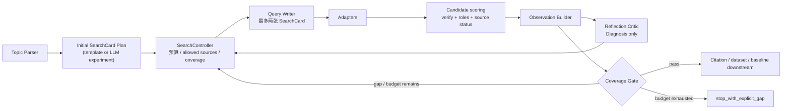

# PaperAgent Re5.X：检索反思链路迁移性升级 SOP

> **制定日期**：2026-07-11  
> **承接**：Re4.0 工程化收口（React、ACP、RAG、StageContract、RunState）。  
> **本期目标**：升级检索规划、ReAct 与 Reflection/Repair 的编排，使其以
> “证据角色覆盖与真实 observation”为优化目标，而不是对固定测试集或“论文数量”
> 过拟合。  
> **明确不在本期范围**：创新点质量、研究叙事质量、工作包内容本身的深度升级；
> 本期只提供更可靠的上游证据与可迁移检索控制面。

---

## 1. 目标与非目标

### 1.1 最终目标

对于未见过的中英文工科题目、跨领域题目、冷门题目和降级网络环境，系统应能：

1. 使用当前**实际允许**的检索源；
2. 区分“某次查询无结果”与“该 source 不可用”；
3. 围绕缺失的证据角色（core / baseline / parallel / dataset / repo）有针对性地
   修复，而不是只继续凑论文数；
4. 以可解释的 observation 驱动反思、停止与降级；
5. 在冻结的 hidden evaluation 集上优于当前基线，再进入生产路径。

### 1.2 非目标

- 不恢复 `search_reflection_loop.py` 的整套已归档 Re10 pipeline；
- 不新增第二个编排器或第二条检索数据链路；
- 不把“检索到 repo”设为所有领域都必须满足的硬约束；
- 不以大模型自然语言 reason 代替可执行的路由规则；
- 不在本期调优 Innovation Extractor、Narrative Builder 或 Devil's Advocate 的
  学术内容质量。

---

## 2. 当前问题与修复原则

| ID | 当前问题 | 影响 | Re5.X 原则 |
|---|---|---|---|
| R5-01 | planner / repair prompt 声称 `web` 可用，但 runtime allowlist 静默丢弃它 | 模型遵从提示词反而产生空计划 | prompt 的工具表由 runtime `allowed_sources` 动态注入，禁止双份静态清单。 |
| R5-02 | `PAPERAGENT_SKIP_SEARCH_PLANNER` 默认 `true` | 大部分运行绕过 LLM planner，调 prompt 不影响生产 | 将 template planner 作为明确 control；LLM planner 作为可配置 experiment arm。 |
| R5-03 | 空响应被视为 adapter failure | 误把 query miss 当 source outage，过早禁用 source | 状态严格拆分 `success / empty / failed / rate_limited / disabled`。 |
| R5-04 | stop 主要依赖 `n_papers >= 5`、`n_repos >= 1` | 容易“凑数即停止”，缺 baseline/dataset 仍向下游传播 | 停止由代码 Coverage Gate 决定，LLM 仅建议。 |
| R5-05 | relevance reflection 只看标题关键词 overlap 与固定 30% 阈值 | 中英文、缩写、同义词、跨学科术语泛化差 | relevance 由 candidate verifier / role classifier 的结果汇总，词面规则只作兜底。 |
| R5-06 | 反思 query 是固定三段拼接 | 不利用噪声、失败原因、已接受 seed、缺口类型 | 采用 Observation → Diagnosis → SearchCard 的受控闭环。 |
| R5-07 | repair 替换 plan、ReAct steps 每轮重置 | 跨轮重复查询保护不完整 | 引入 append-only `query_ledger` 与 normalized fingerprint。 |
| R5-08 | 提示词的 JSON 约束强，运行时语义校验弱 | 不完整输出会被静默归一化后继续运行 | 每个 LLM 输出均经 Pydantic schema + semantic validator 验证。 |

---

## 3. 目标架构：唯一的 SearchController



### 3.1 分层责任

| 层 | 负责 | 不负责 |
|---|---|---|
| `SearchController` | 预算、allowlist、source 状态、覆盖门、停止 | 编造同义词、判断论文真实性 |
| Query Writer（LLM） | 在受控词汇和目标角色下写 0–2 个查询 | 选用未授权工具、直接 stop |
| Adapter | 返回原始结果与真实失败类型 | 把空结果标为错误 |
| Verifier / role classifier | 相关性、真实性、证据角色 | 决定下轮工具预算 |
| Reflection Critic（LLM） | 基于 observation 选择诊断和修复方向 | 生成论文事实、直接修改 state |
| Coverage Gate | 根据可配置的 required roles 决定 continue / stop | 调 LLM |

### 3.2 必须持久化的 `query_ledger`

每个 SearchCard 追加一条事件；禁止在 repair 时覆盖历史。

```json
{
  "round": 2,
  "card_id": "sc-017",
  "fingerprint": "openalex|semantic segmentation bridge crack",
  "target_role": "baseline",
  "source": "openalex",
  "query": "semantic segmentation bridge crack benchmark",
  "source_status": "success|empty|failed|rate_limited|disabled",
  "n_raw": 12,
  "n_relevant": 4,
  "n_verified": 2,
  "diagnosis_parent": "diag-004",
  "created_at": "ISO-8601"
}
```

`fingerprint` 应使用小写、空白规整、标点规整后的 `source|query`；可选再加入
同义词归一化，但不能把不同领域词误合并。

---

## 4. 先做运行时契约修正（不改 prompt 语义）

### Phase 0：消除“提示词说 A，运行时做 B”

- [ ] 建立唯一 `SourceCatalog`：source 名称、启用状态、禁用原因、领域资格、
  timeout、并发限制、替代 source。
- [ ] `search_planner`、`targeted_repair`、`search_agent` 的 prompt 均从
  `SourceCatalog.allowed_sources(...)` 注入，不再内嵌工具名单。
- [ ] 统一 `web` 的产品决策：
  - 若不支持，删掉所有 prompt 中的 `web`；
  - 若支持，新增适配器和 allowlist，再写入 prompt。
- [ ] `_run_tool` 返回结构化 `SourceResult`，禁止以空数组表达 failure。
- [ ] 将 `PAPERAGENT_SKIP_SEARCH_PLANNER` 改为显式三态配置：
  `template | llm | experiment`；默认值与 Run trace 必须可见。
- [ ] 对 SearchCard、Diagnosis、Observation 建立 Pydantic model；缺 `target_role`、
  `evidence_ids`、`source`、`query` 时拒绝执行。

**验收**：

- [ ] prompt 中列出的 source 与 SourceCatalog 逐项一致；
- [ ] `empty` 不进入 failed source blacklist；
- [ ] `disabled` source 不出现于 LLM 输入，也不产生 HTTP 请求；
- [ ] 无效 LLM JSON 或语义不完整输出进入一次 repair/fallback，不静默执行；
- [ ] query ledger 可跨 repair round 查询所有历史 fingerprint。

---

## 5. 三组可替换提示词实验

所有实验保持相同的 adapter replay、budget、topic atoms 和 verifier；每次只替换
一个变量。未通过 §7 的 hidden 集验收，不得替换生产默认路径。

### 实验 A：受控 ReAct 动作选择器（最小改动）

**适用**：保留当前 `think → call → observe` 循环，但收回 LLM 的工具与停止权。

```text
你是“检索动作选择器”，不是最终研究评审员。

你只能从 INPUT.allowed_actions 中选择一个 action；不得选用未提供的
source、query_id 或 candidate_id，不得发明论文、数据集、工具或事实。

优先级：
1. 关闭优先级最高的 evidence_role_gap；
2. 在同一角色内提高 relevant_verified 数；
3. 只有 required_roles 已满足且最近两张 SearchCard 的增益均为 0 时，才建议停止。

注意：source_status=empty 只表示该查询没有命中，不代表 source 失效；
只有 failed、rate_limited、disabled 的 source 不可再选。

返回且只返回：
{
  "action": "execute_query|stop_with_gap",
  "query_id": "必须来自 allowed_actions",
  "diagnosis_code": "role_gap|low_precision|source_failure|budget_exhausted|coverage_complete",
  "evidence_ids": ["必须来自 observations"],
  "reason": "不超过30字"
}
```

**优点**：实现最小，能先解决 source/stop 漂移。  
**不足**：LLM 仍在每一步做决策，成本与方差较高。

### 实验 B：Reflection Critic + Query Writer（推荐）

**适用**：需要真正提升迁移能力时。Reflection 只诊断，Query Writer 只写查询，
Controller 决定是否执行。

#### B1. Reflection Critic

```text
你只根据 OBSERVATIONS 诊断上一轮检索；不生成论文事实，不判断题目是否可做，
不直接生成查询。

从下列 diagnosis_code 中选择一个：
role_gap | low_precision | query_too_narrow | query_too_broad |
source_unavailable | metadata_gap | no_repair_route | unknown

从下列 action 中选择一个：
rewrite_query | switch_source | expand_from_accepted_seed |
repair_metadata | stop_with_explicit_gap

规则：
- source_status=empty 不得判为 source_unavailable。
- 只有 required_roles 包含 repo 时，repo 缺失才是 gap。
- 每个判断必须引用 query_id 或 candidate_id。
- 没有足够 observation 时输出 unknown；不得猜测。

返回 JSON：
{
  "diagnosis_id": "...",
  "diagnosis_code": "...",
  "confidence": 0.0,
  "action": "...",
  "target_role": "core|baseline|parallel|dataset|repo|metadata",
  "evidence_ids": ["..."],
  "must_keep_terms": ["仅来自 atoms 或 accepted candidate"],
  "avoid_terms": ["仅来自 rejected/noise observation"],
  "source_preference": ["仅来自 allowed_sources"],
  "stop_reason": null
}
```

#### B2. Query Writer

```text
根据 DIAGNOSIS 生成至多两张 SearchCard；每张卡只关闭一个 target_role。

约束：
- source 必须来自 allowed_sources；
- query 必须包含 must_keep_terms 至少一个词；
- 不得包含 avoid_terms；
- 不得与 prior_query_fingerprints 等价；
- 新增词必须标记来源：atom、accepted_seed 或 controlled_synonym；
- 无高质量修复路径时返回空 cards，不可用通用方法词填充。

返回：
{
  "cards": [{
    "source": "...",
    "query": "...",
    "target_role": "...",
    "expected_signal": "代码可验证的命中条件",
    "query_term_origin": [{"term":"...","origin":"atom|accepted_seed|controlled_synonym"}],
    "stop_if": "..."
  }],
  "abstain_reason": null
}
```

**优点**：每次修复有可审计因果链，容易做 replay 和失败归因。  
**不足**：新增两个 schema 与一个 controller 接口。

### 实验 C：固定计划优先的计划修订器

**适用**：以现有 template planner 为正式 control，LLM 只对失败卡片提出小范围 edit。

```text
你是检索计划修订器。已有 deterministic SearchCard，不要重写整份计划。

每次最多做两项 edit：
1. 替换一张 low_precision SearchCard；
2. 为缺失 evidence role 追加一张卡；
3. 将 rate_limited / failed source 切换为 allowed alternate source；
4. 明确 no_repair_route。

每个 edit 必须引用被替换的 card_id 和 observation evidence_ids；
不得改变已经满足的 evidence role；不得生成无对象词的泛方法查询。

返回：
{
  "edits": [{
    "operation": "replace|append|disable",
    "card_id": "...",
    "replacement": {"source":"...", "query":"...", "target_role":"..."},
    "evidence_ids": ["..."],
    "expected_increment": "..."
  }],
  "unresolved_gaps": []
}
```

**优点**：方差低、便于回放、最接近当前默认 template 路径。  
**不足**：探索能力弱于实验 B。

### 5.4 选择建议

先实现 Phase 0，再以 **C 作为 control、A 作为低成本替代、B 作为推荐候选**。
只有 B 在 hidden 集显著提升且不增加 false stop / 无效调用时，才成为生产默认。

---

## 6. Coverage Gate 与停止语义

### 6.1 配置化角色要求

不同题目不应共用“5 papers + 1 repo”。Controller 应根据 topic/domain 给出：

```json
{
  "required_roles": {"core": 2, "baseline": 1},
  "optional_roles": {"parallel": 1, "dataset": 1, "repo": 1},
  "budget": {"max_cards": 8, "max_repair_rounds": 2},
  "stop_policy": "coverage_then_marginal_gain"
}
```

`repo` 和 `dataset` 默认为 optional；只有题目明确涉及可复现代码、公开数据或用户
约束要求时，才升级为 required。

### 6.2 代码停止规则

| 条件 | 路由 |
|---|---|
| 所有 required roles 满足，最近两张 card 的 verified 增量为 0 | continue downstream |
| 存在 required gap，预算未耗尽，且有 allowed source | reflect → generate next cards |
| 存在 required gap，但所有可行 route 均 empty / unavailable | `stop_with_explicit_gap` |
| 预算耗尽 | `stop_with_explicit_gap`，记录未满足角色和尝试历史 |

LLM 输出的 `stop_with_gap` 只能作为建议；最终由代码复核 required role 与 budget。

---

## 7. 迁移性评估与验收规范

### 7.1 集合隔离

| 集合 | 数量 | 目的 | 使用约束 |
|---|---:|---|---|
| Dev | 20 | 调 prompt、修 schema | 可重复使用 |
| Hidden | 40 | 选择最终方案 | prompt 冻结前禁止看 gold 标签 |
| Replay fixture | 与题目对应 | 隔离外网波动 | 同一组 adapter 返回用于所有 A/B arms |
| Live smoke | 6 | 检查外网与 ledger 健康 | 不作为质量金标 |

Hidden 集至少包含：中文长题、纯英文、缩写/同义词、医学、土木、遥感、工业制造、
无公开 repo、无合适 dataset、极冷门/不可行题、429、全部 source 空结果和跨领域组合题。

### 7.2 Gold 标签不应是“唯一正确 query”

每题 gold 至少标注：

- required / optional evidence roles；
- 可接受 source 集；
- 相关 paper/candidate ID；
- 噪声候选与拒绝原因；
- 在 disabled、empty、rate limited 条件下可接受的路由；
- 明确不可修复时的正确 `stop_with_explicit_gap`。

允许不同 query 文本，只评估其检索结果、角色覆盖与路由语义。

### 7.3 指标

| 指标 | 定义 |
|---|---|
| Contract violation rate | source、schema、重复 fingerprint、无 observation 引用等硬违例占比 |
| Role coverage@budget | 在预算内完成 required roles 的题目比例 |
| Relevant precision@10 | 前 10 候选中人工/fixture 判定相关的比例 |
| False stop rate | required role 未满足但系统停止的比例 |
| Empty-as-failure rate | `empty` 被错误记作 failure 的比例 |
| Duplicate / useless query rate | 重复或没有目标角色/对象词的查询比例 |
| Recovery success | 在 source 失败、429、低精度场景中下一轮恢复有效证据的比例 |
| Cost | 每题 card 数、adapter 调用数、LLM 调用数、总延迟 |

### 7.4 准入门槛

**硬门（100%）**：

- [ ] Contract violation rate = 0；
- [ ] disabled source 零 HTTP 请求；
- [ ] `empty`、`failed`、`rate_limited` 不混淆；
- [ ] 无重复 query fingerprint；
- [ ] LLM 不可绕过 Coverage Gate；
- [ ] 每个 diagnosis 都有 observation evidence IDs。

**质量门（相对当前 control）**：

- [ ] Hidden `Role coverage@budget` 至少高出 control 10 个百分点；
- [ ] Hidden `Relevant precision@10` 不低于 control 5 个百分点以上；
- [ ] False stop rate 不得高于 control；
- [ ] Duplicate / useless query rate ≤ 5%；
- [ ] 平均 adapter 调用数不超过 control +1；
- [ ] 固定 temperature 下 3 次 replay，至少 2 次达到上述质量门。

若 baseline 太弱或 hidden 标签规模不足，先报告置信区间和逐 case 差异；不得只报
平均分后宣称泛化成功。

---

## 8. 测试分层与执行顺序

### Phase 1：契约单元测试

- [ ] SourceCatalog 与 prompt source 列表一致；
- [ ] 所有 SourceResult 状态均可被正确路由；
- [ ] SearchCard / Diagnosis / Observation 的 Pydantic 与 semantic validation；
- [ ] fingerprint 跨轮去重；
- [ ] required/optional role 的 Coverage Gate；
- [ ] LLM 不完整 JSON、未知 source、空 evidence_ids 的拒绝路径。

### Phase 2：离线 replay A/B

- [ ] 冻结同一批 adapter fixture；
- [ ] 分别运行 control、实验 A、实验 B、实验 C；
- [ ] 每次只改变一个 prompt/控制器变量；
- [ ] 输出 per-case ledger、route、coverage、成本、失败解释。

### Phase 3：hidden 盲测

- [ ] 执行者先提交 prompt hash 和配置 hash；
- [ ] 解封 hidden fixture 后只允许运行，不允许调 prompt；
- [ ] 生成 aggregate report + failure taxonomy；
- [ ] 未过门槛时回到 Dev，不可“修一下 hidden 的个例”。

### Phase 4：可选 live smoke

- [ ] 限制并发与预算；
- [ ] 验证 source policy、ledger、timeout 和用户可见错误；
- [ ] 不以 live 内容的偶然成功覆盖 replay/hidden 失败。

---

## 9. 实施顺序与交付物

| 顺序 | 任务 | 主要文件/产物 | 完成条件 |
|---:|---|---|---|
| 1 | 工具与状态契约收口 | SourceCatalog、SourceResult、Pydantic models | R5-01~03 单测全绿 |
| 2 | ledger 与 Coverage Gate | `query_ledger`、fingerprint、role policy | 跨轮不重复、stop 可解释 |
| 3 | Control 建立 | template planner + 当前 ReAct replay | 形成可复现 baseline report |
| 4 | 实验 A | 受控动作选择器 | 完成 Dev/replay 报告 |
| 5 | 实验 C | 固定计划修订器 | 完成 Dev/replay 报告 |
| 6 | 实验 B | Critic + Writer + Controller | 完成 Dev/replay 报告 |
| 7 | Hidden 盲测与决策 | prompt/config/fixture hashes、对比报告 | 按 §7.4 选定生产 arm |
| 8 | 生产接入与文档 | Prompt overview、Architecture、CHANGELOG、Known limitations | 默认路径唯一，归档 Re10 仅保留历史说明 |

---

## 10. 完成标准

- [ ] 生产检索路径只有一个反思控制面；Re10 归档代码不再被 active import。
- [ ] 运行时 source、prompt source、adapter registry 三者一致。
- [ ] 查询历史 append-only，repair 不覆盖前序 observations。
- [ ] stop 不再由“论文数量 + repo 数量”单独决定。
- [ ] 最终选中 arm 通过全部硬门和 hidden 质量门。
- [ ] 报告包含 control 与 A/B/C 的逐 case 对比、prompt hash、fixture hash、模型版本。
- [ ] README/Prompt 总览明确写出 template、LLM planner、生产默认 arm 的实际关系。

---

## 11. 后续接口：创新点与叙事（仅预留）

Re5.X 结束后，创新点与叙事可消费以下稳定上游资产：

- `verified_candidate_ids` 与角色分类；
- candidate / chunk 的 evidence snippets；
- `query_ledger` 与 source provenance；
- 未满足角色与显式 gap；
- coverage gate 的真实可行性边界。

届时再另立版本处理“证据存在”到“证据真正支持创新/叙事论断”的语义蕴含验证，
避免本期把检索控制面与学术裁缝质量混在一起调参。
