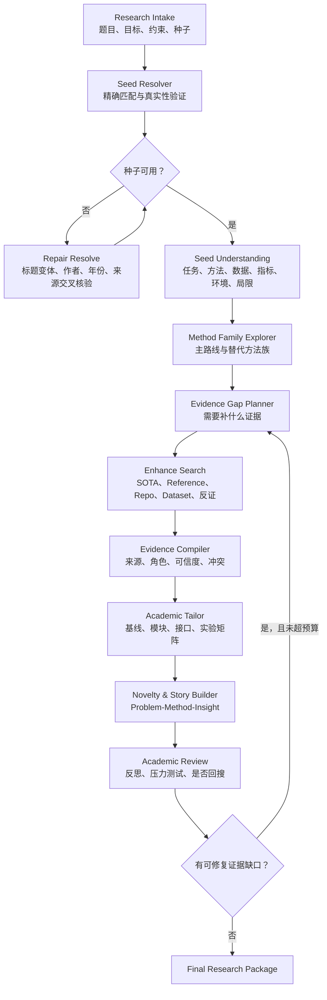

# PaperAgent Re8.0：Seeded Research 学术裁缝 Agent MVP 策划案

> 类型：产品与工程策划案，不包含代码实现  
> 定位：从“给题目后广搜”升级为“带种子论文和研究意图的证据驱动方法设计”  
> 前置：复用 Re6/Re7 的检索、验证、Evidence Context、Novelty、Claim Judge 与 Review 链路

## 目录

- [1. 结论与产品定位](#1-结论与产品定位)
- [2. 用户输入与种子角色](#2-用户输入与种子角色)
- [3. 与现有链路的区别](#3-与现有链路的区别)
- [4. MVP 总体流程](#4-mvp-总体流程)
- [5. 核心状态契约](#5-核心状态契约)
- [6. 种子论文核验与理解](#6-种子论文核验与理解)
- [7. 方法族扩展与增强搜索](#7-方法族扩展与增强搜索)
- [8. Agent 编排与三种模式](#8-agent-编排与三种模式)
- [9. Tailor、Review 与科研故事](#9-tailorreview-与科研故事)
- [10. MVP 工作包](#10-mvp-工作包)
- [11. 测试与验收](#11-测试与验收)
- [12. 风险推演](#12-风险推演)
- [13. MVP 完成定义](#13-mvp-完成定义)

---

## 1. 结论与产品定位

方案可行，而且比当前 `topic-first` 流程更接近真实学生科研场景。用户往往已从导师、Kimi/GPT、自己阅读中获得：

- 一篇经典论文、SOTA 候选或导师指定论文；
- 一篇希望复现、平行改进或迁移的论文；
- 一个模糊选题、应用场景或期望方向；
- 可能不准确的题名、DOI、网页链接、PDF 或模型生成论文列表。

Re8.0 推荐定位：

> 接收“研究意图 + 少量种子论文”，先核验种子、理解任务和方法，再有目的地补齐竞争路线、模块、数据集、Repo 和反证，最终生成可复现、可验证、可讲述的增量研究方案。

这不是删除原检索链，而是新增 `seeded_research` 高级入口，保留 `topic_only` 入口。Re8.0 的核心 KPI 不再是“搜到多少篇”，而是：

1. 种子是否真实、角色是否正确；
2. 为什么需要继续搜索；
3. 每条新证据填补了什么缺口；
4. 模块是否语义、接口和训练目标兼容；
5. 创新叙事是否有可证伪实验支撑。

### 1.1 产品边界

系统可以支持低门槛增量研究和模块组合叙事，但不能捏造论文、DOI、实验数据或引用，也不能把未实验的拼接描述为已验证创新。

方法创新较弱时，允许诚实降级为：

- 工程贡献（engineering contribution）；
- 应用迁移贡献（application contribution）；
- 系统集成贡献（system integration contribution）；
- 实证发现（empirical insight）；
- 复现与边界研究（reproduction and boundary study）。

即“故事可以讲好，但不能超过证据”。

---

## 2. 用户输入与种子角色

### 2.1 推荐输入

用户提交：

1. 研究题目、目标和应用场景；
2. 至少一篇种子论文；
3. 可选的方法偏好、数据、算力、时间和论文目标；
4. 运行模式。

示例：

> 做复杂背景下的混凝土裂缝识别。导师给了一篇 YOLO 检测论文，我想复现并改善小裂缝表现。请同时考虑检测、分割和小目标机制，给出可实现的方法与实验方案。

### 2.2 种子角色

| 角色 | 含义 | 处理方式 |
|---|---|---|
| `classic_anchor` | 经典、理论起点或导师指定论文 | 可作为研究起点 |
| `current_sota_candidate` | 用户认为的当前 SOTA | 需要核验，不强依赖其“最新”身份 |
| `reproduction_target` | 希望复现并改进的主基线 | 优先提取复现环境 |
| `parallel_inspiration` | 平行领域或可迁移方法 | 检查任务与接口兼容性 |
| `survey_reference` | 用于理解领域结构的综述 | 不能作为性能证据 |
| `unknown` | 角色尚未确定 | 由 Agent 推断或用户确认 |

“过时 SOTA”不作为硬错误。若仍适合复现，则改标为 `classic_anchor` 或 `reproduction_target`，另外寻找当前竞争基线用于公平比较。

### 2.3 支持形式

标题、DOI、arXiv ID、URL、BibTeX、本地 PDF、粘贴引用文本、模型生成论文列表均可输入。但它们都只是 `candidate_seed`；真实性验证完成前不得进入 `verified_papers`。

---

## 3. 与现有链路的区别

当前主流程近似：

`topic_parser → search_planner → paper_retriever → verify → dataset/repo → feasibility → work_package → novelty → claim_judge → narrative → review`

它能从空题目启动，但存在四个结构性问题：首轮关键词容易锁死搜索空间；用户已有论文没有成为研究结构中心；上传论文可能被直接注入为 accept；搜索偏相关性扩展而不是为决策补证据。

| 维度 | 当前方案 | Re8.0 |
|---|---|---|
| 入口 | 题目优先 | 题目 + 种子优先 |
| 用户论文 | 可能直接进入验证集 | 必须先做真实性与角色审计 |
| 搜索目标 | 找相关论文 | 解决明确 Evidence Gap |
| 方法扩展 | 关键词相似 | 任务本体 + 方法族 + 机制路线 |
| Agent 决策 | 固定节点串联 | Chain 主干 + 有界 ReAct/Reflection |
| 推理留痕 | trace 为主 | Research Reasoning Ledger |
| 调试 | 依赖联网与模型 | Full、Lite、Offline 三模式 |

保留双入口并统一输出：

```text
topic_only       → 原链路，适合完全没有论文的用户
seeded_research  → Re8.0 新链路，未来推荐默认
                        ↓
      Evidence / Tailor / Review / Final Report
```

---

## 4. MVP 总体流程



主循环规则：

- 主流程采用可恢复的确定性 Chain；
- ReAct 只负责选择下一工具或证据动作；
- Reflection 只在关键 Gate 启用；
- 每次回搜必须绑定 `evidence_gap_id`；
- 默认最多两次 Review 回搜，超限后输出未解决项而非无限循环。

---

## 5. 核心状态契约

### 5.1 `ResearchIntake`

```yaml
topic: string
desired_direction: string
constraints: object
seed_papers: SeedPaperInput[]
entry_mode: topic_only | seeded_research
run_mode: full_agent | lite_chain | offline_replay
network_policy: online | cache_first | offline
```

### 5.2 `SeedPaperCard`

```yaml
seed_id: string
input_form: title | doi | arxiv | url | pdf | citation
resolved_title: string | null
authors: string[]
year: integer | null
doi: string | null
canonical_url: string | null
existence_status: verified | ambiguous | not_found
fulltext_status: downloaded | metadata_only | parse_failed
role: classic_anchor | current_sota_candidate | reproduction_target | parallel_inspiration | survey_reference | unknown
task_definition: string | null
method_summary: string | null
dataset_and_metrics: object
reproduction_environment: object
limitations: string[]
evidence_ids: string[]
```

### 5.3 `MethodFamilyCard`

```yaml
family_id: string
name: string
task_type: classification | detection | segmentation | generation | forecasting | other
relation_to_seed: direct_competitor | alternative_formulation | transferable_mechanism | incompatible
applicability_conditions: string[]
interface_requirements: string[]
expected_strengths: string[]
expected_weaknesses: string[]
search_queries: string[]
```

### 5.4 `EvidenceGap`

每次外部检索必须由 Gap 驱动：

```yaml
gap_id: string
question: string
gap_type: existence | current_baseline | competing_method | mechanism | dataset | repo | environment | counter_evidence
why_needed: string
related_claim_ids: string[]
success_condition: string
budget: object
status: open | satisfied | partially_satisfied | blocked
```

### 5.5 `ResearchReasoningLedger`

不建议存储或依赖模型的自由隐藏 CoT。MVP 改为记录可审计的结构化研究理由：

```yaml
decision_id: string
stage: seed_audit | family_expansion | search | tailor | review
decision: string
evidence_ids: string[]
alternatives_considered: string[]
rejection_reasons: string[]
hypothesis: string | null
falsifier: string | null
next_action: string
confidence: 0.0-1.0
status: proposed | evidence_backed | verified | refuted | unresolved
```

它可用于前端解释、跨模型回归和决策审计，比冗长自由 CoT 更稳定。

---

## 6. 种子论文核验与理解

### 6.1 推荐结构：确定性节点 + 可选并发子任务

论文存在性属于核心数据契约，不应完全交给临时 subagent 自由判断。建议实现 `Seed Resolver` 子图：

1. 标准化输入；
2. 精确标识符解析；
3. 多来源元数据交叉核验；
4. 下载或访问真实全文；
5. 校验题名、作者、年份、DOI 是否一致；
6. 输出统一 `SeedPaperCard`；
7. 服务端 validator 决定能否进入证据池。

多篇论文访问和 PDF 解析可由 subagent/worker 并行执行，但最终必须经过统一 validator，不能让某个 subagent 直接宣告 `verified`。

### 6.2 判定规则

| 情况 | 处理 |
|---|---|
| DOI 可解析且题名、作者基本一致 | `verified` |
| arXiv/出版社页面存在且元数据一致 | `verified` |
| 只有搜索摘要，无权威落地页 | `ambiguous` |
| DOI 指向另一篇论文 | `not_found` + `identifier_mismatch` |
| 标题相近但作者或年份冲突 | 进入 Repair Resolve |
| 本地 PDF 可解析但无 DOI | 建立本地证据并保留来源标记 |
| 模型生成论文无法找到 | 拒绝作为论文证据，保留失败 trace |

当前“用户上传论文直接以 `accept` 注入 `verified_papers`”的路径必须在 Re8.0 改为 `candidate_seed`，否则错误 DOI 会绕过所有验证。

### 6.3 PDF 与复现环境提取

下载论文后提取：

- 任务定义与数据输入输出；
- 数据集、划分和预处理；
- 主干、模块、损失函数；
- epoch、优化器、学习率、batch size；
- 硬件、框架和版本；
- 指标与对比设置；
- Repo、supplementary、config 链接；
- 作者明确写出的局限。

环境信息可信度：

```text
Repo config/environment > supplementary > PDF 正文 > README > Agent 推断
```

PDF 未写出的配置不得补猜，应输出 `unknown` 并创建 `environment` Evidence Gap。

### 6.4 隐私与版权范围

本地 MVP 暂不建设复杂 PDF 权限系统，但保留文件来源、原始 URL、引用元数据和本地/远程标记。云端上传、版权授权和文件保留策略放到上线 Gate，不阻塞本地 MVP。

---

## 7. 方法族扩展与增强搜索

### 7.1 先识别任务，再扩展方法

系统先判断用户实际要解决的是分类、检测、分割、定位与量化、时序预测、生成、重建还是优化，不能仅按模型名搜相似模型。

例如用户输入 YOLO：

- YOLO 是检测路线；
- U-Net 是分割路线，不是同任务设定下的直接替代基线；
- 若目标是裂缝像素级宽度、形态或面积，U-Net 才是合理替代问题表述；
- 若目标只是实例定位，应优先比较两阶段检测器、Transformer detector、小目标和轻量检测路线。

### 7.2 方法族规则

每个任务生成 2–4 个候选方法族：

1. 种子论文所在主方法族；
2. 同任务直接竞争方法族；
3. 解决种子弱点的机制路线；
4. 必要时加入不同任务表述的替代路线。

用户写出的模型是一项强偏好，但不是搜索边界。

### 7.3 五条 Enhance Search Lane

| Lane | 目的 | 产物 |
|---|---|---|
| Anchor/Reference | 补齐经典来源、引用链和理论背景 | 经典论文、综述、引用关系 |
| Competing Baseline | 找公平对比路线 | 同任务竞争模型、强基线 |
| Mechanism/Module | 找解决具体局限的模块 | 小目标、注意力、损失、融合模块 |
| Resource | 找可运行资源 | Repo、Dataset、权重、环境文件 |
| Counter-evidence | 主动挑战种子与拟议创新 | 相似工作、负面结果、适用边界 |

### 7.4 锚定偏差最低措施

Tailor 能调度回搜，但若查询始终带种子模型名，只会强化原锚点。MVP 强制要求：

- 一条不含种子模型名、只描述任务与限制的查询；
- 一条直接竞争方法查询；
- 一条反证或相似工作查询；
- 一次“若不用种子方法，最合理路线是什么”的结构化判断。

这不是为了强追最新 SOTA，而是避免研究方案建立在错误的问题表述上。

---

## 8. Agent 编排与三种模式

### 8.1 总体建议

采用“确定性 Graph 主干 + 有界 Agent Loop”：

- Graph 管状态、恢复、预算、trace 和 validator；
- ReAct 在给定工具和预算内选择下一证据动作；
- Reflection 在关键阶段自审并提出回搜；
- Skill 负责 Tailor/Review 的领域判断，不接管全链路状态。

### 8.2 Full Agent

适合真实研究方案生成。

```yaml
run_mode: full_agent
network_policy: online
reasoning_policy: react_reflection
react_max_actions_per_gate: 5
reflection_max_rounds: 2
search_budget:
  max_queries: 20
  max_papers: 30
  max_wall_time_minutes: 20
```

启用在线论文/Repo/Dataset 检索、种子网络核验、有界 ReAct、三个 Reflection Gate，以及 Review 定向回搜。

### 8.3 Lite Chain

适合低成本运行、快速演示和模型兼容测试。

```yaml
run_mode: lite_chain
network_policy: online | cache_first
reasoning_policy: chain_only
reflection_max_rounds: 0
```

- 关闭 ReAct 和 Reflection；
- 固定节点顺序；
- Search Planner 一次生成查询；
- Tailor 与 Review 各调用一次；
- 保留全部真实性与证据 validator。

Lite 不等于放弃真实性，只是关闭自主循环。

### 8.4 Offline Replay

适合开发调试、CI、提示词回归和多模型兼容测试。

```yaml
run_mode: offline_replay
network_policy: offline
reasoning_policy: chain_only
fixture_set: string
strict_no_network: true
```

- 禁止所有外部 HTTP；
- 使用固定 metadata、PDF 文本、搜索结果和 Repo fixture；
- fixture 覆盖错误 DOI、缺失 PDF 和冲突证据；
- 输出契约与 Full Agent 完全相同；
- 任何意外联网直接使测试失败。

### 8.5 能力矩阵

| 能力 | Full Agent | Lite Chain | Offline Replay |
|---|---:|---:|---:|
| 在线核验 | 是 | 可选 | 否 |
| Enhance Search | 动态回搜 | 固定一轮 | Fixture |
| ReAct | 有界开启 | 关闭 | 关闭 |
| Reflection | 最多两轮 | 关闭 | 关闭 |
| Tailor/Review Skill | 是 | 是 | 是 |
| Evidence Validator | 是 | 是 | 是 |
| 统一输出 Schema | 是 | 是 | 是 |

### 8.6 ReAct 工具白名单

MVP 只开放：

- `resolve_paper`
- `fetch_metadata`
- `fetch_or_parse_pdf`
- `search_reference_chain`
- `search_method_family`
- `search_repo`
- `search_dataset`
- `extract_reproduction_environment`
- `compile_evidence`
- `request_tailor_review`

每次动作必须记录：`目标 Gap → 工具 → 预期成功条件 → 实际结果 → 下一动作`。

### 8.7 Reflection Gate

1. `Seed Audit Gate`：种子是否真实、角色正确、信息足够；
2. `Tailor Gate`：模块是否兼容、是否存在更简单路线、实验能否证伪；
3. `Final Review Gate`：叙事是否超过证据、是否存在高度相似工作、是否需要补证。

每个 Gate 最多两轮；仍有缺口则输出 `unresolved`，禁止继续自循环。

---

## 9. Tailor、Review 与科研故事

### 9.1 Academic Tailor Skill

Tailor 接收结构化的 BaselineCard、ModuleCard、EvidenceContext、MethodFamilyCard、用户约束和 Evidence Gap，而不是整包无边界自由文本。

必须输出：

1. 主基线及选择理由；
2. 候选模块与来源；
3. 模块语义、接口和训练目标兼容性；
4. 最小可行拼接方案；
5. 消融实验矩阵；
6. 公平对比要求；
7. GO / REVISE / NO-GO；
8. 不足证据和定向回搜请求。

### 9.2 Novelty Review Skill

Review 采用 `Problem–Method–Insight`：

- Problem：哪一个可观察失败模式仍未解决；
- Method：哪一个明确机制响应它；
- Insight：实验希望揭示什么可推广认识。

必须输出一句话、三句话和段落版贡献，以及最近似工作、差异、可证伪假设、最小关键实验、三个审稿人攻击点、贡献类型与伪创新风险。

### 9.3 Skill Adapter 与模型差异

```text
Skill Output → Schema Validator → Evidence/Claim Validator → Graph State
```

Skill 只能建议，不能绕过 validator。不同模型返回不一致时：

1. schema repair；
2. 仍缺关键字段则降级 Lite Prompt；
3. 再失败使用规则 fallback；
4. 标记 `generated_by=fallback`；
5. 解析失败不得被当作 GO。

### 9.4 科研故事生成

Story Builder 依据 Evidence 和 Reasoning Ledger 生成：

1. 现实任务与约束；
2. 主流方法在该约束下的失败；
3. 为什么选择该可复现基线；
4. 借用模块解决哪个失败模式；
5. 为什么模块可组合；
6. 哪组实验检验作用机制；
7. 即使性能未显著领先，仍产生什么实证认识。

推荐模板：

```text
在【场景/约束】下，现有【方法族】虽能【已有能力】，但因【可观察失败模式】导致【后果】。
我们以【可复现基线】为起点，引入/重构【有来源的机制模块】，使其在【接口或目标】上作用于该失败模式。
与简单堆叠不同，本研究通过【关键消融/对照】检验【机制假设】，并分析其在【边界条件】下何时有效或失效。
```

句子按证据状态限制措辞：

| 状态 | 可用措辞 |
|---|---|
| `proposed` | “拟采用”“预期”“假设” |
| `evidence_backed` | “已有研究表明”“文献支持” |
| `verified` | “实验验证”“结果显示” |
| `refuted` | “未得到支持”“在该条件下失效” |
| `unresolved` | “尚需验证”“证据不足” |

实验数据进入系统前，只能生成研究计划与预期叙事，不能描述成已完成事实。

---

## 10. MVP 工作包

按单人高强度开发估算为 7–10 个有效开发日。若压缩为演示版，也不应删除 Seed Validator 和 Offline Replay。

### WP0：契约与模式开关

- 增加 `entry_mode/run_mode/network_policy/reasoning_policy`；
- 定义 Seed、Method Family、Evidence Gap、Reasoning Ledger Schema；
- 保持旧 API 和 `topic_only` 兼容；
- trace 增加 mode、provider、model、fallback、budget。

验收：同一输入在三种模式下具有相同顶层输出 Schema。

### WP1：Seed Intake 与 Resolver

- 接收标题、DOI、URL、PDF 等；
- 删除“用户论文自动 accept”的语义；
- 精确解析、交叉核验、全文获取；
- 支持错误 DOI、假论文和近似匹配 Repair；
- 多种子并发解析并输出 SeedPaperCard。

验收：错误 DOI 不进入证据池；真实论文得到稳定 canonical identity。

### WP2：Paper Understanding 与环境提取

- PDF 章节/表格解析；
- 方法、数据、指标、限制抽取；
- Repo、supplementary、environment/config 合并；
- 缺失字段形成 Evidence Gap。

验收：有 Repo 时指出复现入口；配置缺失时明确 unknown。

### WP3：Method Family Explorer

- 轻量任务本体；
- 推导 2–4 个方法族；
- 标记直接竞争、替代问题表述和不可比路线；
- 生成五条 Search Lane、无锚点查询和反证查询。

验收：YOLO 输入不会机械地把所有视觉模型当作同任务直接基线。

### WP4：Evidence Gap 驱动搜索

- 每条查询绑定 Gap 和成功条件；
- 跨来源异步并发；
- 预算、去重、缓存、early exit；
- 0 结果时退出/改写，不空跑 verify；
- Review 只能发起定向补搜。

验收：trace 能回答每次“为什么搜、结果改变了什么”。

### WP5：Tailor/Review Skill Adapter

- 编译结构化 Skill 输入；
- 输出 Schema 校验；
- 多模型 JSON repair 与 fallback；
- Tailor 生成兼容性/消融；
- Review 生成 P-M-I/可证伪性/压力测试。

验收：切换至少三类模型时 Schema 稳定，失败可降级。

### WP6：ReAct、Reflection 与 Ledger

- 工具白名单和硬预算；
- 三个 Reflection Gate；
- 每次决策写入 Ledger；
- 防止无 Evidence Gap 的循环搜索。

验收：Full Agent 有界完成；Lite/Offline 不出现 ReAct/Reflection 调用。

### WP7：前端 MVP

五步页面：

1. 题目与目标；
2. 种子上传和角色；
3. 模式、联网、模型和预算；
4. 实时展示验证、Gap 和 Agent 决策；
5. 输出研究包与待验证事项。

用户可以修正种子角色、排除错误匹配、选择主方法族、批准一次额外搜索并导出报告。

### WP8：Fixture、回归与演示包

- 正确论文、假 DOI、标题冲突、扫描 PDF、缺 Repo fixture；
- Full/Lite/Offline 对照；
- 至少三个跨域案例；
- 一条 3–5 分钟可演示路径；
- 记录耗时、调用数、费用、fallback 和结果差异。

---

## 11. 测试与验收

### 11.1 功能验收

| 编号 | 场景 | 通过标准 |
|---|---|---|
| A-01 | 正确 DOI | 唯一解析，题名和作者一致 |
| A-02 | 错误 DOI | 不进入 evidence，给出 mismatch |
| A-03 | 模型捏造论文 | `not_found`，最终 Claim 不得引用 |
| A-04 | 标题轻微错误 | 通过作者/年份或近似标题 Repair |
| A-05 | 过时 SOTA | 降级为 classic/reproduction，不阻塞 |
| A-06 | PDF 无环境 | 输出 unknown，尝试 Repo/supplementary |
| A-07 | YOLO + 裂缝 | 至少一条同任务竞争路线和一条条件化分割路线 |
| A-08 | Tailor 回搜 | 只搜索明确 Gap，不泛化重跑 |
| A-09 | Full Agent | ReAct/Reflection 在预算内完成或有界退出 |
| A-10 | Lite Chain | 无 ReAct/Reflection，Schema 完整 |
| A-11 | Offline Replay | 网络调用为 0，fixture 可复现 |
| A-12 | 非标准 JSON | repair/fallback 生效且 trace 可见 |

### 11.2 方法论门槛

- 主基线有来源与选择理由；
- 每个模块有来源并对应具体失败模式；
- 检查语义、接口、训练目标和评价协议兼容性；
- 至少设计 `Baseline / A / B / A+B` 消融；
- 强 Claim 绑定 Evidence 和 falsifier；
- 有最近似工作和差异；
- 无证据句只能是 proposed/unresolved；
- 至少三个审稿人攻击点和补救实验。

### 11.3 鲁棒性与性能门槛

- 三种模型的顶层字段完整率 ≥ 98%；
- 非法 JSON 自动恢复率 ≥ 95%；
- fallback 时不 crash 且 trace 路径真实；
- 假论文引用泄漏率为 0；
- Offline 意外联网为 0；
- ReAct/Reflection 上限严格生效；
- 相同 fixture 的角色、Gap 和 Verdict 基本稳定。

建议性能目标：Full Agent 单案例 ≤ 15 分钟，Lite ≤ 6 分钟，Offline ≤ 90 秒。优化顺序为缓存、并发、批量 verify、空输入 early exit、减少重复 LLM 调用；不得以跳过真实性验证换速度。

---

## 12. 风险推演

| 风险 | 后果 | MVP 解决方案 |
|---|---|---|
| Tailor 回搜仍被锚定 | 只强化原模型 | 强制无锚点、竞争和反证查询 |
| 近似标题错误匹配 | 污染全部下游 | 题名/作者/年份/ID 至少两类一致，模糊项人工确认 |
| 扫描 PDF/双栏解析失败 | 方法和环境抽取错误 | 文本→版面→OCR fallback，保留页码与置信度 |
| PDF 复现信息不足 | 无法实际运行 | 联合 Repo/config/requirements，输出已知/推断/缺失 |
| 模块接口相容但机制无效 | 伪创新 | 每模块绑定假设、消融和失败判据 |
| 故事压过证据 | 把计划写成事实 | Claim 状态机、Evidence ID、Claim Judge、措辞约束 |
| ReAct/Reflection 死循环 | 耗时和费用失控 | Gap 去重、动作预算、两轮上限、边际贡献 early exit |
| 模型输出漂移 | JSON/字段不稳定 | Schema、别名归一、repair、一次重试、规则 fallback |
| Skill 升级漂移 | 破坏 Graph State | Adapter 版本化，记录 skill/version/contract，fixture 回归 |
| Offline fixture 太理想 | 测试与生产脱节 | 从真实 trace 生成超时、429、空结果、冲突 ID 等 fixture |
| 经典论文被称为 SOTA | 定位和对比不准 | 不阻塞，分开记录研究起点与当前竞争基线 |

---

## 13. MVP 完成定义

- [ ] 保留 `topic_only`，新增兼容的 `seeded_research`；
- [ ] 用户种子不再自动视为 verified/accept；
- [ ] 正确、错误、模糊论文输入均有可解释结果；
- [ ] 能从 PDF/Repo 形成 SeedPaperCard 和复现缺口；
- [ ] 能生成至少两条任务兼容的方法路线；
- [ ] Enhance Search 全部由 Evidence Gap 驱动；
- [ ] Tailor 输出基线、模块、兼容性和实验矩阵；
- [ ] Review 输出 P-M-I、falsifier 和压力测试；
- [ ] Full Agent 的 ReAct/Reflection 有硬预算；
- [ ] Lite Chain 确认关闭 ReAct/Reflection；
- [ ] Offline Replay 确认完全关闭联网；
- [ ] 三模式共享同一输出 Schema；
- [ ] 假论文、错误 DOI 和无证据 Claim 不进入最终事实；
- [ ] 至少三个跨域案例完成端到端验收；
- [ ] Final Package 包含来源、待验证项、实验计划和失败边界。

最终输出包包含：Research Intent、Seed Audit、Method Family Map、Evidence Gap、Baseline/Module Cards、Tailored Method、Reproduction Checklist、Experiment/Ablation Matrix、Novelty Claims/Falsifiers、Research Story、Reviewer Pressure Test、Unresolved Risks、Citation Manifest，以及模式/模型/预算/fallback 摘要。

### 推荐优先级

```text
P0：Seed Resolver + Evidence Validator + 三模式开关
P0：Method Family Explorer + Evidence Gap Search
P0：Tailor/Review Skill Adapter + 统一 Schema
P1：有界 ReAct/Reflection + Reasoning Ledger
P1：前端可视化与人工角色修正
P2：复杂 PDF 版权、云端保留和多人协作
```

Re8.0 的核心演示不应是“搜了很多篇论文”，而应是：

> 用户给出一组真假混杂、角色模糊的论文和一个研究方向；系统核验并理解它们，主动补齐竞争路线与复现资源，说明每个方法选择的理由，最后交付一个可执行、可证伪、可回溯的增量研究方案。

