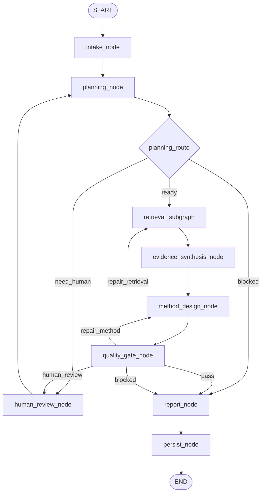
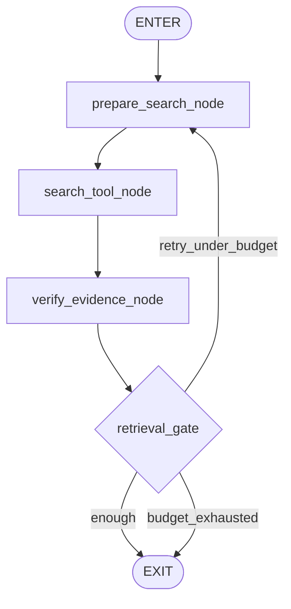

# PaperAgent v0.1 从零重建执行案

> Version: `v0.1`  
> Status: `DESIGN FIRST / IMPLEMENTATION NOT STARTED`  
> Principle: 旧 PaperAgent 仅作参考，不迁移旧图、旧节点、旧 State、旧 Prompt 和旧兼容层。

## 1. v0.1 的唯一目标

v0.1 不追求完整论文研究平台，只完成一个可运行、可测试、可扩展的 LangGraph 骨架：

- 从零定义 State；
- 从零定义 Graph；
- 从零定义 Node 接口；
- 跑通一次最小研究工作流；
- 支持确定性路由、有限检索循环、一次质量修复和可选人工暂停；
- 支持最小 Trace、Checkpoint 和结构化输出；
- 不承诺旧版功能兼容。

v0.1 的成功标准是“架构正确、边界清楚、可以继续迭代”，不是“功能数量多”。

## 2. 明确不做

v0.1 不实现：

- 旧 PaperAgent 的节点迁移；
- Re1—Re8 兼容逻辑；
- 旧 ResearchState 兼容；
- Multi-Agent；
- 长期记忆；
- 完整 Web 前端；
- 自动运行用户代码；
- 自动生成完整论文；
- LangSmith、RAGAS、LLM-as-Judge 深度集成；
- 多套 Reflection / Gate；
- 为现有测试集特化的 fallback；
- 复杂并发和分布式任务系统。

## 3. v0.1 用户流程

最小用户故事：

1. 用户提交一个研究问题及约束；
2. 系统校验请求并规范化；
3. LLM 生成结构化研究计划；
4. 检索子图依据计划执行有限搜索；
5. 系统验证并整理 Evidence；
6. LLM 生成证据综合；
7. LLM 生成方法方案与最小实验计划；
8. 确定性质量门检查结构、证据绑定和预算；
9. 必要时只修复一个目标阶段；
10. LLM 输出最终研究建议；
11. 系统持久化最终状态和 Trace。

## 4. 目标图



检索子图：



## 5. LLM 调用预算

正常路径：

| 阶段 | 调用 |
|---|---:|
| planning_node | 1 |
| evidence_synthesis_node | 1 |
| method_design_node | 1 |
| report_node | 1 |
| 合计 | 4 |

检索工具调用独立计数；质量门默认不调用 LLM。

异常路径最多允许：

- 检索循环 2 次；
- 方法修复 1 次；
- 人工暂停 1 个活跃等待点；
- 总核心 LLM 调用不超过 6 次。

## 6. State 设计

v0.1 使用一个精简 `PaperAgentState`，字段按职责分组。

```python
class PaperAgentState(TypedDict, total=False):
    run: RunContext
    request: ResearchRequest
    plan: ResearchPlan | None
    retrieval: RetrievalState
    evidence: EvidenceBundle
    synthesis: EvidenceSynthesis | None
    method: MethodProposal | None
    quality: QualityDecision | None
    report: FinalReport | None
    execution: ExecutionMeta
    trace: Annotated[list[TraceEvent], operator.add]
```

### 6.1 RunContext

- `run_id`
- `thread_id`
- `created_at`
- `schema_version`
- `engine_version = v0.1`
- `model_profile`
- `network_policy`
- `budgets`

### 6.2 ResearchRequest

- `question`
- `domain_hint`
- `required_constraints[]`
- `optional_preferences[]`
- `user_material_refs[]`
- `clarification_answer`

### 6.3 ResearchPlan

- `problem_statement`
- `scope`
- `research_questions[]`
- `evidence_gaps[]`
- `search_queries[]`
- `success_criteria[]`
- `risks[]`

### 6.4 RetrievalState

- `round`
- `max_rounds`
- `pending_queries[]`
- `completed_queries[]`
- `tool_errors[]`
- `budget_exhausted`

### 6.5 EvidenceBundle

- `items[]`
- `accepted_ids[]`
- `rejected_ids[]`
- `pending_ids[]`
- `failed_verification_ids[]`
- `coverage_by_gap`
- `conflicts[]`

每个 `EvidenceItem` 至少包含：

- `evidence_id`
- `source_type`
- `title`
- `locator`
- `retrieved_at`
- `verification_status`
- `supports_gap_ids[]`
- `summary`
- `content_hash`

### 6.6 ExecutionMeta

- `current_node`
- `status`
- `repair_count`
- `repair_target`
- `last_error`
- `human_action_required`

## 7. Node 实现约束

所有节点必须满足统一函数合同：

```python
async def node_name(state: PaperAgentState, config: RunnableConfig) -> StatePatch:
    ...
```

节点规则：

1. 只返回状态增量，不原地修改 State；
2. 只读取本节点需要的字段；
3. LLM 节点只输出结构化 Pydantic 对象；
4. 工具节点不生成学术结论；
5. Gate 节点不写长文本；
6. 所有错误转换为统一 `NodeError`；
7. 每个节点写入开始、结束、失败 Trace；
8. Prompt 通过版本化 registry 获取；
9. 不允许导入旧 PaperAgent 节点；
10. 不允许通过固定领域词决定输出。

## 8. 项目骨架

```text
PaperAgent/
├── README.md
├── pyproject.toml
├── .env.example
├── docs/
│   └── v0.1/
│       ├── EXECUTION_PLAN.md
│       ├── GRAPH_AND_NODES.md
│       ├── STATE_CONTRACTS.md
│       └── ACCEPTANCE.md
├── src/
│   └── paperagent/
│       ├── __init__.py
│       ├── version.py
│       ├── graph.py
│       ├── state.py
│       ├── config.py
│       ├── errors.py
│       ├── nodes/
│       │   ├── intake.py
│       │   ├── planning.py
│       │   ├── evidence_synthesis.py
│       │   ├── method_design.py
│       │   ├── quality_gate.py
│       │   ├── human_review.py
│       │   ├── report.py
│       │   └── persist.py
│       ├── retrieval/
│       │   ├── graph.py
│       │   ├── prepare_search.py
│       │   ├── search_tool.py
│       │   ├── verify_evidence.py
│       │   └── gate.py
│       ├── schemas/
│       │   ├── request.py
│       │   ├── plan.py
│       │   ├── evidence.py
│       │   ├── method.py
│       │   ├── quality.py
│       │   └── report.py
│       ├── prompts/
│       │   ├── registry.py
│       │   └── v0_1/
│       ├── providers/
│       │   ├── llm.py
│       │   └── search.py
│       ├── telemetry/
│       │   ├── events.py
│       │   └── recorder.py
│       └── persistence/
│           └── checkpointer.py
└── tests/
    ├── unit/
    ├── graph/
    ├── integration/
    ├── ood/
    └── fixtures/
```

## 9. 工作包

### WP0 — 仓库重置与文档冻结

- 备份旧主分支；
- 建立干净 v0.1 工作树；
- 只保留 v0.1 文档和最小 README；
- 明确旧仓库只从 backup 分支查看。

完成条件：新主线中没有旧源码。

### WP1 — 基础工程

- Python 包结构；
- 依赖和配置；
- Pydantic schema；
- 错误合同；
- Fake LLM / Fake Search provider。

完成条件：安装、导入和基础测试通过。

### WP2 — State 与 Trace

- TypedDict State；
- reducer；
- TraceEvent；
- 内存 recorder；
- 最小 checkpointer。

完成条件：状态更新可重放，节点事件完整。

### WP3 — 主图骨架

- 注册所有顶层节点；
- 注册条件边；
- 节点先使用 deterministic stub；
- 图可以从 START 运行到 END。

完成条件：无外部模型时 Fake run 可完成。

### WP4 — 检索子图

- 查询准备；
- Search provider 接口；
- Evidence 验证；
- 有界循环和预算。

完成条件：最多两轮后必然退出。

### WP5 — 四个 LLM 节点

按顺序实现：

1. planning；
2. evidence synthesis；
3. method design；
4. report。

完成条件：所有节点结构化输出成功，失败可诊断。

### WP6 — Gate 与 Human-in-the-Loop

- planning route；
- retrieval gate；
- quality gate；
- interrupt/resume。

完成条件：PASS、REPAIR、HUMAN、BLOCKED 路径均可测试。

### WP7 — OOD 与验收

OOD 集至少覆盖：

- CV；
- NLP；
- 推荐系统；
- 时间序列；
- 数据库；
- 软件工程；
- 信息不足问题；
- 不可完成问题。

完成条件：无固定案例实体泄漏，图在所有案例中有界终止。

## 10. 提交顺序

```text
chore(v0.1): initialize clean project
feat(v0.1): add state and schema contracts
feat(v0.1): add trace and checkpoint foundation
feat(v0.1): build graph with deterministic node stubs
feat(v0.1): add bounded retrieval subgraph
feat(v0.1): implement structured planning workflow
feat(v0.1): implement evidence synthesis workflow
feat(v0.1): implement method design workflow
feat(v0.1): add deterministic quality gate
feat(v0.1): implement final report workflow
feat(v0.1): add interrupt and resume
 test(v0.1): add graph, integration and OOD suites
 docs(v0.1): freeze acceptance report
```

禁止把全部 v0.1 实现压成一个提交。

## 11. v0.1 验收

必须同时满足：

- 新主线不包含旧 PaperAgent 源码；
- 顶层图和检索子图可视化与实现一致；
- 正常路径核心 LLM 调用不超过 4 次；
- 所有循环有硬上限；
- 所有 LLM 输出经过 schema validation；
- Evidence 状态完整；
- 每个最终 claim 可追溯到 Evidence ID 或标记为 proposal；
- Fake provider 图测试全通过；
- 至少一组真实 provider E2E 通过；
- 至少 8 个 OOD 案例无测试集答案泄漏；
- Checkpoint 能恢复一次 human interrupt；
- Trace 能还原节点、路由、调用、错误和成本；
- 不运行用户上传代码；
- 不伪造资料和实验结果。

## 12. 分支策略

- `backup/legacy-pre-v0.1-YYYYMMDD`：永久保留旧实现；
- `master`：重置后的新主线；
- `v0.1`：v0.1 实现分支；
- v0.1 达到验收后，通过 PR 合并进 `master`；
- v0.2、v0.3 继续按独立版本分支推进。

旧 backup 分支不再合并回新主线。需要借鉴时只读查看或手工重写，不 cherry-pick 旧业务提交。
