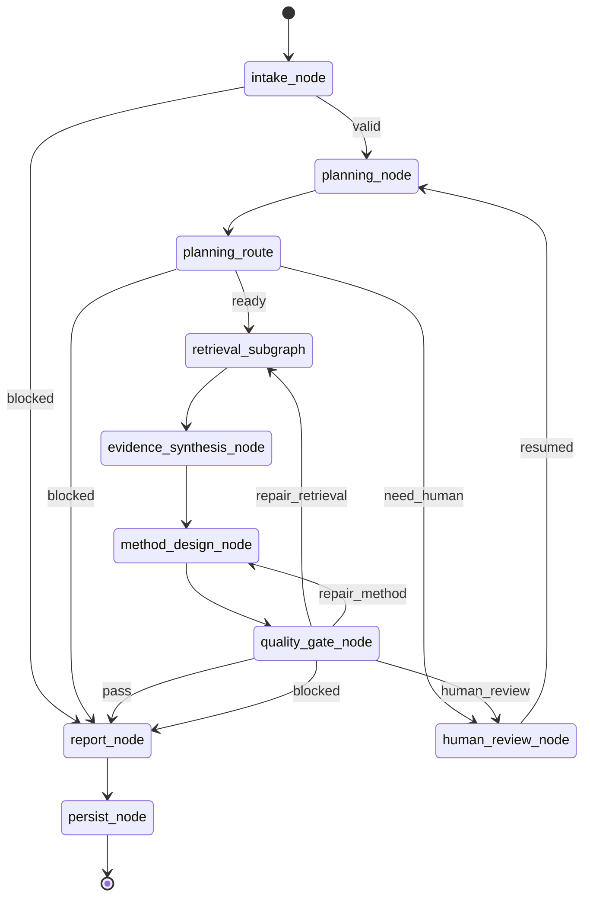
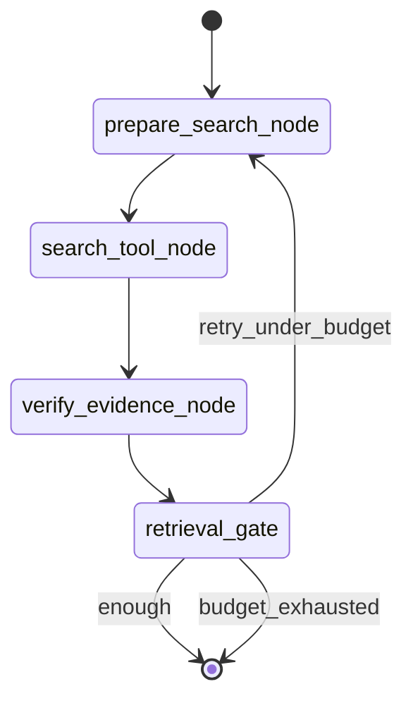

# PaperAgent v0.1 图与节点设计

> Version: `v0.1`  
> Status: `DESIGN FROZEN FOR SKELETON`  
> Scope: 顶层 LangGraph、检索子图、节点输入输出和条件边。

## 1. 设计原则

1. LangGraph 只表达真实控制流，不把普通函数包装成无意义节点；
2. 连续、同上下文、无分支的 LLM 工作合并为一个节点；
3. Tool、Gate、Checkpoint、Human interrupt 保持独立；
4. 节点返回增量 StatePatch；
5. 所有循环有预算和硬上限；
6. 每个 LLM 节点使用独立 Pydantic 输出 schema；
7. Gate 只判断和路由，不生成研究内容；
8. 不保存原始 CoT，只保存结构化决策与 trace metadata；
9. v0.1 不兼容旧节点名称和旧 State；
10. 图必须能在 Fake provider 下确定性运行。

## 2. 顶层图



## 3. 顶层节点总表

| Node | 类型 | LLM | 外部副作用 | 主要输出 | 条件路由 |
|---|---|---:|---:|---|---:|
| `intake_node` | deterministic | 否 | 否 | normalized request / block reason | 否 |
| `planning_node` | workflow | 是 | 否 | ResearchPlan | 否 |
| `planning_route` | gate | 否 | 否 | route label | 是 |
| `retrieval_subgraph` | subgraph | 否 | 搜索/读取 | EvidenceBundle | 内部有 |
| `evidence_synthesis_node` | workflow | 是 | 否 | EvidenceSynthesis | 否 |
| `method_design_node` | workflow | 是 | 否 | MethodProposal | 否 |
| `quality_gate_node` | gate | 否 | 否 | QualityDecision | 是 |
| `human_review_node` | interrupt | 否 | checkpoint | human decision | 暂停/恢复 |
| `report_node` | workflow | 是 | 否 | FinalReport | 否 |
| `persist_node` | deterministic | 否 | 持久化 | terminal metadata | 否 |

## 4. Node 01 — `intake_node`

### 职责

- 校验用户请求；
- 标准化问题、约束和材料引用；
- 创建 run/thread ID；
- 设置预算、网络策略和默认模型 profile；
- 拦截空请求、明显越界请求和不支持模式。

### 输入

- raw user question；
- user constraints；
- runtime config。

### 输出

```text
run
request
execution.status = READY | BLOCKED
execution.last_error
trace += intake_completed
```

### 禁止

- 不做研究规划；
- 不调用 LLM；
- 不猜测用户未提供的领域实体；
- 不访问网络。

### 错误

- `INVALID_REQUEST`
- `UNSUPPORTED_MODE`
- `POLICY_BLOCKED`
- `CONFIG_INVALID`

### 下一节点

- READY → `planning_node`
- BLOCKED → `report_node`

## 5. Node 02 — `planning_node`

### 职责

一次 LLM 调用完成：

- 问题重述；
- 范围界定；
- 子问题拆分；
- evidence gap 设计；
- search query 生成；
- 成功标准和风险识别。

### ContextBuilder 输入

只包含：

- `ResearchRequest`；
- required constraints；
- 用户材料的元数据，不包含未解析全文；
- repair reason（仅 planning repair 时）。

### 输出 schema

```python
class ResearchPlan(BaseModel):
    problem_statement: str
    scope: ScopeDefinition
    research_questions: list[ResearchQuestion]
    evidence_gaps: list[EvidenceGap]
    search_queries: list[SearchQuery]
    success_criteria: list[str]
    risks: list[PlanRisk]
    clarification: ClarificationRequest | None
    blocked_reason: str | None
```

### 语义校验

- 每个 search query 必须绑定 gap ID；
- query 数量在预算内；
- clarification 与 blocked 不能同时出现；
- 不允许凭空声明来源存在；
- 不允许包含 fixture/golden answer 专用标记。

### 错误

- `LLM_TIMEOUT`
- `SCHEMA_INVALID`
- `SEMANTIC_PLAN_INVALID`
- `PROMPT_VERSION_MISSING`

### 下一节点

固定进入 `planning_route`。

## 6. Gate 01 — `planning_route`

### 判定顺序

1. `blocked_reason != null` → `blocked`；
2. `clarification != null` → `need_human`；
3. plan schema/semantic validation 通过 → `ready`；
4. 其他情况 → `blocked`。

### 返回值

```text
ready | need_human | blocked
```

不得调用 LLM。

## 7. Subgraph — `retrieval_subgraph`

### 目标

根据 ResearchPlan 获取、验证并归档 Evidence；允许有限循环，但不承担综合分析和方法设计。

### 子图拓扑



### 共享约束

- 默认最大两轮；
- 每轮 query 数量有上限；
- 搜索结果必须保留 source locator；
- 验证失败不能标记 accepted；
- 工具异常转为结构化 ToolError；
- 单个来源失败不能令整个 run 崩溃，除非全部来源不可用。

## 8. Node 03 — `prepare_search_node`

### 职责

- 从 plan 中选择当前轮 query；
- 去重已执行 query；
- 根据未覆盖 gap 排序；
- 应用 query、时间和结果数量预算。

### 输入

- `plan.search_queries`
- `retrieval.completed_queries`
- `evidence.coverage_by_gap`
- `run.budgets`

### 输出

- `retrieval.pending_queries`
- `retrieval.round`
- trace event。

### 禁止

- 不生成新研究结论；
- v0.1 默认不调用 LLM 改写 query；
- 不根据固定 topic 使用固定查询模板。

## 9. Node 04 — `search_tool_node`

### 职责

- 调用 SearchProvider；
- 返回 raw source candidates；
- 记录 provider、query、latency、status 和 errors。

### Provider 合同

```python
class SearchProvider(Protocol):
    async def search(self, query: SearchQuery, limit: int) -> list[SourceCandidate]: ...
```

### 输出

- raw candidates；
- completed queries；
- tool errors；
- usage trace。

### 禁止

- 不验证论文真实性；
- 不做最终摘要；
- 不把 snippet 当作已验证全文。

## 10. Node 05 — `verify_evidence_node`

### 职责

- 规范化来源；
- 校验 locator/URL/DOI/repository metadata；
- 去重；
- 绑定 evidence gap；
- 标记 verification status；
- 生成稳定 Evidence ID 和 content hash。

### 状态枚举

```text
pending
accepted
rejected
failed_verification
```

### 输出

- `EvidenceBundle.items`
- 状态 ID 集合；
- coverage；
- conflicts；
- verification errors。

### 禁止

- 不根据标题猜测实验结论；
- 不把搜索排序当作证据质量；
- 不静默丢弃失败来源。

## 11. Gate 02 — `retrieval_gate`

### 输入

- 必需 gap 覆盖率；
- 当前轮数；
- 剩余 query；
- provider 状态；
- 搜索预算。

### 判定

```text
if required gaps sufficiently covered:
    enough
elif round < max_rounds and runnable queries remain:
    retry_under_budget
else:
    budget_exhausted
```

### 输出

```text
enough | retry_under_budget | budget_exhausted
```

“budget_exhausted”不是系统错误，后续节点必须显式报告 Evidence 不足。

## 12. Node 06 — `evidence_synthesis_node`

### 职责

一次 LLM 调用完成：

- 对 accepted Evidence 进行语义归类；
- 识别 baseline 候选；
- 汇总支持、冲突和未知项；
- 评估资源可行性；
- 判断哪些 gap 已满足。

### 输入

只包含：

- plan；
- accepted Evidence 的摘要和 locator；
- rejected/failed 的状态统计；
- gap coverage；
- 用户 required constraints。

### 输出 schema

```python
class EvidenceSynthesis(BaseModel):
    supported_findings: list[SupportedFinding]
    baseline_candidates: list[BaselineCandidate]
    conflicts: list[EvidenceConflict]
    unknowns: list[UnknownItem]
    gap_assessments: list[GapAssessment]
    feasibility: FeasibilityAssessment
```

每个 supported finding 必须绑定 accepted evidence IDs。

### 禁止

- 不引用 rejected/failed Evidence 支持结论；
- 不创造新 source；
- 不生成完整方法方案；
- 不把 proposal 写成已证实事实。

## 13. Node 07 — `method_design_node`

### 职责

一次 LLM 调用完成：

- 选择 baseline；
- 设计模块和接口；
- 提炼 problem-method insight；
- 提出可证伪假设；
- 设计最小关键实验；
- 设计消融、风险和停止条件。

### 输入

- request constraints；
- plan；
- EvidenceSynthesis；
- accepted Evidence refs；
- quality repair reason（如有）。

### 输出 schema

```python
class MethodProposal(BaseModel):
    baseline: BaselineChoice
    problem_method_insight: str
    modules: list[MethodModule]
    interfaces: list[IntegrationContract]
    hypothesis: FalsifiableHypothesis
    minimum_key_experiment: ExperimentPlan
    ablations: list[AblationPlan]
    risks: list[MethodRisk]
    stop_conditions: list[StopCondition]
    claim_evidence_map: list[ClaimEvidenceBinding]
```

### 语义校验

- baseline 必须来自候选或显式标记 proposed；
- 每个事实 claim 必须绑定 accepted Evidence；
- 创新点必须对应问题机制和可验证收益；
- 实验计划不得声称已执行；
- 模块接口必须明确输入输出和失败条件。

## 14. Gate 03 — `quality_gate_node`

### 职责

统一执行确定性质量检查并路由。

### 检查项

- schema 是否完整；
- required constraints 是否全部覆盖；
- factual claim 是否绑定 accepted Evidence；
- proposal/fact 状态是否混淆；
- gap 覆盖是否足够；
- baseline 是否可追溯；
- hypothesis 是否可证伪；
- minimum experiment 是否可执行；
- repair 次数是否超限；
- 是否发现旧案例专有实体泄漏；
- 是否需要人工确认。

### 输出 schema

```python
class QualityDecision(BaseModel):
    verdict: Literal[
        "pass",
        "repair_retrieval",
        "repair_method",
        "human_review",
        "blocked",
    ]
    reason_codes: list[str]
    invalid_claim_ids: list[str]
    missing_gap_ids: list[str]
    repair_instruction: str | None
```

### 路由优先级

1. policy/safety/预算硬阻断 → blocked；
2. 必须由用户决定 → human_review；
3. 缺少必要 Evidence 且有剩余预算 → repair_retrieval；
4. 方法合同不完整且 repair_count 未超限 → repair_method；
5. 全部通过 → pass；
6. 无法修复 → blocked。

默认不调用 LLM。

## 15. Node 08 — `human_review_node`

### 职责

- 使用 LangGraph interrupt 暂停；
- 保存 clarification 或审核请求；
- 恢复后写入用户决定；
- 路由回 planning 或后续修复阶段。

### Human request 类型

```text
clarification
constraint_confirmation
source_acceptance
method_choice
risk_acceptance
```

### Checkpoint 要求

- thread_id 必须稳定；
- interrupt 前状态持久化；
- resume payload 经过 schema validation；
- 重复 resume 幂等；
- 不自动重放未知副作用。

## 16. Node 09 — `report_node`

### 职责

一次 LLM 调用将现有 Artifact 编排为最终输出，不新增来源和事实。

### 输入

- request；
- plan；
- EvidenceSynthesis；
- MethodProposal；
- QualityDecision；
- terminal status。

### 输出 schema

```python
class FinalReport(BaseModel):
    status: Literal["completed", "partial", "blocked"]
    problem_summary: str
    verified_findings: list[ReportFinding]
    unknowns: list[str]
    proposed_method: ProposedMethodSection | None
    experiment_plan: ExperimentSection | None
    risks: list[str]
    evidence_index: list[EvidenceCitation]
    next_action: str
```

### 输出规则

- verified、inferred、proposed、unknown 分区；
- blocked/partial 必须明确原因；
- 不隐藏检索预算耗尽；
- Evidence index 只引用真实 Evidence ID；
- 不声称实验已运行。

## 17. Node 10 — `persist_node`

### 职责

- 写入最终 checkpoint；
- 写入 trace 终止事件；
- 汇总 Token、工具调用、延迟和 repair；
- 设置 terminal status；
- 返回 API adapter 所需的最终对象。

### 输入

- 完整但已验证的最终状态。

### 输出

```text
execution.status = COMPLETED | PARTIAL | BLOCKED | FAILED
execution.current_node = persist_node
terminal trace event
```

### 禁止

- 不调用 LLM；
- 不修复内容；
- 不静默覆盖失败状态。

## 18. 条件边定义

```python
builder.add_conditional_edges(
    "planning_route",
    route_after_planning,
    {
        "ready": "retrieval_subgraph",
        "need_human": "human_review_node",
        "blocked": "report_node",
    },
)

builder.add_conditional_edges(
    "quality_gate_node",
    route_after_quality,
    {
        "pass": "report_node",
        "repair_retrieval": "retrieval_subgraph",
        "repair_method": "method_design_node",
        "human_review": "human_review_node",
        "blocked": "report_node",
    },
)
```

条件函数必须是纯函数，不访问网络、不调用 LLM、不修改 State。

## 19. Trace 事件

最小事件类型：

```text
run_started
node_started
node_completed
node_failed
llm_called
llm_validated
tool_called
tool_failed
route_decided
human_interrupted
human_resumed
checkpoint_saved
run_completed
```

每个事件包含：

- schema_version；
- run_id；
- span_id / parent_span_id；
- node；
- timestamp；
- status；
- input_hash；
- output_schema；
- model/provider；
- token/latency/cost；
- evidence_refs；
- reason_codes；
- redaction flags。

## 20. Fake 骨架行为

在实际 LLM 和 SearchProvider 接入前，所有节点必须有 deterministic fake：

- Fake planning 返回固定结构但不含具体领域答案；
- Fake search 依据 query key 返回 fixture；
- Fake verification 按 fixture metadata 标状态；
- Fake synthesis 只引用 fixture evidence IDs；
- Fake method 输出最小合法 proposal；
- Gate 可以触发 pass、repair、human、blocked；
- Fake run 可验证图拓扑而非答案质量。

Fixture 只能位于 `tests/fixtures`，生产 Prompt 和模块不得导入它。

## 21. v0.1 图级测试矩阵

| Case | 预期路径 |
|---|---|
| 正常研究问题 | intake→plan→retrieve→synthesis→method→gate(pass)→report→persist |
| 请求缺少关键约束 | plan→human→plan→retrieve... |
| 首轮 Evidence 不足 | retrieve round1→retrieve round2→synthesis |
| 方法缺少可证伪假设 | gate→repair_method→gate→report |
| Evidence 无法获得 | gate/block 或 partial report |
| 用户拒绝关键假设 | human→report(partial/blocked) |
| Provider 超时 | bounded retry→partial/blocked |
| 非法 schema | node error→统一失败处理 |
| 旧案例实体泄漏 | gate(blocked) |
| 超过 repair 上限 | report(partial/blocked) |

## 22. 骨架完成定义

“骨架完成”必须同时具备：

- 代码目录已建立；
- State 和所有 schema 可导入；
- 顶层图与检索子图可编译；
- 所有节点有真实函数签名；
- 未实现节点显式抛出 `NotImplementedError` 或使用 Fake provider，不允许空 pass；
- 所有条件边可执行；
- Fake 正常、修复、人工和阻断路径通过；
- Mermaid 图与代码节点名称一致；
- 不存在任何旧 PaperAgent 源码依赖。
