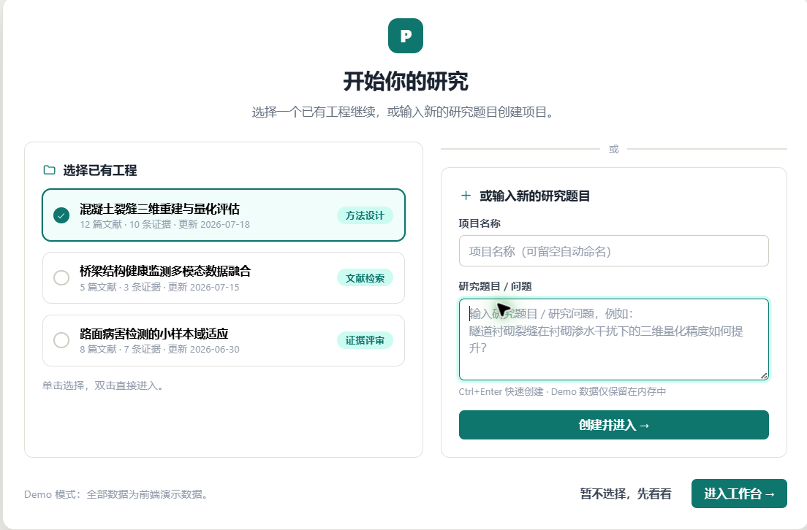
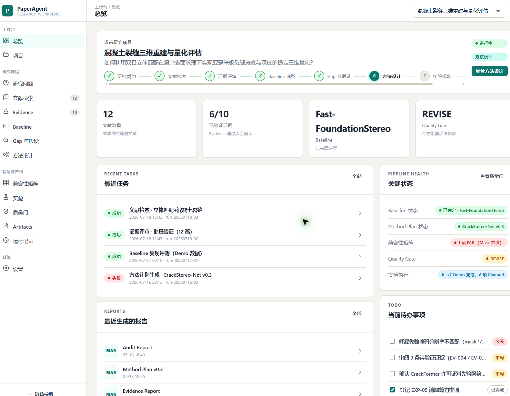
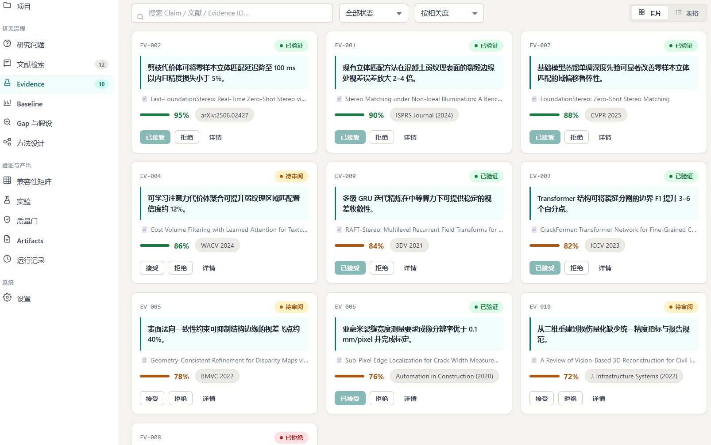

# PaperAgent

PaperAgent 是面向**学术研究任务执行**的领域 Agent。它负责把研究问题转化为可审计的证据检索、方法设计、审查与导出流程，而不是重复实现通用 Agent Runtime。

当前开发主线围绕：

```text
Research Request
  -> Project / Task Context
  -> Query Planning and Academic Retrieval
  -> Evidence Normalization and Verification
  -> Baseline / Module / Gap Reasoning
  -> Method Design or Audit
  -> Human Review
  -> Structured Export
```

## 与 PaperClaw 的职责边界

| 项目 | 主要职责 |
|---|---|
| **PaperClaw** | 通用 Agent Runtime、项目工作区、文件索引、长期 Memory、Artifact 版本、工具权限、扩展机制、任务与多 Agent 基础设施 |
| **PaperAgent** | 学术问题理解、论文证据检索、Query 改写、baseline 与模块分析、方法设计、实验与消融规划、学术审查、研究结果导出 |

PaperAgent 可以调用 PaperClaw 提供的项目知识、Memory、Artifact 和受限工具能力，但不应再次建设一套平行的通用运行时。

## PWA 工作台界面预览

PaperAgent 提供面向研究项目、文献检索、Evidence 评审、Baseline、方法设计与
质量门的本地 PWA 工作台。以下截图展示当前 Demo 模式的主要界面；截图中的项目、
文献和指标是前端演示数据，不代表真实 Provider 运行结果或科学质量结论。

### 研究项目入口

启动后可以继续已有研究项目，也可以输入新的研究问题创建项目。



### 研究工作台总览

总览页展示当前研究问题、研究阶段、Evidence 覆盖度、Baseline、Quality Gate、
最近任务、报告和待办事项。



### Evidence 评审

Evidence 页以卡片形式展示 Claim、来源、相关度、验证状态和人工接受/拒绝操作，
用于支撑后续 Baseline 与方法设计。



## 当前状态

```text
Default branch: master
Package metadata: 0.5.1
Deployment boundary: local single user / trusted network
Current roadmap: Plan/PaperAgent_Agentic_Multimodal_RAG_Development_Plan.md
```

当前代码树已经包含或保留以下能力：

- bounded LangGraph 研究工作流；
- OpenAlex、Semantic Scholar 与 arXiv 学术检索适配；
- Crossref 与 DataCite DOI 校验；
- 多 Provider 结果合并、排序、覆盖度、缓存、重试与调用预算；
- 对宽泛 Query 的拒绝、学术源优先与受控 Web fallback；
- baseline、comparator、dataset relation 与作者关联仓库证据识别；
- 结构化 LLM Provider、输出修复、预算与遥测；
- SQLite 任务、结果、错误、事件与 Review 持久化；
- 幂等提交、Polling、SSE、取消与重启失败关闭；
- JSON、Markdown 与 BibTeX 导出；
- 本地 PWA、CLI、readiness、diagnostics 与 metrics；
- 受控插件运行时；
- academic-method-tailoring 方法设计与审计流程；
- 离线确定性 Demo、合成评测和真实 Provider 验收入口。

> 注意：确定性 Demo、Mock/Fake Provider 和合成 benchmark 只能证明控制流与产品契约，不能证明真实论文质量。

## PaperAgent 应继续实现的能力

### P0：核心学术闭环

- 用户提供单篇或多篇论文后的稳定建档与项目绑定；
- PDF 章节、表格、图、公式、算法和引用位置的结构化解析；
- 面向实验方法、数据集、指标和结果的字段级检索；
- Query classification、decomposition、rewrite 与 retrieval routing；
- claim -> evidence locator -> source document 的可追溯链；
- baseline card、module card、compatibility matrix 与 experiment matrix；
- 对证据不足、冲突或不可复现方案的 REVISE / NO-GO 判定；
- 人工确认后的 Methodology、实验计划和研究报告导出。

### P1：质量与评测

- 真实论文集上的检索 Recall、MRR、nDCG 和 citation grounding；
- 表格数值、实验配置和结论抽取的字段级准确率；
- baseline 选择、模块归因和消融设计的人工专家评测；
- Query 改写前后的质量、延迟、调用次数与成本对比；
- contamination、跨领域误召回和错误仓库关联检测；
- 真实 LLM、真实论文与人工科学审查验收。

### P2：轻量 Coding Worker

仅服务论文理解与方法验证：

- 读取论文配套 GitHub 仓库；
- 定位模型、损失、数据加载和训练入口；
- 对照论文与代码实现；
- 提取配置、超参数和运行命令；
- 生成最小实验 Patch；
- 运行 shape、forward、gradient、tiny-batch 等定向验证；
- 输出明确的 verified / pending / blocked Handoff。

PaperAgent 不应优先承担通用 IDE、复杂 CI/CD、长期多分支开发或大型应用重构。

## 当前主要缺口

- README、包版本与开发能力仍存在版本语义差异；
- 尚未形成统一的 PaperClaw <-> PaperAgent 集成契约；
- 文件导入、论文解析与研究项目 Memory 需要形成一条端到端产品路径；
- 当前检索仍明显依赖外部 Provider，可用性和限流会影响流程；
- 缺少面向用户已提供论文的“本地材料优先”模式；
- 真实科学质量、真实论文复现和人工专家验收尚不能标记为完成；
- 不具备公开多用户服务需要的认证、租户隔离、配额和滥用控制。

## 推荐架构

```text
PaperClaw
  |-- Project Workspace / File Index
  |-- User and Project Memory
  |-- Artifact Revision Store
  |-- Tool and Extension Permissions
  |-- Task / Trace / Multi-Agent Runtime
  `-- Narrow Coding Worker
             |
             v
PaperAgent
  |-- Research Intent and Query Rewrite
  |-- Academic Retrieval and Evidence Ledger
  |-- Paper / Dataset / Repository Relations
  |-- Baseline and Module Reasoning
  |-- Compatibility and Novelty Audit
  |-- Experiment and Ablation Design
  `-- Review and Academic Export
```

## 快速运行

```bash
python -m pip install -e '.[dev,release]'
paperagent serve
```

浏览器访问：

```text
http://127.0.0.1:8000/app
```

确定性演示：

```bash
python scripts/interview_demo.py --output interview-demo-summary.json
```

该演示不会调用真实 LLM，也不能作为科学质量证据。

## 主要接口

```text
GET  /app
GET  /app/{task_id}
POST /v1/tasks
GET  /v1/tasks/{task_id}
GET  /v1/tasks/{task_id}/events
GET  /v1/tasks/{task_id}/events/stream
POST /v1/tasks/{task_id}/cancel
GET  /v1/tasks/{task_id}/papers
PUT  /v1/tasks/{task_id}/papers/{paper_id}/review
GET  /v1/tasks/{task_id}/exports/{json|markdown|bibtex}
GET  /v1/diagnostics/runtime
GET  /metrics
GET  /healthz
GET  /readyz
```

## Agent 自动评估

仓库包含默认离线、无外部副作用的 Evaluation Harness，可检查 Agent 终态、Tool、结构化输出与引用落地、循环/预算、成本遥测和 HumanGate：

```bash
python -m evaluation.runner --dataset evaluation/cases/paper_search.jsonl --offline --output artifacts/evaluations/example
```

Case Schema、指标、offline/live 边界及报告说明见 [`evaluation/README.md`](evaluation/README.md)。LLM Judge 默认关闭，CI 不访问付费 API。

## 验证

```bash
python -m pip install -e '.[dev,release]'
ruff check .
ruff format --check .
mypy --config-file pyproject.toml
pytest --cov=paperagent --cov-branch --cov-report=term-missing -q
python -m build --wheel
```

真实 Provider、真实 LLM、浏览器和容器测试需要对应网络、凭据或运行环境，必须与离线测试分别报告。

## 安全与部署边界

当前版本适用于本地单用户或可信网络评估。它没有完整的：

- 身份认证；
- 多租户隔离；
- 公网配额与滥用控制；
- 对授权 Python 插件的强沙箱；
- 生产级 Secret 管理。

不要将其作为无认证的公网多用户服务直接暴露。
