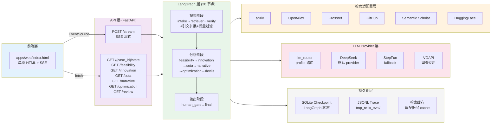
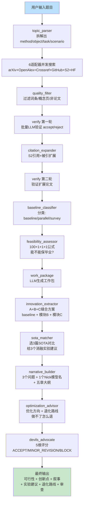
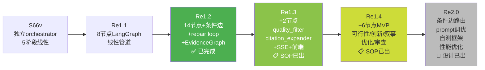

# PaperAgent 项目总览

> **定位**：中国研究生开题选题助手 — 输入一个题目，自动搜索论文/repo/dataset，生成保毕业工作方案 + 优化方向。  
> **技术栈**：Python 3.12 + FastAPI + LangGraph + 多 LLM Provider (DeepSeek/StepFun)  
> **当前阶段**：Re1.2 已完成 → Re1.3 SOP 已出 → Re1.4 MVP SOP 已出 → Re2.0 设计已出（标 🔲）

---

## 一、整体架构图

### 全链路 LangGraph 管道（含计划部分）

```mermaid
flowchart TD
    START --> intake["intake<br/>读取题目"]
    intake --> topic_parser["topic_parser<br/>拆解 method/object/task"]
    topic_parser --> search_planner["search_planner<br/>多轮查询计划"]
    search_planner --> paper_retriever["paper_retriever<br/>6适配器并发搜索"]
    paper_retriever --> quality_filter["quality_filter<br/>LLM过滤非论文<br/>Re1.3 🆕"]
    quality_filter --> verify["verify<br/>LLM批量验证"]

    verify --> quality_gate{"quality_gate<br/>论文够不够?"}
    quality_gate -->|"不够"| targeted_repair["targeted_repair<br/>修复查询"]
    targeted_repair --> paper_retriever

    quality_gate -->|"够用"| citation_expander["citation_expander<br/>S2引文扩展<br/>Re1.3 🆕"]
    citation_expander --> verify2["verify 第二轮<br/>验证扩展论文<br/>Re1.3 🆕"]
    verify2 --> dataset_repo["dataset_repo_extractor<br/>从论文提取数据集/仓库"]
    dataset_repo --> evidence_graph["evidence_graph_builder<br/>构建关系图"]
    evidence_graph --> baseline_classifier["baseline_classifier<br/>分类baseline/parallel/survey"]

    baseline_classifier --> feasibility["feasibility_assessor<br/>可行性判断+100+1+1+1<br/>Re1.4 🆕"]
    feasibility --> work_package["work_package<br/>LLM生成工作包"]
    work_package --> innovation["innovation_extractor<br/>A+B+C缝合方案<br/>Re1.4 🆕"]
    innovation --> sota["sota_matcher<br/>SOTA对比+消融建议<br/>Re1.4 🆕"]
    sota --> narrative["narrative_builder<br/>3问题+1Nick模型叙事<br/>Re1.4 🆕"]

    narrative --> low_bar["low_bar_review<br/>门槛审查"]
    low_bar -->|"blocked且可修"| targeted_repair
    low_bar -->|"通过"| optimization["optimization_advisor<br/>退化路线+优化方向<br/>Re1.4 🆕"]
    optimization --> devils["devils_advocate<br/>5维深度审查<br/>Re1.4 🆕"]

    devils --> human["human_gate<br/>人工确认"]
    human --> final["final_recommendation<br/>最终推荐报告"]
    final --> END

    %% Re2.0 计划中的条件边（MVP阶段不实现）
    devils -.->|"🔲 MINOR_REVISION<br/>Re2.0计划"| narrative
    devils -.->|"🔲 BLOCK<br/>Re2.0计划"| optimization
    feasibility -.->|"🔲 blocked<br/>Re2.0计划"| optimization

    style intake fill:#4caf50,color:#fff
    style topic_parser fill:#4caf50,color:#fff
    style search_planner fill:#4caf50,color:#fff
    style paper_retriever fill:#4caf50,color:#fff
    style quality_filter fill:#8bc34a,color:#fff
    style verify fill:#4caf50,color:#fff
    style quality_gate fill:#ff9800,color:#fff
    style targeted_repair fill:#4caf50,color:#fff
    style citation_expander fill:#8bc34a,color:#fff
    style verify2 fill:#8bc34a,color:#fff
    style dataset_repo fill:#4caf50,color:#fff
    style evidence_graph fill:#4caf50,color:#fff
    style baseline_classifier fill:#4caf50,color:#fff
    style feasibility fill:#cddc39,color:#333
    style work_package fill:#4caf50,color:#fff
    style innovation fill:#cddc39,color:#333
    style sota fill:#cddc39,color:#333
    style narrative fill:#cddc39,color:#333
    style low_bar fill:#4caf50,color:#fff
    style optimization fill:#cddc39,color:#333
    style devils fill:#cddc39,color:#333
    style human fill:#4caf50,color:#fff
    style final fill:#4caf50,color:#fff

    style START fill:#333,color:#fff
    style END fill:#333,color:#fff
```



**图例**：
- 🟢 绿色 = Re1.2 已完成（14 节点）
- 🟡 浅绿 = Re1.3 新增（2 节点：quality_filter + citation_expander）
- 🟡 黄绿 = Re1.4 新增（6 节点：feasibility + innovation + sota + narrative + optimization + devils_advocate）
- 🔲 虚线 = Re2.0 计划中的条件边路由（MVP 阶段不实现）

---

### 系统架构图



---

### 数据流图



---

## 二、版本演进路线



---

## 三、当前节点清单

### ✅ Re1.2 已完成（14 节点）

| # | 节点 | 作用 | LLM | 状态 |
|---|---|---|---|---|
| 1 | `intake` | 读取题目+约束，初始化 trace | ❌ | ✅ |
| 2 | `topic_parser` | LLM 拆解 method/object/task/scenario | ✅ | ✅ |
| 3 | `search_planner` | 生成多轮查询计划（有模板兜底） | ✅ | ✅ |
| 4 | `paper_retriever` | 6 适配器并发搜索 arXiv/OpenAlex/Crossref/GitHub | ❌ | ✅ |
| 5 | `verify` | LLM 验证论文相关性 (accept/weak_reject/reject) | ✅ | ✅ |
| 6 | `quality_gate` | 条件路由：论文够不够？不够 → repair | ❌ | ✅ |
| 7 | `targeted_repair` | 生成修复查询，回到 retriever | ✅ | ✅ |
| 8 | `dataset_repo_extractor` | 从已验证论文中提取 dataset/repo | ✅ | ✅ |
| 9 | `evidence_graph_builder` | 构建 paper↔repo↔dataset 关系图 | ❌ | ✅ |
| 10 | `baseline_classifier` | 分类 baseline/parallel/survey/dataset_papers | ❌ | ✅ |
| 11 | `work_package` | LLM 生成工作包（绑定 baseline+module+dataset） | ✅ | ⚠️ 骨架 |
| 12 | `low_bar_review` | 门槛审查（规则检查） | ✅ | ⚠️ 骨架 |
| 13 | `human_gate` | 人工确认（当前 passthrough） | ❌ | ⚠️ |
| 14 | `final_recommendation` | 汇总输出 | ❌ | ⚠️ 骨架 |

### 🟡 Re1.3 新增（2 节点，SOP 已出）

| # | 节点 | 作用 | LLM | 状态 |
|---|---|---|---|---|
| 15 | `quality_filter` | LLM 判断是否真实学术论文，过滤词条/概念页 | ✅ | 📋 SOP 已出 |
| 16 | `citation_expander` | S2 引用+被引扩展，自动种子选取 | ❌ | 📋 SOP 已出 |

**Re1.3 同时新增**：
- SSE 流式端点 `POST /api/v1/research/stream`
- 前端 `apps/web/index.html`（单页 HTML + EventSource）
- 6 个新 API 端点

### 🟡 Re1.4 新增（6 节点，SOP 已出）

| # | 节点 | 作用 | LLM | 输出字段 | 状态 |
|---|---|---|---|---|---|
| 17 | `feasibility_assessor` | 100+1+1+1 公式，能不能保毕业 | ✅ + fallback | `feasibility_report` | 📋 SOP 已出 |
| 18 | `innovation_extractor` | A+B+C 缝合方案，从 baseline+parallel 提取可缝合模块 | ✅ + fallback | `innovation_points`, `stitching_plan` | 📋 SOP 已出 |
| 19 | `sota_matcher` | 选 3 篇 SOTA 对比 + 3 个消融建议 | ✅ + fallback | `sota_comparison` | 📋 SOP 已出 |
| 20 | `narrative_builder` | "3个问题+1个Nick模型"叙事 + 五章大纲 | ✅ + fallback | `research_narratives` | 📋 SOP 已出 |
| 21 | `optimization_advisor` | 优化方向 + 退化路线（做不了怎么退） | ✅ + fallback | `optimization_directions` | 📋 SOP 已出 |
| 22 | `devils_advocate` | 5 维评分 (D1-D5)，ACCEPT/MINOR_REVISION/BLOCK | ✅ + fallback | `review_report` | 📋 SOP 已出 |

**Re1.4 MVP 原则**：线性直连，不加条件边回环。每个节点 LLM 失败时走 heuristic fallback，管道不阻塞。

### 🔲 Re2.0 计划（设计已出，未实现）

| 改进项 | 内容 | 设计文档位置 |
|---|---|---|
| 条件边路由 | devils_advocate MINOR_REVISION → narrative_builder 回退；BLOCK → optimization_advisor 重规划 | §7.1 |
| feasibility 条件路由 | feasibility blocked → 直接跳 optimization_advisor | §7.1 |
| Prompt 调优 | 基于 Re1.4 真实输出优化 6 个 prompt | §6 |
| 自测框架 | 4 个 validator：paper_validator / repo_validator / dataset_validator / conclusion_validator | §12 |
| SOP AI 审核 | 用 ARS 技能生成 ground truth，交叉验证 recall/precision/hallucination | §12.7 |
| verify 批量化 | 24 次 LLM → 3 次批量调用 | §9.2 |
| innovation+sota 并行 | `asyncio.gather` 并行执行 | §9.3 |
| 性能优化 | 搜索 ≤3min，完整 ≤5min | §9 |
| Repair loop 上限 | MAX_NARRATIVE_REVISIONS=2 | §7.3 |

---

## 四、参考项目

### 三个核心参考

| 项目 | 路径 | 核心借鉴 | 设计文档总结 |
|---|---|---|---|
| **Academic Research Skills (ARS)** | `C:\Users\ZYF\Desktop\Paper\academic-research-skills` | 10 阶段 pipeline、7-mode AI 失败检查表、Devil's Advocate 3-checkpoint、5-dimension reviewer、Material Passport 跨阶段状态载体 | §1.1 |
| **AutoResearchClaw (ARC)** | `C:\Users\ZYF\Desktop\Paper\AutoResearchClaw` | 23 阶段状态机、PIVOT/REFINE loop、4-agent Benchmark Pipeline (Surveyor→Selector→Acquirer→Validator)、Multi-perspective debate、VerifiedRegistry 反伪造、4-layer citation verification | §1.2 |
| **B站毕业论文合集** | `G:\Agent\bilibili-analysis\v5-毕业论文合集` | 100+1+1+1 可行性公式、学术裁缝 A+B+C 缝合法、"3问题+1Nick模型"叙事公式、SOTA tier matching、消融实验最低要求、三档定位 | §1.3 |

### 三者对比

```mermaid
flowchart TD
    subgraph ARS["Academic Research Skills"]
        ars1["10阶段 Pipeline"]
        ars2["4 skill + 27 mode"]
        ars3["7-mode AI失败检查"]
        ars4["DA 3-checkpoint"]
        ars5["5-dim reviewer"]
        ars6["Material Passport"]
    end

    subgraph ARC["AutoResearchClaw"]
        arc1["23阶段状态机"]
        arc2["PIVOT/REFINE loop"]
        arc3["4-agent Benchmark"]
        arc4["Multi-perspective debate"]
        arc5["VerifiedRegistry"]
        arc6["4-layer citation verify"]
    end

    subgraph B站["B站毕业论文合集"]
        bs1["100+1+1+1公式"]
        bs2["A+B+C缝合法"]
        bs3["3问题+1Nick模型"]
        bs4["SOTA tier matching"]
        bs5["消融最低要求"]
        bs6["三档定位"]
    end

    subgraph PA["PaperAgent"]
        pa1["feasibility_assessor"]
        pa2["innovation_extractor"]
        pa3["narrative_builder"]
        pa4["sota_matcher"]
        pa5["optimization_advisor"]
        pa6["devils_advocate"]
        pa7["verify + quality_filter"]
        pa8["citation_expander"]
    end

    bs1 -.-> pa1
    bs2 -.-> pa2
    bs3 -.-> pa3
    bs4 -.-> pa4
    arc2 -.-> pa5
    ars4 -.-> pa6
    ars5 -.-> pa6
    arc6 -.-> pa7
    arc3 -.-> pa8

    style ARS fill:#e8eaf6
    style ARC fill:#e8f5e9
    style B站 fill:#fff3e0
    style PA fill:#fce4ec
```



---

## 五、技术栈

| 层 | 技术 | 版本 | 用途 |
|---|---|---|---|
| 后端框架 | FastAPI + Uvicorn | 0.115+ | API 服务 |
| Agent 框架 | LangGraph | 1.2.7+ | 状态图 + checkpoint |
| 状态持久化 | SQLite + MemorySaver | - | LangGraph checkpoint |
| Trace 持久化 | JSONL 文件 | - | `tmp_re1x_eval/{case_id}/` |
| LLM Provider | DeepSeek (默认) / StepFun (fallback) / VOAPI (审查) | - | 多 provider 路由 |
| 检索适配器 | arXiv / OpenAlex / Crossref / GitHub / Semantic Scholar / HuggingFace | - | 6 源并发搜索 |
| 数据模型 | Pydantic v2 | 2.9+ | Schema 校验 |
| HTTP 客户端 | httpx | 0.27+ | 异步 HTTP |
| 前端 | 原生 HTML + EventSource API | - | 单文件，无框架 |
| 测试 | pytest + Playwright | - | 后端 + E2E |

---

## 六、API 端点全览

### 已有端点（Re1.2）

| 方法 | 路径 | 说明 |
|---|---|---|
| GET | `/api/v1/research/` | 列出所有 case |
| POST | `/api/v1/research/` | 提交题目（后台运行） |
| GET | `/api/v1/research/{case_id}/status` | 运行状态 |
| GET | `/api/v1/research/{case_id}/state` | 完整 ResearchState |
| GET | `/api/v1/research/{case_id}/trace` | 节点 trace 事件 |
| GET | `/api/v1/research/{case_id}/evidence-graph` | 证据关系图 |

### Re1.3 新增

| 方法 | 路径 | 说明 |
|---|---|---|
| POST | `/api/v1/research/stream` | SSE 流式返回全程进度 |
| GET | `/api/v1/research/{case_id}/seeds` | 种子论文列表 |

### Re1.4 新增

| 方法 | 路径 | 说明 |
|---|---|---|
| GET | `/api/v1/research/{case_id}/feasibility` | 可行性报告 |
| GET | `/api/v1/research/{case_id}/innovation` | 创新点 + 缝合方案 |
| GET | `/api/v1/research/{case_id}/sota` | SOTA 对比建议 |
| GET | `/api/v1/research/{case_id}/narrative` | 叙事 + 五章大纲 |
| GET | `/api/v1/research/{case_id}/optimization` | 优化方向 + 退化路线 |
| GET | `/api/v1/research/{case_id}/review` | Devil's Advocate 审查报告 |

---

## 七、文件结构

```
G:\PaperAgent\
├── AGENTS.md                          # 工程规则（测试并行化等）
├── CLAUDE.md                         # Re1.2 工程约束（reasoner JSON 等）
├── pyproject.toml                    # 依赖管理
├── apps/
│   ├── api/
│   │   ├── app/
│   │   │   ├── main.py                # FastAPI 入口
│   │   │   ├── api/v1/research.py     # API 端点
│   │   │   └── services/
│   │   │       ├── llm.py             # LLM 客户端 (DeepSeek/StepFun/VOAPI)
│   │   │       ├── llm_router.py     # Provider 路由 + JSON 修复
│   │   │       ├── json_repair.py     # 3-phase JSON 修复
│   │   │       ├── retrieval/
│   │   │       │   ├── adapters/      # 6 个检索适配器
│   │   │       │   │   ├── arxiv_search.py
│   │   │       │   │   ├── openalex_search.py
│   │   │       │   │   ├── crossref_search.py
│   │   │       │   │   ├── github_search.py
│   │   │       │   │   ├── semantic_scholar_search.py
│   │   │       │   │   └── huggingface_search.py
│   │   │       │   └── _http.py       # HTTP 工具
│   │   │       └── agents/
│   │   │           ├── graph/
│   │   │           │   ├── state.py              # ResearchState
│   │   │           │   ├── research_graph.py     # Graph 构建
│   │   │           │   └── nodes/
│   │   │           │       ├── __init__.py        # 节点注册表
│   │   │           │       ├── intake.py          # ✅ Re1.2
│   │   │           │       ├── topic_parser.py    # ✅ Re1.2
│   │   │           │       ├── search_planner.py  # ✅ Re1.2
│   │   │           │       ├── retrieve.py        # ✅ Re1.2
│   │   │           │       ├── verify.py          # ✅ Re1.2
│   │   │           │       ├── quality_gate.py    # ✅ Re1.2
│   │   │           │       ├── targeted_repair.py # ✅ Re1.2
│   │   │           │       ├── content.py         # ✅ Re1.2 (work_package/low_bar/human_gate/final)
│   │   │           │       ├── dataset_repo_extractor.py  # ✅ Re1.2
│   │   │           │       ├── json_graph_builder.py       # ✅ Re1.2
│   │   │           │       ├── baseline_classifier.py     # ✅ Re1.2
│   │   │           │       ├── quality_filter.py           # 🟡 Re1.3
│   │   │           │       ├── citation_expander.py        # 🟡 Re1.3
│   │   │           │       ├── feasibility_assessor.py     # 🟡 Re1.4
│   │   │           │       ├── innovation_extractor.py     # 🟡 Re1.4
│   │   │           │       ├── sota_matcher.py             # 🟡 Re1.4
│   │   │           │       ├── narrative_builder.py        # 🟡 Re1.4
│   │   │           │       ├── optimization_advisor.py     # 🟡 Re1.4
│   │   │           │       └── devils_advocate_node.py     # 🟡 Re1.4
│   │   │           ├── prompts/               # Prompt 文件
│   │   │           └── research_agent.py      # S66v 独立 orchestrator (遗留)
│   │   ├── tests/                             # pytest 测试
│   │   └── scripts/                           # 运行脚本
│   └── web/
│       └── index.html                         # 🟡 Re1.3 前端
├── docs/
│   └── design/
│       ├── PaperAgent_Re2_FullChain_Design.md # 完整设计文档
│       └── PaperAgent_Re2_执行简报.md          # 执行 AI 入口文档
├── Plan/
│   ├── PaperAgent_Re1.2_*.md                  # Re1.2 SOP + 报告
│   ├── PaperAgent_Re1.3_前端接入与引文扩展搜索_SOP.md  # Re1.3 SOP
│   └── PaperAgent_Re1.4_全链路MVP_SOP.md              # Re1.4 SOP
└── tmp_re12_eval/                             # Re1.2 运行产物
    └── {case_id}/
        ├── state.json
        ├── trace.json
        └── evidence_graph.json
```

---

## 八、用户视角的体验

### 用户操作流程

```
1. 打开 http://127.0.0.1:18181/web/
2. 输入题目："基于YOLOv5的钢材表面缺陷检测研究"
3. 点击"开始研究"

─── 实时看到 ───

搜索阶段 (~1min):
  ✅ arxiv    5 篇
  ✅ openalex 7 篇  
  ✅ crossref 3 篇
  ✅ github   2 个仓库
  
  论文卡片逐条流入:
    ✓ 基于YOLOv5的钢材表面缺陷检测 [arxiv 2024]  ← accept
    ✗ 水声目标识别综述 [arxiv 2023]                ← reject
    ⚠ 基于Transformer的表面检测 [openalex 2024]    ← weak_reject

  引文扩展:
    种子: 基于YOLOv5的钢材表面缺陷检测
    → 扩展 45 篇 (引用 32 + 被引 13)
    → 发现 2 篇综述

分析阶段 (~2min):
  ✅ 可行性: feasible (78分) — 100+1+1+1=103，可以保毕业
  ✅ 创新点: 在YOLOv5基础上借鉴CBAM注意力机制
     缝合方案: A=YOLOv5, B=CBAM(from paper X), C=深可分卷积(from paper Y)
  ✅ SOTA对比: 选3篇近1年三区论文
     消融建议: 去CBAM(-2%) / 去DSC(-1%) / 全去掉(-4%)
  ✅ 叙事: "在钢材缺陷检测中，存在3个问题：小目标检测弱 / 
     复杂背景漏检 / 实时性不足。本文提出YOLO-CrackNet..."
  ✅ 优化方向: 如果CBAM缝合困难→可换SE注意力(更简单)
     退化路线: 去掉C模块仅保留A+B → 仍可毕业
  ✅ 审查: ACCEPT (D1=7 D2=8 D3=7 D4=6 D5=7)

─── 最终输出 ───

完整推荐报告 (Markdown)
```

### 性能目标

| 阶段 | Re1.2 实测 | Re2.0 目标 |
|---|---|---|
| 搜索阶段 | 2.25min (DeepSeek) / 10-40min (StepFun) | ≤3min |
| 完整链路 | 无分析节点 | ≤5min |
| 第一轮结果 | 无 | ≤2min (feasibility) |

---

## 九、关键设计决策

### 为什么用 LangGraph 而不是 ARC 的状态机？

| 维度 | LangGraph | ARC 状态机 |
|---|---|---|
| 状态管理 | TypedDict + checkpoint | StageContract + 文件 |
| 条件路由 | `add_conditional_edges` 原生支持 | 手写 `advance()` |
| 回退/循环 | repair loop 内置 | 递归 `execute_pipeline` |
| 流式输出 | `stream_mode="updates"` | 无 |
| 人工中断 | `interrupt()` 内置 | 自建 HITL |
| 生态 | LangSmith tracing | 无 |

**结论**：LangGraph 已满足需求，不需要引入 ARC 的手写状态机。但 ARC 的 StageContract 概念（每节点声明 input/output 契约）值得借鉴。

### 为什么固定"保毕业"档？

- 用户最急迫的需求是"能不能毕业"，不是"能不能发顶会"
- B站方法论的三档定位需要不同的 SOTA 选择策略和 prompt，增加复杂度
- MVP 阶段先做最大公约数，验证管道跑通后再加档位

### 为什么每个节点都要有 heuristic fallback？

- LLM provider (DeepSeek/StepFun) 有 RPM 限制和偶发超时
- 如果一个节点 LLM 失败就 crash 整个管道，用户体验极差
- fallback 保证管道永远能跑完，质量差但不 crash
- Re2.0 再优化 prompt 质量，让 LLM 路径成为主路径
