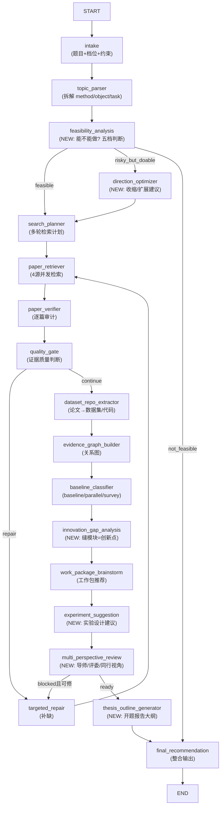

# PaperAgent 全链路 LangGraph 后端设计

> 日期: 2026-07-05  
> 状态: 设计稿 (待评审)  
> 范围: 后端 LangGraph 管道全链路重构，前端随意做

---

## 目录

- [一、参考项目总结](#一参考项目总结)
  - [1.1 academic-research-skills (ARS)](#11-academic-research-skills-ars)
  - [1.2 AutoResearchClaw (ARC)](#12-autoresearchclaw-arc)
  - [1.3 B站毕业论文合集 (学术裁缝方法论)](#13-b站毕业论文合集-学术裁缝方法论)
  - [1.4 三者对比与 PaperAgent 可借鉴点](#14-三者对比与-paperagent-可借鉴点)
- [二、PaperAgent 现状与差距分析](#二paperagent-现状与差距分析)
- [三、全链路 LangGraph 设计](#三全链路-langgraph-设计)
- [四、新增节点详细设计](#四新增节点详细设计)
- [五、ResearchState 升级](#五researchstate-升级)
- [六、Prompt 设计策略](#六prompt-设计策略)
- [七、API 契约](#七api-契约)
- [八、实施路线图](#八实施路线图)

---

## 一、参考项目总结

### 1.1 academic-research-skills (ARS)

**定位**: Claude Code 插件，4 skill × 27 mode 的学术研究 copilot 框架。

**核心架构 — 10 阶段管道**:

```
1.RESEARCH → 2.WRITE → 2.5.INTEGRITY → 3.REVIEW → 4.REVISE
→ 3'.RE-REVIEW → 4'.RE-REVISE → 4.5.FINAL_INTEGRITY
→ 5.FINALIZE → 6.PROCESS_SUMMARY
```

**4 个 Skill**:

| Skill | 版本 | Agent 数 | Mode 数 | 数据访问层 |
|---|---|---|---|---|
| deep-research | 2.11.0 | 13 | 8 | raw |
| academic-paper | 3.2.0 | 12 | 11 | redacted |
| academic-paper-reviewer | 1.10.0 | 7 | 6 | verified_only |
| academic-pipeline | 3.13.0 | 5 (orchestrator) | 1 | verified_only |

**关键设计模式**:

1. **Material Passport**: 跨 skill 的状态载体 (Schema 9)，携带 RQ Brief、Bibliography、Synthesis、Compliance History 等，实现阶段间数据传递。
2. **Devil's Advocate (DA)**: 3 个强制检查点，让步阈值 1-5，仅 ≥4 才让步；防止 AI 迎合用户。
3. **7-Mode AI 失败清单** (M1-M7): 实现错误、幻觉引用、幻觉结果、捷径依赖、Bug-as-insight、方法论编造、框架锁定。
4. **3-Layer Citation Emission**: `<!--ref:slug-->` + `<!--anchor:kind:value-->` + L3 Claim-Faithfulness Audit。
5. **Generator-Evaluator Contract**: 写作盲评 → 看到论文后自评，物理隔离防止"先读再合理化标准"。
6. **Mode Spectrum**: Fidelity (16, 59%) / Balanced (7, 26%) / Originality (4, 15%) — 同一管道不同精度档位。

**对 PaperAgent 的启发**:
- DA + 7-Mode 失败清单 → 已有 devils_advocate 节点，但缺少 M1-M7 系统化检查。
- Material Passport 思路 → ResearchState 需要扩展为跨阶段可序列化的完整状态。
- Mode Spectrum → 可以让用户选"保毕业"/"稳中求新"/"冲高水平"三档，同一管道不同 prompt 精度。
- Citation 三层验证 → 已有 verifier，但缺少 anchor 级别验证。

### 1.2 AutoResearchClaw (ARC)

**定位**: 自主研究管线，"Chat an Idea. Get a Paper."，23 阶段状态机。

**核心架构 — 23 阶段 / 8 相位**:

| 相位 | 阶段 | 关键内容 |
|---|---|---|
| A: Scoping | 1-2 | Topic init → Problem decompose |
| B: Literature | 3-6 | Search strategy → Collect → **Screen [GATE]** → Knowledge extract |
| C: Synthesis | 7-8 | Synthesis → Hypothesis generation |
| D: Experiment Design | 9-11 | **Experiment design [GATE]** → Code generation → Resource planning |
| E: Execution | 12-13 | Experiment run → Iterative refine |
| F: Analysis/Decision | 14-15 | Result analysis → **PIVOT/REFINE decision** |
| G: Writing | 16-19 | Outline → Draft → Peer review → Revision |
| H: Finalization | 20-23 | **Quality gate [GATE]** → Archive → Export → Citation verify |

**关键设计模式**:

1. **Gate/Rollback**: 3 个强制 gate (Stage 5/9/20)，reject 时回滚到上一阶段。
2. **PIVOT/REFINE Loop**: Stage 15 的决策可以触发递归重新执行 (pivot → 回到 hypothesis gen, refine → 回到 experiment)。
3. **BenchmarkAgent (4 子 Agent)**: Surveyor → Selector → Acquirer → Validator — 专门的 dataset/baseline 发现管线。
4. **Multi-Perspective Debate**: 多角色 (contrarian/innovator/pragmatist) 生成 → 综合，用于 hypothesis 和 analysis。
5. **4-Layer Citation Verification**: L1 arXiv ID → L2 DOI → L3 title search → L4 LLM relevance，幻觉引用被删除。
6. **Self-Healing**: 实验诊断 + repair loop + AST 验证 + 执行中修复。
7. **VerifiedRegistry**: 防止编造实验数据的注册表，论文写作只能引用真实跑过的实验结果。
8. **StageContract**: 每个阶段声明 input_files / output_files / dod / error_code — 阶段间 I/O 契约。

**对 PaperAgent 的启发**:
- BenchmarkAgent 的 4 步法 → PaperAgent 的 dataset/repo 提取太简单 (单次 LLM 调用)，可以借鉴 Surveyor→Selector→Acquirer→Validator。
- PIVOT/REFINE → PaperAgent 的 targeted_repair 可以扩展为"方向调整"而非仅"补缺"。
- Multi-Perspective Debate → work package 生成可以引入多视角 (导师/评委/同行)。
- StageContract → 每个节点应有明确的 input/output 契约声明。

### 1.3 B站毕业论文合集 (学术裁缝方法论)

> 注: 第三方探索 Agent 仍在运行，以下基于目录结构和标题的初步分析。

**核心方法论 — "学术裁缝"**:

50+ 视频覆盖论文全生命周期，核心流程:

1. **选题阶段**: 保毕业可行性分析 → 模仿抄三四区论文 → 题目收缩策略
2. **检索阶段**: 搜哪些论文 → 如何下载整理 → 读论文方法 (庖丁解牛)
3. **创新阶段**: 学术裁缝缝模块 → 基准模型理解 → 什么是 Sota → 创新不是从零开始
4. **写作阶段**: 
   - 第一章: 绪论怎么写
   - 第二章: 基础理论
   - 第三章: 方法1 (核心方法)
   - 第四章: 方法2 (改进方法)
   - 第五章: 总结与展望
5. **实验阶段**: 实验性能要求 → 实验就是客观陈述 → 模仿抄和降重实验
6. **润色阶段**: 降重和润色 → 软肋掩盖 → 参考文献不是多就行了
7. **答辩阶段**: 千问千答 → 延毕只有老实人

**"学术裁缝"核心公式**:
```
创新 = Baseline(可复现) + 模块(从平行论文借鉴) + 数据集(标准benchmark)
```

**三档定位**:
- 保毕业: 模仿抄三四区，缝模块，性能达标
- 稳中求新: 在 baseline 上做明确改进，有 ablation
- 冲高水平: 有理论分析或新范式，投稿顶会

**对 PaperAgent 的启发**:
- "裁缝公式"直接映射到 work_package: baseline + module + dataset 三要素。
- 三档定位 → 用户输入题目时选择档位，影响后续 prompt 精度和 work package 推荐策略。
- 论文章节结构 → 可以作为 thesis_outline 节点的模板。
- "参考文献不是多就行了" → 引用质量检查 (已有 verifier)。
- "软肋掩盖" → 不做，但可以在 risk_reminders 中提示软肋。

### 1.4 三者对比与 PaperAgent 可借鉴点

| 维度 | ARS | ARC | 学术裁缝 | PaperAgent 现状 | 可借鉴 |
|---|---|---|---|---|---|
| 管道阶段数 | 10 | 23 | ~7 步 | 14 节点 | 阶段数够，但缺少后半段 |
| 检索 | S2+OpenAlex+Crossref | OpenAlex+S2+arXiv | 手动 | arXiv+OpenAlex+Crossref+GitHub | ✅ 已有 |
| 验证 | 3-Layer Citation | 4-Layer Citation | 人工 | verifier (单次 LLM) | 可加强 |
| Baseline 发现 | bibliography_agent | BenchmarkAgent (4步) | 手动 | dataset_repo_extractor (单次) | 借鉴 ARC 4步法 |
| 方向推荐 | RQ Brief + Synthesis | Hypothesis + PIVOT/REFINE | 模仿抄 | work_package (弱) | 借鉴 ARS RQ + ARC PIVOT |
| 可行性判断 | 无 (假设可行) | 无 (假设可行) | 保毕业分析 | 无 | **新增: feasibility_analysis** |
| 实验设计 | methodology blueprint | experiment_design + code | 手动 | 无 | **新增: experiment_suggestion** |
| 论文结构 | paper_outline (6种) | paper_outline (NeurIPS等) | 5章结构 | 无 | **新增: thesis_outline** |
| 审稿 | 5-reviewer panel | peer_review | 委员会 | devils_advocate (5-dim) | 已有，可加强 |
| 降重/润色 | revision_coach | paper_revision | 手动 | 无 | 暂不做 (超范围) |
| HITL | checkpoint 体系 | 6 mode co-pilot | 无 | human_gate (passthrough) | 可借鉴 ARS checkpoint |

---

## 二、PaperAgent 现状与差距分析

### 已有能力 (Re1.2 14 节点)

```
intake → topic_parser → search_planner → paper_retriever → verify
→ quality_gate → [repair loop] → dataset_repo_extractor
→ evidence_graph_builder → baseline_classifier
→ work_package → low_bar_review → human_gate → final_recommendation
```

**做得好的**:
- ✅ 14 节点 LangGraph + 条件边 + repair loop
- ✅ 4 个检索适配器 (arXiv/OpenAlex/Crossref/GitHub) + 熔断器
- ✅ 论文验证 (verify node, 单次 LLM 审计)
- ✅ Evidence Graph (节点+边关系图)
- ✅ Baseline/Parallel 分类
- ✅ Work Package 生成 (绑定了 candidate_id)
- ✅ Low-bar Review (5 维检查)
- ✅ Devils Advocate (5 维评分, ACCEPT/MINOR_REVISION/BLOCK)
- ✅ Trace 全链路追踪

**关键差距**:

| # | 缺失能力 | 影响 | 参考来源 |
|---|---|---|---|
| G1 | **可行性分析** — 给出题目后不判断"能不能做" | 用户不知道该不该选这个题 | 学术裁缝: 保毕业分析 |
| G2 | **方向优化** — 题目太宽/太窄时不给收缩/扩展建议 | 用户拿到一堆论文但不知道怎么聚焦 | ARS: RQ refinement; 学术裁缝: 题目收缩 |
| G3 | **创新点识别** — 不分析"baseline+什么模块=创新" | work_package 只是列表，不告诉用户怎么创新 | 学术裁缝: 缝模块; ARC: hypothesis_gen |
| G4 | **实验设计建议** — 不建议用什么数据集、跑什么实验 | 用户不知道实验怎么做 | ARC: experiment_design; ARS: methodology blueprint |
| G5 | **论文章节大纲** — 不给出开题报告/论文结构 | 用户拿到论文但不知道怎么组织写作 | ARS: paper_outline; 学术裁缝: 5章结构 |
| G6 | **多视角审查** — devils_advocate 是单视角 | 缺少导师/评委/同行视角 | ARS: 5-reviewer panel; ARC: multi-perspective debate |
| G7 | **档位驱动** — 不区分保毕业/稳中求新/冲高水平 | 所有题目一刀切 | 学术裁缝: 三档定位 |
| G8 | **引用深度验证** — verifier 只判断相关不相关 | 不验证 DOI/URL 是否真实存在 | ARS: 3-Layer; ARC: 4-Layer |
| G9 | **Repair 策略单一** — targeted_repair 只补论文缺口 | 不做方向调整 (PIVOT) | ARC: PIVOT/REFINE |
| G10 | **输出产物单薄** — 只有 buckets + work_packages | 没有结构化报告 | ARS: Material Passport; ARC: deliverables |

### 现有 research_agent.py 的价值与问题

项目有两套并行逻辑:
1. **LangGraph 管道** (14 节点, research_graph.py) — Re1.2 主线
2. **独立 Orchestrator** (research_agent.py, ~3000 行) — S66v 遗产

research_agent.py 包含大量有价值的逻辑 (熔断器、缓存、5-gram 论文关联、survey 检测、dataset 白名单、verifier 等)，但它是一个线性 5 阶段流程，不是 LangGraph。**设计方案应将这些逻辑逐步迁移到 LangGraph 节点中，而非维护两套代码。**

---

## 三、全链路 LangGraph 设计

### 设计原则

1. **保留现有 14 节点**，在其基础上扩展而非推倒重来。
2. **分阶段实施**: 先做 G1-G3 (可行性+方向+创新)，再做 G4-G5 (实验+大纲)，最后 G6-G8 (多视角+引用+PIVOT)。
3. **档位驱动**: 用户输入题目时选择"保毕业"/"稳中求新"/"冲高水平"，影响 prompt 精度。
4. **不引入新依赖**: 继续用 LangGraph + httpx + 现有 LLM provider 体系。
5. ** Ponytail**: 每个新节点尽量 1 次 LLM 调用，fallback 到确定性逻辑。

### 目标管道 (20 节点)



### 与现有 14 节点的关系

| 现有节点 | 保留/修改 | 说明 |
|---|---|---|
| intake | ✏️ 修改 | 增加 `target_level` (保毕业/稳中求新/冲高水平) |
| topic_parser | ✅ 保留 | 不变 |
| search_planner | ✅ 保留 | 不变 |
| paper_retriever | ✅ 保留 | 不变 |
| verify | ✅ 保留 | 不变 |
| quality_gate | ✅ 保留 | 不变 |
| targeted_repair | ✏️ 修改 | 增加 PIVOT 模式 (方向调整, 非仅补缺) |
| dataset_repo_extractor | ✅ 保留 | 不变 |
| evidence_graph_builder | ✅ 保留 | 不变 |
| baseline_classifier | ✅ 保留 | 不变 |
| work_package | ✏️ 修改 | 输出格式升级, 绑定创新点 |
| low_bar_review | ✅ 保留 | 改名为 multi_perspective_review 的前置 |
| human_gate | ✅ 保留 | 不变 |
| final_recommendation | ✏️ 修改 | 输出完整报告 |

| 新增节点 | 阶段 | LLM 调用 |
|---|---|---|
| **feasibility_analysis** | intake 之后 | 1 次 |
| **direction_optimizer** | 条件触发 | 1 次 |
| **innovation_gap_analysis** | baseline 分类之后 | 1 次 |
| **experiment_suggestion** | work package 之后 | 1 次 |
| **multi_perspective_review** | 替代/增强 low_bar_review | 1 次 (3 视角合并) |
| **thesis_outline_generator** | review 之后 | 1 次 |

---

## 四、新增节点详细设计

### 4.1 feasibility_analysis (可行性分析)

**输入**: `topic`, `topic_atoms`, `target_level`
**输出**: `feasibility_report`, 条件路由

**逻辑**:
1. 基于 topic_atoms 判断领域覆盖度
2. 检查是否有已知数据集 (从 `_DATASET_WHITELIST_BY_DOMAIN` 查)
3. 检查方法成熟度 (是否有 arXiv 论文)
4. LLM 一次调用: 输入 topic + atoms → 输出五档判断

**五档**:
| 档位 | 含义 | 后续动作 |
|---|---|---|
| `highly_feasible` | 方法成熟+数据集明确+baseline 可复现 | 直接进入 search_planner |
| `feasible` | 方向清晰但部分要素待验证 | 进入 search_planner |
| `risky_but_doable` | 题目偏宽/偏窄，需要收缩/扩展 | 进入 direction_optimizer |
| `risky` | 缺少关键要素 (无数据集/方法太新) | 进入 direction_optimizer + 标记风险 |
| `not_feasible` | 领域不存在/方法冲突/纯编造 | 直接 final_recommendation (给出替代方向) |

**Prompt 设计**:

```python
SYSTEM = """你是研究生开题可行性评估员。根据题目和方法原子判断:
1. 该方向是否有足够文献支撑 (≥3 篇近5年 arXiv 论文)
2. 是否有标准数据集可复现实验
3. 方法是否成熟 (是否在多个团队验证过)
4. 对目标档位 (保毕业/稳中求新/冲高水平) 是否匹配

不要编造数据集或论文。只基于 topic_atoms 做判断。
如果题目太宽 (如 "基于深度学习的图像识别")，标记 needs_narrowing。
如果题目太窄 (如 "基于 YOLOv3 的 NEU-DET 钢材表面缺陷检测使用 MobileNet backbone")，标记 needs_broadening。"""

USER_TEMPLATE = """题目: {topic}
拆解: {topic_atoms}
目标档位: {target_level}

输出 JSON:
- verdict: "highly_feasible" | "feasible" | "risky_but_doable" | "risky" | "not_feasible"
- domain_maturity: "mature" | "emerging" | "nascent" | "unknown"
- dataset_availability: "standard" | "derivable" | "uncertain" | "none"
- method_readiness: "proven" | "experimental" | "theoretical" | "unknown"
- narrowing_needed: boolean (题目太宽?)
- broadening_needed: boolean (题目太窄?)
- risk_factors: list[str] (≤5 条)
- suggested_pivot: str | null (如果是 risky, 建议的替代方向)
- reason: str (≤100 字)"""
```

**Fallback (无 LLM 时)**: 基于 `_HEURISTIC_DOMAIN_KEYWORDS` 判断领域是否已知 + 检查 topic 长度判断宽窄。

### 4.2 direction_optimizer (方向优化)

**输入**: `topic`, `topic_atoms`, `feasibility_report`
**输出**: `optimized_topic`, `optimization_notes`

**逻辑**:
1. 如果 `narrowing_needed`: 基于 topic_atoms 建议加上限定词 (场景/数据集/方法变体)
2. 如果 `broadening_needed`: 建议去掉过窄的限定词
3. 如果 `suggested_pivot`: 提供替代方向
4. LLM 一次调用生成 2-3 个优化后的题目变体

**Prompt 设计**:

```python
SYSTEM = """你是研究方向优化顾问。当题目太宽或太窄时，提供具体、可操作的收缩/扩展建议。

收缩策略: 加场景限定 (工业场景/医学场景) + 加方法变体 (轻量化/实时性) + 加数据集限定
扩展策略: 去掉过窄的数据集限定 + 去掉过窄的方法版本号 + 泛化对象词

每个建议必须包含: 优化后题目 + 为什么更好 + 预期检索效果变化。"""

USER_TEMPLATE = """原题: {topic}
拆解: {topic_atoms}
可行性: {feasibility_report}
需要收缩: {narrowing_needed}
需要扩展: {broadening_needed}
建议方向: {suggested_pivot}

输出 JSON:
- optimized_topics: list of {topic, why_better, expected_search_effect}
- recommended_one: str (选一个最优)
- optimization_notes: str (≤200字解释)
- keep_original: boolean (如果题目本身没问题)"""
```

**Fallback**: 基于 topic_atoms 的 axis 分布做规则收缩 (去掉非核心 axis / 补全缺失 axis)。

### 4.3 innovation_gap_analysis (创新点识别)

**输入**: `baseline_candidates`, `parallel_candidates`, `topic_atoms`, `target_level`
**输出**: `innovation_gaps`, `innovation_strategies`

**逻辑**:
1. 分析 baseline 论文用了什么方法/模块
2. 分析 parallel 论文在什么维度上做了改进 (速度/精度/效率/鲁棒性)
3. 找到 "baseline 缺什么 + parallel 有什么" 的交集 = 创新机会
4. 按档位推荐不同创新策略:
   - 保毕业: 复现 baseline + 借鉴 parallel 的 1 个模块 + 标准数据集
   - 稳中求新: baseline + 2 个模块组合 + ablation
   - 冲高水平: 新范式/新理论分析/新数据集贡献

**Prompt 设计**:

```python
SYSTEM = """你是学术创新分析员。基于 "学术裁缝" 方法论分析创新机会:

核心公式: 创新 = Baseline(可复现) + 模块(从平行论文借鉴) + 数据集(标准benchmark)

分析规则:
1. 列出每个 baseline 的方法组件 (backbone/loss/attention/data_aug等)
2. 列出每个 parallel 做了什么改进 (在哪个组件上)
3. 找到 "baseline 没用但 parallel 验证有效" 的组件 = 可借鉴模块
4. 按目标档位给出创新策略建议
5. 禁止建议 "加注意力机制" 等通用模板 — 必须从实际候选中提取

输出必须绑定 candidate_id — 每个建议必须指向具体论文。"""

USER_TEMPLATE = """题目: {topic}
目标档位: {target_level}
Baseline 论文: {baselines}
Parallel 论文: {parallels}

输出 JSON:
- baseline_components: list of {candidate_id, components: [str]}
- parallel_improvements: list of {candidate_id, improved_dimension: str, method: str}
- innovation_gaps: list of {gap_description, borrowable_from: [candidate_id], expected_gain: str}
- innovation_strategies: list of {
    strategy_name: str,
    strategy_type: "module_replacement" | "module_addition" | "method_combination" | "new_dataset" | "new_evaluation",
    baseline_candidate_id: str,
    borrow_from: [candidate_id],
    target_level: "保毕业" | "稳中求新" | "冲高水平",
    estimated_effort: "low" | "medium" | "high",
    risk: str,
    why_novel: str (≤50字)
  }
- recommended_strategy: str (选一个最优)
- anti_patterns: list[str] (应该避免的伪创新)"""
```

**Fallback**: 规则匹配 — 从 baseline 标题提取方法词，从 parallel 标题提取改进词，做集合差。

### 4.4 experiment_suggestion (实验设计建议)

**输入**: `work_packages`, `innovation_strategies`, `dataset_candidates`, `baseline_candidates`, `target_level`
**输出**: `experiment_plan`

**逻辑**:
1. 基于 work package 的 baseline + 数据集给出实验设计
2. 建议对比实验 (ablation 的维度)
3. 建议评价指标 (domain-specific)
4. 估算计算资源需求

**Prompt 设计**:

```python
SYSTEM = """你是实验设计顾问。基于已确定的 baseline、数据集和创新策略，给出具体实验方案:

1. 主实验: baseline 在目标数据集上的复现
2. 改进实验: 应用创新策略后的方法在同一数据集
3. 消融实验: 逐个去掉改进模块，验证每个模块的贡献
4. 对比实验: 与 parallel 论文的方法对比
5. 评价指标: domain-specific metrics (mAP/IoU/F1/PSNR 等)

禁止建议不存在的数据集或不现实的实验规模。
数据集必须来自 dataset_candidates。"""

USER_TEMPLATE = """题目: {topic}
目标档位: {target_level}
工作包: {work_packages}
创新策略: {innovation_strategies}
数据集: {datasets}
Baseline: {baselines}

输出 JSON:
- main_experiment: {dataset, baseline, expected_metric, reproducibility_note}
- improvement_experiment: {strategy, dataset, expected_improvement, risk}
- ablation_plan: list of {remove_component, expected_impact, why}
- comparison_experiment: list of {compare_with, on_dataset, expected_result}
- evaluation_metrics: list of {metric_name, higher_is_better, typical_range}
- resource_estimate: {gpu_hours, dataset_size_gb, estimated_training_time}
- experiment_table_template: str (LaTeX 格式的实验表格模板)"""
```

**Fallback**: 基于 domain_route 查表返回标准实验配置。

### 4.5 multi_perspective_review (多视角审查)

**输入**: `work_packages`, `innovation_strategies`, `experiment_plan`, `evidence_graph`
**输出**: `review_panel_verdict`, 条件路由

**逻辑**:
1. 模拟 3 个视角的审查者:
   - **导师视角**: 关注可行性和工作量 (能不能毕业?)
   - **评委视角**: 关注创新性和理论深度 (有什么新东西?)
   - **同行视角**: 关注可复现性和对比公平性 (实验做得对吗?)
2. 每个视角独立打分 + 给出 verdict
3. 综合 3 个视角给出最终 verdict

**Prompt 设计**:

```python
SYSTEM = """你是论文开题审查小组。3 个视角同时审查:

视角1 — 导师 (可行性优先):
- 这个题目能在规定时间内做完吗?
- baseline 可复现吗?
- 数据集获取难度?
- 工作量是否合理?

视角2 — 评委 (创新性优先):
- 相比 baseline 的改进是否清晰?
- 创新点是否足够 (不是简单换模块)?
- 理论分析是否充分?
- 与 SOTA 的差距是否讨论了?

视角3 — 同行 (可复现性优先):
- 实验设置是否公平?
- 对比方法是否最新?
- 消融实验是否完整?
- 评价指标是否标准?

每个视角独立打分 (0-10), 互不影响。"""

USER_TEMPLATE = """题目: {topic}
工作包: {work_packages}
创新策略: {innovation_strategies}
实验方案: {experiment_plan}
证据图: {evidence_summary}

输出 JSON:
- advisor_review: {score: int, verdict: "pass"|"needs_revision"|"block", concerns: [str]}
- committee_review: {score: int, verdict: "pass"|"needs_revision"|"block", concerns: [str]}
- peer_review: {score: int, verdict: "pass"|"needs_revision"|"block", concerns: [str]}
- panel_verdict: "pass" | "needs_revision" | "block"
- blocking_issues: [str] (≤5)
- improvement_suggestions: [str] (≤5)
- summary: str (≤100字)"""
```

**Fallback**: 基于 work_packages 数量 + baseline 数量 + dataset 数量做规则判断。

### 4.6 thesis_outline_generator (开题报告大纲)

**输入**: `topic`, `topic_atoms`, `feasibility_report`, `work_packages`, `innovation_strategies`, `experiment_plan`, `review_panel_verdict`
**输出**: `thesis_outline`

**逻辑**:
1. 生成标准的 5 章结构 (中国研究生大论文)
2. 每章列出要写的内容要点
3. 每章关联对应的 evidence (论文/数据集/repo)
4. 生成可下载的 Markdown 大纲

**Prompt 设计**:

```python
SYSTEM = """你是开题报告撰写顾问。基于已有的研究证据，生成标准的中国研究生大论文 5 章结构:

第一章 绪论: 研究背景 + 国内外研究现状 + 研究内容 + 论文结构
第二章 基础理论: 方法基础 + 技术背景 + 预备知识
第三章 核心方法 (方法1): baseline 复现 + 问题分析 + 初步方法
第四章 改进方法 (方法2): 创新策略 + 详细设计 + 理论分析
第五章 实验与结论: 实验设置 + 结果分析 + 消融实验 + 总结展望

每章必须关联具体的 evidence (candidate_id)。
禁止编造引用 — 只能使用 evidence_graph 中的节点。"""

USER_TEMPLATE = """题目: {topic}
目标档位: {target_level}
拆解: {topic_atoms}
可行性: {feasibility_report}
工作包: {work_packages}
创新策略: {innovation_strategies}
实验方案: {experiment_plan}

输出 JSON:
- chapters: list of {
    chapter_number: int,
    title: str,
    sections: list of {
      section_title: str,
      key_points: [str],
      cited_evidence: [candidate_id],
      estimated_pages: int
    }
  }
- literature_review_strategy: str (如何组织综述, ≤200字)
- innovation_narrative: str (如何在第四章讲创新故事, ≤200字)
- risk_mitigation: str (如何在论文中处理软肋, ≤100字)
- outline_markdown: str (完整 Markdown 大纲)"""
```

**Fallback**: 模板填充 (5 章固定结构 + 填入 topic/baseline/dataset 名称)。

---

## 五、ResearchState 升级

```python
class ResearchState(TypedDict, total=False):
    # --- Intake (修改: 增加 target_level) ---
    case_id: str
    topic: str
    target_level: str  # NEW: "保毕业" | "稳中求新" | "冲高水平"
    user_constraints: dict[str, Any]

    # --- Topic parsing ---
    topic_atoms: dict[str, Any]

    # --- NEW: Feasibility ---
    feasibility_report: dict[str, Any]
    # {
    #   verdict: str, domain_maturity: str, dataset_availability: str,
    #   method_readiness: str, narrowing_needed: bool, broadening_needed: bool,
    #   risk_factors: list[str], suggested_pivot: str | None, reason: str
    # }

    # --- NEW: Direction optimization ---
    optimized_topic: str
    optimization_notes: str

    # --- Search planning ---
    search_plan: dict[str, Any]

    # --- Retrieval ---
    raw_results: dict[str, list[dict[str, Any]]]

    # --- Evidence graph ---
    evidence_graph: dict[str, Any]

    # --- Paper verification ---
    paper_candidates: list[dict[str, Any]]
    verified_papers: list[dict[str, Any]]
    quarantined_candidates: list[dict[str, Any]]  # NEW

    # --- Dataset / repo extraction ---
    dataset_candidates: list[dict[str, Any]]
    repo_candidates: list[dict[str, Any]]

    # --- Evidence audit + classification ---
    baseline_candidates: list[dict[str, Any]]
    parallel_candidates: list[dict[str, Any]]
    dataset_papers: list[dict[str, Any]]
    surveys: list[dict[str, Any]]
    evidence_audit: dict[str, Any]

    # --- NEW: Innovation gap analysis ---
    innovation_gaps: list[dict[str, Any]]
    innovation_strategies: list[dict[str, Any]]
    recommended_strategy: dict[str, Any]

    # --- Work package ---
    work_packages: list[dict[str, Any]]

    # --- NEW: Experiment suggestion ---
    experiment_plan: dict[str, Any]

    # --- Review (修改: 从 low_bar_review 升级) ---
    multi_perspective_review: dict[str, Any]
    low_bar_review: dict[str, Any]  # 保留兼容

    # --- NEW: Thesis outline ---
    thesis_outline: dict[str, Any]

    # --- Human gate ---
    human_gate: dict[str, Any]

    # --- Final recommendation ---
    final_recommendation: dict[str, Any]

    # --- Telemetry ---
    trace_events: list[dict[str, Any]]
    provider_profile: str
    errors: list[dict[str, Any]]
    repair_rounds: int  # NEW: 显式追踪 repair 次数
```

---

## 六、Prompt 设计策略

### 6.1 档位驱动 Prompt 变量

所有 LLM 调用的 system prompt 末尾追加档位提示:

```python
LEVEL_HINT = {
    "保毕业": "用户目标是保毕业。优先推荐成熟方法、标准数据集、可复现的 baseline。创新点不需要很新，缝模块即可。",
    "稳中求新": "用户目标是稳中求新。推荐在成熟 baseline 上做明确改进，需要 ablation 验证。",
    "冲高水平": "用户目标是冲高水平。需要有理论分析或新范式，投稿目标为顶会/顶刊。",
}
```

### 6.2 防编造规则 (全局)

所有 prompt 共享的硬规则:
1. 每个引用必须绑定 candidate_id (来自 evidence_graph)
2. 禁止编造论文/数据集/repo 名称
3. 禁止建议"加注意力机制"等通用模板创新
4. 如果证据不足，输出 evidence_gap 而非编造建议
5. 所有数字 (预计精度/时间) 必须标注 "estimated"

### 6.3 LLM Provider 路由

| 节点 | Profile | Provider | max_tokens | 原因 |
|---|---|---|---|---|
| feasibility_analysis | fast_json | stepfun/deepseek | 1500 | 简单判断 |
| direction_optimizer | fast_json | stepfun/deepseek | 2000 | 生成 2-3 个变体 |
| innovation_gap_analysis | fast_json | stepfun/deepseek | 3000 | 需要分析组件关系 |
| experiment_suggestion | fast_json | stepfun/deepseek | 2500 | 结构化输出 |
| multi_perspective_review | fast_json | stepfun/deepseek | 3000 | 3 视角合并 |
| thesis_outline_generator | fast_json | deepseek | 4000 | 长文本生成 |

---

## 七、API 契约

### 现有端点 (保留)

```
GET  /api/v1/research/                     # 列出 case
POST /api/v1/research/                     # 提交题目
GET  /api/v1/research/{case_id}/status     # 状态
GET  /api/v1/research/{case_id}/state      # 完整 ResearchState
GET  /api/v1/research/{case_id}/trace      # trace events
GET  /api/v1/research/{case_id}/evidence-graph  # 证据图
```

### 新增端点

```
GET  /api/v1/research/{case_id}/feasibility       # 可行性报告
GET  /api/v1/research/{case_id}/innovation        # 创新点分析
GET  /api/v1/research/{case_id}/experiment        # 实验方案
GET  /api/v1/research/{case_id}/review            # 多视角审查
GET  /api/v1/research/{case_id}/outline           # 论文大纲 (Markdown)
GET  /api/v1/research/{case_id}/report            # 完整开题报告 (Markdown)
```

### 提交格式升级

```json
POST /api/v1/research/
{
  "case_id": "steel-yolo-001",
  "topic": "基于YOLOv5的钢材表面缺陷检测研究",
  "target_level": "保毕业",
  "user_constraints": {
    "timeline": "6个月",
    "gpu": "RTX 3090",
    "data_available": ["NEU-DET"]
  }
}
```

---

## 八、实施路线图

### Phase 1: 可行性 + 方向 (1-2 周)

**目标**: 让用户知道"这个题目能不能做"

| 任务 | 文件 | 优先级 |
|---|---|---|
| 新增 `feasibility_analysis` 节点 | `nodes/feasibility.py` | P0 |
| 新增 `direction_optimizer` 节点 | `nodes/direction.py` | P0 |
| 修改 `intake` 接收 `target_level` | `nodes/intake.py` | P0 |
| 修改 `research_graph.py` 加条件边 | `research_graph.py` | P0 |
| 新增 prompt: `feasibility.py`, `direction.py` | `prompts/` | P0 |
| 升级 `ResearchState` | `state.py` | P0 |
| 测试: 3 个题目 × 3 档位 | `tests/` | P1 |

**验收**: 给一个题目，返回"能不能做 + 为什么 + 如果不行怎么改"

### Phase 2: 创新点 + 实验设计 (2-3 周)

**目标**: 告诉用户"怎么做创新 + 实验怎么设计"

| 任务 | 文件 | 优先级 |
|---|---|---|
| 新增 `innovation_gap_analysis` 节点 | `nodes/innovation.py` | P0 |
| 新增 `experiment_suggestion` 节点 | `nodes/experiment.py` | P0 |
| 新增 prompt: `innovation.py`, `experiment.py` | `prompts/` | P0 |
| 升级 `work_package` 绑定创新策略 | `nodes/content.py` | P1 |
| 新增 API: `/innovation`, `/experiment` | `api/v1/research.py` | P1 |
| 测试: 创新点与 evidence 绑定一致性 | `tests/` | P1 |

**验收**: 给一个题目 + baseline，返回"缝什么模块 = 创新点 + 跑什么实验"

### Phase 3: 多视角审查 + 论文大纲 (2-3 周)

**目标**: 生成可用的开题报告

| 任务 | 文件 | 优先级 |
|---|---|---|
| 新增 `multi_perspective_review` 节点 | `nodes/multi_review.py` | P0 |
| 新增 `thesis_outline_generator` 节点 | `nodes/outline.py` | P0 |
| 新增 prompt: `multi_review.py`, `outline.py` | `prompts/` | P0 |
| 升级 `final_recommendation` 整合所有输出 | `nodes/content.py` | P0 |
| 新增 API: `/review`, `/outline`, `/report` | `api/v1/research.py` | P1 |
| 测试: 端到端 3 个题目完整跑通 | `tests/` | P1 |

**验收**: 给一个题目，端到端跑完，输出"可行性 → 创新点 → 实验方案 → 审查 → 开题大纲"

### Phase 4: 增强 + 打磨 (后续)

| 任务 | 说明 |
|---|---|
| PIVOT 模式 | targeted_repair 增加"方向调整"而非仅"补缺" |
| 引用深度验证 | verifier 增加 DOI/URL 存在性检查 |
| 性能优化 | 并行化 multi_perspective_review 的 3 视角 |
| 前端接入 | 随便做个前端展示 |
| research_agent.py 迁移 | 将 S66v 的有价值逻辑逐步迁入 LangGraph 节点 |

---

## 附录 A: 与 ARS 10-Stage 的映射

| ARS Stage | PaperAgent Node | 状态 |
|---|---|---|
| 1. RESEARCH | intake + topic_parser + feasibility | ✅ 现有 + 新增 |
| 2. WRITE | thesis_outline_generator | 🆕 新增 |
| 2.5. INTEGRITY | verify + quality_gate | ✅ 现有 |
| 3. REVIEW | multi_perspective_review | 🆕 新增 (替代 low_bar) |
| 4. REVISE | targeted_repair | ✅ 现有 |
| 4.5. FINAL INTEGRITY | devils_advocate (research_agent.py) | 📋 待整合 |
| 5. FINALIZE | final_recommendation | ✅ 现有 |
| 6. PROCESS SUMMARY | trace_events | ✅ 现有 |

## 附录 B: 与 ARC 23-Stage 的映射

| ARC Stage | PaperAgent Node | 状态 |
|---|---|---|
| 1-2. Scoping | intake + topic_parser + feasibility | ✅ + 🆕 |
| 3-6. Literature | search_planner + retriever + verify | ✅ 现有 |
| 7-8. Synthesis | innovation_gap_analysis | 🆕 新增 |
| 9-11. Experiment Design | experiment_suggestion | 🆕 新增 |
| 12-13. Execution | (不做 — 超范围) | ❌ |
| 14-15. Decision | multi_perspective_review + targeted_repair | 🆕 + ✅ |
| 16-19. Writing | thesis_outline_generator | 🆕 新增 |
| 20-23. Finalization | final_recommendation | ✅ 现有 |
