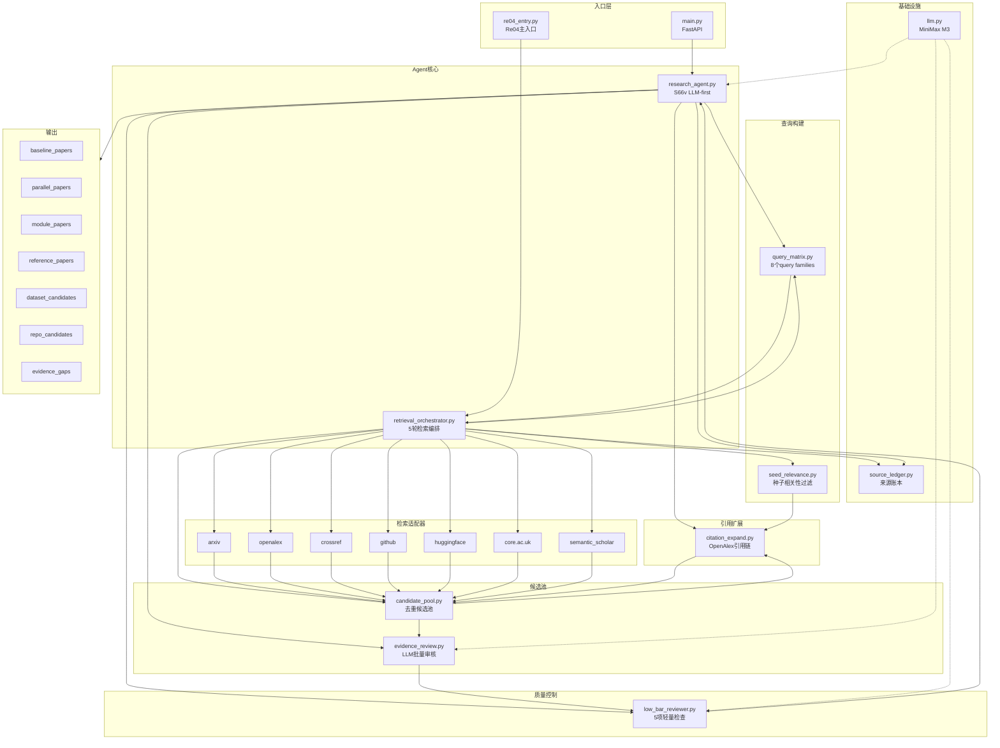
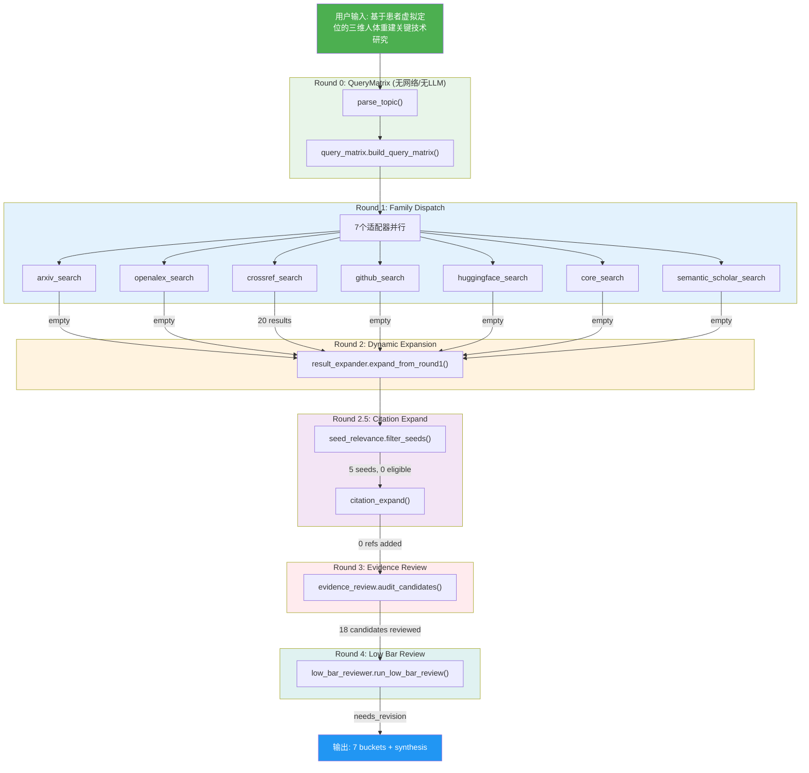
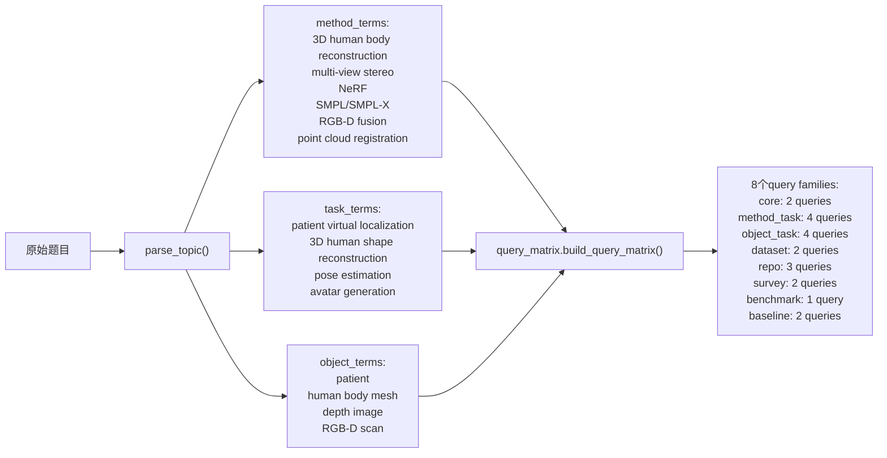
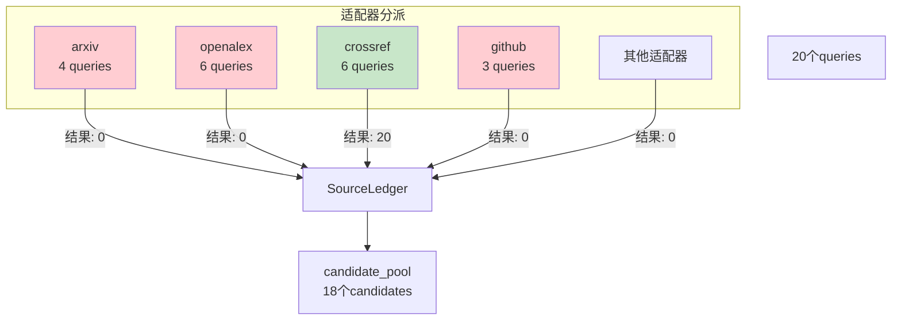
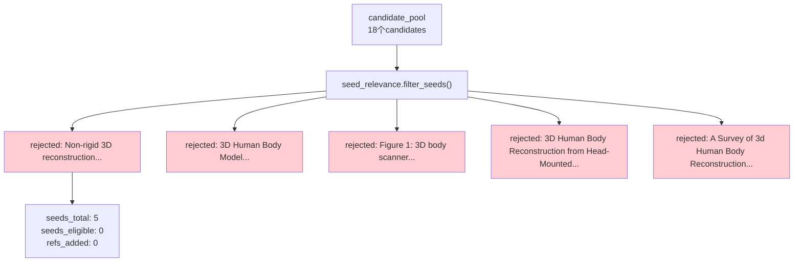
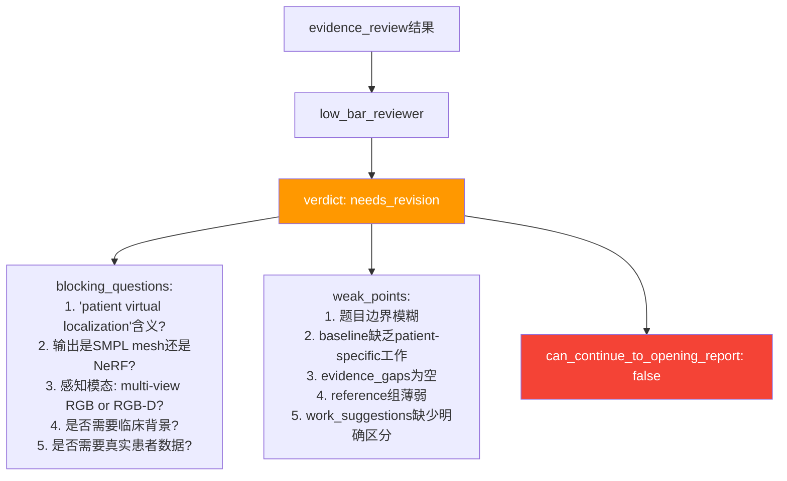

# PaperAgent Agent 架构图

## 整体架构



## Pipeline 流程

```
用户输入题目
    ↓
┌─ Round 0: query_matrix (无网络/无LLM) ─────────────┐
│  → 8个query families (core/method_task/object_task/...) │
└──────────────────────────────────────────────────────┘
    ↓
┌─ Round 1-2: retrieval_orchestrator ─────────────────┐
│  → dispatch to 7 adapters (arxiv/openalex/crossref/...) │
│  → results → candidate_pool (dedup by stable_id)      │
│  → result_expander (LLM refinement)                   │
└──────────────────────────────────────────────────────┘
    ↓
┌─ Round 2.5: citation_expand ────────────────────────┐
│  → seed_relevance filter → OpenAlex referenced_works  │
│  → expanded refs → candidate_pool                     │
└──────────────────────────────────────────────────────┘
    ↓
┌─ Round 3: evidence_review (1 LLM batch call) ──────┐
│  → Every candidate → status (core/candidate/rejected) │
└──────────────────────────────────────────────────────┘
    ↓
┌─ Round 4: low_bar_reviewer (1 LLM call) ───────────┐
│  → pass / needs_revision / stop                       │
└──────────────────────────────────────────────────────┘
    ↓
输出 7 buckets + fabrication_alerts + source_ledger
```

## 数据流图 (Data Flow)



## 真实案例: ENG-THESIS-015

### 输入

**题目**: 基于患者虚拟定位的三维人体重建关键技术研究

### Round 0: QueryMatrix (无网络/无LLM)



**产出**: 20个query分布在8个family

### Round 1: Family Dispatch (检索)



**SourceLedger 记录**:
| adapter | query | status | result_count |
|---------|-------|--------|--------------|
| crossref | 3D human body reconstruction classic | ok | 8 |
| crossref | patient patient virtual localization | ok | 8 |
| crossref | 3D human body reconstruction patient | ok | 7 |
| arxiv | 所有queries | empty | 0 |
| openalex | 所有queries | empty | 0 |
| github | 所有queries | empty | 0 |

### Round 2.5: Citation Expand (种子过滤)



**种子过滤原因**: 所有候选论文都没有openalex_id或DOI作为引用扩展的种子

### Round 3: Evidence Review (LLM批量审核)

```mermaid
flowchart TD
    POOL["18个candidates"] --> LLM["LLM batch audit<br/>(1次调用)"]

    LLM --> CORE["core (1)"]
    LLM --> CANDIDATE["candidate (7)"]
    LLM --> NEEDS_MANUAL["needs_manual (1)"]
    LLM --> REJECTED["rejected (7)"]

    CORE --> |"c-a6120f4a"| SURVEY["A Survey of 3d Human Body Reconstruction<br/>confidence: high<br/>relation: survey"]

    CANDIDATE --> C1["c-9cdb1e1a: 3D Human Body Model...<br/>confidence: high"]
    CANDIDATE --> C2["c-f2fbe7c1: Towards Accurate 3D...<br/>confidence: high"]
    CANDIDATE --> C3["c-acd759b2: 3D Reconstruction...Kinect<br/>confidence: high"]
    CANDIDATE --> C4["c-e7af122e: A High Precision 3d...<br/>confidence: high"]
    CANDIDATE --> C5["c-7c030080: PeeledHuman...<br/>confidence: high"]
    CANDIDATE --> C6["c-b7e4392d: Non-rigid 3D...<br/>confidence: medium"]
    CANDIDATE --> C7["c-c48bc24e: 3D Human Body...<br/>confidence: medium"]

    NEEDS_MANUAL --> NM1["c-db16a094: Figure 1: 3D body scanner...<br/>reason: metadata_mismatch"]

    REJECTED --> R1["c-f86b584a: Neurologic Examination...<br/>reason: unrelated"]
    REJECTED --> R2["c-a0ee1cc7: Replicate Engineered...<br/>reason: unrelated"]
    REJECTED --> R3["c-54bfd053: Shifting from the...<br/>reason: unrelated"]
    REJECTED --> R4["c-ca23e8b5: Supplemental Information 5...<br/>reason: metadata_mismatch"]
    REJECTED --> R5["c-740cc3bf: Virtual Patient Encounter<br/>reason: unrelated"]
    REJECTED --> R6["c-8f49efef: Patient-to-Patient Communication...<br/>reason: unrelated"]
    REJECTED --> R7["c-2a9c7658: The Data-Driven Cyber Patient<br/>reason: unrelated"]

    style CORE fill:#4CAF50,color:white
    style CANDIDATE fill:#2196F3,color:white
    style NEEDS_MANUAL fill:#FF9800,color:white
    style REJECTED fill:#f44336,color:white
```



### Round 4: Low Bar Review (质量控制)



### 最终输出: 7 Buckets

```mermaid
flowchart TD
    subgraph BUCKETS["输出: 7 Buckets"]
        B1["baseline_papers<br/>(3篇)"]
        B2["parallel_papers<br/>(4篇)"]
        B3["module_papers<br/>(0篇)"]
        B4["reference_papers<br/>(2篇)"]
        B5["dataset_candidates<br/>(0篇)"]
        B6["repo_candidates<br/>(0篇)"]
        B7["evidence_gaps<br/>(5个问题)"]
    end

    B1 --> D1["c-acd759b2: 3D Reconstruction...Kinect (2022)"]
    B1 --> D2["c-e7af122e: A High Precision 3d... (2022)"]
    B1 --> D3["c-9cdb1e1a: 3D Human Body Model... (2024)"]

    B2 --> P1["c-7c030080: PeeledHuman... (2020)"]
    B2 --> P2["c-f2fbe7c1: Towards Accurate 3D... (2019)"]
    B2 --> P3["c-c48bc24e: 3D Human Body... (2023)"]
    B2 --> P4["c-310ee0fe: Image-based 3D..."]

    B4 --> S1["c-a6120f4a: A Survey of 3d... (2023)"]
    B4 --> S2["c-25fa513a: Remarks on 3d... (2007)"]

    B7 --> G1["1. 'patient virtual localization'含义?"]
    B7 --> G2["2. 输出格式?"]
    B7 --> G3["3. 感知模态?"]
    B7 --> G4["4. 临床背景需求?"]
    B7 --> G5["5. 数据需求?"]
```



### 处理统计

| 指标 | 值 |
|------|-----|
| 总耗时 | 169秒 |
| LLM调用次数 | 3-4次 |
| 适配器调用次数 | 22次 |
| 候选池大小 | 18篇 |
| Core论文 | 1篇 |
| Candidate论文 | 7篇 |
| Rejected论文 | 7篇 |
| 需人工审核 | 1篇 |
| 种子过滤 | 5个种子全部被拒绝 |
| 引用扩展 | 0篇 |

### 关键发现

1. **crossref是唯一有效适配器**: arxiv、openalex、github全部返回空结果
2. **"virtual localization"语义歧义**: 导致检索到大量无关的"virtual patient"临床文献
3. **种子相关性过滤有效**: 阻止了不相关论文的引用扩展
4. **质量控制触发修订**: low_bar_reviewer正确识别了题目边界模糊问题

---

## 关键设计决策

- **LLM-first**: 仅 3-4 次 LLM 调用（parse_topic → plan_tools → synthesize → devils_advocate）
- **无评分字段**: 无 `*_score` 字段，纯 tier enums
- **来源追踪**: SourceLedger 记录每次适配器调用的 provenance
- **多适配器路由**: 7 个检索适配器按 query family 路由，非单一 `multi_round_fetch`
