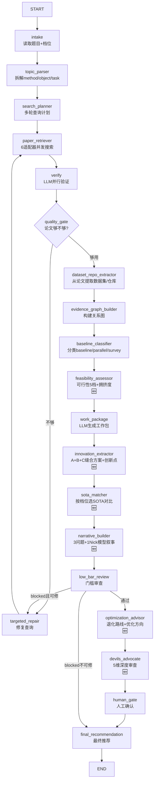

# PaperAgent Re2 — 全链路 LangGraph 后端设计

> **目标**：输入题目 → 搜索论文/repo/dataset → 科研技能工作流 → 生成题目工作推荐 + 优化方向
>
> **范围限定**：本期只做"保毕业"档，不做"稳中求新"/"冲高水平"档位分层。所有 prompt、SOTA 选择、创新策略均以保毕业为唯一目标。
>
> **性能要求**：搜索阶段 ≤3 min；后续每个 LLM 节点尽快产出第一轮结果（流式/分阶段返回）。
>
> **前端要求**：简易 HTML 单页，SSE 实时显示搜索/验证/分析过程，搜索结果逐条流入。
>
> **当前状态**：Re1.2 已完成 14 节点 LangGraph + 条件边 + repair loop，搜索功能可用但后续链路（可行性判断、创新点生成、工作包推荐、优化方向）仍是骨架。
>
> **本文件范围**：后端 LangGraph 全链路设计 + 简易前端接入设计 + 自测 SOP。

---

## 目录

1. [三参考项目总结](#1-三参考项目总结)
2. [PaperAgent 现状与差距分析](#2-paperagent-现状与差距分析)
3. [目标 Graph 总览](#3-目标-graph-总览)
4. [ResearchState 扩展设计](#4-researchstate-扩展设计)
5. [新增节点详细设计](#5-新增节点详细设计)
6. [Prompt 设计](#6-prompt-设计)
7. [条件边与路由逻辑](#7-条件边与路由逻辑)
8. [API 契约](#8-api-契约)
9. [性能设计与流式返回](#9-性能设计与流式返回)
10. [简易前端接入设计](#10-简易前端接入设计)
11. [实施路线图](#11-实施路线图)
12. [自测与验证 SOP](#12-自测与验证-sop)

---

## 1. 三参考项目总结

### 1.1 Academic Research Skills (ARS)

**定位**：Claude Code 插件，4 skill + 27 mode，覆盖科研到发表全流程。

**核心架构 — 10 阶段 Pipeline**：

```
1.RESEARCH → 2.WRITE → 2.5.INTEGRITY → 3.REVIEW → 4.REVISE →
3'.RE-REVIEW → 4'.RE-REVISE → 4.5.FINAL_INTEGRITY → 5.FINALIZE → 6.PROCESS_SUMMARY
```

**对 PaperAgent 的启发**：

| ARS 机制 | PaperAgent 可借鉴点 |
|---|---|
| **7-mode AI 失败检查表** (M1-M7) | 证据验证后的 fabrication gate 可扩展为 M1-M7 checklist |
| **Devil's Advocate 3 次强制检查 + concession threshold** | devils_advocate 节点已有雏形，可强化为多轮辩论 |
| **Material Passport** (跨阶段状态载体) | ResearchState 已有类似设计，可增加 provenance 追踪 |
| **数据访问层级** (raw → redacted → verified_only) | 证据分层：raw_results → verified_papers → baseline_candidates |
| **5-dimension reviewer** (0-100 + PASS/WARN/BLOCK) | 已有 5-dimension 设计，但未输出结构化评分 |
| **Socratic Mentor 5-layer dialogue** | 可用于 human_gate 节点的交互式提问 |
| **Revision loop cap** (max 2 loops) | 已有 max_repair_rounds，可统一为 revision cap |

### 1.2 AutoResearchClaw (ARC)

**定位**：自主研究管线，23 阶段状态机，8 个阶段。

**核心架构**：

```
A:Scoping(1-2) → B:Literature(3-6) → C:Synthesis(7-8) →
D:Experiment(9-11) → E:Execution(12-13) → F:Decision(14-15) →
G:Writing(16-19) → H:Finalization(20-23)
```

**Gate stages**: 5(LITERATURE_SCREEN), 9(EXPERIMENT_DESIGN), 20(QUALITY_GATE)

**对 PaperAgent 的启发**：

| ARC 机制 | PaperAgent 可借鉴点 |
|---|---|
| **4-agent Benchmark Pipeline** (Surveyor→Selector→Acquirer→Validator) | dataset/repo 检索可升级为多步：先从论文提取→再网络搜索→再验证可用性 |
| **PIVOT/REFINE loop** (Stage 15, max 2 pivots) | 可用于"方向调整建议"：如果证据不足，给 pivot vs refine 建议 |
| **Multi-perspective debate** (contrarian/innovator/pragmatist) | 创新点生成可用多视角：保守派/激进派/实用派各自出方案→综合 |
| **VerifiedRegistry** (反伪造数据注册表) | evidence_graph 可扩展为 VerifiedRegistry，记录每个证据的验证状态 |
| **4-layer citation verification** (arXiv ID→DOI→title→LLM) | verify 节点可升级为多级验证 |
| **Compute budget block** (时间预算+步数限制) | 可加入 LLM call budget 管理 |
| **Self-learning lessons** (30天衰减) | trace 持久化可加入跨 run 的经验学习 |
| **StageContract** (input_files/output_files/dod) | 每个节点的输入输出契约可更严格 |

### 1.3 B站毕业论文合集

**定位**：50 个视频 + 7 套模板，三大学派实战经验。

**三大学派**：

| 学派 | 核心哲学 | 适用场景 |
|---|---|---|
| **水导** | A+B+C 系统化流水线 | CS/AI 全流程 |
| **木水** | SCI = 八股填空题 | 传统工科，速成 |
| **水神** | 代码缝合（shape alignment） | 顶会顶刊冲刺 |

**核心方法论 — 7 阶段**：

```
1.选题/可行性 → 2.文献搜索与阅读 → 3.创新点识别(学术裁缝) →
4.论文结构(1-5章) → 5.实验设计与baseline对比 → 6.投稿与降重 → 7.答辩
```

**对 PaperAgent 的关键启发**：

| B站方法论 | PaperAgent 可借鉴点 |
|---|---|
| **100+1+1+1=103 可行性公式** | 可行性判断：baseline(100) + 模块(1×3) → 预判可毕业性 |
| **"人多的方向"原则** | 搜索结果数量+近3-5年论文密度 → 方向拥挤度评分 |
| **学术裁缝 A+B+C** | 工作包推荐应输出：baseline(A) + 可缝合模块(B,C) + 缝合方案 |
| **Research Gap 5 类型** | 无/少、局限性、宽泛性、低效、理想化 → evidence_gaps 分类 |
| **Innovation 4 组合** (新+老×问题+方法) | 方向推荐应标注组合类型 + ROI 等级 |
| **"基准模型藏在相关工作里"** | baseline 搜索应扫描相关工作章节，不只看标题 |
| **SOTA tier matching** (按目标期刊级别选对比基线) | 需要输入目标档位 → 动态选 SOTA 对比范围 |
| **缝模块大法** (shape alignment) | repo 搜索结果需标注"可缝合度" |
| **叙事公式** "3个问题+1个Nick模型" | 工作包输出应包含：3个问题描述 + 1个统一模型名 |
| **消融实验最低要求** (≥3个) | 工作包应输出消融实验建议 |
| **投稿期刊选择** (Google Scholar→LetPub) | 可接入期刊数据库，推荐匹配期刊 |
| **降重 4 技法** | 不在 Agent 范围内，但可输出降重建议 |

---

## 2. PaperAgent 现状与差距分析

### 2.1 已有能力

```
intake → topic_parser → search_planner → paper_retriever → verify →
quality_gate ──(repair loop)──→ dataset_repo_extractor →
evidence_graph_builder → baseline_classifier → work_package →
low_bar_review → human_gate → final_recommendation
```

| 节点 | 状态 | 能力 |
|---|---|---|
| intake | ✅ 可用 | 读取 topic/constraints，初始化 trace |
| topic_parser | ✅ 可用 | LLM 拆解 method/object/task/scenario |
| search_planner | ✅ 可用 | 生成多轮查询计划 |
| paper_retriever | ✅ 可用 | arXiv/OpenAlex/Crossref/GitHub 6 适配器 |
| verify | ✅ 可用 | 并行 LLM 验证，accept/weak_reject/reject |
| quality_gate | ✅ 可用 | 条件路由到 repair |
| targeted_repair | ✅ 可用 | 生成修复查询 |
| dataset_repo_extractor | ✅ 可用 | 从论文提取 dataset/repo |
| evidence_graph_builder | ✅ 可用 | 构建 nodes/edges 关系图 |
| baseline_classifier | ✅ 可用 | 规则分类 baseline/parallel/survey |
| work_package | ⚠️ 骨架 | LLM 生成工作包，但常为空或质量低 |
| low_bar_review | ⚠️ 骨架 | 规则检查，但判断维度不足 |
| human_gate | ⚠️ passthrough | 未实际使用 |
| final_recommendation | ⚠️ 骨架 | 仅汇总计数，无实质推荐 |

### 2.2 核心差距

| # | 差距 | 影响 | 对标参考 |
|---|---|---|---|
| G1 | **无可行性判断** — 用户不知道这个题目能不能做 | 无法回答"能不能毕业" | B站: 100+1+1+1 公式 |
| G2 | **无创新点生成** — 只搜论文不分析"往哪缝" | 工作包变成了论文列表而非行动方案 | B站: 学术裁缝; ARC: hypothesis_gen |
| G3 | **无方向推荐/优化方向** — 没有退化路线 | 题目做不了时无退路 | B站: 守恒法则; ARC: PIVOT/REFINE |
| G4 | **work_package 质量低** — LLM 只产出空壳 | 无实际可操作的工作建议 | ARS: work_suggestions binding |
| G5 | **baseline 识别不准** — 规则太简单 | survey 被当 baseline | ARS: 5-dimension reviewer |
| G6 | **无 SOTA 对比建议** — 不知道该和谁比 | 实验设计缺失 | B站: SOTA tier matching |
| G7 | **无叙事生成** — 不产出"3个问题+1个模型" | 无法直接用于写论文 | B站: 叙事公式 |
| G8 | **无消融实验建议** — 不知道该消融什么 | 实验设计缺失 | B站: 消融最低要求 |
| G9 | **devils_advocate 未深度集成** — 仅在独立 orchestrator | graph 内无质量审查 | ARS: DA 3-checkpoint |
| G10 | **无目标档位支持** — 不区分保毕业/冲高水平 | 推荐不分层 | B站: 三档定位 | → 本期只做保毕业，暂不实现多档位 |

---

## 3. 目标 Graph 总览

### 3.1 新增节点

在 Re1.2 的 14 节点基础上，新增 **6 个节点**：

| 新节点 | 位置 | 作用 |
|---|---|---|
| `feasibility_assessor` | baseline_classifier 之后 | 可行性 5 档判断 + 拥挤度评分 |
| `innovation_extractor` | work_package 之后 | 从证据中提取创新点 + A+B+C 缝合方案 |
| `sota_matcher` | innovation_extractor 之后 | 按目标档位选 SOTA 对比范围 |
| `narrative_builder` | sota_matcher 之后 | 生成"3个问题+1个Nick模型"叙事 |
| `optimization_advisor` | low_bar_review 之后 | 生成退化路线 + 优化方向 |
| `devils_advocate` | optimization_advisor 之后 | 5-dimension 深度审查 |

### 3.2 完整 Graph



### 3.3 节点职责一览

| # | 节点 | 输入 | 输出 | LLM | 说明 |
|---|---|---|---|---|---|
| 1 | intake | topic | case_id, trace | ❌ | 读取题目（本期固定保毕业档，不接收 target_tier） |
| 2 | topic_parser | topic | topic_atoms | ✅ | 拆解 method/object/task/scenario |
| 3 | search_planner | topic_atoms | search_plan | ✅ | 多轮查询计划 |
| 4 | paper_retriever | search_plan | raw_results, paper_candidates | ❌ | 6 适配器并发搜索 |
| 5 | verify | paper_candidates | verified_papers | ✅ | LLM 并行验证 |
| 6 | quality_gate | verified_papers | evidence_audit | ❌ | 条件路由到 repair |
| 7 | targeted_repair | evidence_audit | search_plan | ✅ | 修复查询 |
| 8 | dataset_repo_extractor | verified_papers | datasets, repos | ✅ | 从论文提取 |
| 9 | evidence_graph_builder | verified, datasets, repos | evidence_graph | ❌ | 关系图 |
| 10 | baseline_classifier | verified_papers | baselines, parallels, surveys | ❌ | 分类 |
| 11 | **feasibility_assessor** 🆕 | baselines, parallels, datasets, repos, topic_atoms | feasibility_report | ✅ | 可行性 5 档 + 拥挤度 + 100+1+1+1 评估 |
| 12 | work_package | baselines, parallels, datasets, feasibility | work_packages | ✅ | LLM 工作包 |
| 13 | **innovation_extractor** 🆕 | work_packages, baselines, parallels, evidence_graph | innovation_points, stitching_plan | ✅ | A+B+C 缝合方案 + 创新点 |
| 14 | **sota_matcher** 🆕 | baselines, topic_atoms | sota_comparison_list | ✅ | 选 SOTA 对比（保毕业档：近1年三区论文） |
| 15 | **narrative_builder** 🆕 | innovation_points, work_packages, feasibility | research_narrative | ✅ | "3问题+1Nick模型"叙事 |
| 16 | low_bar_review | work_packages, narrative | low_bar_review | ✅ | 门槛审查 |
| 17 | **optimization_advisor** 🆕 | feasibility, evidence_gaps, narrative | optimization_directions, pivot_plan | ✅ | 退化路线 + 优化方向 |
| 18 | **devils_advocate** 🆕 | 全部上游产物 | review_report | ✅ | 5 维深度审查 |
| 19 | human_gate | 全部 | human_gate | ❌ | 人工确认 |
| 20 | final_recommendation | 全部 | final_recommendation | ❌ | 汇总输出 |

---

## 4. ResearchState 扩展设计

```python
class ResearchState(TypedDict, total=False):
    # === 已有字段 (Re1.2) ===
    case_id: str
    topic: str
    user_constraints: dict[str, Any]

    # Topic parsing
    topic_atoms: dict[str, Any]

    # Search planning
    search_plan: dict[str, Any]

    # Retrieval
    raw_results: dict[str, list[dict[str, Any]]]
    evidence_graph: dict[str, Any]

    # Paper verification
    paper_candidates: list[dict[str, Any]]
    verified_papers: list[dict[str, Any]]

    # Dataset / repo
    dataset_candidates: list[dict[str, Any]]
    repo_candidates: list[dict[str, Any]]

    # Evidence classification
    baseline_candidates: list[dict[str, Any]]
    parallel_candidates: list[dict[str, Any]]
    dataset_papers: list[dict[str, Any]]
    surveys: list[dict[str, Any]]
    evidence_audit: dict[str, Any]

    # Work package
    work_packages: list[dict[str, Any]]

    # Review
    low_bar_review: dict[str, Any]

    # Human gate
    human_gate: dict[str, Any]

    # Final
    final_recommendation: dict[str, Any]

    # Telemetry
    trace_events: list[dict[str, Any]]
    provider_profile: str
    errors: list[dict[str, Any]]

    # === 🆕 新增字段 (Re2) ===

    # 可行性评估
    feasibility_report: dict[str, Any]
    # {
    #   "verdict": "feasible" | "risky" | "not_recommended" | "blocked",
    #   "score": int,  # 0-100
    #   "crowding_score": int,  # 0-100, 论文密度
    #   "100_plus_formula": {
    #     "baseline_weight": int,   # 通常 100
    #     "module_weights": list[int],  # [1, 1, 1]
    #     "estimated_total": int,   # 103
    #     "assessment": str         # "足够毕业" | "勉强" | "不足"
    #   },
    #   "gap_types": list[str],  # ["无/少", "局限性", "宽泛性", "低效", "理想化"]
    #   "innovation_combination": str,  # "新问题+老方法" etc.
    #   "innovation_roi": str,  # "高" | "中" | "低"
    #   "reasons": list[str],
    #   "degradation_paths": list[str]  # 退化路线
    # }

    # 创新点提取
    innovation_points: list[dict[str, Any]]
    # [
    #   {
    #     "innovation_id": "inn-xxx",
    #     "type": "缝合创新" | "问题驱动" | "方法迁移" | "数据驱动",
    #     "description": str,
    #     "gap_addressed": str,  # 对应的 research gap
    #     "baseline_used": str,  # candidate_id
    #     "stitched_modules": list[str],  # candidate_ids
    #     "stitching_plan": str,  # 具体怎么缝
    #     "estimated_difficulty": "低" | "中" | "高",
    #     "expected_outcome": str
    #   }
    # ]

    stitching_plan: dict[str, Any]
    # {
    #   "baseline_model": str,        # A — 主干
    #   "module_b": str,               # B — 第一个缝合模块
    #   "module_c": str,               # C — 第二个缝合模块
    #   "module_b_source": str,        # 来源论文/仓库
    #   "module_c_source": str,
    #   "shape_compatibility": str,    # "完全匹配" | "需适配层" | "需重构"
    #   "stitching_steps": list[str],  # 具体步骤
    #   "risk_notes": list[str]
    # }

    # SOTA 对比建议
    sota_comparison: dict[str, Any]
    # {
    #   "target_tier": "保毕业",  # 本期固定，不作为输入参数
    #   "comparison_papers": list[dict],  # 按档位筛选的 SOTA
    #   "time_window": str,  # "近1年" | "近2年" | "近3年"
    #   "metrics_to_compare": list[str],
    #   "expected_performance_gap": str,  # "略低于" | "接近" | "超越"
    #   "ablation_suggestions": list[dict],  # 消融实验建议
    #   "experiment_checklist": list[str]
    # }

    # 叙事
    research_narrative: dict[str, Any]
    # {
    #   "three_problems": [
    #     {"problem": str, "evidence": str, "from_paper": str},
    #     ...
    #   ],
    #   "nick_model_name": str,  # 建议的模型名
    #   "narrative_summary": str,  # 完整叙事段落
    #   "chapter_outline": dict,  # 5章大纲
    #   "abstract_draft": str  # 摘要草稿
    # }

    # 优化方向
    optimization_directions: dict[str, Any]
    # {
    #   "current_assessment": str,
    #   "optimization_paths": list[dict],
    #   # [{"direction": str, "expected_gain": str, "difficulty": str,
    #   #   "action_items": list[str]}]
    #   "pivot_plan": dict | None,
    #   # 如果需要 pivot:
    #   # {"reason": str, "new_direction": str,
    #   #  "evidence_reuse": list[str], "new_search_queries": list[str]}
    #   "degradation_paths": list[dict],
    #   # [{"path": str, "trade_off": str, "survival_rate": str}]
    #   "risk_mitigation": list[str]
    # }

    # Devil's Advocate 审查报告
    review_report: dict[str, Any]
    # {
    #   "dimension_scores": list[dict],
    #   # [{"dimension": str, "score": int, "verdict": "PASS|WARN|BLOCK",
    #   #   "reason": str}]
    #   "overall_verdict": "ACCEPT" | "MINOR_REVISION" | "BLOCK",
    #   "fabrication_alerts": list[dict],
    #   "risks_identified": list[str],
    #   "revised_narrative": dict | None,  # 审查后修正的叙事
    #   "verdict_source": "llm" | "heuristic"
    # }
```

---

## 5. 新增节点详细设计

### 5.1 feasibility_assessor 🆕

**位置**：baseline_classifier → feasibility_assessor → work_package

**职责**：评估"这个题目能不能做"，输出 5 档可行性判断。

**输入**：
- `topic` + `topic_atoms`
- `baseline_candidates` + `parallel_candidates` + `dataset_candidates` + `repo_candidates`
- ~~`target_tier`~~ (本期固定"保毕业"，不作为参数传入)

**输出**：`feasibility_report`

**LLM Prompt 策略**：

```
System: 你是研究生开题可行性评估专家。基于搜索到的证据，判断这个题目能不能做。

评估维度（5档）：
1. 证据充分性 — 有没有足够的 baseline / parallel / dataset / repo
2. 拥挤度 — 这个方向论文多不多（人多的方向 = 好毕业）
3. 创新空间 — A+B+C 能不能缝出新东西
4. 复现难度 — baseline 有没有代码、数据集好不好找
5. 风险评估 — 会不会卡在复现阶段

100+1+1+1 公式评估：
- baseline 权重 = 100（有近2年顶会/顶刊论文 + 有代码 = 100）
- 每个可缝合模块 = 1（有明确来源 + 可复现 = 1）
- 预估总分 ≥ 103 = "足够毕业"
- < 100 = "需要换方向"

Research Gap 分类：
- 无/少 — 领域论文太少
- 局限性 — 现有方法有明显缺陷
- 宽泛性 — 题目太泛需要收窄
- 低效 — 方法效率不够
- 理想化 — 假设太理想不实际

Innovation 组合 ROI（保毕业导向）：
- 新问题+老方法 = 高ROI（推荐 — 容易做，有新意）
- 老问题+新方法 = 中ROI（可做 — 方法新但问题成熟）
- 新问题+新方法 = 低ROI（不推荐 — 风险高，保毕业不宜）
- 老问题+老方法 = 不推荐（无新意）

输出 JSON:
{
  "verdict": "feasible" | "risky" | "not_recommended" | "blocked",
  "score": 0-100,
  "crowding_score": 0-100,
  "100_plus_formula": {...},
  "gap_types": [...],
  "innovation_combination": "...",
  "innovation_roi": "...",
  "reasons": [...],
  "degradation_paths": [...]
}
```

**Heuristic fallback**（LLM 不可用时）：
- `crowding_score` = `min(len(verified_papers) * 10, 100)`
- `verdict` = "feasible" if baselines ≥ 2 and datasets ≥ 1 and repos ≥ 1
- `verdict` = "risky" if baselines ≥ 1
- `verdict` = "not_recommended" if baselines == 0

### 5.2 innovation_extractor 🆕

**位置**：work_package → innovation_extractor → sota_matcher

**职责**：从证据中提取创新点，生成 A+B+C 缝合方案。

**LLM Prompt 策略**：

```
System: 你是学术裁缝专家。从已有证据中提取创新点，生成 A+B+C 缝合方案。

核心原则：
1. 创新不是 A+B+C 本身，而是"发现问题 → 用 A+B+C 解决"
2. baseline(A) 必须来自 verified_papers，且优先有 repo 的
3. 缝合模块(B,C) 必须来自 parallel_papers 或 cross-domain papers
4. 需标注 shape_compatibility（深度学习 = shape 对齐）
5. 缝合步骤必须可执行

Innovation 类型：
- 缝合创新 — 从两个不同方法中取模块拼接（水神派）
- 问题驱动 — 发现现有方法的缺陷，提出针对性改进（水导派）
- 方法迁移 — 将其他领域的方法迁移到当前领域
- 数据驱动 — 利用新数据集或数据增强策略

输出 JSON:
{
  "innovation_points": [
    {
      "innovation_id": "inn-xxx",
      "type": "缝合创新|问题驱动|方法迁移|数据驱动",
      "description": "...",
      "gap_addressed": "...",  // 对应的 research gap
      "baseline_used": "c-xxx",  // candidate_id
      "stitched_modules": ["c-yyy", "c-zzz"],
      "stitching_plan": "...",  // 具体怎么缝
      "estimated_difficulty": "低|中|高",
      "expected_outcome": "..."
    }
  ],
  "stitching_plan": {
    "baseline_model": "...",
    "module_b": "...",
    "module_c": "...",
    "module_b_source": "...",
    "module_c_source": "...",
    "shape_compatibility": "完全匹配|需适配层|需重构",
    "stitching_steps": ["1. ...", "2. ..."],
    "risk_notes": [...]
  }
}
```

### 5.3 sota_matcher 🆕

**位置**：innovation_extractor → sota_matcher → narrative_builder

**职责**：按目标档位选 SOTA 对比范围 + 输出实验设计清单。

**档位策略**（来自 B 站方法论，本期只实现保毕业）：

| 目标档位 | 对比范围 | 时间窗 |
|---|---|---|
| **保毕业 (Q4)** | 去年三区论文 | 近 1 年 |
| ~~稳中求新 (Q3)~~ | ~~前年二区/一区~~ | ~~近 2 年~~ (本期不做) |
| ~~冲高水平 (Q1/Q2)~~ | ~~顶刊顶会~~ | ~~近 2 年~~ (本期不做) |

**输出 JSON**：
```json
{
  "target_tier": "保毕业",
  "comparison_papers": [
    {"candidate_id": "c-xxx", "title": "...", "year": 2024, "venue": "...", "metrics": {...}}
  ],
  "time_window": "近1年",
  "metrics_to_compare": ["Accuracy", "F1", "mAP"],
  "expected_performance_gap": "略低于|接近|超越",
  "ablation_suggestions": [
    {"name": "去掉模块B", "purpose": "验证模块B的贡献", "expected_drop": "1-3%"},
    {"name": "去掉模块C", "purpose": "验证模块C的贡献", "expected_drop": "1-3%"},
    {"name": "去掉B+C", "purpose": "验证整体创新贡献", "expected_drop": "3-5%"}
  ],
  "experiment_checklist": [
    "对比实验 (≥3个baseline)",
    "消融实验 (≥3组)",
    "参数敏感性实验 (≥4组)",
    "定性分析 (case study)"
  ]
}
```

### 5.4 narrative_builder 🆕

**位置**：sota_matcher → narrative_builder → low_bar_review

**职责**：生成"3个问题 + 1个Nick模型"叙事 + 五章大纲。

**叙事公式**（来自 B 站水导）：

```
"在{领域}中，现有方法存在三个问题：
  1. {问题1}（来自论文X的局限）
  2. {问题2}（来自论文Y的缺陷）
  3. {问题3}（来自论文Z的不足）
本文提出{Nick模型名}，通过{模块B}和{模块C}解决上述问题，
在{数据集}上性能达到了{预期提升}。"
```

**输出 JSON**：
```json
{
  "three_problems": [
    {
      "problem": "现有方法无法处理小目标检测",
      "evidence": "论文X指出其方法在小目标上mAP仅为45%",
      "from_paper": "c-xxx",
      "solution_module": "c-yyy"
    },
    {"problem": "...", "evidence": "...", "from_paper": "c-yyy", "solution_module": "c-zzz"},
    {"problem": "...", "evidence": "...", "from_paper": "c-zzz", "solution_module": "c-www"}
  ],
  "nick_model_name": "YOLO-CrackNet",
  "narrative_summary": "完整叙事段落...",
  "chapter_outline": {
    "chapter_1": {"title": "绪论", "sections": ["研究背景", "国内外现状", "研究内容"]},
    "chapter_2": {"title": "相关基础", "sections": ["YOLO架构", "注意力机制", "损失函数"]},
    "chapter_3": {"title": "方法1", "sections": ["概述", "总体框架", "模块B介绍", "消融实验"]},
    "chapter_4": {"title": "方法2", "sections": ["概述", "总体框架", "模块C介绍", "消融实验"]},
    "chapter_5": {"title": "总结与展望", "sections": ["总结", "展望"]}
  },
  "abstract_draft": "摘要草稿..."
}
```

### 5.5 optimization_advisor 🆕

**位置**：low_bar_review → optimization_advisor → devils_advocate

**职责**：生成退化路线 + 优化方向。

**场景**：
- **feasible**：生成优化方向（如何从"能毕业"到"能发好论文"）
- **risky**：生成退化路线（如果主线走不通，怎么退）
- **not_recommended**：生成 pivot 计划（换方向建议）

**输出 JSON**：
```json
{
  "current_assessment": "当前可行性评分: 72/100 (risky)",
  "optimization_paths": [
    {
      "direction": "增加数据增强策略",
      "expected_gain": "提升2-5% mAP",
      "difficulty": "低",
      "action_items": ["调研CutMix在缺陷检测上的效果", "实现并对比3种增强策略"]
    },
    {
      "direction": "替换backbone为更大的模型",
      "expected_gain": "提升1-3% mAP",
      "difficulty": "中",
      "action_items": ["评估YOLOv8-L的推理速度", "对比参数量与精度权衡"]
    }
  ],
  "pivot_plan": {
    "reason": "baseline无代码，复现风险极高",
    "new_direction": "将YOLO替换为DETR系列（有官方代码）",
    "evidence_reuse": ["c-xxx", "c-yyy"],
    "new_search_queries": ["DETR defect detection", "transformer surface inspection"]
  },
  "degradation_paths": [
    {"path": "去掉模块C，仅保留A+B", "trade_off": "创新点减少但可毕业", "survival_rate": "高"},
    {"path": "换用更简单的数据集", "trade_off": "实验规模缩小", "survival_rate": "中"},
    {"path": "改投更低级别期刊", "trade_off": "Q4→无级别", "survival_rate": "极高"}
  ],
  "risk_mitigation": [
    "优先复现baseline，确认代码可运行后再做创新",
    "准备2个备选数据集防止单一数据集不可用",
    "保留实验日志以便答辩时解释"
  ]
}
```

### 5.6 devils_advocate 🆕

**位置**：optimization_advisor → devils_advocate → human_gate

**职责**：5 维深度审查，决定是否需要修改。

**5 个维度**（已在现有 `devils_advocate.py` prompt 中定义，这里做 graph 节点适配）：

| 维度 | 评分 | 判断标准 |
|---|---|---|
| D1 原创性 | 0-10 | 是否真的发现了 gap，还是硬凑 |
| D2 方法学严谨性 | 0-10 | baseline 选择是否合理 |
| D3 证据充分性 | 0-10 | ≥2 baseline + ≥2 parallel + ≥1 dataset |
| D4 论证连贯性 | 0-10 | 3个问题是否真的被模块解决 |
| D5 写作质量 | 0-10 | 叙事是否自洽，有无过度宣传 |

**输出**：`review_report`

**路由**：
- ACCEPT → human_gate
- MINOR_REVISION → 回到 narrative_builder 修正
- BLOCK → 回到 optimization_advisor 重新规划

---

## 6. Prompt 设计

### 6.1 新增 Prompt 文件清单

```
apps/api/app/services/agents/prompts/
├── feasibility_assessor.py      🆕
├── innovation_extractor.py      🆕
├── sota_matcher.py              🆕
├── narrative_builder.py         🆕
├── optimization_advisor.py      🆕
└── devils_advocate_graph.py     🆕 (graph 节点版，复用现有 devils_advocate.py 的 system prompt)
```

### 6.2 Prompt 设计原则

1. **System prompt ≤ 100 token**（StepFun step-3.7-flash 的硬约束）
2. **User prompt 结构化**：填空式模板，LLM 只需填值
3. **JSON-only 输出**：明确 schema + 字段类型
4. **证据绑定**：所有推荐必须引用 candidate_id
5. **禁止编造**：明确"不得编造不存在的论文/数据集/仓库"
6. **保毕业导向**：所有 prompt 固定以"保毕业"为目标，不区分档位

### 6.3 通用 Prompt 模板

每个新 prompt 遵循统一结构：

```python
# -*- coding: utf-8 -*-
"""<node_name> prompt (Re2)."""

SYSTEM = """<≤100 token 角色定义 + 硬规则>"""

USER_TEMPLATE = """\
题目: {topic}
目标档位: 保毕业
题目原子: {topic_atoms}

=== 证据摘要 ===
Baseline: {baselines}
Parallel: {parallels}
Dataset: {datasets}
Repo: {repos}

=== 可行性报告 ===
{feasibility_report}

=== <节点特定上下文> ===
{extra_context}

输出 JSON:
{json_schema}
"""

def build(topic, topic_atoms, **kwargs) -> dict[str, str]:
    return {
        "system": SYSTEM,
        "user": USER_TEMPLATE.format(
            topic=topic,
            topic_atoms=json.dumps(topic_atoms, ensure_ascii=False),
            **kwargs,
        ),
    }
```

---

## 7. 条件边与路由逻辑

### 7.1 新增条件边

```python
# 1. feasibility_assessor → 路由
def _route_after_feasibility(state) -> str:
    verdict = state.get("feasibility_report", {}).get("verdict", "risky")
    if verdict == "blocked":
        return "optimization_advisor"  # 直接跳到优化建议
    return "work_package"  # 正常流程

# 2. devils_advocate → 路由
def _route_after_devils(state) -> str:
    verdict = state.get("review_report", {}).get("overall_verdict", "ACCEPT")
    if verdict == "MINOR_REVISION":
        return "narrative_builder"  # 回去修正叙事
    if verdict == "BLOCK":
        return "optimization_advisor"  # 重新规划
    return "human_gate"  # 通过

# 3. low_bar_review → 路由 (已有，扩展)
def _route_after_low_bar(state) -> str:
    review = state.get("low_bar_review", {})
    if review.get("status") == "blocked":
        repair_rounds = state.get("evidence_audit", {}).get("repair_rounds", 0)
        if repair_rounds < MAX_REPAIR:
            return "targeted_repair"
        return "optimization_advisor"  # 🆕 不走 repair，走优化建议
    return "optimization_advisor"  # 🆕 正常进入优化建议
```

### 7.2 完整路由表

```python
graph.add_conditional_edges("quality_gate", _route_after_quality_gate, {
    "repair": "targeted_repair",
    "continue": "dataset_repo_extractor",
    "blocked": "final_recommendation",
})

graph.add_conditional_edges("feasibility_assessor", _route_after_feasibility, {
    "work_package": "work_package",
    "optimization_advisor": "optimization_advisor",  # 🆕 blocked 直接跳
})

graph.add_conditional_edges("low_bar_review", _route_after_low_bar, {
    "repair": "targeted_repair",
    "optimization_advisor": "optimization_advisor",  # 🆕
    "blocked": "final_recommendation",
})

graph.add_conditional_edges("devils_advocate", _route_after_devils, {
    "human_gate": "human_gate",
    "narrative_builder": "narrative_builder",       # 🆕 MINOR_REVISION
    "optimization_advisor": "optimization_advisor",  # 🆕 BLOCK
})
```

### 7.3 Repair Loop 上限

```python
MAX_REPAIR_ROUNDS = 2          # 已有
MAX_NARRATIVE_REVISIONS = 2    # 🆕 devils_advocate → narrative_builder 循环上限
```

---

## 8. API 契约

### 8.1 现有端点（不变）

```
POST /api/v1/research/                          提交题目
GET  /api/v1/research/{case_id}/status         运行状态
GET  /api/v1/research/{case_id}/state           完整 ResearchState
GET  /api/v1/research/{case_id}/trace           节点 trace
GET  /api/v1/research/{case_id}/evidence-graph  证据关系图
```

### 8.2 新增端点

```
GET  /api/v1/research/{case_id}/feasibility      可行性报告
GET  /api/v1/research/{case_id}/innovation       创新点 + 缝合方案
GET  /api/v1/research/{case_id}/sota             SOTA 对比建议
GET  /api/v1/research/{case_id}/narrative        叙事 + 五章大纲
GET  /api/v1/research/{case_id}/optimization     优化方向 + 退化路线
GET  /api/v1/research/{case_id}/review           Devil's Advocate 审查报告
```

### 8.3 提交时支持目标档位

```json
POST /api/v1/research/
{
  "case_id": "steel-yolo-001",
  "topic": "基于YOLOv5的钢材表面缺陷检测研究"
}
```

> 本期不接收 `target_tier` 参数，固定为"保毕业"。

---

## 9. 性能设计与流式返回

### 9.1 性能目标

| 阶段 | 目标 | 当前 (Re1.2) | 策略 |
|---|---|---|---|
| **搜索阶段** (intake→verify→quality_gate) | ≤3 min | 10-40 min (StepFun) / 2.25 min (DeepSeek) | 见 §9.2 |
| **可行性 + 工作包** (feasibility→work_package) | ≤30 s | 新增 | 每节点 1 次 LLM，max_tokens 1500-2000 |
| **创新 + SOTA + 叙事** (innovation→narrative) | ≤60 s | 新增 | 可并行 3 节点 |
| **优化 + 审查** (optimization→devils_advocate) | ≤30 s | 新增 | 每节点 1 次 LLM |
| **总计 (第一轮完整结果)** | ≤5 min | 10-40 min | 搜索 3 min + 后续 2 min |

### 9.2 搜索阶段 ≤3 min 策略

#### 瓶颈分析 (Re1.2 实测数据)

| 节点 | 耗时 (StepFun) | 耗时 (DeepSeek) | 根因 |
|---|---|---|---|
| topic_parser | 100-120 s | 3-7 s | StepFun reasoner 慢 |
| search_planner | 0 ms (模板) | 0 ms (模板) | ✅ 已优化 |
| paper_retriever | 18-27 s | 18-27 s | I/O bound, 4 适配器串行 |
| verify (24 篇) | **237-1292 s** | 70 s | StepFun RPM=10 限流 |
| dataset_repo | 240-420 s | 8 s | 同上 |
| **合计** | **10-40 min** | **2.25 min** | StepFun RPM 是致命瓶颈 |

#### 解决方案

**策略 1: 默认 DeepSeek，StepFun 仅做 fallback**

```python
# .env
FAST_JSON_PRIMARY=deepseek
LLM_PROFILE=fast_json
# StepFun 仅在 DeepSeek 不可用时启用
```

DeepSeek 实测 2.25 min/case，满足 3 min 目标。StepFun RPM=10 不可控，不作为主 provider。

**策略 2: 搜索阶段无 LLM 化**

搜索阶段的 4 个节点中，只有 `topic_parser` 和 `verify` 需要 LLM：

| 节点 | 需要 LLM? | 优化 |
|---|---|---|
| intake | ❌ | 无改动 |
| topic_parser | ✅ 1 次 | DeepSeek 3-7s；或 heuristic fallback 0ms |
| search_planner | ✅ 但已模板化 | 模板兜底 0ms |
| paper_retriever | ❌ | 纯 I/O，已 asyncio.gather 并发 |
| verify | ✅ N 次 (每篇1次) | **改为批量验证** |

**策略 3: verify 批量化 (关键优化)**

当前 verify 对每篇论文单独调用 LLM (24 篇 × 10s = 240s)。改为：

```python
# 旧方案：24 次串行 LLM 调用
for candidate in candidates:
    verdict = call_json(verify_one_prompt(topic, candidate))  # 10s × 24 = 240s

# 新方案：1-3 次批量调用
# batch_size = 8, 3 次调用覆盖 24 篇
for batch in chunked(candidates, batch_size=8):
    verdicts = call_json(verify_batch_prompt(topic, batch))  # 10s × 3 = 30s
```

批量 verify prompt：

```
System: 你是论文相关性审计员。对每篇候选论文给出 accept/weak_reject/reject 判断。

候选论文列表 (共 {n} 篇):
1. Title: {title1}, Snippet: {snippet1}
2. Title: {title2}, Snippet: {snippet2}
...

输出 JSON array, 每个元素:
{"index": 1, "verdict": "accept|weak_reject|reject",
 "hit_keywords": [...], "relation_to_topic": "baseline|parallel|survey|none",
 "reason": "..."}
```

**策略 4: paper_retriever 并发优化**

已有 `asyncio.gather`，但加了 `asyncio.sleep(0.4)` 间隔。改为无间隔并发 + Semaphore(4)：

```python
# 旧: 串行 + 0.4s 间隔 = 4 × (fetch_time + 0.4)
# 新: 并发 + 无间隔 = max(fetch_times)
results = await asyncio.gather(*[
    _safe(adapter_fn(qs, top_k), adapter_name)
    for adapter_fn, adapter_name in adapters
])
```

**策略 5: 搜索结果上限控制**

```python
# 每适配器 top_k 从 8 降为 5 (减少 verify 压力)
TOP_K_PER_ADAPTER = 5  # 4 适配器 × 5 = 20 篇，批量 verify 3 次
```

#### 预期效果

| 优化 | 节省时间 |
|---|---|
| DeepSeek 替代 StepFun | 100s → 5s (topic_parser) |
| verify 批量化 (24→3 次) | 240s → 30s |
| retriever 去掉 sleep | 节省 1.2s |
| top_k 8→5 | verify 30s → 20s |
| **搜索阶段总计** | **~55s (DeepSeek)** |

### 9.3 后续节点加速策略

#### 策略 1: 节点并行化

`innovation_extractor` → `sota_matcher` → `narrative_builder` 三个节点有依赖关系，但 `innovation_extractor` 和 `sota_matcher` 可以部分并行：

```python
# sota_matcher 只需要 baseline_candidates (保毕业档固定)
# 不依赖 innovation_extractor 的输出
# 可以与 innovation_extractor 并行

async def parallel_innovation_sota(state):
    innovation, sota = await asyncio.gather(
        run_innovation_extractor(state),
        run_sota_matcher(state),
    )
    return {**innovation, **sota}
```

#### 策略 2: LangGraph 流式回调 (SSE)

利用 LangGraph 的 `stream_mode` 让前端实时看到每个节点的输出：

```python
# FastAPI 端点
@router.post("/")
async def submit_and_stream(payload: dict):
    """提交题目并 SSE 流式返回每个节点的结果。"""
    async def event_generator():
        graph = build_graph()
        for chunk in graph.stream(
            state_in,
            config={"configurable": {"thread_id": case_id}},
            stream_mode="updates",  # 每个节点完成后立即输出
        ):
            node_name = list(chunk.keys())[0]
            node_output = chunk[node_name]
            yield {
                "event": "node_complete",
                "data": json.dumps({
                    "node": node_name,
                    "output": _slim_node_output(node_name, node_output),
                }),
            }
    return EventSourceResponse(event_generator())
```

前端收到的 SSE 事件流：

```
event: node_complete  data: {"node": "intake", "output": {...}}
event: node_complete  data: {"node": "topic_parser", "output": {...}}
event: node_complete  data: {"node": "paper_retriever", "output": {"n_papers": 20}}
event: node_complete  data: {"node": "verify", "output": {"n_accept": 12}}
...
event: node_complete  data: {"node": "final_recommendation", "output": {...}}
event: done
```

#### 策略 3: 分阶段返回 (API 轮询)

不用 SSE 时，前端可轮询 `/status` 获取进度：

```python
# GET /api/v1/research/{case_id}/status
{
  "status": "running",
  "current_node": "innovation_extractor",
  "completed_nodes": ["intake", "topic_parser", "search_planner",
                       "paper_retriever", "verify", "quality_gate",
                       "dataset_repo_extractor", "evidence_graph_builder",
                       "baseline_classifier", "feasibility_assessor",
                       "work_package"],
  "phase": "innovation",   # "search" | "analysis" | "review" | "done"
  "progress_pct": 55,      # completed_nodes / total_nodes
  "partial_results": {
    "n_papers": 12,
    "n_baselines": 3,
    "feasibility": "feasible",
    "feasibility_score": 78
  }
}
```

#### 策略 4: 快速降级 (Graceful Degradation)

每个新节点在 LLM 超时 (15s) 或失败时，不阻塞管道，输出确定性 fallback：

| 节点 | LLM 超时时的 Fallback |
|---|---|
| feasibility_assessor | 基于论文计数规则判断 (baselines≥2 → feasible) |
| innovation_extractor | 输出 "缝合方案待定" + 列出可缝合的 baseline + parallel |
| sota_matcher | 输出全部 baselines 作为对比 + 标准消融模板 |
| narrative_builder | 输出模板叙事 "本文基于{baseline}，通过引入{module}改进..." |
| optimization_advisor | 输出 "如有困难可考虑：换数据集/换backbone/降投稿级别" |
| devils_advocate | 输出 heuristic verdict (有 baseline → ACCEPT) |

### 9.4 节点级超时配置

```python
# 每个节点的 LLM 调用超时 (秒)
NODE_TIMEOUTS = {
    "topic_parser": 30,
    "verify": 45,              # 批量调用，给更多时间
    "dataset_repo_extractor": 30,
    "feasibility_assessor": 20,
    "work_package": 30,
    "innovation_extractor": 30,
    "sota_matcher": 20,
    "narrative_builder": 45,   # 长文本生成
    "optimization_advisor": 20,
    "devils_advocate": 30,
}
```

### 9.5 预期时间线 (单 case, DeepSeek)

```
t=0s     intake (0ms)
t=0s     topic_parser (5s)
t=5s     search_planner (0ms, 模板)
t=5s     paper_retriever (20s, 4适配器并发)
t=25s    verify (30s, 3次批量调用)
t=55s    quality_gate (0ms, 规则)
t=55s    dataset_repo_extractor (15s)
t=70s    evidence_graph_builder (0ms, 规则)
t=70s    baseline_classifier (0ms, 规则)
─────────── 搜索阶段结束: ~70s ───────────
t=70s    feasibility_assessor (15s)
t=85s    work_package (20s)
─────────── 第一轮结果可用: ~105s ───────────
t=105s   innovation_extractor (20s)  ┐ 并行
t=105s   sota_matcher (15s)          ┘
t=125s   narrative_builder (30s)
t=155s   low_bar_review (10s, 规则)
t=165s   optimization_advisor (15s)
t=180s   devils_advocate (20s)
t=200s   human_gate (0ms, passthrough)
t=200s   final_recommendation (0ms)
─────────── 完整结果: ~200s (3.3 min) ───────────
```

> **总结**：搜索阶段 ~70s (远低于 3 min 目标)；第一轮结果 (feasibility + work_package) ~105s；完整结果 ~200s。

### 9.6 ResearchState 扩展：进度追踪

```python
class ResearchState(TypedDict, total=False):
    # ... 已有字段 ...

    # 🆕 性能追踪
    node_timings: dict[str, dict]  # {node_name: {started_at, ended_at, elapsed_s}}
    search_phase_completed: bool   # 搜索阶段是否完成
    first_results_ready: bool      # 第一轮结果 (feasibility + work_package) 是否就绪
    total_elapsed_s: float         # 端到端总耗时
```

---

## 10. 简易前端接入设计

### 10.1 设计目标

一个自包含的 `index.html`，无需构建工具、无需 npm，直接用浏览器打开或由 FastAPI 静态托管。

核心交互：
1. 用户输入题目 + 选择档位 → 点击"开始研究"
2. 页面通过 SSE 实时接收后端事件，**搜索结果逐条流入**
3. 每条论文经历 verify 时，实时显示 accept/reject 标记
4. 后续分析节点完成后，结果增量渲染到页面

### 10.2 SSE 事件协议

后端在 `POST /api/v1/research/` 端点开启 SSE 流，逐节点推送事件：

| 事件类型 | `event` 字段 | `data` 内容 | 时机 |
|---|---|---|---|
| 搜索开始 | `search_started` | `{adapters: ["arxiv","openalex","crossref","github"]}` | paper_retriever 开始 |
| 适配器完成 | `adapter_result` | `{adapter: "arxiv", count: 5, papers: [{title, url, year}]}` | 每个适配器返回后立即推送 |
| 搜索完成 | `search_completed` | `{total_raw: 20}` | 全部适配器完成 |
| 验证结果 | `verify_result` | `{index: 0, title: "...", verdict: "accept"\|"reject"\|"weak_reject", hit_keywords: [...]}` | 每篇验证完即推送 |
| 验证完成 | `verify_completed` | `{accepted: 12, rejected: 8}` | verify 节点结束 |
| 节点完成 | `node_complete` | `{node: "feasibility_assessor", output: {...}}` | 每个后续节点完成 |
| 最终完成 | `done` | `{case_id, total_elapsed_s}` | final_recommendation 完成 |
| 错误 | `error` | `{node, message}` | 任何节点失败 |

### 10.3 后端 SSE 实现

```python
# api/v1/research.py — 新增 SSE 端点

from fastapi.responses import StreamingResponse
import json, asyncio

@router.post("/stream")
async def submit_and_stream(payload: dict):
    """提交题目并 SSE 流式返回全程进度。"""
    case_id = payload.get("case_id", "")
    topic = payload.get("topic", "")

    async def event_stream():
        from apps.api.app.services.agents.graph.research_graph import build_graph
        from apps.api.app.services.agents.graph.state import ResearchState

        state_in: ResearchState = {
            "case_id": case_id,
            "topic": topic,
            "target_tier": "保毕业",  # 固定
            "user_constraints": {},
            "trace_events": [],
            "provider_profile": "fast_json",
            "errors": [],
        }
        graph = build_graph()

        # 用 LangGraph stream_mode="updates" 获取每节点增量
        for chunk in graph.stream(state_in, config={"configurable": {"thread_id": case_id}}, stream_mode="updates"):
            node_name = list(chunk.keys())[0]
            node_output = chunk[node_name]

            # 搜索阶段：推送每篇论文
            if node_name == "paper_retriever":
                raw = node_output.get("raw_results", {})
                for adapter, papers in raw.items():
                    yield _sse("adapter_result", {
                        "adapter": adapter,
                        "count": len(papers),
                        "papers": [_slim_paper(p) for p in papers[:5]],
                    })
                yield _sse("search_completed", {"total_raw": sum(len(v) for v in raw.values())})

            # 验证阶段：推送每篇 verdict
            elif node_name == "verify":
                verified = node_output.get("verified_papers", [])
                all_candidates = node_output.get("paper_candidates", [])
                for i, v in enumerate(verified):
                    yield _sse("verify_result", {
                        "index": i,
                        "title": v.get("title", ""),
                        "verdict": v.get("verdict", ""),
                        "hit_keywords": v.get("hit_keywords", []),
                        "relation": v.get("relation_to_topic", ""),
                    })
                yield _sse("verify_completed", {
                    "accepted": len(verified),
                    "total": len(all_candidates),
                })

            # 后续节点：推送完整输出
            else:
                yield _sse("node_complete", {
                    "node": node_name,
                    "output": _slim_output(node_name, node_output),
                })

        yield _sse("done", {"case_id": case_id})

    return StreamingResponse(event_stream(), media_type="text/event-stream")


def _sse(event: str, data: dict) -> str:
    return f"event: {event}\ndata: {json.dumps(data, ensure_ascii=False)}\n\n"


def _slim_paper(p: dict) -> dict:
    return {
        "title": p.get("title", ""),
        "url": p.get("url") or p.get("html_url", ""),
        "year": p.get("year"),
        "source": p.get("source", ""),
    }
```

### 10.4 前端 index.html 设计

单个 HTML 文件，用原生 `EventSource` API 消费 SSE：

```
┌──────────────────────────────────────────────────┐
│  PaperAgent — 题目研究助手                        │
│                                                  │
│  题目: [________________________]                │
│  档位: 保毕业 (固定)        [开始研究]             │
│                                                  │
│  ── 搜索阶段 ──────────────────────────────       │
│  ✅ arxiv    5 篇  (2.1s)                         │
│  ✅ openalex 7 篇  (3.4s)                         │
│  ⏳ crossref ...                                  │
│                                                  │
│  论文列表 (实时流入):                              │
│  ┌────────────────────────────────────────────┐  │
│  │ ✓ 基于YOLOv5的钢材表面缺陷检测 [arxiv 2024] │  │
│  │   accept · hit: YOLO, defect, steel        │  │
│  ├────────────────────────────────────────────┤  │
│  │ ✗ 水声目标识别深度学习综述 [arxiv 2023]      │  │
│  │   reject · 无关领域                          │  │
│  ├────────────────────────────────────────────┤  │
│  │ ⚠ 基于Transformer的表面检测 [openalex 2024] │  │
│  │   weak_reject · 弱相关                       │  │
│  └────────────────────────────────────────────┘  │
│                                                  │
│  ── 分析阶段 ──────────────────────────────       │
│  ✅ 可行性: feasible (78分) — 可以做               │
│  ✅ 工作包: 2个方案                               │
│  ⏳ 创新点分析中...                               │
│                                                  │
│  ── 最终结果 ──────────────────────────────       │
│  [完整推荐报告 Markdown 渲染]                     │
└──────────────────────────────────────────────────┘
```

### 10.5 前端核心 JS 逻辑

```javascript
// 只用原生 API，不依赖任何框架
function startResearch(topic) {
    const es = new EventSource(`/api/v1/research/stream?topic=${encodeURIComponent(topic)}`);

    es.addEventListener("adapter_result", (e) => {
        const data = JSON.parse(e.data);
        renderAdapterResult(data);  // 在搜索区追加适配器结果
        data.papers.forEach(p => appendPaperCard(p));  // 论文卡片逐条流入
    });

    es.addEventListener("verify_result", (e) => {
        const data = JSON.parse(e.data);
        updatePaperVerdict(data);  // 给已有论文卡片打上 ✓/✗/⚠ 标记
    });

    es.addEventListener("node_complete", (e) => {
        const data = JSON.parse(e.data);
        renderNodeResult(data.node, data.output);  // 增量渲染后续分析结果
    });

    es.addEventListener("done", (e) => {
        es.close();
        showComplete();
    });

    es.addEventListener("error", (e) => {
        console.error("SSE error", e);
    });
}

// 论文卡片：流入时显示，verify 后更新状态
function appendPaperCard(paper) {
    const div = document.createElement("div");
    div.className = "paper-card pending";
    div.dataset.title = paper.title;
    div.innerHTML = `
        <span class="status">⏳</span>
        <span class="title">${paper.title}</span>
        <span class="meta">${paper.source} ${paper.year || ""}</span>
        <div class="detail" style="display:none"></div>
    `;
    document.getElementById("paper-list").prepend(div);
}

function updatePaperVerdict(result) {
    // 找到对应论文卡片，更新状态
    const cards = document.querySelectorAll(".paper-card");
    const card = cards[result.index];
    if (!card) return;
    card.className = `paper-card ${result.verdict}`;
    const icon = {accept: "✓", reject: "✗", weak_reject: "⚠"}[result.verdict] || "?";
    card.querySelector(".status").textContent = icon;
    card.querySelector(".detail").textContent = result.hit_keywords.join(", ");
    card.querySelector(".detail").style.display = "block";
}
```

### 10.6 CSS 设计要点

```css
/* 三色状态：accept=绿、reject=红、weak_reject=黄、pending=灰 */
.paper-card { border-left: 3px solid #ccc; padding: 8px; margin: 4px 0; }
.paper-card.accept { border-color: #4caf50; background: #f1f8f1; }
.paper-card.reject { border-color: #f44336; background: #fce8e8; opacity: 0.5; }
.paper-card.weak_reject { border-color: #ff9800; background: #fff5e6; }
.paper-card.pending { border-color: #999; background: #f5f5f5; }

/* 流入动画 */
.paper-card { animation: slideIn 0.3s ease; }
@keyframes slideIn { from { opacity: 0; transform: translateX(-10px); } to { opacity: 1; } }
```

### 10.7 FastAPI 静态托管

```python
# main.py — 挂载静态文件
from fastapi.staticfiles import StaticFiles
app.mount("/web", StaticFiles(directory="apps/web", html=True), name="web")
# 访问 http://127.0.0.1:18181/web/ 即可打开前端
```

文件结构：

```
apps/web/
├── index.html      # 单文件前端（HTML + CSS + JS 内联）
└── app.js          # 可选：拆出 JS（如果 index.html 太大）
```

### 10.8 SSE vs 轮询备选

如果 SSE 在某些代理下不工作，提供轮询 fallback：

```javascript
// Fallback: 2s 间隔轮询 /status
async function pollStatus(caseId) {
    while (true) {
        const resp = await fetch(`/api/v1/research/${caseId}/status`);
        const data = await resp.json();
        updateProgress(data);
        if (data.status === "done") break;
        await sleep(2000);
    }
}
```

---

## 11. 实施路线图

### Phase 1: 基础扩展 + 性能优化 + 简易前端（1.5 周）

**目标**：扩展 ResearchState + 实现 feasibility_assessor + 搜索阶段提速

| 任务 | 文件 |
|---|---|
| 扩展 ResearchState (含 node_timings) | `graph/state.py` |
| ~~新增 target_tier 到 intake 节点~~ | (本期固定保毕业，不作为输入参数) |
| 实现 feasibility_assessor | `nodes/feasibility_assessor.py` + `prompts/feasibility_assessor.py` |
| 注册节点 + 接入条件边 | `nodes/__init__.py` + `research_graph.py` |
| **verify 批量化** (24→3 次 LLM) | `nodes/verify.py` + `prompts/re11_paper_verifier.py` |
| **paper_retriever 去 sleep** | `nodes/retrieve.py` |
| **默认 DeepSeek** + StepFun fallback | `.env` + `llm_router.py` |
| **top_k 8→5** | `search_planner` 模板 |
| **节点超时配置** | `research_graph.py` |
| **SSE 流式端点** `/api/v1/research/stream` | `api/v1/research.py` |
| **简易前端 index.html** | `apps/web/index.html` |
| FastAPI 静态托管 | `main.py` |
| 单元测试 | `tests/test_re2_feasibility.py` + `tests/test_re2_verify_batch.py` |

### Phase 2: 创新与叙事（1.5 周）

**目标**：实现 innovation_extractor + sota_matcher + narrative_builder

| 任务 | 文件 |
|---|---|
| innovation_extractor | `nodes/innovation_extractor.py` + `prompts/innovation_extractor.py` |
| sota_matcher | `nodes/sota_matcher.py` + `prompts/sota_matcher.py` |
| narrative_builder | `nodes/narrative_builder.py` + `prompts/narrative_builder.py` |
| 条件边接入 | `research_graph.py` |
| 单元测试 | `tests/test_re2_innovation.py`, `tests/test_re2_narrative.py` |

### Phase 3: 优化与审查（1 周）

**目标**：实现 optimization_advisor + devils_advocate graph 节点

| 任务 | 文件 |
|---|---|
| optimization_advisor | `nodes/optimization_advisor.py` + `prompts/optimization_advisor.py` |
| devils_advocate graph 节点 | `nodes/devils_advocate_node.py` + `prompts/devils_advocate_graph.py` |
| 条件边接入 | `research_graph.py` |
| 单元测试 | `tests/test_re2_optimization.py`, `tests/test_re2_devils_advocate.py` |

### Phase 4: API + 集成测试 + 自测框架（1 周）

**目标**：新增 API 端点 + 端到端测试 + 自测验证框架

| 任务 | 文件 |
|---|---|
| 新增 6 个 API 端点 | `api/v1/research.py` |
| 端到端集成测试 | `tests/test_re2_e2e.py` |
| 真实样例验证（3 topic） | `scripts/re2_run.py` |
| **论文验证器** | `tests/self_test/paper_validator.py` |
| **Repo 验证器** | `tests/self_test/repo_validator.py` |
| **Dataset 验证器** | `tests/self_test/dataset_validator.py` |
| **分析结论验证器** | `tests/self_test/conclusion_validator.py` |
| **5 个标准测试用例 × 3 档位** | `tests/self_test/cases/` |
| **3 个高风险测试用例** | `tests/self_test/cases/` |
| **自测报告生成器** | `tests/self_test/report_generator.py` |

### Phase 5: 验收（0.5 周）

**验收条件**：

| # | 条件 | 验证方式 |
|---|---|---|
| 1 | 20 节点 graph 可运行 | trace 中出现 20 个 node 事件 |
| 2 | 输入"基于YOLOv5的钢材表面缺陷检测"能产出完整推荐 | E2E 测试 |
| 3 | feasibility_report 有 verdict + score + 100_plus_formula | 人工检查 |
| 4 | innovation_points ≥ 1，stitching_plan 有具体步骤 | 人工检查 |
| 5 | sota_comparison 按档位筛选，ablation_suggestions ≥ 3 | 人工检查 |
| 6 | narrative 有 3 个 problem + nick_model_name | 人工检查 |
| 7 | optimization_directions 有 ≥ 2 条路径 | 人工检查 |
| 8 | review_report 有 5 维评分 + overall_verdict | 人工检查 |
| 9 | "高风险题目"能产出退化路线 | E2E 测试 |
| 10 | 搜索阶段 ≤3 min (DeepSeek) | 计时 node_timings |
| 11 | 第一轮结果 (feasibility) ≤2 min | 计时 |
| 12 | 完整结果 ≤5 min (DeepSeek) | 计时 |
| 13 | SSE 流式回调可用 | 手动测试 |
| 14 | index.html 可输入题目并看到搜索结果逐条流入 | 手动测试 |
| 15 | 论文 verify 结果实时标记 ✓/✗/⚠ | 手动测试 |
| 16 | 后续分析结果增量渲染到页面 | 手动测试 |
| 17 | 论文 URL 可访问性 ≥80% | paper_validator 自测 |
| 18 | Repo GitHub API 可访问率 ≥80% | repo_validator 自测 |
| 19 | Dataset 在已知注册表中 ≥90% | dataset_validator 自测 |
| 20 | 分析结论全部绑定真实 candidate_id | conclusion_validator 自测 |
| 21 | SOP AI 交叉验证 recall ≥0.3, precision ≥0.5 | SOP 审核报告 |
| 22 | 高风险题目 (#6-#8) 输出正确降级路径 | E2E 测试 |

### 总工期：5.5 周 (含性能优化 0.5 周 + 自测框架 0.5 周)

---

## 12. 自测与验证 SOP

### 12.1 角色定义

本 SOP 涉及两个角色：

| 角色 | 职责 | 执行时机 |
|---|---|---|
| **执行 AI** (Coding AI) | 编写代码后运行自测，验证 agent 产出是否正确 | 每个节点实现完成后 |
| **SOP AI** (Reviewer AI) | 生成参考答案 (ground truth)，审核 agent 的生成结果 | 执行 AI 完成自测后 |

### 12.2 验证对象

agent 的输出分为 4 类，每类有独立的验证方法：

| 输出类型 | 验证维度 | 通过标准 |
|---|---|---|
| **论文** (papers) | 真实性 + 相关性 + 角色正确性 | 见 §12.3 |
| **Repo** (代码仓库) | 真实性 + 可访问性 + 可复现性 | 见 §12.4 |
| **Dataset** (数据集) | 真实性 + 可获取性 + 领域匹配 | 见 §12.5 |
| **分析结论** (feasibility/innovation/narrative) | 证据绑定 + 逻辑自洽 + 无编造 | 见 §12.6 |

### 12.3 论文可用性验证

#### 12.3.1 执行 AI 自测步骤

每个验证步骤对应代码中的一个检查函数：

```python
# tests/self_test/paper_validator.py

async def validate_papers(case_id: str, verified_papers: list[dict]) -> dict:
    """执行 AI 调用：验证论文列表的可用性。"""

    report = {"total": len(verified_papers), "passed": 0, "failed": [], "warnings": []}

    for i, paper in enumerate(verified_papers):
        checks = {}

        # 检查 1: 必要字段存在
        checks["has_title"] = bool(paper.get("title", "").strip())
        checks["has_url"] = bool(paper.get("url") or paper.get("html_url"))
        checks["has_source"] = paper.get("source") in ("arxiv", "openalex", "crossref", "github")

        # 检查 2: URL 可访问 (HEAD 请求，不下载正文)
        url = paper.get("url") or paper.get("html_url") or ""
        if url:
            checks["url_accessible"] = await _check_url_accessible(url)
        else:
            checks["url_accessible"] = False

        # 检查 3: 标识符真实
        # arxiv_id 格式: 2401.12345 或 cs/0701001
        # doi 格式: 10.xxx/yyy
        arxiv_id = paper.get("arxiv_id", "")
        doi = paper.get("doi", "")
        if arxiv_id:
            checks["arxiv_id_valid"] = _validate_arxiv_id(arxiv_id)
            checks["arxiv_url_resolves"] = await _check_arxiv_resolves(arxiv_id)
        if doi:
            checks["doi_valid"] = _validate_doi(doi)
            checks["doi_resolves"] = await _check_doi_resolves(doi)

        # 检查 4: 非重复
        checks["not_duplicate"] = _check_not_duplicate(paper, verified_papers[:i])

        # 检查 5: 关键词命中 (verify 节点已做，这里复检)
        hit_kw = paper.get("hit_keywords", [])
        topic_atoms = ...  # 从 state 读取
        checks["has_hit_keywords"] = len(hit_kw) > 0
        checks["keywords_in_title_or_abstract"] = _check_keywords_grounded(
            hit_kw, paper.get("title", ""), paper.get("abstract", "")
        )

        all_pass = all(checks.values())
        if all_pass:
            report["passed"] += 1
        else:
            report["failed"].append({"index": i, "title": paper.get("title"), "checks": checks})

    return report


async def _check_url_accessible(url: str) -> bool:
    """HEAD 请求检查 URL 是否返回 200/301/302。超时 5s。"""
    import httpx
    try:
        async with httpx.AsyncClient(timeout=5.0, follow_redirects=True) as c:
            r = await c.head(url)
            return r.status_code < 400
    except Exception:
        return False


def _validate_arxiv_id(aid: str) -> bool:
    """arxiv_id 格式: YYMM.NNNNN 或 arch-ive/YYMMNNN。"""
    import re
    return bool(re.match(r'^\d{4}\.\d{4,5}$', aid) or
                re.match(r'^[a-z\-]+/\d{7}$', aid))


def _validate_doi(doi: str) -> bool:
    """DOI 格式: 10.xxxx/yyy。"""
    return bool(doi.startswith("10.") and "/" in doi)


async def _check_arxiv_resolves(arxiv_id: str) -> bool:
    """检查 arxiv.org/abs/{id} 可访问。"""
    return await _check_url_accessible(f"https://arxiv.org/abs/{arxiv_id}")


async def _check_doi_resolves(doi: str) -> bool:
    """检查 doi.org/{doi} 可重定向到出版商页面。"""
    return await _check_url_accessible(f"https://doi.org/{doi}")
```

#### 12.3.2 论文验证通过标准

| 检查项 | 必须? | 说明 |
|---|---|---|
| has_title | ✅ 必须 | 标题非空 |
| has_url | ✅ 必须 | 有可访问的 URL |
| has_source | ✅ 必须 | 标注来源适配器 |
| url_accessible | ✅ 必须 | HEAD 请求返回 < 400 |
| arxiv_id_valid | ⚠ 条件 | 如有 arxiv_id 则必须格式正确 |
| arxiv_url_resolves | ⚠ 条件 | arxiv.org/abs/{id} 可访问 |
| doi_valid | ⚠ 条件 | 如有 DOI 则格式正确 |
| doi_resolves | ⚠ 条件 | doi.org/{doi} 可重定向 |
| not_duplicate | ✅ 必须 | 与已有论文不重复 |
| has_hit_keywords | ✅ 必须 | 至少 1 个命中词 |
| keywords_grounded | ✅ 必须 | 命中词确实出现在标题或摘要中 |

**通过条件**: 所有 ✅ 必须 项全部通过。⚠ 条件项在有值时必须通过。

#### 12.3.3 SOP AI 审核步骤

SOP AI 使用以下科研技能生成参考答案，与 agent 输出做交叉验证：

```
SOP AI 工作流：
1. 拿到题目 → 用 academic-research-skills (ARS) deep-research skill 做独立检索
2. ARS deep-research: research_question_agent → bibliography_agent → source_verification_agent
3. 得到 ARS 参考论文列表 (ground truth)
4. 与 agent 的 verified_papers 做交集
5. 计算 recall: agent 找到的 / ARS 找到的
6. 计算 precision: 正确的 / agent 找到的总数
```

| 指标 | 公式 | 通过标准 |
|---|---|---|
| Recall | `len(agent_papers ∩ ars_papers) / max(len(ars_papers), 1)` | ≥ 0.3 (至少找到 30% 的参考答案) |
| Precision | `len(agent_papers ∩ ars_papers) / max(len(agent_papers), 1)` | ≥ 0.5 (至少 50% 正确) |
| Hallucination Rate | `len(agent_papers - ars_papers) / len(agent_papers)` | ≤ 0.2 (≤20% 不在参考答案中) |
| URL Validity | `accessible_urls / total_urls` | ≥ 0.8 |

### 12.4 Repo 可用性验证

#### 12.4.1 执行 AI 自测步骤

```python
# tests/self_test/repo_validator.py

async def validate_repos(repo_candidates: list[dict]) -> dict:
    """验证 GitHub repo 的可用性。"""

    report = {"total": len(repo_candidates), "passed": 0, "failed": [], "warnings": []}

    for i, repo in enumerate(repo_candidates):
        checks = {}

        # 检查 1: 有 owner/repo 或 URL
        url = repo.get("url") or repo.get("html_url") or ""
        name = repo.get("name") or repo.get("full_name") or ""
        checks["has_identifier"] = bool(url or name)

        # 检查 2: GitHub URL 格式正确
        checks["valid_github_url"] = "github.com/" in url or name.count("/") == 1

        # 检查 3: repo 可访问 (GitHub API)
        owner_repo = _extract_owner_repo(url, name)
        if owner_repo:
            checks["repo_accessible"] = await _check_github_repo(owner_repo)
            checks["repo_has_code"] = await _check_repo_has_code(owner_repo)
            checks["repo_not_archived"] = await _check_repo_not_archived(owner_repo)
        else:
            checks["repo_accessible"] = False

        # 检查 4: 有描述
        checks["has_description"] = bool((repo.get("description") or "").strip())

        # 检查 5: 与论文关联 (如果有 from_paper)
        if repo.get("from_paper"):
            checks["linked_paper_exists"] = True  # 在上游 verified_papers 中可查到

        # 检查 6: stars > 0 (活跃度)
        stars = repo.get("stars") or 0
        checks["has_stars"] = stars > 0
        if stars == 0:
            report["warnings"].append(f"repo {name} has 0 stars")

        if all(v for k, v in checks.items() if k != "has_stars"):
            report["passed"] += 1
        else:
            report["failed"].append({"index": i, "name": name, "checks": checks})

    return report


async def _check_github_repo(owner_repo: str) -> bool:
    """用 GitHub API 检查 repo 是否存在。无 token 时用公开 API。"""
    import httpx
    url = f"https://api.github.com/repos/{owner_repo}"
    try:
        async with httpx.AsyncClient(timeout=5.0) as c:
            r = await c.get(url, headers={"Accept": "application/vnd.github.v3+json"})
            return r.status_code == 200
    except Exception:
        return False


async def _check_repo_has_code(owner_repo: str) -> bool:
    """检查 repo 不是空仓库 (有 content)。"""
    import httpx
    url = f"https://api.github.com/repos/{owner_repo}/contents"
    try:
        async with httpx.AsyncClient(timeout=5.0) as c:
            r = await c.get(url)
            return r.status_code == 200 and len(r.json()) > 0
    except Exception:
        return False


async def _check_repo_not_archived(owner_repo: str) -> bool:
    """检查 repo 未被 archive。"""
    import httpx
    url = f"https://api.github.com/repos/{owner_repo}"
    try:
        async with httpx.AsyncClient(timeout=5.0) as c:
            r = await c.get(url)
            return r.status_code == 200 and not r.json().get("archived", False)
    except Exception:
        return False


def _extract_owner_repo(url: str, name: str) -> str | None:
    import re
    if url:
        m = re.search(r'github\.com/([^/]+/[^/]+)', url)
        if m:
            return m.group(1).rstrip('/').rstrip('.git')
    if "/" in name and not name.startswith("http"):
        return name
    return None
```

#### 12.4.2 Repo 验证通过标准

| 检查项 | 必须? | 说明 |
|---|---|---|
| has_identifier | ✅ | 有 URL 或 owner/repo |
| valid_github_url | ✅ | GitHub URL 格式正确 |
| repo_accessible | ✅ | GitHub API 返回 200 |
| repo_has_code | ✅ | 仓库非空 |
| repo_not_archived | ⚠ 建议 | 未被归档 |
| has_description | ⚠ 建议 | 有描述 |
| has_stars | ⚠ 建议 | stars > 0 |

#### 12.4.3 SOP AI 审核步骤

```
SOP AI 用 ARS deep-research 的 bibliography_agent + source_verification_agent 生成参考 repo 列表：

1. 输入题目 → bibliography_agent 检索论文 → 从论文中提取 official code links
2. source_verification_agent 验证每个 link 的可访问性
3. 得到参考 repo 列表
4. 与 agent 的 repo_candidates 做交集
5. 计算 recall / precision / hallucination rate (同论文验证)
```

### 12.5 Dataset 可用性验证

#### 12.5.1 执行 AI 自测步骤

```python
# tests/self_test/dataset_validator.py

async def validate_datasets(dataset_candidates: list[dict]) -> dict:
    """验证数据集的可用性。"""

    report = {"total": len(dataset_candidates), "passed": 0, "failed": [], "warnings": []}

    for i, ds in enumerate(dataset_candidates):
        checks = {}

        # 检查 1: 有名称
        checks["has_name"] = bool((ds.get("name") or ds.get("title") or "").strip())

        # 检查 2: 数据集真实存在
        ds_name = (ds.get("name") or ds.get("title") or "").strip()
        if ds_name:
            checks["in_known_datasets"] = _check_in_known_datasets(ds_name)
            checks["has_url"] = bool(ds.get("url"))

            # 检查 3: URL 可访问 (如果有)
            url = ds.get("url", "")
            if url:
                checks["url_accessible"] = await _check_url_accessible(url)
            else:
                checks["url_accessible"] = False
                report["warnings"].append(f"dataset {ds_name} has no URL")

            # 检查 4: 来源可追溯
            source = ds.get("source") or ""
            checks["has_source"] = bool(source)
            if source == "whitelist":
                checks["in_whitelist"] = True  # 白名单是可信的
            elif source == "github":
                checks["from_github"] = True
            elif ds.get("from_paper"):
                checks["from_paper"] = True  # 从论文提取的

            # 检查 5: 非编造 (名称不能是通用词)
            checks["not_generic"] = ds_name.lower() not in (
                "dataset", "data", "benchmark", "corpus", "unknown"
            )

        if all(checks.get(k, False) for k in ("has_name", "in_known_datasets", "not_generic")):
            report["passed"] += 1
        else:
            report["failed"].append({"index": i, "name": ds_name, "checks": checks})

    return report


# 已知数据集注册表 (从 research_agent.py _DATASET_WHITELIST_BY_DOMAIN 提取)
_KNOWN_DATASETS = {
    "NEU-DET", "GC10-DET", "COCO", "Pascal VOC", "ImageNet",
    "DTU", "ETH3D", "Tanks and Temples", "ScanNet", "KITTI",
    "ShipsEar", "DeepShip", "DCASE", "AudioSet", "ESC-50",
    "GLUE", "SQuAD", "WMT", "CLUE", "CMRC",
    "DOTA", "DIOR", "LEVIR-CD", "AID", "NWPU-RESISC45",
    "CheXpert", "MIMIC-CXR", "LIDC-IDRI", "LUNA16",
    "ModelNet40", "ShapeNet", "PCN",
    "VisDrone", "Cityscapes", "Matterport3D",
    # ... 完整列表从 _DATASET_WHITELIST_BY_DOMAIN 展平
}

def _check_in_known_datasets(name: str) -> bool:
    """检查数据集是否在已知数据集注册表中。"""
    return name.strip() in _KNOWN_DATASETS or any(
        name.lower() in kd.lower() or kd.lower() in name.lower()
        for kd in _KNOWN_DATASETS
    )
```

#### 12.5.2 Dataset 验证通过标准

| 检查项 | 必须? | 说明 |
|---|---|---|
| has_name | ✅ | 名称非空 |
| in_known_datasets | ✅ | 在已知数据集注册表中，或从论文/github 中提取 |
| has_url | ⚠ 建议 | 有可访问的 URL |
| url_accessible | ⚠ 条件 | 有 URL 时必须可访问 |
| has_source | ✅ | 标注来源 (whitelist/paper/github) |
| not_generic | ✅ | 不是通用词 |

#### 12.5.3 SOP AI 审核步骤

```
SOP AI 用 ARS deep-research + B站方法论验证数据集：

1. 输入题目 → ARS research_question_agent 确定 domain
2. 根据 domain 查 _DATASET_WHITELIST_BY_DOMAIN 得到该领域的已知数据集
3. 在 Google Scholar 搜索 "{domain} benchmark dataset" → 记录数据集名
4. 检查 agent 的 dataset_candidates 中是否有不在以上两个列表中的数据集
5. 如有 → 标记为 "needs_verification" (可能是编造的)
```

### 12.6 分析结论验证

#### 12.6.1 执行 AI 自测步骤

分析结论 (feasibility / innovation / narrative / optimization) 难以做 URL 检查，验证重点是**证据绑定**和**逻辑自洽**：

```python
# tests/self_test/conclusion_validator.py

def validate_conclusions(state: dict) -> dict:
    """验证分析结论的证据绑定与逻辑自洽。"""

    report = {"checks": [], "passed": 0, "failed": []}

    # 获取所有合法的 candidate_id
    evidence_graph = state.get("evidence_graph", {})
    valid_ids = {n["id"] for n in evidence_graph.get("nodes", [])}

    # --- 检查 1: feasibility_report 引用的证据都存在 ---
    feasibility = state.get("feasibility_report", {})
    for reason in feasibility.get("reasons", []):
        # 检查 reason 中提到的论文/数据集是否在 evidence_graph 中
        mentioned = _extract_candidate_refs(reason)
        for ref in mentioned:
            if ref not in valid_ids:
                report["failed"].append({
                    "check": "feasibility_evidence_binding",
                    "issue": f"reason references {ref} not in evidence_graph"
                })

    # --- 检查 2: innovation_points 每条都绑定了 baseline + module ---
    innovations = state.get("innovation_points", [])
    for inn in innovations:
        baseline_id = inn.get("baseline_used", "")
        module_ids = inn.get("stitched_modules", [])

        check = {
            "innovation_id": inn.get("innovation_id"),
            "baseline_bound": baseline_id in valid_ids,
            "modules_bound": all(m in valid_ids for m in module_ids),
            "has_stitching_plan": bool(inn.get("stitching_plan")),
            "has_expected_outcome": bool(inn.get("expected_outcome")),
        }
        if all(check.values()):
            report["passed"] += 1
        else:
            report["failed"].append(check)

    # --- 检查 3: narrative 的 3 个问题各有对应论文 ---
    narrative = state.get("research_narratives", {})
    problems = narrative.get("three_problems", [])
    if len(problems) != 3:
        report["failed"].append({
            "check": "narrative_problems_count",
            "issue": f"expected 3 problems, got {len(problems)}"
        })
    for p in problems:
        paper_id = p.get("from_paper", "")
        if paper_id and paper_id not in valid_ids:
            report["failed"].append({
                "check": "narrative_evidence_binding",
                "issue": f"problem '{p.get('problem')}' references {paper_id} not in evidence"
            })

    # --- 检查 4: optimization_directions 不含编造数据 ---
    opt = state.get("optimization_directions", {})
    for path in opt.get("optimization_paths", []):
        for item in path.get("action_items", []):
            # action item 中不应包含具体的精度数字 (除非标注 estimated)
            if _has_hard_numbers(item) and "estimated" not in item.lower():
                report["failed"].append({
                    "check": "optimization_no_fabricated_numbers",
                    "issue": f"action item has hard number: {item}"
                })

    # --- 检查 5: review_report 的 fabrication_alerts 为空或已处理 ---
    review = state.get("review_report", {})
    alerts = review.get("fabrication_alerts", [])
    if alerts:
        report["failed"].append({
            "check": "review_fabrication_alerts",
            "issue": f"{len(alerts)} fabrication alerts unresolved"
        })

    if not report["failed"]:
        report["checks"].append("all_conclusion_checks_passed")

    return report


def _extract_candidate_refs(text: str) -> list[str]:
    """从文本中提取 c-xxx 格式的 candidate_id 引用。"""
    import re
    return re.findall(r'c-[0-9a-f]{6,}', text)


def _has_hard_numbers(text: str) -> bool:
    """检测文本中是否有未标注 estimated 的具体数字。"""
    import re
    numbers = re.findall(r'\d+\.?\d*%?', text)
    return len(numbers) > 0
```

#### 12.6.2 分析结论验证通过标准

| 检查项 | 必须? | 说明 |
|---|---|---|
| feasibility_evidence_binding | ✅ | 可行性理由引用的证据都存在于 evidence_graph |
| innovation_baseline_bound | ✅ | 每个创新点绑定了一个真实 baseline |
| innovation_modules_bound | ✅ | 缝合模块来自真实候选 |
| innovation_has_plan | ✅ | 有具体缝合步骤 |
| narrative_3_problems | ✅ | 叙事有 3 个问题 |
| narrative_evidence_binding | ✅ | 每个问题关联了真实论文 |
| optimization_no_fabricated_numbers | ✅ | 优化建议中无编造的精度数字 |
| review_no_fabrication_alerts | ✅ | 审查报告无未处理的编造告警 |

### 12.7 SOP AI 使用的科研技能清单

SOP AI 在生成参考答案时，使用以下 ARS 技能：

| 验证对象 | 使用的 ARS 技能 | 产出 |
|---|---|---|
| 论文 | `deep-research` → `bibliography_agent` + `source_verification_agent` | 参考论文列表 + 每篇的可访问性验证 |
| 论文质量 | `academic-paper-reviewer` → `methodology_reviewer_agent` | 论文是否真的与题目方法相关 |
| Repo | `deep-research` → `source_verification_agent` (L1-L3 验证) | 参考代码仓库列表 |
| Dataset | `deep-research` → `research_question_agent` (确定 domain) + 领域知识库 | 该领域的标准数据集列表 |
| 创新点合理性 | `academic-paper-reviewer` → `devils_advocate_reviewer_agent` | 创新点是否真的"新"，还是硬凑 |
| 叙事逻辑 | `academic-paper-reviewer` → `editorial_synthesizer_agent` | 3 个问题是否真的被解决方案回答了 |
| 可行性判断 | `deep-research` → `risk_of_bias_agent` + B站 100+1+1+1 公式 | 可行性判断是否过于乐观 |

### 12.8 自测流程图

```
执行 AI 编写节点代码
    │
    ▼
执行 AI 运行自测 (§12.3-§12.6 的 validator)
    │
    ├── 全部 PASS → 提交给 SOP AI 审核
    │
    └── 有 FAIL → 修复代码 → 重跑自测
            │
            ▼
SOP AI 接收 agent 输出 + 自测报告
    │
    ├── 用 ARS 技能生成参考答案 (ground truth)
    │
    ├── 交叉验证 (recall / precision / hallucination rate)
    │
    ├── 审核分析结论 (证据绑定 + 逻辑自洽)
    │
    ├── 全部通过 → 标记 case 为 "verified"
    │
    └── 有问题 → 生成审核报告 → 执行 AI 修复
```

### 12.9 测试用例设计

#### 标准测试用例 (5 个题目，均保毕业档)

| # | 题目 | 预期论文数 | 预期数据集 | 预期 repo | 验证重点 |
|---|---|---|---|---|---|
| 1 | 基于YOLOv5的钢材表面缺陷检测研究 | ≥5 | NEU-DET / GC10-DET | YOLOv5 official | URL 可访问 + 数据集在白名单 |
| 2 | 基于深度学习的视觉SLAM语义地图研究 | ≥5 | TUM RGBD / KITTI | 至少 1 个 | 跨领域验证 (SLAM ≠ 目标检测) |
| 3 | 基于大语言模型的医学问答可信度评估 | ≥3 | MedQA / MedMCQA | 可能为空 | 无 repo 时不编造 |
| 4 | 基于FDTD的微波器件电磁仿真研究 | ≥3 | 无标准数据集 | openEMS / Meep | 无数据集时的降级路径 |
| 5 | 基于多模态大模型的通用工业缺陷智能诊断 | 预期很少 | 不确定 | 不确定 | 高风险题目的退化路线 |

#### 高风险测试用例

| # | 题目 | 验证重点 |
|---|---|---|
| 6 | 基于量子计算的全自动驾驶系统研究 | 应输出 not_feasible + 退化路线 |
| 7 | 深度学习 | 题目太宽，应输出 narrowing_needed |
| 8 | 基于YOLOv3的NEU-DET钢材表面缺陷检测使用MobileNet backbone且加入CBAM注意力机制的轻量化实时检测系统 | 题目太窄，应输出 broadening_needed |

### 12.10 自测报告格式

```json
{
  "case_id": "steel-yolo-001",
  "topic": "基于YOLOv5的钢材表面缺陷检测研究",
  "timestamp": "2026-07-05T14:30:00Z",

  "paper_validation": {
    "total": 12,
    "passed": 10,
    "failed": [{"index": 5, "title": "...", "checks": {"url_accessible": false}}]
  },

  "repo_validation": {
    "total": 3,
    "passed": 3,
    "failed": []
  },

  "dataset_validation": {
    "total": 2,
    "passed": 2,
    "failed": []
  },

  "conclusion_validation": {
    "checks": ["all_conclusion_checks_passed"],
    "passed": 5,
    "failed": []
  },

  "sop_review": {
    "reviewer": "ARS deep-research + academic-paper-reviewer",
    "recall": 0.6,
    "precision": 0.83,
    "hallucination_rate": 0.17,
    "url_validity": 0.92,
    "innovation_assessment": "合理 — 缝合方案有明确来源",
    "narrative_assessment": "3个问题均有论文支撑，逻辑自洽",
    "feasibility_assessment": "判断合理，100+1+1+1=103 公式应用正确",
    "overall_verdict": "pass"
  },

  "overall_status": "verified"
}
```

---

## 附录 A: 三参考项目对比矩阵

| 维度 | ARS | ARC | B站合集 | PaperAgent Re2 |
|---|---|---|---|---|
| 管线阶段数 | 10 | 23 | 7 | 20 |
| LLM 驱动 | ✅ (Claude) | ✅ (OpenAI-compat) | ❌ (人类经验) | ✅ (StepFun/DeepSeek) |
| 证据验证 | 7-mode checklist | 4-layer citation | 句号驱动阅读 | verify + fabrication gate |
| 创新生成 | ❌ (human-in-loop) | hypothesis_gen | A+B+C 缝合 | innovation_extractor |
| 可行性判断 | ❌ | ❌ | 100+1+1+1 | feasibility_assessor |
| 叙事生成 | ✅ (draft_writer) | ✅ (paper_draft) | 3问题+1Nick模型 | narrative_builder |
| 退化路线 | ❌ | PIVOT/REFINE | 守恒法则 | optimization_advisor |
| 深度审查 | 5-dim reviewer + DA | peer_review | "别自我意淫" | devils_advocate |
| 档位分层 | ❌ | ❌ | Q1-Q4 tier | 保毕业 only (本期) |
| SOTA 对比 | ❌ | benchmark pipeline | SOTA tier matching | sota_matcher |
| 实验设计 | ❌ | experiment_design | 消融最低要求 | sota_matcher.ablation |
| 代码缝合 | ❌ | code_generation | shape alignment | stitching_plan |

## 附录 B: 节点依赖关系图

```
intake
  └→ topic_parser
       └→ search_planner
            └→ paper_retriever
                 └→ verify
                      └→ quality_gate ──(repair)──→ targeted_repair ──→ paper_retriever
                           └→ dataset_repo_extractor
                                └→ evidence_graph_builder
                                     └→ baseline_classifier
                                          └→ feasibility_assessor ──(blocked)──→ optimization_advisor
                                               └→ work_package
                                                    └→ innovation_extractor
                                                         └→ sota_matcher
                                                              └→ narrative_builder
                                                                   └→ low_bar_review ──(repair)──→ targeted_repair
                                                                        └→ optimization_advisor
                                                                             └→ devils_advocate ──(revision)──→ narrative_builder
                                                                                  └→ human_gate
                                                                                       └→ final_recommendation
```
