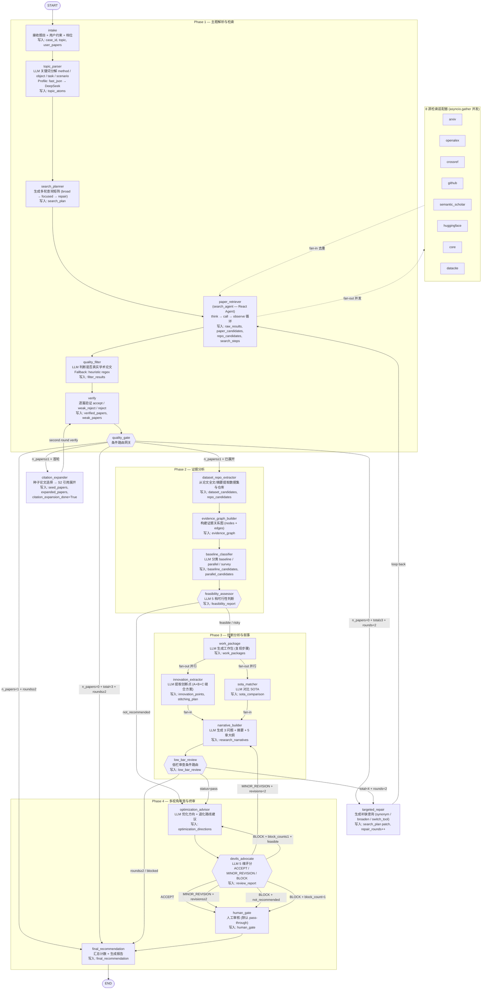
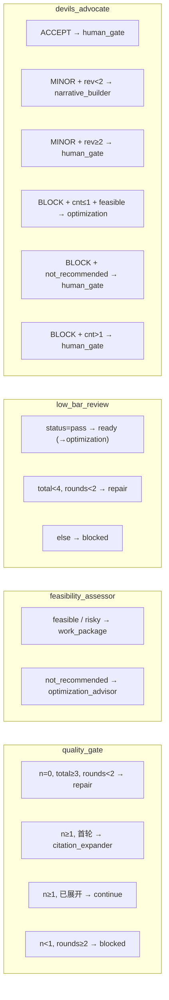
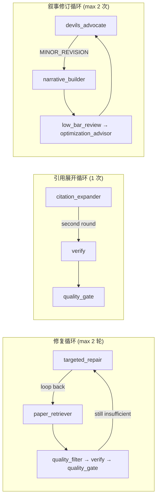
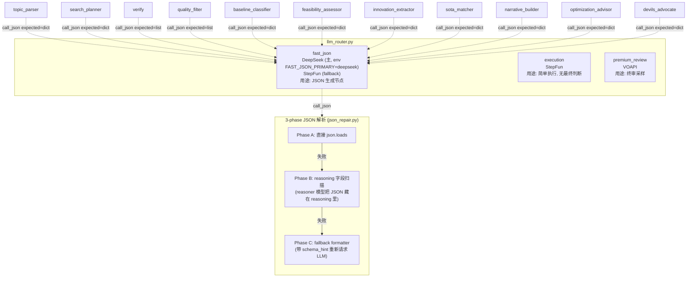
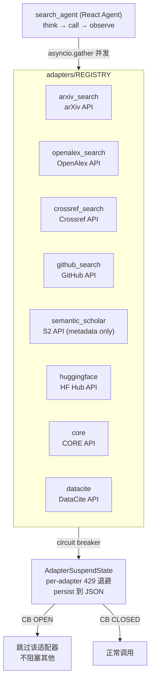

# PaperAgent Agent 范式与 LangGraph 架构图

> 基于 `apps/api/app/services/agents/graph/research_graph.py` 源码绘制，反映 Re3.8 当前状态。

## 1. 全链路 LangGraph 架构



## 2. LangGraph 构建方式

### 2.1 代码骨架 (`research_graph.py`)

```python
from langgraph.graph import END, START, StateGraph
from langgraph.checkpoint.memory import MemorySaver

def build_graph(*, checkpointer=None):
    # 1. 创建状态图，绑定 ResearchState TypedDict
    graph = StateGraph(ResearchState)

    # 2. 批量注册节点 (REGISTRY 字典: name → function)
    for name, fn in REGISTRY.items():
        graph.add_node(name, fn)

    # 3. 线性主干边
    graph.add_edge(START, "intake")
    graph.add_edge("intake", "topic_parser")
    graph.add_edge("topic_parser", "search_planner")
    graph.add_edge("search_planner", "paper_retriever")
    graph.add_edge("paper_retriever", "quality_filter")
    graph.add_edge("quality_filter", "verify")
    graph.add_edge("verify", "quality_gate")

    # 4. 条件路由边 (4 个网关)
    graph.add_conditional_edges("quality_gate",     _route_after_quality_gate,    {...})
    graph.add_conditional_edges("feasibility_assessor", _route_after_feasibility, {...})
    graph.add_conditional_edges("low_bar_review",   _route_after_review,          {...})
    graph.add_conditional_edges("devils_advocate",  _route_after_devils,          {...})

    # 5. 并行扇出/扇入
    graph.add_edge("work_package", "innovation_extractor")  # fan-out
    graph.add_edge("work_package", "sota_matcher")          # fan-out
    graph.add_edge("innovation_extractor", "narrative_builder")  # fan-in
    graph.add_edge("sota_matcher", "narrative_builder")          # fan-in

    # 6. 编译 (checkpointer 支持断点续跑)
    return graph.compile(checkpointer=checkpointer or MemorySaver())
```

### 2.2 ResearchState TypedDict

```python
class ResearchState(TypedDict, total=False):
    # Intake
    case_id: str
    topic: str
    user_constraints: dict[str, Any]
    user_papers: list[dict[str, Any]]

    # Topic parsing
    topic_atoms: dict[str, Any]  # {method, object, task, scenario, domain, ...}

    # Search
    search_plan: dict[str, Any]
    raw_results: dict[str, list[dict[str, Any]]]
    search_steps: list[dict[str, Any]]  # React agent step log

    # Evidence
    paper_candidates: list[dict[str, Any]]
    verified_papers: list[dict[str, Any]]
    weak_papers: list[dict[str, Any]]
    evidence_graph: dict[str, Any]
    evidence_audit: dict[str, Any]

    # Classification
    baseline_candidates: list[dict[str, Any]]
    parallel_candidates: list[dict[str, Any]]
    dataset_papers: list[dict[str, Any]]
    surveys: list[dict[str, Any]]

    # Datasets / repos
    dataset_candidates: list[dict[str, Any]]
    repo_candidates: list[dict[str, Any]]

    # Re1.3 citation expansion
    seed_papers: list[dict[str, Any]]
    expanded_papers: list[dict[str, Any]]
    surveys_found: list[dict[str, Any]]
    citation_expansion_done: bool

    # Re1.4 analysis
    feasibility_report: dict[str, Any]
    innovation_points: list[dict[str, Any]]
    stitching_plan: dict[str, Any]
    sota_comparison: dict[str, Any]
    research_narrative: dict[str, Any]
    optimization_directions: dict[str, Any]
    review_report: dict[str, Any]

    # Loop counters
    narrative_revision_count: int
    devils_advocate_block_count: int

    # Output
    work_packages: list[dict[str, Any]]
    low_bar_review: dict[str, Any]
    human_gate: dict[str, Any]
    final_recommendation: dict[str, Any]

    # Telemetry (Annotated: 自动 merge)
    trace_events: Annotated[list[dict[str, Any]], operator.add]
    errors: Annotated[list[dict[str, Any]], operator.add]
    provider_profile: str
```

节点返回 **partial patch** (dict)，LangGraph 自动 merge。`trace_events` 和 `errors` 使用 `Annotated[..., operator.add]` 自动追加而非覆盖。

## 3. 4 个条件路由网关



## 4. 3 个循环模式



| 循环 | 路径 | 计数器 | 上限 | 环境变量 |
|---|---|---|---|---|
| 修复 | `targeted_repair → paper_retriever → ... → quality_gate` | `evidence_audit.repair_rounds` | 2 | `PAPERAGENT_MAX_REPAIR_ROUNDS` |
| 引用展开 | `citation_expander → verify → quality_gate` | `citation_expansion_done` (bool) | 1 次 | — |
| 叙事修订 | `devils_advocate → narrative_builder → ... → devils_advocate` | `narrative_revision_count` | 2 | `MAX_NARRATIVE_REVISIONS` |
| BLOCK 重试 | `devils_advocate → optimization_advisor → devils_advocate` | `devils_advocate_block_count` | 1 | `MAX_BLOCK_RETRIES` |

## 5. LLM Provider 路由



## 6. Ponytail 节点范式

每个 LangGraph 节点遵循统一模式：

```python
def some_node(state: ResearchState) -> dict[str, Any]:
    """节点 docstring: 读取 X, 写入 Y."""
    t0 = time.time()

    # 1. 幂等检查 — 已有结果则跳过
    if state.get("some_result"):
        return {"trace_events": [_emit(..., skipped=True)]}

    # 2. 尝试 LLM 调用 (1 次, profile=fast_json)
    try:
        built = P.build(topic, ...)
        out = call_json(built["user"], system=built["system"],
                       profile="fast_json", expected="dict", timeout=30)
        result = out if isinstance(out, dict) else _heuristic(state)
        prov = "fast_json"
    except Exception as exc:
        # 3. 确定性 fallback — LLM 不可用时不崩溃
        logger.warning("xxx LLM failed: %s — heuristic fallback", exc)
        result = _heuristic(state)
        prov = "heuristic"

    # 4. 返回 partial state patch (不原地修改)
    return {
        "some_result": result,
        "trace_events": [_emit("xxx", t0, input_summary, output_summary,
                                tool_calls, prov, state_keys)],
    }
```

核心原则：
- **1 次 LLM 调用** — 每个节点最多 1 次
- **确定性 fallback** — LLM 失败降级到规则逻辑
- **partial patch 返回** — 不原地修改 state
- **trace_event 记录** — 耗时 / 工具 / provider / state_keys

## 7. 节点注册表 (22 个节点)

| 节点名 | 模块 | 读取 | 写入 | 别名 |
|---|---|---|---|---|
| `intake` | `intake.py` | topic, user_papers | case_id | — |
| `topic_parser` | `topic_parser.py` | topic | topic_atoms | — |
| `search_planner` | `search_planner.py` | topic_atoms | search_plan | — |
| `paper_retriever` | `search_agent.py` | search_plan, topic_atoms | raw_results, paper_candidates, repo_candidates, search_steps | `search_agent` |
| `quality_filter` | `quality_filter.py` | paper_candidates | filter_results | — |
| `verify` | `verify.py` | paper_candidates, topic_atoms | verified_papers, weak_papers | `paper_verifier` |
| `quality_gate` | `quality_gate.py` | verified_papers, evidence_audit | evidence_audit | — |
| `targeted_repair` | `targeted_repair.py` | evidence_audit, topic_atoms | search_plan (patch) | — |
| `citation_expander` | `citation_expander.py` | verified_papers | seed_papers, expanded_papers, citation_expansion_done | — |
| `dataset_repo_extractor` | `dataset_repo_extractor.py` | verified_papers | dataset_candidates, repo_candidates | `dataset_repo` |
| `evidence_graph_builder` | `json_graph_builder.py` | verified_papers, baseline_candidates | evidence_graph | — |
| `baseline_classifier` | `baseline_classifier.py` | verified_papers, topic_atoms | baseline_candidates, parallel_candidates | `evidence_auditor` |
| `feasibility_assessor` | `feasibility_assessor.py` | baseline_candidates, dataset_candidates | feasibility_report | — |
| `work_package` | `content.py` | baselines, datasets, repos | work_packages | `work_package_brainstorm` |
| `innovation_extractor` | `innovation_extractor.py` | baselines, parallels | innovation_points, stitching_plan | — |
| `sota_matcher` | `sota_matcher.py` | baselines, parallels | sota_comparison | — |
| `narrative_builder` | `narrative_builder.py` | innovations, feasibility | research_narratives | — |
| `low_bar_review` | `content.py` | work_packages, evidence_audit | low_bar_review | — |
| `optimization_advisor` | `optimization_advisor.py` | parallels, feasibility | optimization_directions | — |
| `devils_advocate` | `devils_advocate_node.py` | narrative, feasibility, innovations | review_report | — |
| `human_gate` | `content.py` | review_report, final_recommendation | human_gate | — |
| `final_recommendation` | `content.py` | all state | final_recommendation | — |

## 8. 检索适配器层



规则：
- 8 源共享 `search_planner` 生成的同一查询列表
- 一个适配器 429/timeout 不阻塞 pipeline (circuit breaker + `failed_tools` 跳过)
- GitHub 结果 → `repo_candidates`，不进入 `verified_papers`
- 跨源去重: normalized title + DOI priority
