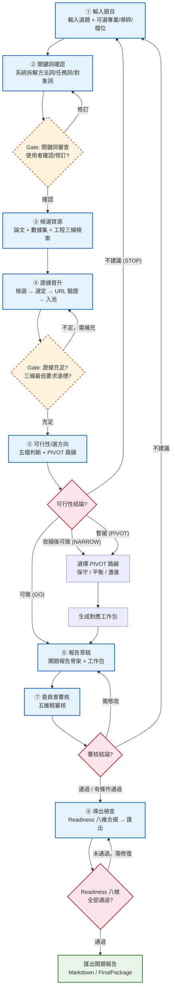

# TopicPilot-CN 架構圖解

> 文件定位：本文件提供 Two-Tier 架構視圖，分別從 **用戶視角** 與 **技術視角** 描述 TopicPilot-CN OneTopic MVP 的全域流程與元件關係。
>
> 對齊：`Plan/TopicPilot-CN_OneTopic_MVP_修改SOP.md`、`apps/api/app/api/v1/one_topic.py`、`apps/web/run_state.js`、`apps/web/step_deck.js`

---

## 圖一：用戶流程圖（User Flow Diagram）

### 說明

下方流程圖展示使用者從「輸入一個題目」到「導出開題報告」的 8 個階段。每個階段的 Gate 代表人機互動節點——系統等待使用者確認或選擇後才繼續推進。PIVOT 決策發生在可行性判斷之後，Readiness 檢查則在最終匯出之前。



### 關鍵決策點說明

| 節點 | 類型 | 說明 |
|------|------|------|
| G1 關鍵詞審查 | 人機 Gate | 使用者確認關鍵詞拆分是否準確，可編輯後再繼續 |
| G2 證據充足 | 系統 + 人機 Gate | 系統檢查論文明確數、數據集、Baseline 是否達最低要求 |
| D1 可行性 | 自動決策 | 五檔判斷；非 GO 時自動生成 PIVOT 路線供使用者選擇 |
| D2 覆核 | 人機節點 | 委員會輕審核，四種結論對應不同後續路徑 |
| D3 Readiness | 自動檢查 | 八維合規檢查全部通過後才允許匯出 |

---

## 圖二：技術架構圖（Technical Architecture Diagram）

### 說明

下方架構圖展示完整的系統分層，從前端展示層到底層 LLM / 外部 API。箭頭方向代表資料流：使用者操作經 API 進入服務層，服務層讀寫資料儲存並調用 LLM 或外部檢索，最終將結果推回前端。

證據流（Evidence Flow）以粗體箭頭標示，展示一條候選資源從檢索到最終報告的完整生命週期。

```mermaid
graph TB
    %% ========================================
    %% 1. 前端展示層（Frontend）
    %% ========================================
    subgraph FE ["前端展示層 (Vanilla JS)"]
        SD["Step Deck UI<br/>步驟欄 + 主卡 + Action Bar"]
        WB["Workspace Board<br/>候選資源 | 選定資源 | 證據"]
        EP["Evidence Promotion<br/>晉升閘門邏輯"]
        CR["ComponentRegistry<br/>6 類核心卡統一渲染"]
        TP["Trace Panel<br/>即時事件流 (SSE / Mock)"]
        FC["Feasibility Card<br/>可行性風險裁決模組"]
        PD["Proposal Draft<br/>開題報告草稿"]
        RV["Committee Review<br/>委員會覆核"]
    end

    %% ========================================
    %% 2. API 層（FastAPI）
    %% ========================================
    subgraph API ["Backend API (FastAPI)"]
        R1["POST /analyze<br/>一題分析"]
        R2["POST /analyze/stream<br/>SSE 流式分析"]
        R3["GET /evidence<br/>證據池"]
        R4["GET /workspace/board<br/>雙欄工作台"]
        R5["PATCH /workspace/item<br/>移動/標核心/拒絕"]
        R6["POST /final-package/build<br/>最終套件構建"]
        R7["POST /{id}/readiness<br/>匯出前合規檢查"]
        R8["POST /proposal-draft<br/>開題報告草稿"]
        R9["POST /review<br/>委員會覆核"]
        R10["POST /retrieval/search<br/>多源檢索"]
        R11["POST /retrieval/import<br/>導入證據池"]
        R12["POST /materials/upload<br/>資料上傳"]
        R13["POST /{id}/pivot/select<br/>PIVOT 路線選擇"]
    end

    %% ========================================
    %% 3. 核心服務層（Core Services）
    %% ========================================
    subgraph SVC ["核心服務層 (Python / FastAPI Services)"]
        direction TB
        OT["OneTopic Orchestrator<br/>run_one_topic() / stream()"]

        subgraph KG ["關鍵詞與檢索"]
            KD["KeywordDecompose<br/>LLM 拆解 + Heuristic Fallback"]
            SA["Search Assistant<br/>同領域檢索助手"]
            RP["Retrieval Orchestrator<br/>7 檢索層排程"]
        end

        subgraph EP_SVC ["證據管線"]
            EL["EvidenceLedger<br/>記憶體證據池 (per project)"]
            VS["Verification Service<br/>單條/批量 URL 驗證"]
            SC["Scoring Service<br/>論文/數據集/Repo 評分"]
            WS["Workspace Service<br/>雙欄狀態管理"]
            ERS["EvidenceRefs Service<br/>引用掛接 + 覆蓋率計算"]
        end

        subgraph FS ["可行性與決策"]
            FE["Feasibility Engine<br/>五檔判斷 + Hard Veto"]
            PE["Pivot Engine<br/>退化路線生成"]
            PG["Proposal Generator<br/>開題建議 + 工作包"]
        end

        subgraph RS ["審核與匯出"]
            CR_SVC["Committee Review<br/>五維輕審核"]
            RDC["Readiness Checker<br/>八維合規檢查"]
            FP["Final Package Builder<br/>Markdown + 章節 + 引用"]
            QS["Quality Service<br/>八維報告質量審核"]
        end

        subgraph TR ["追蹤與持久化"]
            TS["Trace Store<br/>jsonl + 記憶體"]
            RES["RunEvent Store<br/>事件持久化與回放"]
        end

        %% 服務內部連線
        KG --> EP_SVC
        EP_SVC --> FS
        FS --> RS
        TR -.-> KG & EP_SVC & FS & RS
    end

    %% ========================================
    %% 4. 資料儲存層（Data Store）
    %% ========================================
    subgraph DS ["資料儲存層"]
        ES["EvidenceStore<br/>dict + threading.Lock"]
        TC["Trace Files<br/>.runtime/traces/{id}.jsonl"]
        SCache["Snapshot Cache<br/>.runtime/snapshots/"]
        REvents["RunEvent Store<br/>記憶體"]
        PCache["FinalPackage Cache<br/>最近構建"]
    end

    %% ========================================
    %% 5. LLM 層（Language Model Layer）
    %% ========================================
    subgraph LLM ["LLM 層"]
        MM["Minimax API<br/>chat_json() / chat_json_array()"]
        HF["Heuristic Fallback<br/>LLM 失敗時純規則兜底"]
    end

    %% ========================================
    %% 6. 外部整合（External Integration）
    %% ========================================
    subgraph EXT ["外部整合"]
        ARX["ArXiv API<br/>論文檢索 + 中文摘要"]
        GH["GitHub API<br/>工程 / Baseline 檢索"]
        WEB["Web Fetch<br/>資料集 / 競賽檢索"]
    end

    %% ========================================
    %% 7. 測試層（Testing）
    %% ========================================
    subgraph TEST ["測試層"]
        PW["Playwright E2E<br/>happy / no-dataset / review / trace"]
        PT["pytest<br/>單元測試 + 整合測試"]
        DS2["Demo Smoke<br/>scripts/demo_smoke.py"]
        FS2["Full Smoke<br/>scripts/full_smoke.py"]
    end

    %% ========================================
    %% 證據流（Evidence Flow）
    %% ========================================
    subgraph EF ["證據流 (Evidence Flow)"]
        direction LR
        CRsrc["CandidateResource<br/>檢索候選"]
        --> SR["SelectedResource<br/>使用者選定"]
        --> UV["URLVerified<br/>驗證通過"]
        --> EV["Evidence<br/>正式入池"]
        --> REF["EvidenceRefs<br/>引用掛接"]
        --> REP["Reports<br/>可行性/開題/審核"]
    end

    %% ========================================
    %% 資料流連線（Data Flow）
    %% ========================================

    %% 前端 → API
    FE -->|HTTP / SSE| API

    %% API → 服務層
    API -->|請求路由| OT
    API -->|證據操作| EL
    API -->|工作台操作| WS
    API -->|檢索請求| RP
    API -->|資料上傳| MS
    API -->|套件構建| FP

    %% 服務 → 資料儲存
    EL --> ES
    TS --> TC
    OT --> SCache
    RES --> REvents
    FP --> PCache

    %% 服務 → LLM
    KD -->|關鍵詞拆解| MM
    KD -->|LLM 失敗| HF
    FE -->|可行性判斷| MM
    PG -->|開題建議| MM
    CR_SVC -->|審核| MM
    SA -->|檢索助手| MM

    %% 服務 → 外部
    RP -->|論文檢索| ARX
    RP -->|工程檢索| GH
    RP -->|數據集檢索| WEB
    VS -->|URL 驗證| WEB

    %% 服務 → 前端 (回寫)
    OT -->|SSE 事件流| TP
    OT -->|步驟產物| SD
    EL -->|證據池| WB
    WS -->|工作台狀態| WB
    FE -->|可行性結果| FC
    PG -->|開題建議| PD
    CR_SVC -->|覆核結果| RV

    %% 證據流實際路由
    CRsrc -.->|由 RP 產生| RP
    SR -.->|由 WB 使用者操作| WS
    UV -.->|由 VS 驗證| VS
    EV -.->|入 EvidenceLedger| EL
    REF -.->|ERS 構建引用| ERS
    REP -.->|餵入 FS 與 RS| FS & RS

    %% 測試層
    PW -.->|E2E 測試| FE
    PT -.->|單元測試| SVC
    DS2 -.->|Smoke 測試| API

    %% ========================================
    %% 樣式
    %% ========================================
    classDef frontend fill:#e8eaf6,stroke:#3949ab,stroke-width:2px
    classDef api fill:#fff3e0,stroke:#e65100,stroke-width:2px
    classDef service fill:#e3f2fd,stroke:#1565c0,stroke-width:2px
    classDef substore fill:#f3e5f5,stroke:#7b1fa2,stroke-width:2px
    classDef llm fill:#fce4ec,stroke:#c62828,stroke-width:2px
    classDef external fill:#e0f2f1,stroke:#00695c,stroke-width:2px
    classDef test fill:#fff8e1,stroke:#f57f17,stroke-width:2px
    classDef ef fill:#fffde7,stroke:#f9a825,stroke-width:3px,stroke-dasharray: 5 3

    class FE,SD,WB,EP,CR,TP,FC,PD,RV frontend
    class API,R1,R2,R3,R4,R5,R6,R7,R8,R9,R10,R11,R12,R13 api
    class SVC,OT,KG,KD,SA,RP,EP_SVC,EL,VS,SC,WS,ERS,FS,FE,PE,PG,RS,CR_SVC,RDC,FP,QS,TR,TS,RES service
    class DS,ES,TC,SCache,REvents,PCache substore
    class LLM,MM,HF llm
    class EXT,ARX,GH,WEB external
    class TEST,PW,PT,DS2,FS2 test
    class EF,CRsrc,SR,UV,EV,REF,REP ef
```



### 架構分層說明

| 層級 | 職責 | 關鍵元件 |
|------|------|----------|
| **前端展示層** | 使用者互動介面，步驟驅動 | Step Deck UI、Workspace Board、Component Registry、Trace Panel |
| **API 層** | 對外 HTTP 端點，請求路由 | 13+ 個 REST 端點（analyze / evidence / workspace / retrieval / materials / final-package 等） |
| **核心服務層** | 業務邏輯實作，分為四大子域 | 關鍵詞檢索、證據管線、可行性決策、審核匯出 |
| **資料儲存層** | 記憶體 + 檔案雙重持久化 | EvidenceStore (dict+lock)、Trace Files (jsonl)、Snapshot Cache |
| **LLM 層** | 語言模型調用 + 降級策略 | Minimax API（主路徑）、Heuristic Fallback（LLM 失效時） |
| **外部整合** | 真實資料檢索驗證 | ArXiv API、GitHub API、Web Fetch |
| **測試層** | 多層級品質保障 | Playwright E2E、pytest、Demo Smoke、Full Smoke |

### 證據流生命週期

證據流是系統最核心的資料路徑，一條候選資源經歷以下階段：

1. **CandidateResource** — 由 Retrieval Orchestrator 從 ArXiv / GitHub / Web 檢索而得
2. **SelectedResource** — 使用者在 Workspace Board 中從左欄（候選）移至右欄（選定）
3. **URLVerified** — Verification Service 對 URL 進行真實可達性驗證
4. **Evidence** — 驗證通過後正式入 EvidenceLedger（記憶體證據池），獲得 review_status 與 score
5. **EvidenceRefs** — EvidenceRefs Service 將證據掛接到 FeasibilitySummary / PivotRoute / WorkPackage / LightReview
6. **Reports** — 最終進入可行性報告、開題建議、審核意見

### 服務依賴關係

```
Frontend → API Gateway → OneTopic Orchestrator
                            ├── KeywordDecompose (LLM + Fallback)
                            ├── Search Assistant
                            ├── Retrieval Orchestrator → ArXiv / GitHub / Web
                            ├── EvidenceLedger (in-memory store)
                            │   ├── Verification Service
                            │   ├── Scoring Service
                            │   └── Workspace Service
                            ├── Feasibility Engine (5-tier + Pivot)
                            ├── Proposal Generator
                            ├── Light Review / Committee Review
                            ├── Readiness Checker
                            └── Final Package Builder
```

---

> 文件版本：v1.0 · 對應 Session 21-32 實作狀態
