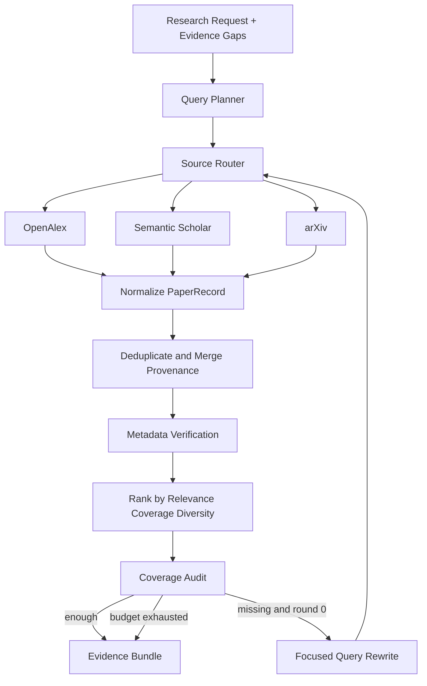

# PaperAgent v0.2 文献检索与 Web-First 上线方案

> Status: `PROPOSED — AFTER v0.1 ONLY`  
> Scope: v0.2 文献检索核心，以及对 v0.3—v0.5 上线形态的约束  
> Constraint: 不修改正在开发的 v0.1 Graph、Node、State 和测试合同。

## 1. 结论

v0.2 不应继续闭门设计一个“万能科研搜索 Agent”。应把文献检索收敛成一个可验证、可缓存、可在网页端和小程序端运行的检索服务：

```text
研究问题
→ 查询意图与 Evidence Gap
→ 有预算的多源检索
→ 统一元数据
→ 去重与元数据合并
→ 存在性验证
→ 相关性 / 覆盖 / 多样性排序
→ 最多一次缺口补搜
→ Evidence Bundle
```

核心 LLM 调用最多 2 次：

1. 第一次生成结构化 Query Plan；
2. 只有 Coverage Gate 判定不足时，才生成一次定向补搜 Query。

每篇论文不单独调用 LLM。论文存在性、DOI、arXiv ID、URL 和来源状态由确定性工具验证。

## 2. 参考项目审查

### 2.1 PrismLens：借鉴产品运行方式，不照搬检索语义

PrismLens 当前采用：

- FastAPI；
- 后台 Worker；
- Redis / ARQ；
- PostgreSQL；
- Next.js；
- 任务提交、状态查询、SSE 和认证；
- LangGraph Checkpoint。

这些适合长任务网页产品，因为用户请求不需要一直占用一个 HTTP 连接，前端可以持续显示运行状态。

PrismLens 当前检索图为：

```text
plan
→ search
→ reflect
→ search ...
→ generate_report
```

它适合媒体事件多视角分析，但不适合直接作为学术文献检索：

- 查询固定为支持、反对、中立、国际四类，属于媒体域硬编码；
- 只使用 Tavily 网页摘要，不是学术元数据源；
- Search 结果持续追加，但缺少 DOI/arXiv/title 去重；
- 没有文献存在性、作者、年份、期刊、撤稿和引用状态验证；
- Reflect 依赖 LLM 判断覆盖，缺少可计算 Evidence Gap；
- 循环是否继续主要依赖重试次数，不应成为 PaperAgent 的质量标准。

PaperAgent 应借鉴：

- API / Worker / Progress Event 分层；
- SSE 实时进度；
- 后台任务和 Checkpoint；
- Web 前端只展示状态和结果，不承载 Agent 逻辑。

PaperAgent 不应借鉴：

- 固定四立场查询；
- Tavily 作为主要论文源；
- 把 LLM Reflection 当作唯一 Coverage Gate；
- 未去重的结果累积。

### 2.2 AutoResearchClaw：借鉴多源、去重、缓存和引用验证

AutoResearchClaw 的文献模块具有以下有效设计：

- OpenAlex、Semantic Scholar、arXiv 多源检索；
- 默认以 OpenAlex 为主要来源，降低对受限 API 的压力；
- DOI → arXiv ID → 标题的跨源去重顺序；
- 查询缓存和按来源区分 TTL；
- arXiv ID、Crossref/DataCite DOI、标题搜索的分层引用验证；
- verified / suspicious / hallucinated / skipped 状态；
- 多查询结果合并。

需要修正后再借鉴：

1. **来源调用不能串行 sleep。** Web 产品应在每来源独立限流器下并发执行，并设置总 deadline。
2. **空结果和 Provider 故障必须区分。** 网络失败不能被当作真实的“0 篇论文”，更不能把失败产生的空数组写入正常缓存。
3. **去重不能只保留引用量更高的一条。** 应合并各来源字段和 provenance，例如 OpenAlex 的概念、S2 的摘要、arXiv 的预印本 ID。
4. **标题匹配必须是真正的近似匹配。** 标准化后完全相同只能叫 exact-normalized match；近似匹配需独立阈值和 suspicious 状态。
5. **不能只按引用量排序。** 引用量会系统性偏向旧论文和热门方向；它只能作为弱特征或 tie-breaker。
6. **检索必须围绕 Evidence Gap。** 找到很多论文不等于覆盖研究问题。

### 2.3 PaperQA2：借鉴 Evidence Gathering，不在 v0.2 搬全量 RAG

可借鉴：

- 多来源冗余元数据补全；
- 元数据感知；
- 文献检索、Evidence Gathering、Answer 分阶段；
- 查询迭代；
- 对候选片段进行相关性排序；
- Citation / journal / retraction 等元数据检查思路。

v0.2 暂不搬入：

- 全量 PDF 下载与解析；
- 向量数据库；
- 每篇论文 chunk/embed；
- 多轮 Agentic RAG；
- 多模态 PDF；
- LLM 对大量 chunk 逐条重排。

原因：这些会显著增加请求时间、内存、存储、成本和部署复杂度，不适合先做网页 / 小程序 MVP。

### 2.4 STORM / Co-STORM：借鉴多角度提问和缺口追问

可借鉴：

- 先识别问题的不同研究视角，再生成查询；
- 发现新信息后提出 follow-up question；
- 将检索器设计成可替换接口；
- 人可以在高价值节点修改方向。

不应直接搬入：

- 模拟多个专家的长对话；
- 多套模型分别承担 question asker、conversation、outline 等角色；
- 为生成长文章而设计的复杂流程。

PaperAgent 将“Perspective”改写为结构化 `QueryLane`，例如：

```text
baseline
method
benchmark_dataset
evaluation_metric
limitation_failure
recent_progress
contradictory_evidence
```

不是每个问题都执行全部 Lane。Planner 根据 Evidence Gap 选择 2—4 条。

### 2.5 ResearchPilot：借鉴轻量全栈体验，删除过早基础设施

可借鉴：

- FastAPI + SSE；
- Next.js 运行状态界面；
- Semantic Scholar + arXiv 的部分失败容忍；
- abstract → claims / methods / datasets / results / limitations 的结构化抽取；
- 报告历史。

v0.2 不采用：

- 四个串行 Agent；
- 默认 Qdrant；
- 每次检索都做向量化；
- Top 10 abstract 直接代表完整领域；
- 自动生成 Related Work 作为核心交付。

## 3. 产品定位与减法

### 3.1 v0.2 的用户交付

网页端和小程序端只需要完成：

1. 输入研究问题；
2. 可选年份、语言、领域和论文类型；
3. 查看检索进度；
4. 获得已去重的论文卡片；
5. 查看为什么推荐、覆盖哪个 Evidence Gap；
6. 查看 verified / pending / suspicious / failed；
7. 接受、拒绝或收藏论文；
8. 导出 Evidence Bundle。

### 3.2 v0.2 明确不做

- 自动写完整论文；
- 自动运行实验；
- Multi-Agent 辩论；
- 自动下载并解析全部 PDF；
- Qdrant / Elasticsearch；
- Citation Graph 无限扩展；
- Google Scholar 爬虫；
- 每篇论文单独 LLM Judge；
- 长期个人记忆；
- 社交协作；
- 复杂付费系统。

## 4. 与 v0.1 Graph 的兼容方式

v0.2 不增加顶层节点，只增强 v0.1 Retrieval Subgraph 内部服务。

```text
prepare_search_node
  └─ QueryPlanner + SourceRouter

search_tool_node
  └─ Provider Fan-out + Normalize + Deduplicate/Merge

verify_evidence_node
  └─ Metadata Verify + Rank + Coverage Audit

retrieval_gate
  └─ enough | retry_under_budget | budget_exhausted
```

这样保留 v0.1 已经建立的 LangGraph 骨架，不重新膨胀成十几个文献节点。

## 5. v0.2 检索流程



## 6. 来源策略

### 6.1 Discovery Sources

#### OpenAlex

默认主源，承担广覆盖搜索和基础元数据。

#### Semantic Scholar

承担补充摘要、引用信息和计算机科学 / 生物医学相关覆盖。无 API Key 或限流时允许部分失败。

#### arXiv

用于预印本、近期方法和已知 arXiv ID 精确查找，不作为所有领域的唯一来源。

### 6.2 Verification / Enrichment Sources

#### Crossref

验证 DOI 和补充出版社元数据。

#### DataCite

验证 Crossref 不覆盖的 DOI，尤其预印本和数据集相关 DOI。

#### Unpaywall（可选，v0.2 后半）

只用于补充开放获取地址，不用于判断论文质量。

### 6.3 非论文来源隔离

GitHub、普通网页、博客和数据集仓库不得与论文混在一个排序池中。它们使用统一 Evidence 外壳，但有独立 `source_type`、验证规则和排名。

## 7. 数据合同

### 7.1 QueryPlan

```text
question
scope
query_lanes[]
required_gap_ids[]
year_min / year_max
languages[]
publication_types[]
max_rounds
```

### 7.2 QueryLane

```text
lane_id
purpose
query
source_preferences[]
gap_ids[]
priority
```

### 7.3 ProviderResult

```text
provider
request_id
status = success | empty | rate_limited | timeout | failed
papers[]
started_at
finished_at
retry_count
cache_status
```

`empty` 与 `failed` 必须严格区分。

### 7.4 PaperRecord

```text
paper_id
canonical_title
authors[]
year
abstract
venue
doi
arxiv_id
openalex_id
semantic_scholar_id
urls[]
source_records[]
verification_status
verification_methods[]
matched_gap_ids[]
rank_features
```

### 7.5 CoverageReport

```text
gap_coverage
uncovered_gap_ids[]
source_diversity
publication_year_distribution
verification_distribution
retry_recommendation
```

## 8. 去重与元数据合并

优先级：

```text
Canonical DOI exact
→ arXiv ID exact
→ Provider canonical ID mapping
→ normalized title + year + first author
→ approximate title match marked suspicious
```

重复记录不是简单删除，而是合并：

- 保留全部 provider provenance；
- 选择信息最完整的 abstract；
- 合并 DOI、arXiv、OpenAlex、S2 ID；
- URL 去重；
- 作者冲突和年份冲突进入 warning；
- 不能用引用数高低覆盖稳定标识符。

## 9. 排序策略

推荐分数只使用可解释特征：

```text
0.40 semantic / lexical relevance
0.25 Evidence Gap coverage
0.15 metadata completeness and verification
0.10 recency fit
0.10 source / method diversity
```

Citation Count：

- 只做对数缩放弱特征或同分 tie-breaker；
- 不直接决定主排序；
- 新论文没有引用不应自动降到末尾。

v0.2 不使用每篇论文 LLM 评分。相关性优先使用标题、摘要和查询的可测试打分；LLM 只负责生成 QueryPlan 和可选补搜 Query。

## 10. Coverage Gate

Coverage Gate 首先执行确定性检查：

- 每个 required gap 是否至少有一篇 verified/pending 候选；
- 是否全部来自同一个 provider；
- 是否只有同一团队或同一论文版本；
- 年份范围是否符合约束；
- 论文类型是否符合约束；
- 是否达到候选和验证预算。

仅在需要重新表达查询时调用一次 LLM。LLM 不能自行删除 required gap。

## 11. 缓存与限流

### 11.1 缓存

缓存键必须包含：

```text
normalized_query
provider
filters
limit
provider_contract_version
```

规则：

- 成功结果：按来源 TTL 缓存；
- 真实空结果：短 TTL；
- timeout / failed：不得写入正常结果缓存；
- verification：长 TTL，但记录 verification_version；
- 同一时间相同请求执行 request coalescing，避免重复打 API。

### 11.2 并发

- 来源之间并发；
- 单一来源内部受 semaphore / token bucket 约束；
- 整轮检索有总 deadline；
- 某一来源失败不阻塞其他来源；
- 达到 deadline 后返回 partial result，并保留失败状态。

## 12. Web / 小程序上线约束

### 12.1 v0.2 核心层

v0.2 先做纯 Python 服务合同和真实 Provider，不建设完整前端。

### 12.2 v0.3 Durable Task API

默认最小部署：

```text
FastAPI
+ SQLite / LangGraph Checkpointer
+ 单进程后台 Task Runner
+ SSE（网页）
+ Polling fallback（小程序）
```

只有出现多实例、任务丢失或并发需求后，再升级为：

```text
Redis + ARQ/RQ/Celery
PostgreSQL
独立 Worker
```

不要一开始照搬 PrismLens 的完整 Redis + PostgreSQL + Worker 组合。

### 12.3 v0.5 Web / Mini Program Shell

网页端优先 PWA：

- 研究问题输入；
- 任务状态；
- 论文卡片；
- Evidence Gap 标签；
- verified/pending/suspicious 状态；
- 接受 / 拒绝 / 收藏；
- 导出 Markdown/JSON/BibTeX。

小程序端不复制完整 Agent UI，只提供：

- 创建任务；
- 轮询任务；
- 查看论文卡片；
- 人工接受 / 拒绝；
- 查看最终摘要；
- 分享任务链接。

PDF 阅读、复杂 Trace、调试和配置留在网页端。

## 13. 请求与负载预算

建议初始预算：

```text
Query lanes: 2—4
Retrieval rounds: <= 2
Discovery providers per lane: <= 2
Results per provider request: <= 10
Merged candidates before verification: <= 30
Final paper cards: <= 12
LLM calls inside retrieval: <= 2
```

网页 / 小程序响应：

- 首次 HTTP 请求只返回 `task_id`；
- 进度事件不得包含完整 Prompt；
- 论文列表使用分页；
- 首屏只返回元数据和短摘要；
- 全文和长摘要按需加载；
- 单次状态响应建议控制在 200 KB 内。

## 14. TDD 测试矩阵

### Provider Contract

- success；
- verified empty；
- timeout；
- rate limited；
- malformed response；
- partial fields；
- duplicate records；
- provider returns same paper under different IDs。

### Cache

- success cache hit；
- provider failure does not poison cache；
- negative cache expires quickly；
- schema version changes invalidate cache；
- concurrent identical request is coalesced。

### Dedup / Merge

- same DOI；
- same arXiv ID；
- same title/year/author；
- title collision but different paper；
- preprint and published version merge；
- conflicting year / author metadata creates warning。

### Ranking

- high citation but irrelevant paper cannot outrank relevant paper；
- recent uncited paper can enter final set；
- all results from one source trigger diversity warning；
- uncovered gap triggers focused retry；
- required gap cannot be silently deleted。

### Graph

- one source failure still completes partial result；
- all sources fail → BLOCKED；
- first round enough → no LLM retry；
- second round still insufficient → budget_exhausted；
- total LLM and provider calls stay inside budget。

### API / UI Contract（v0.3+）

- POST returns task_id quickly；
- duplicate idempotency key does not create duplicate task；
- SSE and polling expose the same state；
- cancel prevents new provider calls；
- task resume does not repeat completed search requests；
- mobile payload pagination is stable。

## 15. v0.2 验收标准

### P0

- OpenAlex、Semantic Scholar、arXiv 至少两个真实来源可运行；
- Crossref/DataCite 至少一种验证路径可运行；
- empty / timeout / rate_limited / failed 被区分；
- DOI/arXiv/title-year-author 去重测试通过；
- 去重后保留多源 provenance；
- 检索循环最多两轮；
- Retrieval 内 LLM 调用最多两次；
- Provider 失败不生成虚假 PaperRecord；
- rejected/failed verification 不支持最终 claim；
- Fake Provider 离线测试全绿；
- 真实 Smoke Test 与离线测试分开报告。

### P1

- 相同请求缓存命中；
- 不缓存故障产生的空结果；
- 部分来源失败仍能产出可解释结果；
- Ranking 能解释每篇论文覆盖的 gap；
- Citation Count 不作为唯一或主要排序；
- 30 个候选以内完成元数据合并和验证。

## 16. 推荐提交顺序

```text
docs(v0.2): freeze literature retrieval requirements and fixtures
test(v0.2): add provider result and paper record contracts
feat(v0.2): add OpenAlex provider
test(v0.2): add partial failure and cache poisoning cases
feat(v0.2): add Semantic Scholar and arXiv providers
feat(v0.2): add normalized paper merge and provenance
feat(v0.2): add Crossref/DataCite verification
feat(v0.2): add explainable ranking and coverage audit
feat(v0.2): add one-round focused query retry
test(v0.2): add real-provider smoke suite
docs(v0.2): publish retrieval evaluation and known limitations
```

## 17. 最终原则

PaperAgent 的文献检索成功标准不是“搜到很多”，而是：

```text
查得到
+ 确认存在
+ 去重正确
+ 覆盖问题
+ 状态可解释
+ 失败不造假
+ 可以在有限时间和成本内返回给网页 / 小程序用户
```
