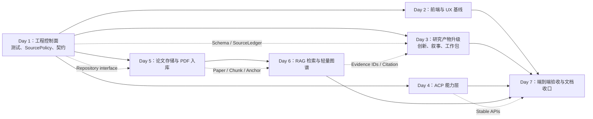

# PaperAgent Re4：7 天全功能 MVP 开发 Map

> **制定日期**：2026-07-10  
> **目标**：在不做公网部署（TODO-11）的前提下，将项目 TODO 中的其余方向都纳入
> 7 天开发周期；每条方向交付一个能演示、能测试、可继续扩展的最小闭环（MVP）。  
> **核心取舍**：RAG 放在后半程。前四天先修复工程控制面、前端、研究产物和
> ACP；第 5–6 天再做 PDF → RAG → 图谱的垂直链路。

---

## 1. 本周期的完成定义

本计划不是在 7 天内把所有方向做成生产级产品，而是要求每个方向都达到下列
最低标准：

1. 有明确的数据/接口契约，而非仅写 prompt 或页面占位；
2. 至少能跑通一条真实或固定离线数据的端到端路径；
3. 有自动化测试或可复跑的验收脚本；
4. 失败会显式返回原因和下一步，不以 heuristic 输出伪装成功；
5. 新能力不继续堆入 `research_agent.py` 或 `search_reflection_loop.py`。

### 本周期包含与不包含

| 方向 | 本周期目标 | MVP 边界 |
|---|---|---|
| TODO-1 RAG | 可引用全文问答 | 用户上传/OA PDF；不做 OCR 与云端知识库 |
| TODO-2 前端 | 可启动、可回归的新 UI | React 源码存在则收口；不存在则先恢复/新建最小 Vite shell |
| TODO-3 UX | 新手可理解的主流程 | 首页、工作台、错误/空状态、移动端基本可浏览 |
| TODO-4 创新点 | 有证据绑定的创新点 | 强制 `candidate_ids` / snippets，不追求自动原创性判定 |
| TODO-5 叙事 | 可编辑、可比较的叙事 | 一轮修订和 diff；不做协作式富文本编辑器 |
| TODO-6 工作包 | 可执行的结构化任务包 | 依赖图与简易里程碑，不做完整项目管理系统 |
| TODO-7 限流 | 全链路 SourcePolicy | S2/OpenAlex 开关、退避、ledger；不做分布式队列 |
| TODO-8 存储 | 本地可迁移数据层 | SQLite + 文件系统 + LanceDB repository；不引入云数据库 |
| TODO-9 PDF/图谱 | PDF、向量检索、轻量图谱 | 10–50 篇/文档节点的 D3 视图；Draftpaper_loop 为 adapter MVP |
| TODO-10 ACP | 稳定的工具能力层 | REST capability registry + MCP/JSON-RPC 二选一的最小适配；不承诺所有外部 IDE 都深度集成 |
| TODO-11 上线 | **不做** | 不做公网、账号、支付、Docker 上云与备案 |

---

## 2. 先决事实与 Day 1 硬门

当前工作区与旧文档有偏差，不能直接按旧路线推进：

- `apps/web-react/` 当前不存在；但 TODO/迁移矩阵把它描述为已完成的大部分新前端。
- `pytest` 收集被仍引用已归档模块的活跃测试阻断。
- S2/OpenAlex 的禁用策略未覆盖 `citation_expander`。
- `case_id` 未作路径安全校验；运行状态和用户上传仍主要放在内存与直接 JSON 写盘。

**Day 1 结束前必须通过以下 Gate A，否则暂停新增功能，只修基线：**

- [ ] 明确 React 源码的位置：恢复、迁移进仓库，或确认以现有 `apps/web/` 为本周期 UI 基线。
- [ ] 建立 `tests/active/` 或等价测试清单；过期测试同步归档，`pytest --collect-only` 无导入错误。
- [ ] `case_id` 改为服务端 UUID 或受限 slug，并做 `resolve()` 路径边界校验。
- [ ] 统一 `SourcePolicy`；关闭某源后包括 citation expansion 在内均不发 HTTP 请求。
- [ ] 写入一份实际可运行的 Local Runbook，替换失效启动命令与版本号。

---

## 3. 依赖 Map

关键原则：**只建设一条 PDF/chunk/embedding 管道**。TODO-1、TODO-8、TODO-9
共享同一 `PaperRepository`、`ChunkRepository` 和 `CitationAnchor`，禁止各自落盘。

---

## 4. 七日排程

### Day 1：工程控制面、基线与安全收口

**目标**：让“当前可运行”和“测试通过”有同一份可信定义。

- [ ] 处理 Gate A：测试收集、React 目录事实、启动脚本、版本/文档事实源。
- [ ] 实现 `SourcePolicy`：按 source 启停、并发上限、指数退避、`enabled/skipped/rate_limited/failed` ledger。
- [ ] 修复 `case_id` 路径边界、TLS 默认校验、CORS 环境化配置。
- [ ] 定义 `StageContract v1`：节点输入/输出、字段版本、fallback 来源、错误码。
- [ ] 建立 `Run` 状态模型和原子 JSON 写入 helper，为后续持久化迁移留接口。

**验收**：活跃测试能收集；禁用 S2/OpenAlex 零请求；非法 case ID 被拒绝；
`ruff check apps/api/app` 无新增错误；Runbook 在干净终端可启动服务。

### Day 2：前端基线、Vite 与人性化主流程

**目标**：让用户能看懂“输入题目 → 检索 → 审核 → 报告”的状态，而不是读取 Agent 内部术语。

- [ ] 若 `apps/web-react/` 可恢复：统一 dev port、proxy、路由刷新和 strict TypeScript。
- [ ] 若无法恢复：新建最小 React + Vite shell，仅实现 Home、Workbench、RAG 占位路由；旧 `apps/web/` 保留回滚。
- [ ] 首页：价值主张、三步引导、两个 Demo Case 入口。
- [ ] 工作台：人话状态、证据数量、来源失败/跳过说明、Human Gate 当前仅作为“审阅提示”。
- [ ] 统一空状态、错误说明、下一步动作、加载语义和键盘可达性。
- [ ] 建立 screenshot Playwright 基线：home、workbench、失败状态、报告页。

**验收**：新用户 30 秒内可启动 Demo；任何 API 错误有中文解释和建议动作；
核心视图在窄屏可浏览和提交。

### Day 3：创新点、叙事与工作包的可追溯升级

**目标**：把生成式文本变成可审查的研究方案，而不是模板化 A+B+C。

- [ ] 扩展 schema：
  - `InnovationPoint`: `candidate_ids`、`evidence_snippets`、`novelty/feasibility/evidence_score`；
  - `NarrativeRevision`: `revision_reason`、`parent_revision_id`、`diff`；
  - `WorkPackage`: `objective`、`method`、`deliverable`、`effort`、`risk`、`prerequisite_ids`。
- [ ] 实现 binding validator：候选论文、baseline、parallel、dataset、工作包之间必须逻辑一致。
- [ ] 让 devil's advocate 输出针对 evidence ID 的 critique，而非泛泛评价。
- [ ] 新增简易依赖 DAG / 里程碑视图，并允许用户编辑叙事约束后再生成一轮。
- [ ] 为 3 个历史 case 加离线契约回归。

**验收**：每项创新点都有至少一条可展开证据；无 orphan work package；
叙事修订可查看前后差异；缺证据时被标记为 `needs_evidence`，不进入最终结论。

### Day 4：ACP 最小能力层

**目标**：先稳定能力契约，再谈多工具接入。

- [ ] 定义 capability registry：名称、read/write 级别、输入 schema、输出 schema、错误码、示例。
- [ ] 交付至少 10 个能力声明；优先实现：
  `search_literature`、`get_run_status`、`get_evidence_graph`、`get_papers`、
  `upload_paper`、`ingest_pdf`、`query_rag`、`generate_report`、
  `get_work_packages`、`review_human_gate`。
- [ ] 选择一个协议作为可运行 MVP：优先 **MCP**；若本周期插件环境不稳定，则以 REST + JSON Schema 为运行实现，MCP adapter 仅包薄层。
- [ ] 默认最小权限：查询默认开放；上传、启动 run、删除文档需显式 `write` capability。
- [ ] 输出 Codex / Claude Code / Trae 各一段可运行调用示例（未接通的工具必须标明为示例）。

**验收**：能力清单可机器读取；至少 3 个只读能力和 2 个受控写能力通过集成测试；
未知能力、越权写操作和非法参数返回统一错误结构。

### Day 5：论文存储、PDF 入库与 RAG 地基

**目标**：建立真正可追溯的全文数据资产；本日不急于生成问答。

- [ ] 存储落地：SQLite 管论文、版本、chunk、run、查询元数据；文件系统保存原 PDF；LanceDB 保存向量。
- [ ] 定义 repository interface，业务层不直接依赖 SQLite/LanceDB。
- [ ] PDF 入库：SHA-256 去重、元数据抽取、`pypdf` 文本提取、章节优先 chunk、页码与字符 offset 锚点。
- [ ] 对无文本层、密码保护、过大文件、重复版本、解析异常建立可恢复状态机。
- [ ] Draftpaper_loop adapter MVP：只封装其文献搜索/导入输入输出，不把其内部 workflow 拷入本项目。
- [ ] 准备离线 golden set：3 份合法可用 PDF，10–15 个问题和人工标注页码。

**验收**：同一 PDF 重传不重复；任意 chunk 可反查 paper/version/page；
扫描件返回 `OCR_REQUIRED`；失败入库可重试或清理。

### Day 6：RAG 问答、向量检索与轻量知识图谱

**目标**：完成“问题 → 证据片段 → 带页码回答 → 可视化关系”的最小闭环。

- [ ] embedding provider 可配置、记录模型版本、支持批量索引；测试使用固定 fake embedding，禁止 hash fallback 伪装语义能力。
- [ ] 实现 vector top-k + metadata/FTS hybrid retrieval，支持 topic、年份、来源过滤。
- [ ] 实现 `POST /rag/query`：返回 answer、citation chunks、page anchors、scores、no-answer/fallback 原因。
- [ ] 生成前后都做 grounding validator：无证据不得给确定性结论。
- [ ] 构建轻量图谱：paper、method、dataset、task、citation/similarity edges；实体抽取优先复用已验证结构化字段。
- [ ] 在前端实现引用抽屉和 D3 简易图（10–50 节点，点击查看来源），不追求复杂编辑能力。

**验收**：golden set 中至少 4/5 抽样问题的 Top-3 命中正确页码 chunk；
无命中问题明确拒答；浏览器中可从回答跳到页码引用并查看关联论文节点。

### Day 7：全链路验收、观测与文档收口

**目标**：把七天成果变成可复跑的版本，而不是一次性演示。

- [ ] 跑离线单元/集成/E2E；网络测试单列为 opt-in，不以外网成功替代离线质量门。
- [ ] 运行 3 个题目端到端案例：常规工科、医学/合规敏感、中文长题/跨语言检索。
- [ ] 输出质量报告：ingestion success、Recall@k、citation validity、no-answer precision、
  latency、source failure rate、fallback rate；未实现的原 11 指标明确标 `not_measured`。
- [ ] 验证 SourcePolicy、创新证据绑定、ACP 权限、RAG 无引用拒答、前端错误态。
- [ ] 更新 TODO、CHANGELOG、Architecture、Runbook、Known Limitations、Test Matrix；
  清理/归档历史 eval 生成物并补 `.gitignore` 策略。
- [ ] 写 Re4 MVP 完工报告与失败案例清单。

**验收**：从干净环境依 Runbook 启动；固定数据集全绿；三条完整 Demo 可复跑；
每个 TODO-1～TODO-10 都有对应代码、测试、文档或明确登记的延期项。

---

## 5. 并行工作流与日内顺序

每日的顺序必须保持：**先契约/数据层 → 后 API → 再 UI → 最后 E2E**。可并行的
工作使用下表分流；同一 contract 未冻结前禁止并行改同一接口。

| 工作流 | 主责任范围 | 可并行阶段 |
|---|---|---|
| A：平台稳定性 | SourcePolicy、测试、错误、Run/StageContract | Day 1、Day 7 |
| B：产品体验 | Vite、页面、错误/空状态、引用抽屉 | Day 2、Day 6 |
| C：研究产物 | 创新、叙事、工作包、validators | Day 3、Day 7 |
| D：开放能力 | ACP registry、协议 adapter、权限测试 | Day 4、Day 7 |
| E：论文知识库 | 存储、PDF、chunk、embedding、图谱 | Day 5–6 |

每天预留至少 20% 时间给整合、回归和文档，禁止把所有验收压到 Day 7。

---

## 6. 关键风险与预案

| 风险 | 触发信号 | 预案 |
|---|---|---|
| React 源码无法找回 | Day 1 未找到 `apps/web-react/` | 新建最小 Vite shell；旧 `apps/web/` 作为稳定回滚，不阻塞后端/RAG。 |
| PDF 多栏、公式、扫描件 | 页码错位或无文本层 | 双锚点（页码 + offset）、解析质量等级、OCR 明确列入后续版本。 |
| embedding 模型过大或中英检索差 | 本地下载慢、Top-k 不命中 | provider 抽象、模型版本记录、以 golden set 比较后再定默认模型。 |
| 429 / 网络失败 | SourceLedger 出现 rate_limited | 全路径 SourcePolicy、缓存、指数退避；开发/测试默认关闭敏感源。 |
| LLM/资料注入导致幻觉 | 无引用但输出强结论 | 将 PDF 正文视为不可信数据；system prompt 隔离；grounding validator 强制 evidence ID。 |
| 数据三份不一致 | 文件、SQLite、向量库记录不一致 | `IngestionRun` 状态机、事务、原子替换、按版本可重建索引。 |
| Human Gate 名实不符 | 需要暂停但无法 resume | 本周期只提供审阅记录；真正 interrupt/resume 需 SQLite checkpointer + resume API 后另立任务。 |
| 范围爆炸 | Day 4 前核心 API 未冻结 | 削减“完善度”而非新增方向：保留每条 MVP 的一条通路，复杂编辑/多端深度适配延期。 |

---

## 7. 最终验收清单

- [ ] 当前活跃测试可收集、可区分 offline 与 network。
- [ ] 搜索敏感源可控、可观测、全链路不绕过开关。
- [ ] 新前端或最小 Vite shell 可启动，旧前端可回滚。
- [ ] 创新点、叙事、工作包均绑定证据和结构化 contract。
- [ ] ACP registry 可读取，至少 5 项能力真实可调。
- [ ] PDF 可入库、可去重、可定位 chunk、可删除/重建。
- [ ] RAG 回答有页码引用；无证据时拒答而非编造。
- [ ] 图谱显示的是有来源的关系，不把 LLM 推测标为事实。
- [ ] 三个端到端案例、golden set、质量报告和 Runbook 均可复跑。
- [ ] TODO/CHANGELOG/架构/限制文档与真实代码一致。

---

## 8. 本地参考项目加速 Map（复用策略与许可证边界）

本节将 `docs/project/TODO.md` 中列出的三个本地项目转化为本周期的明确
加速来源。**“参考”不等于可以无条件复制**：必须按其许可证及本项目未来可能
上线的方向，区分直接复用、独立重写和外部适配三种方式。

### 8.1 复用总原则

| 等级 | 含义 | 工程动作 |
|---|---|---|
| A：可直接复用 | 许可证允许，且模块边界与 PaperAgent 匹配 | 复制最小模块/测试，保留原版权和许可证，在 `THIRD_PARTY_NOTICES.md` 登记来源、版本、修改点。 |
| B：行为级借鉴 | 只复用架构、数据模型、验收思想；代码和 prompt 重新实现 | 在 ADR/设计注释写“inspired by”，不复制具体实现或长文本。 |
| C：外部适配 | 原项目保持独立，通过 CLI/文件契约交换数据 | 不 vendoring、不形成运行时强依赖；适配器可被关闭并给出缺失说明。 |
| D：禁止进入主仓 | 许可证与将来上线/商业化目标冲突，或第三方子依赖不清晰 | 只能阅读和抽象思路，不能复制代码、模板或 prompt 原文。 |

> **硬规则**：任何复制前先核验具体文件及其第三方依赖的许可证；“仓库是开源的”
> 不是可复制的充分条件。不可把非商业许可内容混入未来可能部署/收费的主仓。

### 8.2 `academic-research-skills`：高价值方法论库，默认行为级借鉴

**许可证结论**：该仓库为 **CC BY-NC 4.0**。它适合作为本地、非商业研究的
prompt/审查方法参考；但鉴于 PaperAgent 的 TODO 已包含未来产品上线，默认采用
**B/D**：复用思想、重新编写文字与实现，不直接拷贝 prompt、模板或 skill 文件。
若将来明确保持非商业且需要复制，必须保留署名、许可链接、修改说明，并经一次
许可证复核。

| 可借鉴资产 | 放入 PaperAgent 的位置 | 7 天行动 | 复用级别 |
|---|---|---|---|
| `academic-pipeline/references/pipeline_state_machine.md`、`passport_as_reset_boundary.md` | Day 1 `StageContract v1` 与 Run 状态机 | 采用“阶段产物 + reset 边界 + 显式状态”的模型，重写为 LangGraph 节点契约。 | B |
| `deep-research/templates/literature_matrix_template.md`、`evidence_assessment_template.md` | Day 3 创新点/工作包 evidence schema；Day 6 RAG golden set | 设计 PaperAgent 自己的 evidence matrix：claim、candidate/chunk、定位、强度、状态。 | B |
| `academic-pipeline/references/claim_verification_protocol.md`、`integrity_review_protocol.md` | Day 3 binding validator 与 Day 7 质量报告 | 将“主张—引文—证据”审计拆成可测试规则，而不是照搬检查清单文本。 | B |
| `academic-pipeline/references/score_trajectory_protocol.md`、`progress_dashboard_template.md` | Day 2 工作台、Day 7 指标 | 用阶段状态、失败原因、分数变化替代仅展示 Agent thinking。 | B |
| `evals/gold/` 与 fixtures 的组织方式 | Day 5–7 golden set | 建立 manifest + fixed fixtures + expected evidence-page，不复制其样本内容。 | B |

**明确不复制**：仓库中的 prompt 原文、SKILL.md、论文模板、评审模板、整套测试
fixtures。这既避免 CC BY-NC 对未来上线的约束，也避免把别人的写作风格/规则当成
PaperAgent 的未经验证产品逻辑。

### 8.3 `AutoResearchClaw`：MIT 代码的优先加速来源

**许可证结论**：MIT。可直接复用代码，但每一个复制模块都必须随附
`Copyright (c) 2026 Aiming Lab` 与 MIT license notice。只取边界清晰的基础设施，
**不搬入其 23 阶段整套 pipeline**，否则会与 PaperAgent 的 LangGraph 主链路形成
双编排器。

| 源模块/思路 | PaperAgent 目标 | 排期与具体做法 | 复用级别 |
|---|---|---|---|
| `researchclaw/pipeline/contracts.py` | `StageContract v1` | **Day 1**：审阅其 contract 数据模型；优先抽取可独立运行的 schema/helper，或等价移植为 Pydantic。给每个节点声明 reads/writes、版本和恢复策略。 | A/B |
| `researchclaw/literature/cache.py`、`openalex_client.py`、`semantic_scholar.py` | SourcePolicy、缓存、429 控制 | **Day 1**：比较现有 adapters；仅复用与现有 httpx 封装兼容的 cache/retry 小函数，统一入口，补“关闭即零请求”的测试。 | A/B |
| `researchclaw/llm/client.py`、`config.py` | provider 配置、fallback 链路 | **Day 1/3**：借鉴配置验证和 provider fallback 分层；保留 PaperAgent 的现有 provider 名称与 trace source 标记。 | B |
| `researchclaw/mcp/registry.py`、`tools.py`、`server.py` | ACP capability registry | **Day 4**：优先复用工具注册、JSON Schema 校验和 MCP transport 的小模块；能力实现仍调用 PaperAgent service。 | A |
| `researchclaw/web/pdf_extractor.py`、`web/_ssrf.py` | PDF 抽取与 URL 安全 | **Day 5**：先与本项目 `pypdf` 路径对比；可复用安全 URL 校验/解析辅助，PDF 抽取仅挑无业务耦合函数。 | A/B |
| `researchclaw/pipeline/runner.py` 的 Gate 模式 | Human Gate 后续落地 | **Day 4/后续**：借鉴 Gate 的状态表达与恢复语义；不直接接管 LangGraph runner。 | B |
| `researchclaw/experiment/validator.py` | 工作包的代码/命令安全检查 | **Day 3**：仅提取 AST/命令白名单理念，作为将来“执行研究工作包”的隔离前置条件；本周期不执行用户代码。 | B |

**接入步骤**：

1. 新建 `docs/project/THIRD_PARTY_NOTICES.md`，记录原路径、commit/tag、文件清单、
   MIT 许可证文本与改动说明；
2. 每个引入模块先加独立单测，再接入 PaperAgent；
3. 不复制 `researchclaw` 的项目管理、实验执行、云/SSH、语音、趋势、网站等大模块；
4. 若复制后需要改动超过约 30%，改为 B：以接口行为为依据重写，避免维护分叉。

### 8.4 `Draftpaper_loop_temp`：作为独立 CLI 与审计模型参考

**许可证结论**：Source-Available Non-Commercial。它允许非商业研究、教育、评估和
个人写作使用，但禁止商业 SaaS、API、企业部署和商业产品集成。PaperAgent 已规划
TODO-11，因此主仓默认只采用 **B/C/D**：不复制其 Python 源码、DPL schema 原文或
vendored `paper_fetch_skill`；可在明确的本地非商业模式下，提供用户自愿启用的外部
CLI adapter。

| 源模块/思路 | PaperAgent 目标 | 排期与具体做法 | 复用级别 |
|---|---|---|---|
| `passport.py`、`orchestrator.py` 的 project passport + append-only ledger | Run/证据审计与真正 Human Gate | **Day 1/4**：重写 `run_ledger.jsonl`、`checkpoint_ledger.jsonl` 的最小格式；checkpoint 以 hash 消费，禁止重复 resume。 | B |
| `stale_sync.py` 的 artifact hash drift | 叙事、创新点、RAG 改动后的下游失效标记 | **Day 3/5**：实现简化版：上游文档/证据 hash 变化后标记 derived narrative/work package 为 stale，不自动静默改写。 | B |
| `literature_search.py`、`references/citation_evidence.csv` | 文献导入和 claim-evidence 表 | **Day 5**：设计 PaperAgent 自己的 `citation_evidence` 表/CSV 导出，字段绑定 candidate/chunk/page；不复制其 schema 或代码。 | B |
| `integrity_gate.py`、`quality_gate.py` | RAG / 报告质量门 | **Day 6/7**：实现最小 gate：回答引用存在、页码可解析、创新点证据存在、stale 产物不作为 final。 | B |
| `draftpaper_cli` CLI | Draftpaper_loop 联动 | **Day 5**：实现可选 subprocess adapter：输入 topic/已验证文献，读取其公开 JSON/CSV/LaTex 产物摘要；缺少该仓库时返回 `ADAPTER_UNAVAILABLE`。 | C |
| LaTeX 组装与论文写作路径 | 报告/导出未来方向 | 本周期只记录接口草案，**不接入**完整论文生成，避免越过 PaperAgent 的开题/证据工作台边界。 | D |

**适配器边界**：PaperAgent 不调用 Draftpaper-loop 的隐藏内部状态，也不复制其代码；
adapter 只在本机、用户明确启用且已接受其许可时运行，使用 JSON/CSV/文件路径作为
交换格式。未来若做公网或商业化部署，adapter 默认永久关闭，除非取得原作者书面授权。

### 8.5 按日落地的“少造轮子”清单

| 日期 | 优先借鉴/复用 | 本项目仍需自己实现的部分 |
|---|---|---|
| Day 1 | AutoResearchClaw 的 contracts、缓存/检索客户端组织；academic skills 的状态机与证据审查思想；Draftpaper 的 passport/ledger 行为 | PaperAgent 的字段命名、LangGraph 契约、SourcePolicy、路径安全、活跃测试清单。 |
| Day 2 | academic skills 的 dashboard/进度呈现原则；AutoResearchClaw dashboard 的事件分层 | PaperAgent React/旧前端真实入口、中文 UX 文案、SSE 事件映射。 |
| Day 3 | academic skills 的 claim-ref alignment；Draftpaper 的 stale/quality gate 思想；AutoResearchClaw contracts | Innovation/Narrative/WorkPackage Pydantic schema 与针对本项目 evidence 的 validator。 |
| Day 4 | **AutoResearchClaw MCP registry/tools（优先直接复用候选）**；Draftpaper checkpoint/resume 行为 | PaperAgent capability names、权限、FastAPI/MCP adapter、真正 resume 的 LangGraph 持久化。 |
| Day 5 | AutoResearchClaw PDF/SSRF helper；Draftpaper 文献证据表和外部 CLI 协议 | 本项目 storage repository、chunk/page anchors、可选 adapter 的错误处理。 |
| Day 6 | Draftpaper integrity/citation gate 的验收思想；academic skills golden-set 组织 | RAG retrieval、grounding validator、D3 图数据、PaperAgent 自己的分页引用格式。 |
| Day 7 | 三个项目的 fixture/ledger/report 组织方法 | 统一的 Re4 指标、失败案例、Runbook、许可证清单与回归基线。 |

### 8.6 复用验收门（每个复制模块必过）

- [ ] 记录来源仓库、准确文件路径、commit/tag、许可证和责任人。
- [ ] 许可证与 PaperAgent 当前/未来使用方式兼容；不兼容则切为 B/C/D。
- [ ] 不引入源项目的密钥、遥测、网络副作用、全局配置或大而全依赖。
- [ ] 已有/新增单测覆盖 PaperAgent 期望行为，而非只运行上游测试。
- [ ] 代码可在不安装源项目的条件下运行；外部 adapter 则可明确检测缺失并安全降级。
- [ ] 文档和 `THIRD_PARTY_NOTICES.md` 已同步，不能在合并后补做。

---

## 9. 周期结束后的自然延伸

Re4 MVP 完成后，按以下顺序深化，而不是重新开第二条数据管道：

1. RAG Eval 扩大到稳定的 11 指标与更大金标集；
2. 将 RAG chunk 证据接入创新点、叙事和工作包的 validators；
3. 落地真正的 Human Gate resume 与多项目隔离；
4. 扩充 ACP 为多个客户端的稳定 MCP 生态；
5. 最后再进入 TODO-11 的部署、账号、隐私合规和成本治理。
