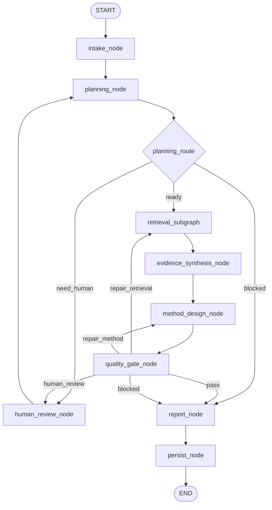
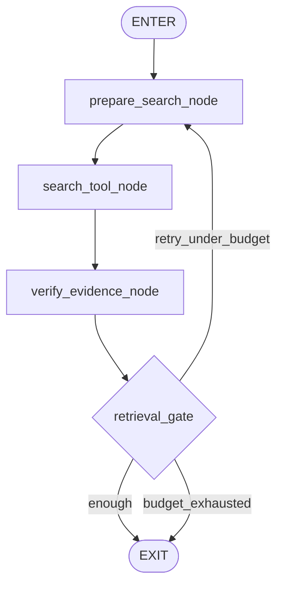

# PaperAgent v0.1 从零重建执行案

> Version: `v0.1`  
> Status: `DESIGN AND TEST CONTRACT FREEZE`  
> Development method: `MANDATORY TDD`  
> Principle: 旧 PaperAgent 仅作参考，不迁移旧图、旧节点、旧 State、旧 Prompt、旧 fixture 和旧兼容层。

## 1. v0.1 的唯一目标

v0.1 不追求完整论文研究平台，只完成一个可运行、可测试、可扩展的 LangGraph 骨架：

- 从零定义 State、Schema、Graph 和 Node；
- 跑通一次最小研究工作流；
- 支持确定性路由、有限检索循环、一次质量修复和可选人工暂停；
- 支持最小 Trace、Checkpoint 和结构化输出；
- 建立固定 Fake LLM / Fake Search Provider；
- 用 TDD 固化每个节点和每条边的行为；
- 不承诺旧版功能兼容。

成功标准是“架构正确、边界清楚、测试先行、可以继续迭代”，不是“功能数量多”。

## 2. 明确不做

v0.1 不实现：

- 旧 PaperAgent 节点迁移；
- Re1—Re8 兼容逻辑；
- 旧 ResearchState 兼容；
- Multi-Agent；
- 长期记忆；
- 完整 Web 前端；
- 自动运行用户代码；
- 自动生成完整论文；
- LangSmith、RAGAS、LLM-as-Judge 深度集成；
- 多套 Reflection / Gate；
- 为现有测试集特化的 fallback；
- 复杂并发和分布式任务系统；
- 以真实 LLM 测试替代离线确定性测试。

## 3. 强制 TDD 原则

每项实现必须严格执行：

```text
写失败测试 RED
→ 写最少代码 GREEN
→ 在测试保护下 REFACTOR
→ 补充边界测试
→ 提交
```

禁止：

- 先写完整节点再补测试；
- 修改 fixture 只为让错误实现通过；
- 用 Prompt 关键词分支决定 Fake LLM 回复；
- 单元测试访问网络；
- 测试依赖真实时间、随机数或外部 Provider；
- 将 Mock 成功当成真实 E2E 成功；
- 用快照测试替代 schema 和语义断言。

每个生产模块至少需要：

1. happy path；
2. schema/输入失败；
3. 下游 Provider 失败；
4. trace 事件；
5. 状态增量约束；
6. 不允许字段或证据泄漏；
7. 确定性重复运行。

## 4. 最小用户流程

1. 用户提交研究问题及约束；
2. `intake_node` 校验并规范化；
3. `planning_node` 生成结构化研究计划；
4. Planning Router 决定 ready / need_human / blocked；
5. Retrieval Subgraph 执行最多两轮检索；
6. `evidence_synthesis_node` 汇总已验证证据；
7. `method_design_node` 生成方法方案和最小实验；
8. `quality_gate_node` 执行确定性质量检查；
9. 必要时只修复 retrieval 或 method；
10. `report_node` 生成最终研究建议；
11. `persist_node` 持久化状态和 Trace；
12. 图到达 END。

## 5. 目标图



Retrieval Subgraph：



## 6. LLM 与工具预算

正常路径核心 LLM 调用：

| Node | Calls |
|---|---:|
| planning_node | 1 |
| evidence_synthesis_node | 1 |
| method_design_node | 1 |
| report_node | 1 |
| 合计 | 4 |

异常路径上限：

- Retrieval 最多 2 轮；
- Method repair 最多 1 次；
- Human interrupt 同时最多 1 个活跃等待点；
- 总核心 LLM 调用最多 6 次；
- 达到预算后必须 BLOCKED 或输出带限制说明的报告。

## 7. 测试金字塔

### 7.1 Unit Tests

覆盖：

- Pydantic schemas；
- reducer；
- Context Builder；
- 每个 Node；
- 每个 Router/Gate；
- Fake Providers；
- Trace Recorder；
- Checkpointer adapter。

要求：无网络、毫秒级、完全确定性。

### 7.2 Contract Tests

覆盖：

- LLM Provider 接口；
- Search Provider 接口；
- 节点输入输出 schema；
- Prompt registry 版本；
- fixture schema；
- checkpoint serialization。

### 7.3 Graph Tests

覆盖完整路由：

- success；
- need_human；
- planning blocked；
- retrieval retry；
- retrieval exhausted；
- repair_method；
- quality blocked；
- malformed LLM response；
- Provider timeout；
- resume after interrupt。

### 7.4 Integration Tests

使用 Fake LLM + Fake Search 跑完整 StateGraph，不访问网络。

### 7.5 Real Provider Smoke Tests

单独标记 `real_provider`，默认 CI 不运行。只用于验证 Provider adapter，不用于证明业务正确性。

### 7.6 OOD Tests

至少覆盖：CV、NLP、推荐系统、时间序列、数据库、软件工程、信息不足问题和不可完成问题。

## 8. 固定 LLM 测试回复

所有 LLM 节点必须首先通过版本化 fixture：

```text
tests/fixtures/llm/v0_1/
├── planning/
├── evidence_synthesis/
├── method_design/
├── report/
└── invalid/
```

Fake LLM 按以下键取回复：

```text
task + scenario + call_index + fixture_version
```

示例：

```text
planning + happy_path + 0 + v0.1
method_design + repair_method + 1 + v0.1
```

禁止按 Prompt 内容、问题关键词或领域名称选择 fixture。具体模拟输入输出由 `LLM_TEST_FIXTURES.md` 冻结。

## 9. 项目骨架

```text
PaperAgent/
├── README.md
├── pyproject.toml
├── .env.example
├── docs/
│   └── v0.1/
│       ├── EXECUTION_PLAN.md
│       ├── GRAPH_AND_NODES.md
│       ├── STATE_CONTRACTS.md
│       ├── TDD_STRATEGY.md
│       ├── LLM_TEST_FIXTURES.md
│       ├── DEVELOPMENT_WORKFLOW.md
│       └── ACCEPTANCE.md
├── src/
│   └── paperagent/
│       ├── __init__.py
│       ├── version.py
│       ├── graph.py
│       ├── state.py
│       ├── config.py
│       ├── errors.py
│       ├── context.py
│       ├── nodes/
│       ├── retrieval/
│       ├── schemas/
│       ├── prompts/
│       ├── providers/
│       ├── telemetry/
│       └── persistence/
└── tests/
    ├── unit/
    ├── contracts/
    ├── graph/
    ├── integration/
    ├── ood/
    └── fixtures/
        ├── llm/v0_1/
        ├── search/v0_1/
        └── states/v0_1/
```

## 10. 工作包与 TDD Gate

### WP0 — 文档与测试合同冻结

产物：当前目录下全部 v0.1 文档。

RED：文档完整性测试预期缺失文件失败。  
GREEN：所有必需文档存在并相互链接。  
完成条件：实现前的接口、fixture 和验收标准冻结。

### WP1 — 基础工程与 Schema

先写测试：

- package import；
- version；
- config defaults；
- schema valid/invalid cases；
- error serialization。

完成条件：所有 schema 和基础模块通过离线测试。

### WP2 — State、Reducer 与 Trace

先写测试：

- state patch 不原地修改；
- trace append reducer；
- stable run/thread ID；
- serialization round trip；
- redaction。

完成条件：状态更新可重放，Trace 完整。

### WP3 — Provider Contracts 与 Fixtures

先写测试：

- Fake LLM 精确按 key 返回；
- 未知 key 明确失败；
- call history 可断言；
- Fake Search 返回稳定结果；
- timeout/error 可注入。

完成条件：测试不依赖 Prompt 文本分支。

### WP4 — 顶层 Graph Skeleton

先写 graph tests，再实现 deterministic stubs。

完成条件：Fake provider 下从 START 到 END，节点序列与预期一致。

### WP5 — Retrieval Subgraph

先写两轮上限、coverage、verification 和 exhausted tests。

完成条件：所有路径有界退出。

### WP6 — 四个 LLM Nodes

按 planning → evidence synthesis → method design → report 顺序，每个节点：

1. schema failure test；
2. happy path test；
3. Provider error test；
4. trace test；
5. forbidden evidence reference test；
6. implementation。

### WP7 — Gate 与 HITL

先覆盖 PASS、REPAIR_RETRIEVAL、REPAIR_METHOD、HUMAN_REVIEW、BLOCKED。

完成条件：Gate 不调用 LLM，interrupt/resume 可测试。

### WP8 — OOD 与验收

先建立 OOD 测试，再接任何真实 Provider。

完成条件：无固定案例实体泄漏，图在所有案例中有界终止。

## 11. 分支与提交规则

- 所有 v0.1 实现只在 `v0.1` 分支进行；
- 每个工作包按测试提交和实现提交拆分；
- 推荐提交顺序：

```text
test(v0.1): define <module> behavior
feat(v0.1): implement minimum <module> behavior
refactor(v0.1): simplify <module> under tests
```

禁止一次提交同时加入大量未测试代码和测试。

## 12. 合并回 master 的条件

只有同时满足以下条件才允许合并：

- 全部离线测试通过；
- Graph 路径覆盖完整；
- Fixture 合同冻结；
- OOD 泄漏检查通过；
- 正常路径核心 LLM 调用设计不超过 4 次；
- 循环和 repair 有硬上限；
- Trace/Checkpoint 测试通过；
- 文档与实际实现一致；
- 无旧项目代码导入。

## 13. 完成定义

v0.1 完成仅表示：

```text
A tested LangGraph skeleton exists.
```

不表示已完成自动科研、完整检索平台或生产级上线。
