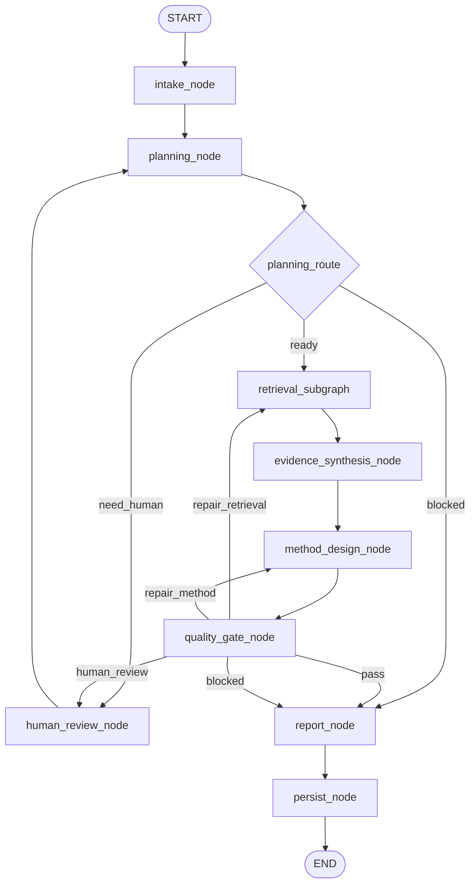
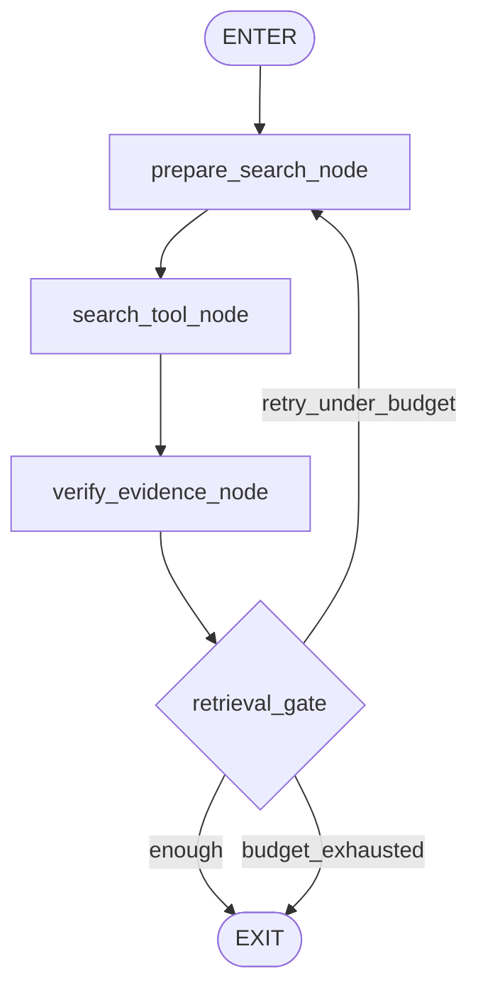

# PaperAgent v0.1 图与节点设计

> Version: `v0.1`  
> Status: `DESIGN FROZEN FOR SKELETON`  
> Scope: 顶层 LangGraph、Retrieval Subgraph、节点输入输出、条件边和测试责任。

## 1. 设计原则

1. LangGraph 只表达真实控制流，不把普通函数包装成无意义节点；
2. 连续、同上下文、无分支的 LLM 工作合并为一个节点；
3. Tool、Gate、Checkpoint、Human interrupt 保持独立；
4. 节点返回增量 `StatePatch`，不原地修改 State；
5. 所有循环有预算和硬上限；
6. 每个 LLM 节点使用独立 Pydantic 输出 schema；
7. Gate 只判断和路由，不生成研究内容；
8. 不保存原始 CoT，只保存结构化决策与 Trace metadata；
9. v0.1 不兼容旧节点名称和旧 State；
10. 图必须能在 Fake Provider 下确定性运行；
11. 每个节点的测试先于实现；
12. 节点不得根据测试题领域或 Prompt 关键词返回固定答案。

## 2. 顶层图



## 3. Retrieval Subgraph



## 4. 统一节点函数合同

```python
async def node_name(
    state: PaperAgentState,
    config: RunnableConfig,
) -> StatePatch:
    ...
```

所有节点必须：

- 只读取声明的输入字段；
- 只返回自身负责的 State 字段；
- 写入 `node.started` 和 `node.completed`，失败时写入 `node.failed`；
- 将可预期错误转换为 `NodeError`；
- 不吞掉 Provider error；
- 不读取测试 fixture 路径；
- 不直接实例化具体 LLM/Search SDK；
- 通过 config 注入 Provider、Clock、ID Factory 和 Recorder。

## 5. 顶层节点合同

### N01 `intake_node`

**类型：** deterministic  
**LLM：** 否

输入：

- `request.question`
- `request.required_constraints`
- `request.optional_preferences`
- `request.user_material_refs`

职责：

- 去除空白并规范化请求；
- 校验问题非空和长度；
- 去重约束；
- 初始化 RunContext、ExecutionMeta 和 RetrievalState；
- 标记明显非法输入。

输出：

- `request`
- `run`
- `execution`
- `retrieval`
- `trace[]`

测试：

- 正常输入；
- 空问题；
- 重复约束；
- 不修改输入对象；
- Clock/ID 确定性。

### N02 `planning_node`

**类型：** LLM structured workflow  
**LLM task key：** `planning`

输入：

- 规范化 ResearchRequest；
- Run budgets；
- 可用 source types。

职责：

- 定义问题、范围和研究问题；
- 生成 evidence gaps；
- 生成查询计划；
- 判断是否需要澄清；
- 不声明外部资源真实存在。

输出：`ResearchPlan`

关键字段：

```text
status: ready | need_human | blocked
problem_statement
scope
research_questions[]
evidence_gaps[]
search_queries[]
success_criteria[]
clarification_question?
block_reason?
```

测试：

- happy path fixture；
- need_human fixture；
- blocked fixture；
- malformed JSON；
- unknown field；
- 超预算查询数；
- Provider timeout；
- Trace usage metadata。

### R01 `planning_route`

**类型：** deterministic router

路由：

```text
plan.status == ready       → retrieval_subgraph
plan.status == need_human  → human_review_node
plan.status == blocked     → report_node
otherwise                  → error
```

Router 不调用 LLM，不修改 State。

### N03 `human_review_node`

**类型：** Human-in-the-Loop interrupt

输入：

- `plan.clarification_question` 或 `quality.human_question`
- execution status

职责：

- 构造公开、最小化的 interrupt payload；
- 暂停图；
- resume 后写入 `request.clarification_answer`；
- 清除 active human request。

输出：

- `request`
- `execution`
- `trace[]`

测试：

- interrupt payload；
- resume；
- 缺少回答；
- 同时只有一个 active interrupt；
- checkpoint round trip。

### N04 `evidence_synthesis_node`

**类型：** LLM structured workflow  
**LLM task key：** `evidence_synthesis`

输入：

- ResearchPlan；
- 仅 accepted EvidenceItem；
- coverage_by_gap；
- conflicts。

职责：

- 按 gap 综合证据；
- 区分 supported / partial / unsupported；
- 显式记录冲突；
- 不使用未提供的 Evidence ID；
- 给出 feasibility verdict。

输出：`EvidenceSynthesis`

测试：

- accepted evidence happy path；
- 空证据；
- 冲突证据；
- 输出引用未知 Evidence ID；
- rejected evidence 不得进入上下文；
- malformed response；
- deterministic fixture replay。

### N05 `method_design_node`

**类型：** LLM structured workflow  
**LLM task key：** `method_design`

输入：

- ResearchPlan；
- EvidenceSynthesis；
- accepted evidence refs；
- repair reason（可选）。

职责：

- 选择 baseline；
- 提出模块和接口；
- 生成可证伪假设；
- 生成最小关键实验和消融；
- 指出风险和停止条件；
- 将提案标记为 proposed，而非 verified。

输出：`MethodProposal`

测试：

- happy path；
- repair_method 第二次调用；
- 缺少 baseline；
- 无可证伪假设；
- 引用未知 evidence；
- 将 proposed 写成 verified 时语义校验失败；
- repair_count 上限。

### N06 `quality_gate_node`

**类型：** deterministic gate  
**LLM：** 否

输入：

- Plan；
- EvidenceBundle；
- EvidenceSynthesis；
- MethodProposal；
- ExecutionMeta；
- budgets。

检查：

- schema 完整性；
- Evidence ID 绑定；
- accepted evidence coverage；
- unsupported claims；
- hypothesis、experiment、ablation 和 stop conditions；
- repair 上限；
- retrieval budget；
- legacy/test-specific entity leakage。

输出：`QualityDecision`

```text
verdict: pass | repair_retrieval | repair_method | human_review | blocked
reason_codes[]
repair_target?
missing_gap_ids[]
invalid_evidence_ids[]
human_question?
```

测试必须覆盖全部五类 verdict，且相同输入重复调用结果完全一致。

### R02 `quality_route`

映射：

```text
pass               → report_node
repair_retrieval   → retrieval_subgraph
repair_method      → method_design_node
human_review       → human_review_node
blocked            → report_node
```

### N07 `report_node`

**类型：** LLM structured workflow  
**LLM task key：** `report`

输入：

- Plan；
- accepted Evidence；
- EvidenceSynthesis；
- MethodProposal；
- QualityDecision。

职责：

- 组织最终研究建议；
- 不新增事实和 Evidence ID；
- 区分 verified / inferred / proposed / unknown / blocked；
- blocked 时给出限制说明，不伪装成功。

输出：`FinalReport`

测试：

- pass report；
- blocked report；
- 未知 Evidence ID；
- 新增未提供论文/数据集名称；
- 缺少 limitation；
- malformed response；
- 输出稳定性。

### N08 `persist_node`

**类型：** deterministic side-effect boundary

职责：

- 保存最终 State snapshot；
- 保存 Trace；
- 写入 terminal status；
- 使用幂等键 `run_id + checkpoint_seq`；
- 不执行研究内容转换。

测试：

- 成功持久化；
- 重复调用幂等；
- persistence failure；
- terminal trace；
- serialization round trip。

## 6. Retrieval 节点合同

### RN01 `prepare_search_node`

输入：Plan gaps、pending/completed queries、当前轮次。

职责：

- 选择本轮查询；
- 去重；
- 限制数量；
- 将 query 绑定 gap_id；
- 不调用网络。

测试：去重、round 0/1、无 pending query、预算耗尽。

### RN02 `search_tool_node`

输入：prepared queries。

职责：

- 调用 Search Provider；
- 记录 raw candidates 和工具错误；
- 不判断学术结论；
- 使用 timeout 和 bounded retry。

测试：成功、空结果、部分失败、timeout、稳定 call history。

### RN03 `verify_evidence_node`

输入：raw candidates。

职责：

- 生成稳定 Evidence ID；
- 验证 locator、source type 和基本 metadata；
- 计算 content hash；
- 分类 accepted/rejected/pending/failed_verification；
- 绑定 gap_id。

测试：有效来源、重复来源、无 locator、验证失败、hash 稳定性。

### RR01 `retrieval_gate`

规则：

```text
必要 gaps 达到最低 coverage → enough
未达到且 round < max_rounds → retry_under_budget
未达到且 round >= max_rounds → budget_exhausted
```

不得使用 LLM。

## 7. 节点调用预算

| 节点 | 正常调用 | 最大调用 |
|---|---:|---:|
| intake | 1 | 1 |
| planning | 1 | 2（HITL 后） |
| retrieval subgraph | 1 round | 2 rounds |
| evidence synthesis | 1 | 2（retrieval repair 后） |
| method design | 1 | 2 |
| quality gate | 1 | 3 |
| report | 1 | 1 |
| persist | 1 | 1 |

图必须通过递归和预算配置双重限制，防止无限循环。

## 8. Trace 事件

每个节点写入：

```text
node.started
node.completed
node.failed
```

LLM 节点额外写入：

```text
llm.requested
llm.responded
llm.validation_failed
```

Tool 节点额外写入：

```text
tool.requested
tool.responded
tool.failed
```

Router/Gate 写入：

```text
route.decided
```

Trace 只记录 hash、版本、结构化路由、token/latency/error metadata，不记录原始隐式推理过程。

## 9. 测试路径矩阵

| Scenario | Expected path |
|---|---|
| happy_path | intake → planning → retrieval → synthesis → method → pass → report → persist |
| need_human | intake → planning → human → planning → ... |
| planning_blocked | intake → planning → report → persist |
| retrieval_retry | retrieval round 1 → retry → round 2 → exit |
| retrieval_exhausted | retrieval round 2 → exhausted → synthesis → quality blocked/report |
| repair_method | quality → method second call → quality pass |
| repair_retrieval | quality → retrieval second round → synthesis → method → quality |
| malformed_llm | node failure with typed error; no silent fallback |
| provider_timeout | bounded retry then typed failure/block |
| checkpoint_resume | interrupt → persisted state → resume → continue |

## 10. 图冻结规则

在 v0.1 骨架完成前，不新增：

- 第二套质量 Gate；
- 独立 critic/reflection Agent；
- Multi-Agent coordinator；
- 长期记忆节点；
- 自动代码执行节点；
- 与某个测试集或领域绑定的路由。

任何新增节点都必须说明为什么普通函数、schema validator 或现有 Workflow 无法承担该职责，并先补图测试。
