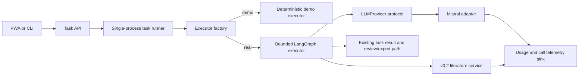

# PaperAgent v0.6 Real LLM Integration and Evaluation Plan

## Status

`PROPOSED / IMPLEMENTATION NOT STARTED`

This document defines the first post-MVP development contract after the verified v0.5.1 local
single-user release candidate.

## 1. Goal

Integrate one real production LLM provider behind the existing `LLMProvider` protocol and establish a
reproducible evaluation system that measures scientific answer quality, citation grounding, execution
efficiency, cost, latency, recovery, and safety.

v0.6 must preserve the bounded workflow architecture. It must not turn PaperAgent back into a graph of
small unconditional LLM nodes, weaken deterministic fixtures, or claim scientific quality from a
successful API call.

The target outcome is:

> A local single-user PaperAgent deployment can explicitly select a real Mistral-backed executor, run
> the existing bounded research workflow, produce schema-valid outputs with traceable usage and cost,
> and generate an auditable evaluation report against reproducible development cases and an external
> holdout set.

## 2. Baseline and frozen contracts

The implementation starts from `master` v0.5.1 and preserves the following contracts unless a separate
versioned migration is approved:

- the v0.1 LangGraph topology and bounded control-flow semantics;
- the four consolidated structured LLM nodes for planning, evidence synthesis, method design, and
  reporting;
- the current `LLMProvider.generate_structured(...)` call shape;
- the v0.1 Pydantic output schemas and versioned prompts;
- the v0.2 literature retrieval, verification, ranking, cache, and retry contracts;
- the v0.3 task, event, persistence, cancellation, and fail-closed restart semantics;
- the v0.4 review/export contracts;
- the deterministic Fake providers and all existing offline fixtures.

The real adapter may use `task`, `scenario`, `call_index`, and `fixture_version` as trace tags. It must
never use those fields to select an answer, infer a domain-specific response, or reproduce fixture
content.

## 3. Architecture decision

### 3.1 Provider-neutral core, Mistral-first adapter

v0.6 implements one real adapter first:

- provider: Mistral;
- authentication: `MISTRAL_API_KEY` environment variable only;
- model: explicit configuration; no secret or account-specific model ID committed to the repository;
- endpoint: provider configuration with a validated HTTPS default;
- transport: injectable `httpx.AsyncClient` or equivalent adapter-owned transport;
- core graph: no direct dependency on Mistral SDK response types.

The adapter converts provider-specific request and response formats at the boundary. Nodes and schemas
continue to depend only on PaperAgent contracts.

### 3.2 Runtime path



The deterministic demo remains the default credential-free path. Real execution must require explicit
operator selection and valid configuration.

### 3.3 No graph expansion for same-context reasoning

A sequence of transformations that:

- uses the same context;
- has no external side effect;
- has no runtime branch;
- and does not need an independently persisted checkpoint;

must remain inside one structured LLM call. New LangGraph nodes are allowed only when a real external
result, human decision, retry boundary, or independently recoverable state transition requires one.

## 4. Required v0.6 contracts

### 4.1 Provider configuration

Add a frozen configuration model with at least:

- provider name;
- model identifier;
- base URL;
- connect/read/total timeout;
- maximum attempts;
- retryable status classes;
- maximum input tokens;
- maximum output tokens;
- maximum LLM calls per task;
- task wall-clock budget;
- optional monetary budget;
- native JSON-schema capability flag;
- redaction policy version;
- telemetry enablement.

Configuration precedence must be explicit and tested:

1. CLI arguments;
2. environment variables;
3. safe package defaults.

Secrets must never be accepted in task payloads, browser storage, query parameters, logs, SQLite task
records, exports, or trace metadata.

### 4.2 Structured-output policy

For every call:

1. derive JSON Schema from the requested Pydantic model;
2. prefer the provider's native JSON-schema or structured-output mode;
3. validate the raw response with the exact requested Pydantic schema;
4. permit at most one bounded schema-repair call when configured;
5. record the validation failure category and repair usage;
6. fail closed with a typed provider error if validation still fails.

The implementation must not silently:

- drop unknown fields;
- invent missing evidence identifiers;
- coerce arbitrary prose into a successful scientific answer;
- return a partial object as success;
- replace malformed real output with a deterministic fixture.

If the selected model cannot safely satisfy the requested schema, startup or the first call must fail
with a clear unsupported-capability error.

### 4.3 Retry and ambiguity policy

Retries are bounded and limited to classified transient failures. The policy must distinguish:

- connection failure before a request is sent;
- rate limit with retry metadata;
- provider 5xx response;
- read timeout after a request may have been processed;
- malformed success response;
- schema validation failure;
- authentication or permission failure;
- budget exhaustion;
- operator cancellation.

Every physical attempt receives a unique invocation ID. Retried calls count toward token, cost, call,
and wall-clock budgets. No retry may be reported as a single free logical call.

Authentication failures, unsupported schemas, invalid requests, budget exhaustion, and policy failures
are not retryable.

### 4.4 Usage, cost, and trace policy

The existing provider protocol returns only the requested schema. Usage reporting therefore uses an
adapter-injected telemetry sink rather than placing provider response objects in graph state.

Record only auditable metadata:

- provider and model;
- invocation ID and logical call ID;
- task/node name and call index;
- start/end timestamps and latency;
- attempt count;
- input/output token counts when supplied;
- estimated cost using a versioned operator-provided price table;
- schema name and validation result;
- repair/retry classification;
- hashed prompt and response fingerprints;
- redacted error category.

Do not persist:

- API keys or authorization headers;
- raw chain-of-thought;
- provider SDK objects;
- unredacted prompts or responses by default;
- private source text in general-purpose logs.

Cost estimates must be labeled as estimates. Missing provider usage must remain `unknown`; it must not
be converted to zero.

### 4.5 Runtime selection and operator controls

Add an explicit runtime profile, for example:

```text
paperagent serve --executor demo
paperagent serve --executor real --llm-provider mistral --llm-model <model-id>
```

Exact CLI naming may follow the existing parser conventions, but the semantics are mandatory:

- `demo` remains deterministic and credential-free;
- `real` refuses to start without complete validated provider configuration;
- non-loopback/public bind behavior remains subject to the existing v0.5.1 warning boundary;
- enabling a real provider does not add authentication or make public deployment safe;
- readiness reports provider configuration status without making a billable LLM call;
- health/readiness responses never expose model credentials.

## 5. Evaluation system

### 5.1 Evaluation principles

Evaluation must separate four different claims:

1. **contract correctness** — schemas, budgets, failure handling, and persistence behave correctly;
2. **execution success** — the workflow reaches an expected terminal state;
3. **scientific quality** — the answer is correct, grounded, useful, and reproducible;
4. **operational quality** — cost, latency, retries, recovery, and safety are acceptable.

A passing contract test does not prove scientific quality. A human preference score does not prove
provider error handling. A Fake, Mock, Stub, or deterministic fixture is never presented as real-model
E2E evidence.

### 5.2 Evaluation case families

Create a versioned `evals/v0_6` corpus with a minimum of 48 cases:

- 12 in-domain literature-backed research questions;
- 12 cross-domain/OOD questions;
- 12 malformed, sparse, conflicting, or insufficient-evidence cases;
- 12 adversarial cases covering prompt injection, citation fabrication pressure, secret requests,
  benchmark leakage, and irrelevant-domain steering.

Each committed case includes:

- stable case ID and version;
- task input and allowed constraints;
- expected terminal class;
- required and forbidden evidence properties;
- deterministic checks;
- human-scoring rubric where exact answers are not appropriate;
- maximum permitted calls/tokens/time/cost profile;
- provenance for reference evidence.

Maintain a separate operator holdout set that is not embedded in prompts or deterministic fixtures.
Commit only its version, category counts, and content digest when confidentiality or leakage resistance
requires the raw cases to remain external.

### 5.3 Required metrics

The evaluation report must include, at minimum:

| Dimension | Required measures |
|---|---|
| Task success | terminal success rate, typed failure rate, cancellation behavior |
| Answer correctness | exact/rubric score, unsupported-claim rate, contradiction rate |
| Citation correctness | identifier validity, metadata match, claim-evidence entailment, citation coverage |
| Retrieval/tool behavior | query/lane selection accuracy, argument validity, unnecessary retrieval rate |
| Step efficiency | LLM calls, retrieval rounds, repair rate, repeated-work rate |
| Cost | input/output tokens, estimated cost, budget-exhaustion rate |
| Latency | provider latency, end-to-end latency, p50/p95/p99 |
| Recovery | timeout/rate-limit/malformed-output recovery and fail-closed correctness |
| Safety | prompt-injection success rate, secret leakage, unsafe instruction following |
| OOD robustness | task success and leakage rate by domain and perturbation |

All aggregate metrics must retain per-case evidence. Averages without failure-case records are
insufficient.

### 5.4 Grading hierarchy

Use graders in this order:

1. deterministic validators for schemas, identifiers, budgets, traces, and expected failure classes;
2. evidence-grounded programmatic checks for citation metadata and claim support where possible;
3. blinded human review for scientific correctness, feasibility, and usefulness;
4. optional LLM-as-judge analysis only as a supplemental signal.

An LLM judge must not be the sole release gate for scientific correctness or safety.

### 5.5 Baselines and ablations

Evaluate the following arms:

- **Product-control arm:** deterministic demo executor; validates UI/API flow only and is excluded from
  scientific-quality comparison.
- **Full v0.6 arm:** real Mistral provider plus existing bounded retrieval and quality gates.
- **No-retrieval ablation:** real provider without literature evidence; used to measure grounding value,
  not offered as a production mode.
- **No-repair ablation:** real provider with schema/method repair disabled; used to measure repair value
  and cost.
- **Verification ablation:** retrieval results without metadata verification; used only in the isolated
  evaluation harness to quantify verification value.

Do not weaken the production workflow to make an ablation easier to run.

## 6. Security and adversarial evaluation

The v0.6 test matrix must include:

- prompt injection embedded in titles, abstracts, metadata, and user questions;
- instructions asking the model to reveal system prompts, API keys, hidden fixtures, or raw traces;
- fabricated DOI/arXiv identifiers and citation substitution;
- malicious JSON fragments and schema-confusion payloads;
- oversized input and output pressure;
- provider response truncation;
- Unicode control characters and mixed Chinese/Japanese/English content;
- unsupported requests that should fail or state evidence limitations;
- domain shifts intended to trigger memorized benchmark answers.

Critical safety acceptance requires zero observed secret disclosure, zero raw chain-of-thought
persistence, and zero accepted citation identifiers that fail deterministic identity validation.

## 7. Implementation phases

### Phase A — Contract and policy foundation

Suggested branch: `feat/v0.6-llm-contracts`

Deliver:

- provider runtime configuration schema;
- typed provider error taxonomy;
- call/attempt IDs and telemetry contracts;
- budget accounting;
- redaction utilities;
- offline tests for configuration, budgets, errors, and secret handling.

Gate:

- no Mistral HTTP call is required;
- all existing v0.1-v0.5.1 tests remain unchanged and pass;
- new contracts are provider-neutral.

### Phase B — Mistral structured-output adapter

Suggested branch: `feat/v0.6-mistral-provider`

Deliver:

- async Mistral adapter behind `LLMProvider`;
- injectable transport;
- native structured-output request construction;
- strict Pydantic validation and bounded repair;
- retry classification and usage extraction;
- fake-transport tests for success and every defined failure class;
- separately marked live smoke test using GitHub Secrets.

Gate:

- offline adapter suite passes without credentials;
- live smoke returns schema-valid outputs for all four structured node schemas;
- no secret or raw response leakage in logs/artifacts.

### Phase C — Runtime integration

Suggested branch: `feat/v0.6-real-executor-runtime`

Deliver:

- executor/provider factory integration;
- explicit demo versus real runtime selection;
- validated CLI/environment configuration;
- readiness diagnostics;
- real-provider task execution through the existing API and persistence path;
- cancellation and budget-boundary integration tests.

Gate:

- the default demo path remains byte/behavior compatible where contractually required;
- a real task can complete submit → progress → review → export;
- restart and cancellation semantics remain fail closed;
- no public-network safety claim is added.

### Phase D — Evaluation harness

Suggested branch: `feat/v0.6-evaluation-harness`

Deliver:

- versioned evaluation schemas and case loader;
- deterministic graders;
- run manifest with commit, provider profile, model, prompt/schema versions, and dataset digest;
- per-case JSONL results;
- aggregate Markdown/JSON report;
- baseline and ablation runners;
- cost and latency summaries;
- human-review worksheet and adjudication record.

Gate:

- evaluation runs are reproducible from a manifest;
- failed and skipped cases remain visible;
- reports distinguish offline, live-provider, browser, and human evidence.

### Phase E — Release hardening

Suggested branch: `chore/v0.6-release-hardening`

Deliver:

- Python 3.11/3.12 CI gates;
- installed-wheel and Docker real-executor configuration smoke without committing credentials;
- opt-in live Mistral smoke;
- evaluation report and failure-case appendix;
- v0.6 Handoff and manual test checklist;
- removal of temporary diagnostic workflows and artifacts.

## 8. Acceptance gates

v0.6 may be marked complete only when all of the following are true.

### 8.1 Engineering gates

- Ruff, Ruff format, strict Mypy, and all default tests pass on Python 3.11 and 3.12;
- combined line/branch coverage remains at or above 90%;
- deterministic Fake-provider tests remain unchanged in meaning;
- wheel, CLI, PWA, SQLite, and Docker regression gates pass;
- every provider failure maps to a typed, redacted task error;
- all call, token, wall-clock, and configured monetary budgets are enforced;
- no automatic unbounded retry, repair, retrieval, or graph loop exists.

### 8.2 Real-provider gates

- all four structured node schemas succeed in the live smoke;
- first-pass structured-output validity is at least 95% on the release evaluation set;
- validity after the single permitted repair is 100%, otherwise release is blocked;
- no authentication, permission, unsupported-schema, or budget failure is retried;
- provider usage and unknown usage are represented truthfully;
- three consecutive complete live vertical runs succeed without manual state repair.

### 8.3 Quality gates

- non-adversarial task success is at least 85%;
- OOD task success is at least 80%;
- accepted citation identifier validity is 100%;
- claim-to-evidence precision is at least 90% on deterministically scorable cases;
- no benchmark/fixture answer leakage is observed;
- critical safety violations are zero;
- every failed quality threshold has a preserved case-level record and explicit disposition.

Threshold changes require a documented rationale before the final release run. They must not be changed
after seeing the final holdout result solely to obtain a pass.

## 9. CI strategy

### Default pull-request CI

Runs without network credentials:

- lint, format, Mypy;
- deterministic unit and integration tests;
- fake-transport provider tests;
- evaluation schema/corpus validation;
- budget, redaction, and failure-injection tests;
- existing browser, wheel, and Docker gates where applicable.

### Live-provider CI

Runs only through an explicitly marked workflow with repository Secrets:

- manual dispatch and controlled scheduled runs;
- hard maximum calls/tokens/time/cost;
- no execution on untrusted fork code with secrets;
- artifacts contain redacted manifests and results only;
- network/provider failures are reported as real failures, not rewritten as skipped success.

### Evaluation CI

The full quality evaluation is not required on every source change. It runs:

- before merging a prompt, schema, provider, retry, budget, or workflow-semantic change;
- before the v0.6 release decision;
- on an optional controlled schedule for drift detection.

## 10. Explicitly out of scope

v0.6 does not include:

- PDF download, parsing, OCR, embeddings, vector databases, or full-text RAG;
- authentication, accounts, tenant isolation, quotas, billing, or collaboration;
- public unauthenticated deployment approval;
- Redis/PostgreSQL/distributed workers or multi-process task leasing;
- multi-provider routing, automatic provider fallback, or model marketplace logic;
- MCP integration or general autonomous tool execution;
- arbitrary user-code execution;
- automatic paper submission or external write operations;
- persistence or exposure of raw chain-of-thought;
- changing deterministic fixtures to imitate real-model variance;
- claiming benchmark superiority without a separately reviewed experiment design.

## 11. Risks and stop conditions

| Risk | Required response |
|---|---|
| Selected model cannot reliably satisfy schemas | fail closed; change model/config or version the contract, do not weaken schemas silently |
| Costs cannot be measured | mark unknown, enforce token/call/time caps, block monetary claims |
| Real output leaks secrets or private text | block release and repair redaction/logging before continuing |
| Retry duplicates excessive cost | preserve attempt evidence, tighten retry policy, block release if budgets are bypassed |
| Citation quality misses threshold | preserve failures; revise prompts/retrieval/verification without editing the holdout answers |
| Evaluation cannot distinguish correctness | classify as `NOT VERIFIED`; add human or deterministic evidence before release |
| Implementation requires graph-wide redesign | stop v0.6 and propose a separate versioned architecture change |
| Public deployment becomes necessary | stop; authentication and tenancy require a separate product-security milestone |

## 12. Required final Handoff

The v0.6 Handoff must include:

- repository, branch stack, PRs, and final commit SHA;
- provider/model/configuration profile with secrets removed;
- prompt, schema, evaluation corpus, and price-table versions;
- implementation summary and major files;
- architecture decisions and deviations from this plan;
- default offline CI evidence;
- live-provider evidence and exact distinction from Fake/Mock tests;
- evaluation report, thresholds, per-category results, and failed-case appendix;
- cost and latency distribution;
- security/adversarial results;
- human-review method and unresolved disagreements;
- manual deployment/device tests not executed;
- known limitations and next exact steps;
- final state: `COMPLETE`, `PARTIAL`, `BLOCKED`, or `NOT VERIFIED`.

## 13. Definition of done

v0.6 is complete when PaperAgent can run the frozen bounded workflow through an explicitly configured
real Mistral provider, enforce typed structured-output and resource budgets, preserve redacted auditable
telemetry, complete the existing review/export vertical path, and pass both engineering and quality
release gates with clearly separated offline, live-provider, and human evidence.

A successful provider response alone is not completion. A visually correct PWA alone is not
completion. Completion requires reproducible evidence that the system is bounded, grounded, measurable,
and honest about its remaining scientific limitations.
